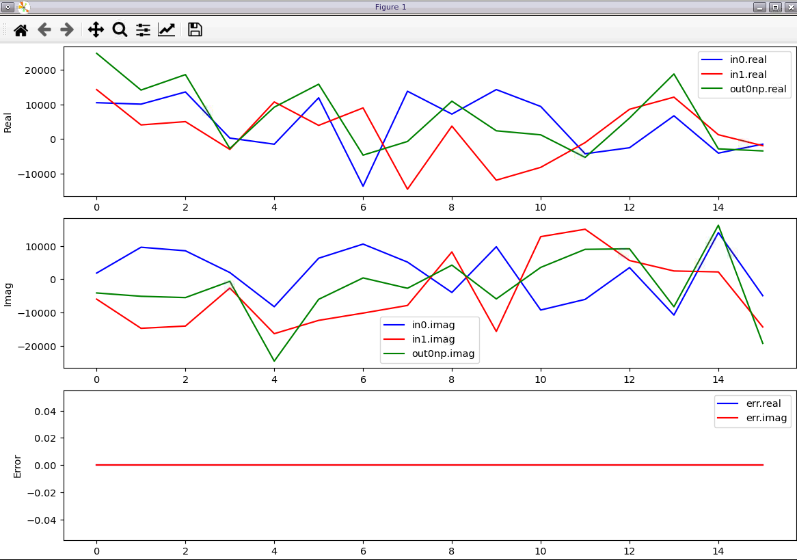

<table class="sphinxhide" style="width:100%;">
  <tr>
    <td align="center">
      <picture>
        <source media="(prefers-color-scheme: dark)" srcset="https://raw.githubusercontent.com/Xilinx/Image-Collateral/main/logo-white-text.png">
        
      </picture>
      <h1>AMD Vitis™ System Design Tutorials</h1>
      <a href="https://www.amd.com/en/products/software/adaptive-socs-and-fpgas/vitis.html">See Vitis™ Development Environment on amd.com</a>
    </td>
  </tr>
</table>

# Using Python VFS to develop HLS Kernel

In this lab, we will show how to functionally verify HLS Kernel using the new Python x86sim features.

Python VFS provide same value add as Matlab VFS, and can be used for AIE graphs, HLS kernel, and subsystems containing both.
This is for users prefer using rich Python libraries like NumPy, SciPy, etc. to model and verify their designs.


## Setting up Python virtual environment

VFS supports Python versions 3.9 - 3.12. To make it easier to install libraries like NumPy, it's recommended to setup a virtual Python environment.
This instruction is for using Python 3.11, but same principle should be applicable to the other supported versions.

[How to configure and setup Python virtual environment](https://packaging.python.org/en/latest/guides/installing-using-pip-and-virtual-environments/#create-and-use-virtual-environments)

Activate the virtual environment:
```
source .venv/bin/activate
```
Upgrade pip and install numpy, argparse and matplotlib:
```
pip install --upgrade pip
pip install numpy==1.21.3 argparse matplotlib
```
*Note that* matplotlib require libraries for rendering. Try either PyQt5 or tk/tkinter:<br>
***PyQt5:***
```
pip install PyQt5
```
***tk/tkinter:***
```
pip install tk tkinter
```


### OPTIONAL - Deactivate the virtual environment when done
```
deactivate
```


## Preparing testbench stimuli and running the simulation

Two example Matlab files have been prepared to simplify experimenting with the feature.

[matlab](.) Directory/file structure:
| Directory/file                         | Description
| ---------------------------------------|-------------------------------------------------
| [verify_vadd.py](./verify_vadd.py)   | Verification example for VADD HLS kernel


To compile and simulate the VADD HLS kernel run:
```
python verify_vadd.py
```

The number of samples used and plotting of the results can be changed with optional arguments "--size" and "--plot".
For details on the arguments, try:
```
python verify_vadd.py --help
```


A successful run will print:
```
**************************************************************************************************************
Warning: Neither 'part' nor 'platform' is provided. The Versal part 'xcvc1902-vsva2197-1LP-e-S' is being used.
**************************************************************************************************************

Compiling HLS Kernel
Compilation directory: <path to compile folder>
Compilation command: <path to command>

Loaded HLSKernel
Small data set, adding prints for visual confirmation of results
input 0
[ 4874. +4515.j -2049. +8383.j  6970.+11600.j  3151.+14085.j
   353.  -515.j  2978. -1975.j  -609.+11273.j  5308.+10218.j]
input 1
[  5162. -1991.j  -7229.-11969.j -10864.+15348.j  -7950.-14941.j
   6728.-14283.j -12412. -4314.j -16025.-11031.j  13305.  -664.j]
golden
[ 10036. +2524.j  -9278. -3586.j  -3894.+26948.j  -4799.  -856.j
   7081.-14798.j  -9434. -6289.j -16634.  +242.j  18613. +9554.j]
out0
[ 10036. +2524.j  -9278. -3586.j  -3894.+26948.j  -4799.  -856.j
   7081.-14798.j  -9434. -6289.j -16634.  +242.j  18613. +9554.j]
VADD output matches golden
```

If the output differs from the python reference model exception is raised like:
```
Traceback (most recent call last):
  File "verify_vadd.py", line 52, in <module>
    raise ValueError("VADD differ from golden")
ValueError: VADD differ from golden
```

This screenshot is an example with the "--plot" option is used with "--size 16" samples. (Note the use of short argument handles)
```
python verify_vadd.py -p -s 16
```
**Note** To end the python process, close the plot figure.



## Navigation helper

 - [VSS Component](../README.md)
 - [VFS MATLAB](../matlab/README.md)
 - [Inspect AIE design](../ip/aie/README.md)
 - [Inspect HLS VADD](../ip/vadd_s/README.md)
 - [Return to top](../../README.md)


<p class="sphinxhide" align="center"><sub>Copyright © 2020–2025 Advanced Micro Devices, Inc</sub></p>

<p class="sphinxhide" align="center"><sup><a href="https://www.amd.com/en/corporate/copyright">Terms and Conditions</a></sup></p>


