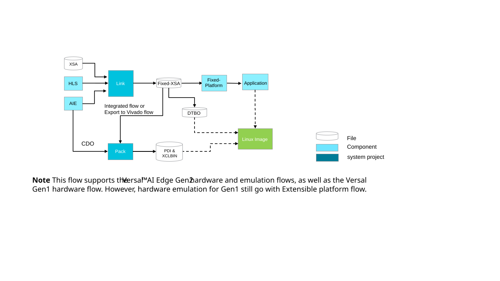

<table class="sphinxhide" width="100%">
 <tr width="100%">
    <td align="center"><h1>Versal™ AI Edge Gen2 Design Flow with Vitis™ Unified IDE</h1>
    <a href="https://www.xilinx.com/products/design-tools/vitis.html">See Vitis Development Environment on xilinx.com </a>
    </td>
 </tr>
</table>

***Version: Vitis 2025.2 and Vivado 2025.2***

In this module, you will create an acceleration application for the VEK385 Evaluation board, starting from an extensible XSA instead of an extensible platform.

First, you'll generate the extensible XSA using the Versal Gen2 CED. This CED includes two parts:

   - Base part: PS and PS-to-NoC-DDR connectivity

   - Extensible part: PL and AIE regions

   

The base part will serve as the foundation to generate the EDF WIC image. For more information about AMD EDF, please refer to the official [AMD Wiki page](https://xilinx-wiki.atlassian.net/wiki/spaces/A/pages/3250585601/AMD+Embedded+Development+Framework+EDF#Introduction-to-the-AMD-Embedded-Development-Framework).  The extensible part will later be used to link with your custom kernels, ensuring your development flow is fully aligned with the AMD EDF methodology.

   >Note: This CED design enables segmented configuration by default. The PS-NoC-to-LPDDR is used to initialize the LPDDR memory and provide access to it during system bring-up. For more details about segmented configuration, please refer to [UG1273](https://docs.amd.com/r/en-US/ug1273-versal-acap-design/Segmented-Configuration).

 Then, you'll develop the AIE and HLS kernels and link them with the extensible XSA to produce a fixed XSA. Finally, you'll develop the acceleration application based on this fixed XSA.

The diagram below illustrates this XSA-based flow.

The following sections will introduce the detailed steps. Each section describes one major step in the platform creation process.

- [Step 1: Create the Extensible hardware](./step1.md) 
             Create Vivado Design to generate extensible XSA
- [Step 2: Kernel Integration](./step2.md) 
            Develop and Integrate Kernels to generate final hardware design
- [Step 3: Application](./step3.md) 
             Software application development

### Setup and Initialization

IMPORTANT: Before beginning the tutorial, ensure you have:
* Installed AMD Vitis™ 2025.2 software and set `PLATFORM_REPO_PATHS` to the value `<Vitis_tools>/base_platforms`.
* Created directory `<path-to-design>/yocto_artifacts` and set environment variable YOCTO_ARTIFACTS to that path.
      
      For Bash shell:
      export YOCTO_ARTIFACTS=<path-to-design>/yocto_artifacts
      For CSH Shell:
      setenv YOCTO_ARTIFACTS "<path-to-design>/yocto_artifacts"
* From [Embedded Development Framework (EDF) downloads page](https://www.xilinx.com/support/download/index.html/content/xilinx/en/downloadNav/embedded-design-tools.html) package 25.11:
  * Download amd-cortexa78-mali-common_meta-edf-app-sdk, run the script and set path output to `<path-to-design>/yocto_artifacts/amd-cortexa78-mali-common_meta-edf-app-sdk/sdk.sh`.
  * Download VEK385 OSPI Image and move into `<path-to-design>/yocto_artifacts/`.
  * Download amd-cortexa78-mali-common_edf-linux-disk-image (SD wic), unzip and move into `<path-to-design>/yocto_artifacts/`.
  * Download amd-cortexa78-mali-common_vek385_qemu_prebuilt, unzip and move `amd-cortexa78-mali-common_vek385_qemu_prebuilt` into `<path-to-design>/yocto_artifacts/`.
This tutorial is aligned with the AMD Embedded Development Framework (EDF). For more information about AMD EDF, please refer to the official [AMD Wiki page](https://xilinx-wiki.atlassian.net/wiki/spaces/A/pages/3250585601/AMD+Embedded+Development+Framework+EDF#Introduction-to-the-AMD-Embedded-Development-Framework)

Copyright © 2026 Advanced Micro Devices, Inc.

<a href="https://www.amd.com/en/corporate/copyright">Terms and Conditions</a>

