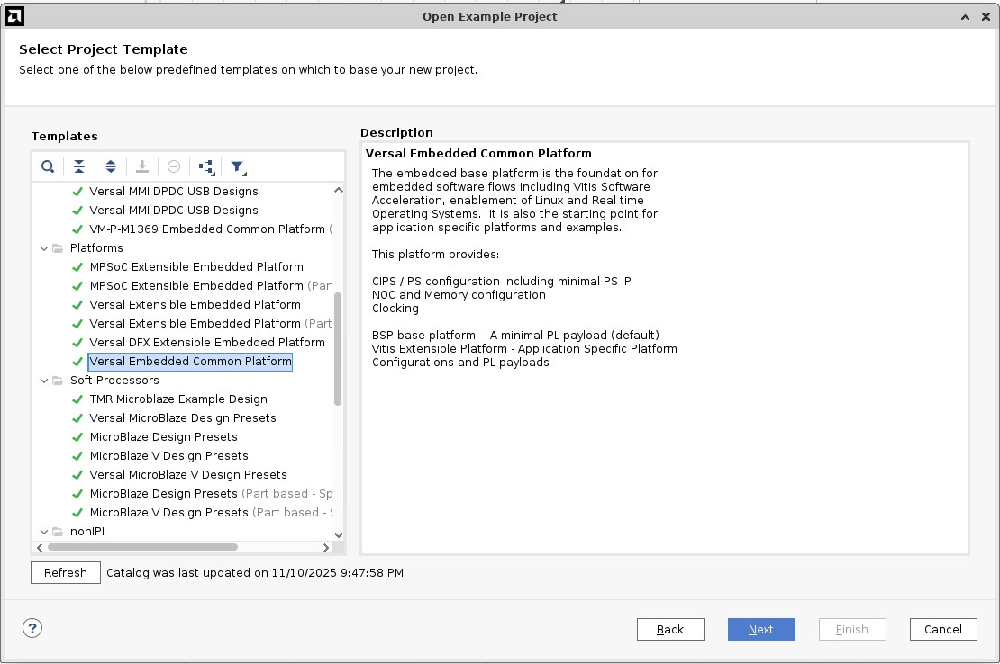
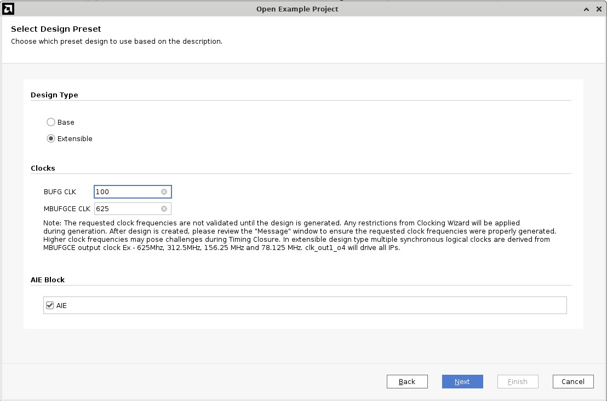
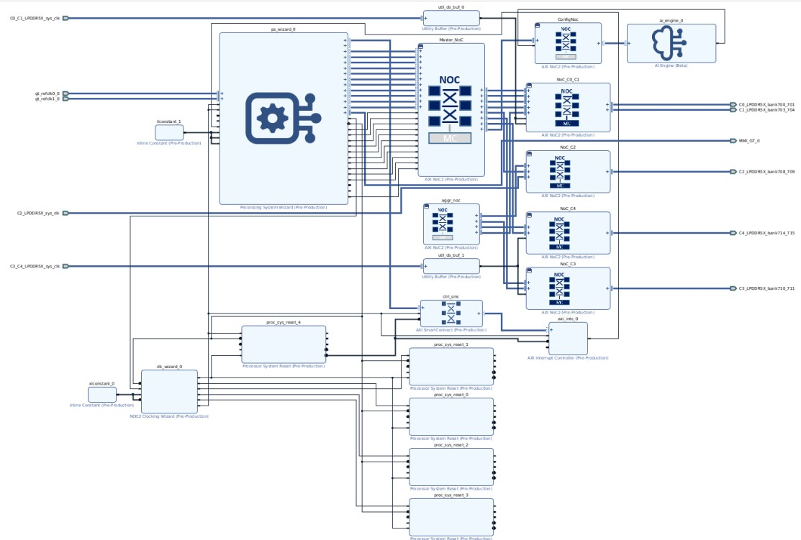
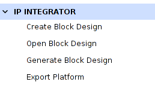
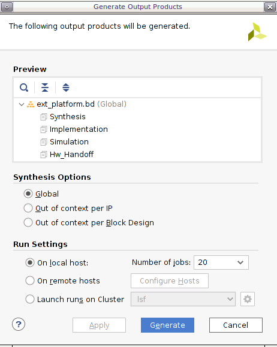
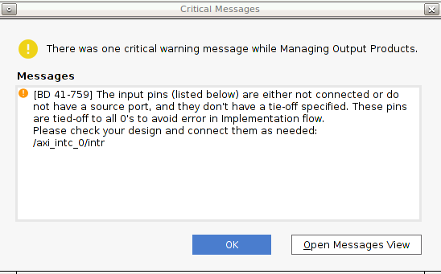
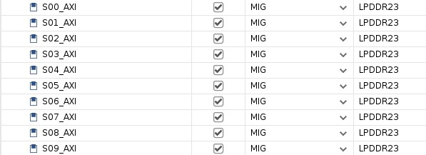
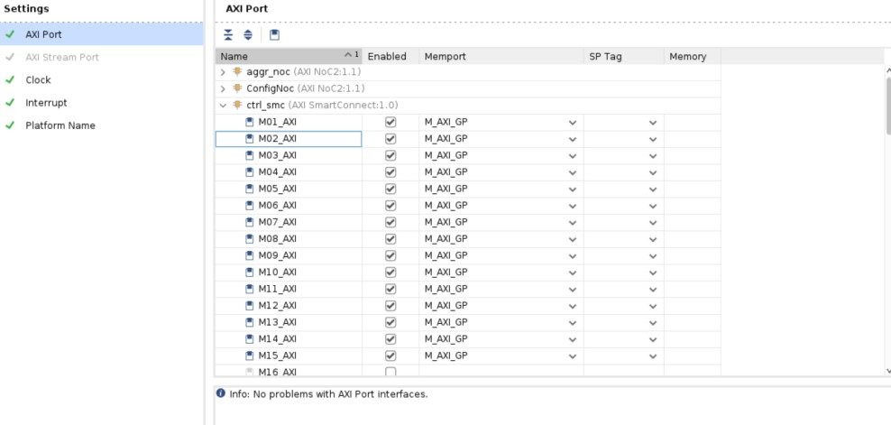
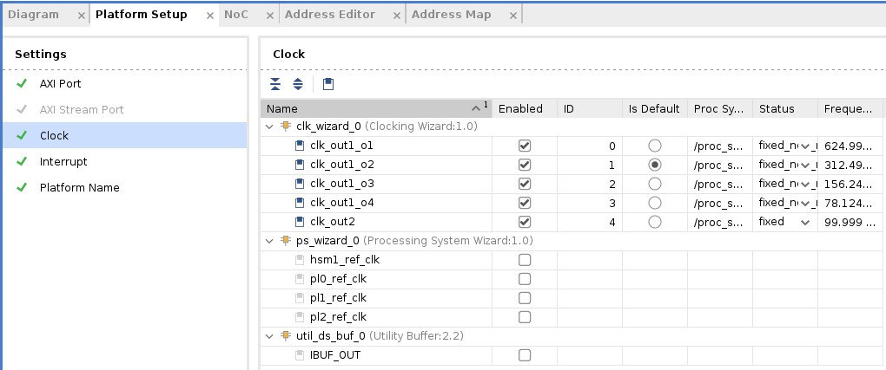
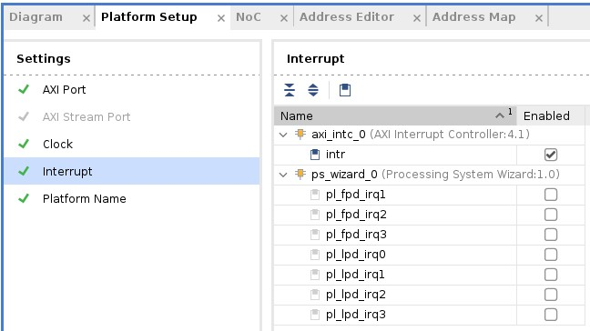

<table class="sphinxhide" width="100%">
 <tr width="100%">
    <td align="center"><h1>Versal™ AI Edge Gen2 Design Flow with Vitis™ Unified IDE</h1>
    <a href="https://www.xilinx.com/products/design-tools/vitis.html">See Vitis Development Environment on xilinx.com</br></a>
    </td>
 </tr>
</table>

# Step 1: Create Vivado Design to generate extensible XSA

In this step, you will create an extensible hardware platform for the VEK385 board using the AMD **Versal Embedded Common Platform** example design. This example serves as a board support design for Versal adaptive SoCs and includes key platform components such as the Processing System (PS), NoC, DDR, AI Engine, and other essential IP blocks.

The platform is pre-configured with many common elements, while keeping key board-specific settings—such as PS-side peripherals, platform clocks, and DDR configurations—open for user customization. This allows you to tailor the hardware design based on your board’s specific requirements.

Once you complete the necessary configuration—such as updating the PS settings, DDR parameters, and any additional platform properties—you will export an extensible XSA file. This file serves as the foundation for developing kernel applications including AIE and HLS kernels and software applications in the Vitis Unified IDE.

1. Create a workspace and launch AMD Vivado™ 

   - Create a workspace for the entire project

   ```bash
   mkdir WorkSpace
   cd WorkSpace
   ```
   
   - Run `source <Vitis_Install_Directory>/settings64.sh` to set up the Vivado running environment
   - Run Vivado by typing `vivado` in the console.

2. Download the Versal Extensible Embedded Platform Example
   
   - Click menu **Tools -> Vivado Store.**
   - Click **OK** to agree to download open source examples from the web.
   - Select **Example designs -> Platform -> Versal Embedded Common Platform** and click the download button on the toolbar.
   - Click **Close** after installation is complete.

   

3. Create the Versal Embedded Common Platform example project

   - Click **File -> Project -> Open Example**.
   - Click **Next**.
   - Select **Versal Embedded Common Platform** in the Select Project Template window.
   - Input **project name** and **project location**. Keep **Create project subdirectory** checked. Click **Next**.
   - Select the target board VEK385  Evaluation Platform (Rev A ) in the Default Part window. We support only Rev A board for now with this tutorial and click **Next**.
   - Select **Extensible** in the Select Design Preset dialog. The base design is used to generate EDF images.

   

   - Configure Clock Settings. You can update output frequency. In this example, we can keep the default settings.
   - Enable the AI Engine according to your requirements. In this example, we can keep the default settings.
   - Click **Next**.
   - Review the new project summary and click **Finish**.
   - After a while, the design example is generated.

   The generated design is shown in the following figure:

   

   At this stage, the Vivado block automation has added a PS wizard (shortened to PS in the future) block, AXI NOC block, AI Engine, and all supporting logic blocks to the diagram, and applied all board presets for the VEK385. 
   
4. Generate Block Diagram

   - Click **Generate Block Design** from the Flow Navigator window.

   

   - Select **Synthesis Options** to **Global** to save generation time. 

   

   - Click the **Generate** button.

   **Note**: It is safe to ignore this critical warning. Vitis will connect this signal in the future.

   


5. Versal Embedded Common Platform interface setup.

   1. Go to the **Platform Setup** tab.

      - If the tab is not open, click menu **Window -> Platform Setup** to open it.

      > **NOTE:** If you cannot find the Platform Setup tab, make sure your design is a Vitis platform project. Open **Settings** in **Project Manager**, go to the **Project Settings -> General** tab, and make sure **Project is an extensible Vitis platform** is enabled.

   2. Review the AXI port settings.

      - In **NoC_C0_C1**, S00_AXI to S29_AXI are enabled. **SP Tag** is set to **LPDDR01**, and in **NoC_C2_C3**, S00_AXI to S29_AXI are enabled. **SP Tag** is set to **LPDDR23**.

      

      >**NOTE:** Vitis emulation automation scripts require AXI slave interfaces on Versal platforms to have SP Tag as either **DDR** or **LPDDR**.

      - In **ctrl_smc**, M01_AXI to M15_AXI are enabled. Memport is set to M_AXI_GP. SP Tag is empty. These ports provide the AXI master interfaces to control PL kernels. 

      

      >**NOTE:** SP Tag for AXI Master does not take effect.

   3. Review the clock settings.

   - In the Clock tab, `clk_out` is the default clock. The V++ linker will use this clock to connect the kernel if the link configuration doesn't specify any clocks.
   - The Proc Sys Reset property is set to the synchronous reset signal associated with each clock.

      

   >**Note:** The 625MHz clock is generated by a clock generator with MBUGCE driver, designed to deliver a high clock frequency with minimal clock skew for AIE-related designs. For more details about platform clock settings, please refer to the [Platform Clock Setting in UG1393](https://docs.amd.com/r/en-US/ug1393-vitis-application-acceleration/Platform-Clock-Setting).

   4. Review the Interrupt tab.

   - In the Interrupt tab, **intr** is enabled.

      

      

6. Export hardware and hardware emulation platform with the following scripts:

   This platform follows the segmented configuration method and is designed to work with the AMD Embedded Design Framework (EDF). To ensure the system boots correctly with EDF-provided images, the configuration of the processing system (PS) and the PS to NOC LPDDR must match the settings defined by EDF. See the [AMD EDF Documentation](https://edf.docs.amd.com/en/latest/) (the 2026.1 home for EDF documentation, superseding the legacy Confluence wiki) for more details.

   Run the Export Platform wizard again, and export the XSA for hardware.

   - Click **File -> Export -> Export Platform**. Alternative ways are: **Flow Navigator** window: **IP Integrator -> Export Platform**, or the **Export Platform** button at the bottom of the **Platform Setup** tab.
   - Click **Next** on the Export Hardware Platform page.
   - Select **Hardware and hardware emulation**.  Click **Next**.
   - Select **Pre-synthesis**, because we are not making a DFX platform. Click **Next**.
   - Input Name: **vek385_custom_platform**, click **Next**.
   - Update the XSA file name to **vek385_custom**, click **Next**.
   - Review the summary. Click **Finish**.
   - **vek385_custom.xsa** file is generated in the Vivado project location directory.

Up to now, the extensible hardware design is finished. We can go to the next step: [Vitis Integration to generate final fixed hardware design](./step2.md)

<p class="sphinxhide" align="center"><sub>Copyright © 2026 Advanced Micro Devices, Inc.</sub></p>

<p class="sphinxhide" align="center"><sup><a href="https://www.amd.com/en/corporate/copyright">Terms and Conditions</a></sup></p>
