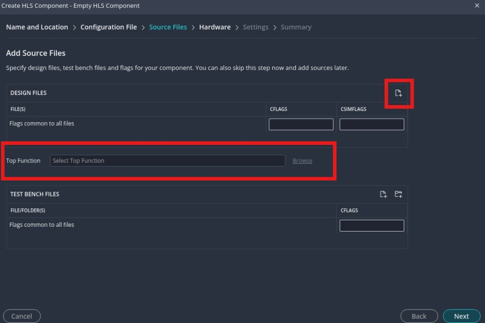
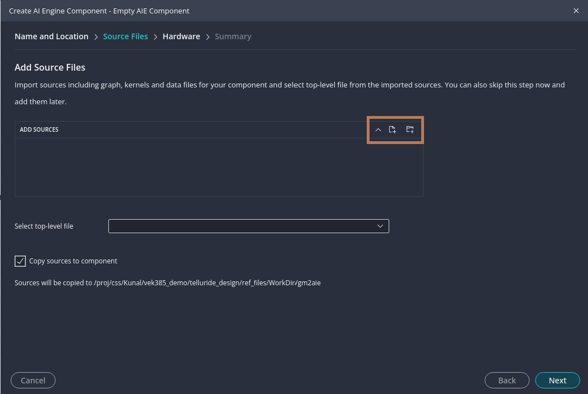
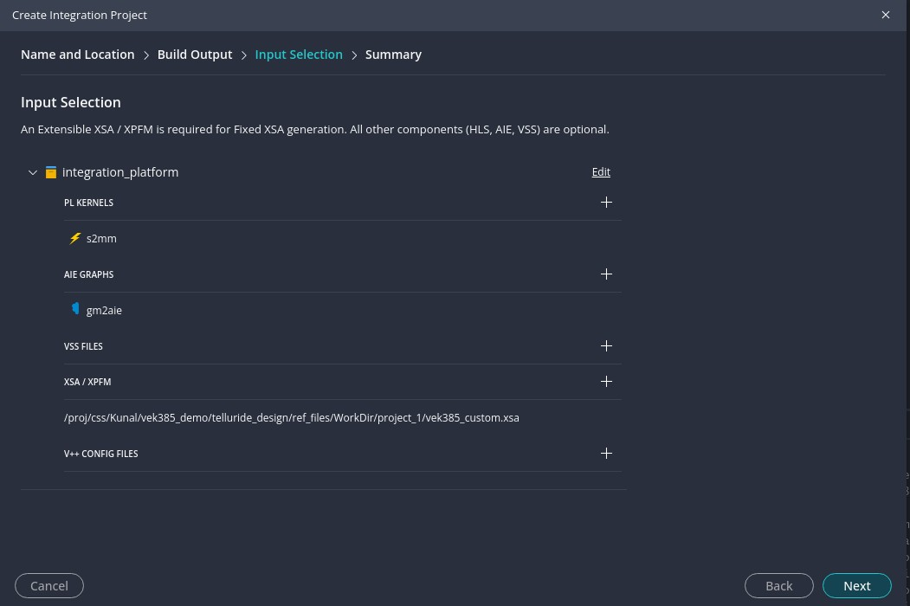
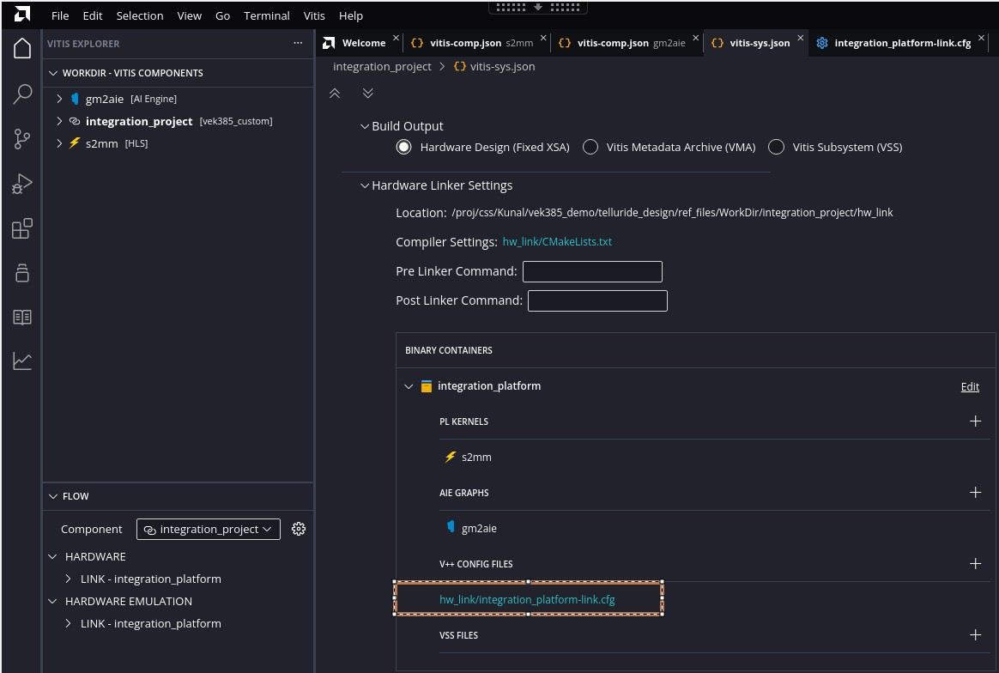
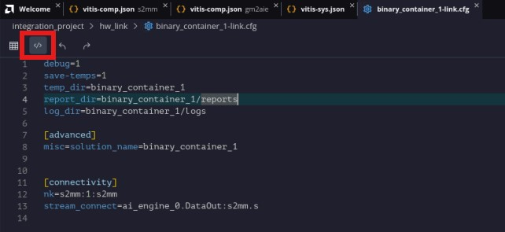
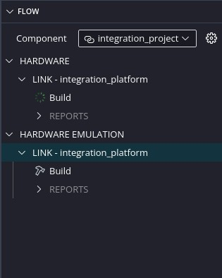

<table class="sphinxhide" width="100%">
 <tr width="100%">
    <td align="center"><h1>Versal™ AI Edge Gen2 Design Flow with Vitis™ Unified IDE</h1>
    <a href="https://www.xilinx.com/products/design-tools/vitis.html">See Vitis Development Environment on xilinx.com</br></a>
    </td>
 </tr>
</table>

## Step 2: Develop and Integrate Kernels to Generate the Final Hardware Design

In this step, you will create HLS and AI Engine components using pre-prepared kernel source files, and integrate them with the extensible hardware platform generated in Step 1.

The goal of this step is not to focus on kernel development, but to demonstrate the flow on how to develop the final hardware design using the Vitis Unified IDE for the VEK385 board. This includes integrating existing HLS and AIE kernels into the hardware platform and generating the final hardware design.

1. Create an HLS kernel

    - Navigate to the Workspace folder that you created in Step 1

    ```bash
    cd Workspace
    ```

    - Launch Vitis Unified IDE by typing `vitis -w .` in the Linux console. `-w` is to specify the workspace. `.` means the current workspace.
    >Note: Before launching Vitis, you need to `source <vitis installation folder>/settings64.sh` to enable the Vitis tool environment.
    - In the Vitis IDE, select **File**->**New Component**->**HLS** to start creating a new HLS component.
    - Enter the Component name. For this example, type `s2mm`, and click **Next**.
    - On the **Configuration File** page, choose to create a new empty configuration file (default selection). Then, click **Next**.
    - On the **Source Files** page, click the button in the following picture to add files and navigate to: `ref_files/step2_vitis_integration/pl_kernels/`. Select the file `s2mm.cpp` and click **Open**.
    - On the same **Source Files** page, click **Browse** to detect and select the top function. The IDE will automatically detect the top-level function. Click **OK** to confirm, then click **Next**.

    

    - On the **Hardware** select page, choose **Hardware design** and click **Browse** to select the XSA file exported from Step 1. For this example, the XSA path is: `WorkSpace/step1/project_1/vek385_custom.xsa`. Then, click **Next**.
    - On the **Settings** page, set **flow_target** to **Vitis Kernel Flow Target** and set **package.output.format** to **Generate a Vitis XO**. Then, click **Next** to continue.
    - Review the summary and click **Finish** to complete HLS component creation.

    The `s2mm` HLS component will now appear in the Vitis Component View.

2. Create an AIE kernel

    - In the Vitis IDE, select **File**->**New Component**->**AI Engine** to start creating a new AIE component.
    - Enter the Component name. For this example, type `gm2aie`, and click **Next**.
    - On the **Source Files** page, click the button shown in the image below to add folders.
    
    
    
    Navigate to: `ref_files/step2_vitis_integration/`. Select the `src` folder and click **Open**. Enable the option **Copy source files to component**. The tool will automatically detect and select the top-level source file. Click **Next** to continue.
    - On the **Hardware** select page, choose **Hardware design** and click **Browse** to select the XSA file exported from Step 1. For this example, the XSA path is: `WorkSpace/step1/project_1/vek385_custom.xsa`. Then, click **Next**.
    - Review the summary and click **Finish** to complete AIE component creation.

    The `gm2aie` AIE component will now appear in the Vitis Component View.

3. Create a integration project to integrate the two kernels with the extensible design

    1. Create a integration project.

        - In the Vitis IDE, select **File**->**New Component**->**Integration Project** to start creating a new integration project.
        - Keep the Component name as `integration_project`, and click **Next**.
        - On the **Build Output** select page, choose **Hardware design** and click **Next** to select the XSA file exported from Step 1. For this example, the XSA path is: `WorkSpace/step1/project_1/vek385_custom.xsa`. Then, click **Next**.
        - On the **Select build output** page, select **PL KERNELS**, **AIE GRAPHS** and
        **XSA** generated in the previous steps as below example. Then, click **Next**.
        
        

        - Review the summary and click **Finish** to complete system project creation.

        The `integration_project`  will now appear in the Vitis Component View and system project Json file also appear in the main view.

    2. Configure the system project

        Go to the system project JSON file that automatically opens in the main view. If it doesn’t appear, navigate to the Component View, select the `integration_project`, expand the `Settings`, and click on `vitis-sys.json`

        

        - Go to **Hardware Linker Settings**, expand **Binary Container_1**, and click on the **hw_link/binary_container_1-link.cfg** file to open it. Click the icon `</>` to switch to source editor mode. Then, copy the contents from [binary_container.cfg](ref_files/step2_vitis_integration/cfg/binary_container_1-link.cfg) and paste them into this file, replacing the existing content. 

        


    3. Build the integration project to generate final hardware for hardware run or hardware emulation

        - Generate fixed XSA for hardware run
            - Go to **Flow Navigator**.
            - Go to the **HARDWARE** section, expand **LINK-integration_platform**. Then click **Build**.
            The generated fixed XSA file for hardware run will be located at: `WorkSpace/integration_project/build/hw/hw_link/integration_platform.xsa`

        - Generate fixed XSA for hardware emulation
            - Go to **Flow Navigator**.
            - Go to the **HARDWARE EMULATION** section, expand **LINK-integration_platform**. Then click **Build**.

            The generated fixed XSA file for hardware emulation will be located at: `WorkSpace/integration_project/build/hw_emu/hw_link/integration_platform.xsa`

        

At this point, the final fixed hardware design for hardware or emulation is complete. Next, we will move on to the [Software development phase](./step3.md).

<p class="sphinxhide" align="center"><sub>Copyright © 2026 Advanced Micro Devices, Inc.</sub></p>

<p class="sphinxhide" align="center"><sup><a href="https://www.amd.com/en/corporate/copyright">Terms and Conditions</a></sup></p>
