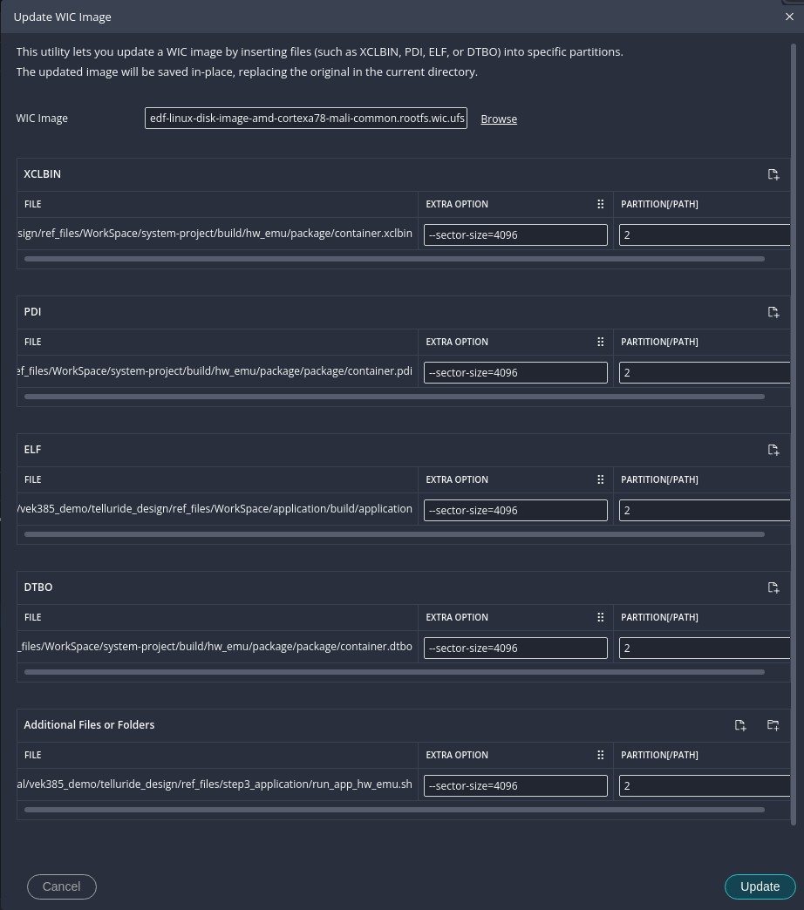
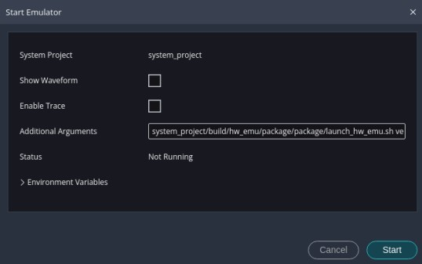
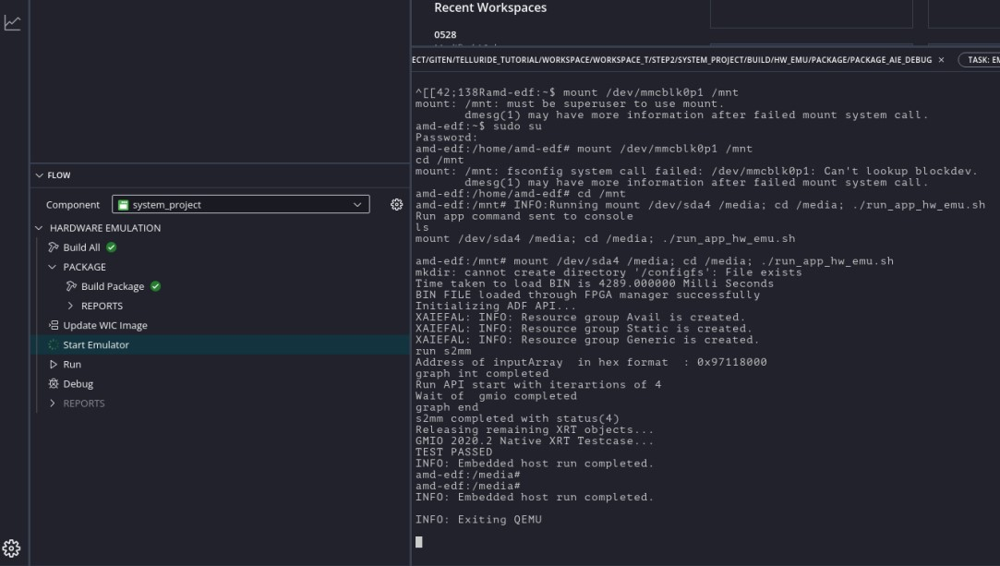

<table class="sphinxhide" width="100%">
 <tr width="100%">
    <td align="center"><h1>Versal™ AI Edge Gen2 Design Flow with Vitis™ Unified IDE</h1>
    <a href="https://www.xilinx.com/products/design-tools/vitis.html">See Vitis Development Environment on xilinx.com</br></a>
    </td>
 </tr>
</table>

## Step 3: Software application development

In this step, we will create a platform-based application for development. To make the flow easier to follow, especially for users working with both hardware and emulation, we will divide this section into two parts: Hardware Flow and Hardware Emulation Flow.

### Hardware flow

1. Create a platform based on the final fixed XSA generated in Step 2 for application development.

    - In the Vitis IDE, select **File**->**New Component**->**Platform** to start creating a new platform component.
    - Enter the Component name. For this example, type `vek385_fixed_hw`, and click **Next**.
    - On the **Flow** page, click **Browse** and navigate to: `integration_project/build/hw/hw_link/`. Select the `integration_platform.xsa` XSA file. Expand the **Advanced Options** section and enter `versal2-vek385-reva` in the Board DTS field and enable the **DT ZOCL** option. Then, click **Next** to continue.
    - On the **OS and Processor** page, select `Linux` as the **Operating System** and the **Processor** will be automatically updated to `cortexa78`. Ensure the **DT Overlay** option is enabled. Then, click **Next**.

    >Note: For the VEK385 board, we will use the Basecamp Common Images, which are prebuilt and include the Device Tree Blob (DTB) and other essential boot components. As a result: DTB generation is not required — the prebuilt DTB from Basecamp will be used. However, DTBO (Device Tree Overlay) generation must be enabled for application kernel binary reload. Just keep the default settings, as DTBO generation is enabled by default.

    - Review the summary and click **Finish** to complete platform component creation.

    The `vek385_fixed_hw` platform component will appear in the Vitis component view.
 
    - Go to **Flow** navigator, select `vek385_fixed_hw` and click **Build** to build the platform.

    After completing the platform build process, the Device Tree Overlay (DTBO) file is automatically generated and can be found at `WorkSpace/vek385_fixed_hw/export/vek385_fixed_hw/sw/boot/pl.dtbo`.

    After completing the build process, the XCLBIN and PDI files are automatically generated and can be found at `WorkSpace/integration_project/build/hw/hw_link/integration_platform/integration_platform/int/integration_platform.xclbin` and `WorkSpace/integration_project/build/hw/hw-link/integration_platform/integration_platform/int/vpl_gen_fixed_pld.pdi`

    >Note: PDI name should always be `vpl_gen_fixed_pld`. As this name is hard coded in the device tree file and will be used to find the PDI file when loading the DTBO and XCLBIN file.

2. Create an application component based on the platform

    - In the Vitis IDE, select **File**->**New Component**->**Application** to start creating a new application component.
    - Enter the Component name. For this example, type `application`, and click **Next**.
    - On the **Hardware** select page, choose the platform **vek385_fixed_hw** that we just created from the platform Repository list. Then, click **Next**.
    - On the **Domain** page, keep the default one **linux_cortexta78** generated during platform creation. Click **Next**.
    - On the **Sysroot** page, click **Browse**, navigate to `WorkSpace/sysroots/`, select the folder `cortexa72-cortexa53-amd-linux`, and click **Select** to confirm.
    - On the **Source Files** page, click the add files button and navigate to: `ref_files/step3_application/host_src/`. Select all files under this folder and click **Open**. Similarly, click the add files button and navigate to: `gm2aie/build/hw/Work/ps/c_rts/`. Select `aie_control_xrt.cpp` and click **Open**. Then, click **Next**.

    >Note: The functions in `aie_control_xrt.cpp`, which leverage the XRT API to control the AIE, will be referenced throughout the host code.

    - Review the summary and click **Finish** to complete application component creation.


3. Build the application 

    - Update the compiler settings
        - Navigate to the application component's `vitis-comp.json` file. This file opens automatically after the application component is created. If it doesn't, go to the application component in the Component view, expand Application Settings, and click `vitis-comp.json` to open it manually.
        - Click **UserConfig.cmake** to open it.
        - Go to the **Includes** section and click `Add items`, then **Browse**, navigate to the `gm2aie/src` folder and click **Open**.
        - Go to the **Miscellaneous** section, click the dropdown menu, and set **CMake CXX Standard** to `17`.

        >Note: C++ 17 is required for compiling the C++ code.

    - Build the application component
        - Go to **Flow** navigator, select the application component and click **Build**.

        After the building process is finished, the executable file is located in `WorkSpace/application/build/application`

4. Run on VEK385 board

    - Boot the board using the QSPI BIN file downloaded in the previous step, following the instructions outlined in chapter `How to boot a board using the pre-built Images: OSPI Boot` in  [AMD EDF Wiki Page](https://xilinx-wiki.atlassian.net/wiki/spaces/A/pages/3258155011/AMD+EDF+Getting+started+-+Discovery+and+Evaluation+AMD+Versal+device+portfolio#AMDEDFGettingstarted-DiscoveryandEvaluationAMDVersaldeviceportfolio-How-to-boot-a-board-using-the-pre-built-Images%3A-OSPI-Boot).
    - Program the `edf-linux-disk-image-amd-cortexa78-mali-common.rootfs-20250730090230.wic.xz` to a SD card. Refer to the chapter of `Writing the EDF Linux® disk image (wic) to the secondary boot media : SD card ` in  [AMD EDF Wiki Page](https://xilinx-wiki.atlassian.net/wiki/spaces/A/pages/3258155011/AMD+EDF+Getting+started+-+Discovery+and+Evaluation+AMD+Versal+device+portfolio#AMDEDFGettingstarted-DiscoveryandEvaluationAMDVersaldeviceportfolio-How-to-boot-a-board-using-the-pre-built-Images%3A-OSPI-Boot).

      > **NOTE:** Eject the SD card properly from the system after programming it.

    - Insert the SD card, and boot the VEk385 board with QSPI boot mode (SW!: ON,ON,ON,OFF = 0001) and power on.

    - Connect to UART console.

    - Launch the test application from UART console.

    <details>
    <summary><strong>Use the following steps to run the application</strong></summary>

     You will need to log in with user `amd-edf` first and set up a new password (it is then also the sudo password):

    - Log into the system

         ```bash
         amd-edf login:amd-edf
         You are required to change your password immediately (administrator enforced).
         New password:
         Retype new password:
         amd-edf:~$ sudo su
         We trust you have received the usual lecture from the local System
         Administrator. It usually boils down to these three things:
               #1) Respect the privacy of others.
               #2) Think before you type.
               #3) With great power comes great responsibility.
         Password:
         amd-edf:/home/amd-edf#
         ```

    - Use SCP to download the application and other files required to the current folder. Required files are listed as below:

        - Application: `WorkSpace/application/build/application`
        - DTBO: `WorkSpace/vek385_fixed_hw/export/vek385_fixed_hw/sw/boot/gm2aie.dtbo`
        - XCLBIN: `WorkSpace/integration_project/build/hw/package/gm2aie.xclbin`
        - PDI: `WorkSpace/integration_project/build/hw/package/package/gm2aie.pdi`

       Use the scp command to transfer files to the current working directory. For example, to download the application file:

        ```
        amd-edf:/home/amd-edf# scp  <user_name>@<IP of host where IDE is running on>:<path to workspace>/WorkSpace/application/build/application .
        ```
        >Note: Using an SD card to copy the files to your board also works.

    - Run the application

        ```
        amd-edf:/home/amd-edf# ls 
        amd-edf:/home/amd-edf# application gm2aie.dtbo gm2aie.xclbin gm2aie.pdi
        amd-edf:/home/amd-edf# fpgautil -b gm2aie.pdi  -o gm2aie.dtbo
        amd-edf:/home/amd-edf# ./application gm2aie.xclbin

   </details>  

    - Expected print on UART console

    <details>
    <summary><b>Show Log</b></summary>

    ```
    amd-edf:/home/amd-edf# fpgautil -b gm2aie.pdi  -o gm2aie.dtbo
    amd-edf:/home/amd-edf# ./application gm2aie.xclbin
    Initializing ADF API...
    XAIEFAL: INFO: Resource group Avail is created.
    XAIEFAL: INFO: Resource group Static is created.
    XAIEFAL: INFO: Resource group Generic is created.
    run s2mm
    Address of inputArray  in hex format  : 0x873d5000
    graph int completed            Run API start with iterations of 4
    Wait of  gmio completed 
    graph end
    s2mm completed with status(4)
    Releasing remaining XRT objects...
    GMIO 2020.2 Native XRT Testcase...
    TEST PASSED
    INFO: Embedded host run completed.
    ```
    </details>


### Hardware emulation flow

1. Create a platform based on the fixed XSA generated in Step 2 for application development.

    - In the Vitis IDE, select **File**->**New Component**->**Platform** to start creating a new platform component.
    - Enter the Component name. For this example, type `vek385_fixed_hwemu`, and click **Next**.
    - On the **Flow** page, expand the **Emulation** section, click **Browse** and navigate to: `integration_project/build/hw_emu/hw_link/`. Select the `integration_platform.xsa` XSA file as **HW Design(XSA) for hardware emulation**. Next, expand the **Advanced Options** section and enter `versal2-vek385-reva` in the Board DTS field and enable the **DT ZOCL** option. Once completed, click **Next** to continue.
    - On the **OS and Processor** page, select `Linux` as the **Operating System** and the **Processor** will be automatically updated to `cortexa78`. Ensure the **DT Overlay** option is enabled. Then, click **Next**.

    >Note: For the VEK385 board, we will use the Basecamp Common Images, which are prebuilt and include the Device Tree Blob (DTB) and other essential boot components. As a result: DTB generation is not required — the prebuilt DTB from Basecamp will be used. However, DTBO (Device Tree Overlay) generation must be enabled for application kernel binary reload. Just keep the default settings, as DTBO generation is enabled by default.

    - Review the summary and click **Finish** to complete platform component creation.

    The `vek385_fixed_hwemu` platform component will appear in the Vitis component view.
 
    - Go to **Flow** navigator, select `vek385_fixed_hwemu` and click **Build** to build the platform.

    After completing the platform build process, the Device Tree Overlay (DTBO) file is automatically generated and can be found at `WorkSpace/vek385_fixed_hwemu/export/vek385_fixed_hwemu/sw/boot/pl.dtbo`.

2. Create an application component based on the platform

    >Note: If you've already completed the hardware flow, you can reuse the application created during that process. In that case, you may skip this step.

    - Navigate to the `WorkSpace` folder.

    ```bash
    cd WorkSpace
    ```

    - Run Vitis by typing `vitis -w .` in the console. `-w` is to specify the workspace. `.` means the current workspace.
    - In the Vitis IDE, select **File**->**New Component**->**Application** to start creating a new application component.
    - Enter the Component name. For this example, type `application`, and click **Next**.
    - On the **Hardware** select page, choose the platform **vek385_fixed_hwemu** that we just created from the platform Repository list. Then, click **Next**.
    - On the **Domain** page, keep the default one **linux_cortexta78** generated during platform creation. Click **Next**.
    - On the **Sysroot** page, click **Browse**, navigate to `WorkSpace/sysroots/`, select the folder `cortexa72-cortexa53-amd-linux`, and click **Select** to confirm.
    - On the **Source Files** page, click the add files button and navigate to: `ref_files/step3_application/host_src/`. Select all files under this folder and click **Open**. Similarly, click the add files button and navigate to: `gm2aie/build/hw/Work/ps/c_rts/`. Select `aie_control_xrt.cpp` and click **Open**. Then, click **Next**.

    >Note: The functions in `aie_control_xrt.cpp`, which leverage the XRT API to control the AIE, will be referenced throughout the host code.

    - Review the summary and click **Finish** to complete application component creation.
    - Update the application compiler settings
        - Navigate to the application component's `vitis-com.json` file. This file opens automatically after the application component is created. If it doesn't, go to the application component in the Component view, expand Application Settings, and click `vitis-com.json` to open it manually.
        - Click **UserConfig.cmake** to open it.
        - Go to the **Include** section and click `Add items`, then **Browse**, navigate to the `gm2aie/src` folder and click **Open**.
        - Go to the **Miscellaneous** section, click the dropdown menu, and set **CMake CXX Standard** to `17`.

        >Note: C++ 17 is required for compiling the C++ code.

3. Create a system project for hardware emulation

    - In the Vitis IDE, select **File**->**New Component**->**System Project** to start creating a new system project.
    - Enter the Component name. For this example, keep the default name, and click **Next**.
    - On the **Hardware** select page, choose **Hardware design** and select the platform we created just now: `vek385_fixed_hwemu`. Then, click **Next**.
    - On the **Embedded components path** page, please specify the sysroot we installed just now. Then, click **Next**.

    - Review the summary and click **Finish** to complete system project creation.
    
    
    The `System_project`  will now appear in the Vitis Component View and system project Json file also appear in the main view.
    

4. Configure and build the system project

    - Go to the system project JSON file that automatically opens in the main view. If it doesn't appear, navigate to the Component View, select the `system_project`, expand the `Settings`, and click on `vitis-sys.json`
    - Go to **Components** section and click **Add Existing Component**, and in the pop-up window, select application and then AIE in order to add the `application`  component and the `gm2aie` AI Engine component.
    - Go to **Flow Navigator**, then click **Build All** to build the system project. Please deselect the `gm2aie` component, as we already build this component.
    
    The generated XCLBIN, PDI and application are in following location:
    
    ```bash
    WorkSpace/system_project/build/hw_emu/package/package/BOOT.BIN
    WorkSpace/system_project/build/hw_emu/package/gm2aie.xclbin
    WorkSpace/application/build/application
    ```

   At this point, all required binaries for hardware emulation have been generated. You can now proceed to run the hardware emulation.

5. Run hardware emulation

    - Update WIC image 
        - Run the following command to extract the images for emulation.

        ```bash
        tar -xvzf versal-2ve-2vm-vek385-sdt-qemu-prebuilt_11151020.tar.gz
        cd versal-2ve-2vm-vek385-sdt-qemu-prebuilt_11151020/
        ls 
        BOOT-versal-2ve-2vm-vek385-sdt-seg.bin
        BOOT-versal-2ve-2vm-vek385-sdt-seg.qemuboot.conf
        combined.qemuboot.conf
        edf-linux-disk-image-amd-cortexa78-mali-common.rootfs.qemuboot.conf
        edf-linux-disk-image-amd-cortexa78-mali-common.rootfs.wic.ufs
        qemu-hw-devicetrees
        qemu-ospi-versal-2ve-2vm-vek385-sdt-seg.bin
        ```

        - Go to **Flow** Navigator, click **Update WIC image**. Folowing wizard would appear in the main view.

        

        >Note: The WIC Wizard can also be launched from menu **Vitis** → **Update WIC Image** in the top menu. When opened through the Flow Navigator, the required files (XCLBIN, PDI, ELF, and DTBO) are automatically populated. If you launch the wizard from the Vitis menu, you’ll need to manually provide the paths to these files.

        - Click **Browse** in the pop-up wizard and navigate to the `amd-cortexa78-mali-common_vek385_qemu_prebuilt/` folder, which contains the hardware emulation image extracted earlier. Select the file named: `edf-linux-disk-image-amd-cortexa78-mali-common.rootfs.wic.ufs`
        In the **Additional Files or Folders** section add run_app_hw_emu.sh script to run the binaries.
        - Click **Update** in the right bottom of this wizard. 

        >Note: A notification confirming that the WIC image update is complete will appear in the bottom-right corner. The updated WIC image remains in the original `versal-2ve-2vm-vek385-sdt-qemu-prebuilt_05222340/` folder. The wizard simply inserts the specified files and replaces the existing image in place.


    - Go to **Flow** Navigator, click **Start Emulator**, In the pop-up window, enter the following command in the **Additional Arguments** field, then click **Start**.

    ```bash
    -qemu-config <path-to-WorkSpace>/amd-cortexa78-mali-common_vek385_qemu_prebuilt/combined.qemuboot.conf  -login "amd-edf" -password "amd-edf" -run-app "mount /dev/sda2 /media; cd /media; ./run_app_hw_emu.sh"
    ```

    

    
    

    - To stop the emulator, hover over **Start Emulator** and click the **X** icon if needed.


### Fast Track
If you encounter any issues when creating the extensible platform or the validation application in this tutorial, you can run the following command to generate the reference design and compare with your design.

-   Hardware emulation 

   Before running the following commands, ensure that the SDK has been downloaded and installed in the `step3_application` folder. Also, verify that the EDF QEMU File Set mentioned in the previous steps has been downloaded and extracted.

    ```bash
    cd ref_files
    make all YOCTO_QEMU_ARTIFACTS=versal-2ve-2vm-vek385-sdt-qemu-prebuilt_11151020/ ##Extracted in previous step.
    ```

    `versal-2ve-2vm-vek385-sdt-qemu-prebuilt_11151020/` is a flag to specify the common WIC image path. Please contact your AMD FAE to download the common WIC image from the Xilinx secure website and provide the path to the flag.

- Hardware run

    ```bash
    make sd_card  
    ```
    Then copy `hw_run` under the `step3_application` folder to your running board and execute `sh embedded_exec.sh` to run your application.


<p class="sphinxhide" align="center"><sub>Copyright © 2026 Advanced Micro Devices, Inc.</sub></p>

<p class="sphinxhide" align="center"><sup><a href="https://www.amd.com/en/corporate/copyright">Terms and Conditions</a></sup></p>
