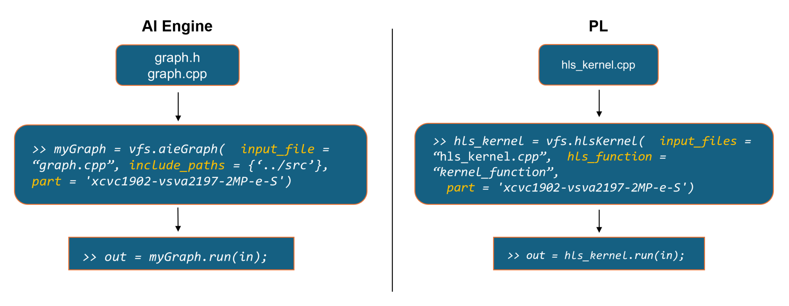
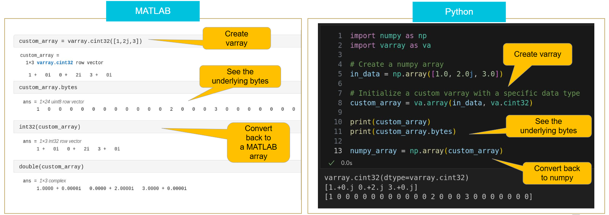

<table class="sphinxhide" style="width:100%;">
  <tr>
    <td align="center">
      <picture>
        <source media="(prefers-color-scheme: dark)" srcset="https://raw.githubusercontent.com/Xilinx/Image-Collateral/main/logo-white-text.png">
        
      </picture>
      <h1>AMD Vitis™ System Design Tutorials</h1>
      <a href="https://www.amd.com/en/products/software/adaptive-socs-and-fpgas/vitis.html">See Vitis™ Development Environment on amd.com</a>
    </td>
  </tr>
</table>

# Vitis Functional Simulation

***Version: Vitis 2025.2***

## Table of Contents

1. [Introduction](#introduction)
2. [Setup Instructions](#setup-instructions)
3. [Available Examples](#available-examples)

[Support](#support)

## Introduction

Vitis Functional Simulation (VFS) allows you to functionally simulate AI Engine graphs and/or HLS kernels in both MATLAB® and Python™ environments on Linux. It presents simple APIs to compile and simulate your design. VFS is designed to be easy to use and provides a familiar environment for users who are already accustomed to using MATLAB or Python.



## Varray

Vitis Functional Simulation (VFS) leverages "varray" (Vitis array), a module supporting all the data types available in AMD devices in both MATLAB and Python environments and allowing conversion and casting between the types.



For more information on Vitis Functional Simulation and Vitis array, refer to Chapter 6 of *Embedded Design Development Using Vitis User Guide* ([UG1701](https://docs.amd.com/r/en-US/ug1701-vitis-accelerated-embedded/Functional-Simulation-and-Verification-in-Vitis)).

## Setup Instructions

Source the appropriate settings file:

```
[shell]% source <vitis_install_folder>/settings64.sh
```

### Python

Launch Python (supports 3.9 to 3.13). The "numpy" module is required.

```
# import the following two modules
import vfs
import varray as va
```

> Optional: Create a virtual environment to install necessary modules or simply `source create_venv.sh`.

### MATLAB

Launch MATLAB (supports 2024a, 2024b and 2025a).

## Available Examples

This directory contains simple AI Engine Graphs and HLS kernels to show how to get started with VFS, as well as a more representative system example.

| Example    | Description |
| -------- | ------- |
| [`varray`](varray) | Showcasing basic varray operations |
| [`aie/GraphMultiplyByComplex`](aie/GraphMultiplyByComplex) | Simple design showcasing the basic structure of a VFS code |
| [`aie/bfloat16`](aie/bfloat16) | Demonstrates partial data being passed to the AIE graph |
| [`aie/FIRasyncRTP`](aie/FIRasyncRTP) | Instantiation of a symmetric FIR filter with async RTP port from [Vitis_Libraries](https://docs.amd.com/r/en-US/Vitis_Libraries/dsp/rst/class_xf_dsp_aie_fir_sr_sym_fir_sr_sym_graph.html) |
| [`aie/gmio`](aie/gmio) | Simple weighted-sum design that leverages GMIO |
| [`hls/SumOfFour`](hls/SumOfFour) | Simple design showcasing the basic structure of a VFS code |
| [`hls/array_pointer_data_type`](hls/array_pointer_data_type) | Demonstrates a kernel with array and pointer inputs |
| [`hls/arrayOfHlsStreams`](hls/arrayOfHlsStreams) | Demonstrates using an HLS kernel where the ports are arrays of streams |
| [`hls/kernel_invert`](hls/kernel_invert) | Demonstrates usage of the fixed-point varray data type |
| [`aie_hls/64kifft`](aie_hls/64kifft) | 64k-point IFFT implemented using a 2D breakdown containing resources in both AI Engine and PL. Also includes a Jupyter notebook version. [Link](https://github.com/Xilinx/Vitis-Tutorials/tree/2025.2/AI_Engine_Development/AIE/Design_Tutorials/12-IFFT64K-2D) to original design. |

## Support

GitHub issues are used for tracking requests and bugs. For questions, go to [Support](https://adaptivesupport.amd.com/s/?language=en_US).

<hr class="sphinxhide"></hr>

<p class="sphinxhide" align="center"><sub>Copyright © 2025 Advanced Micro Devices, Inc.</sub></p>

<p class="sphinxhide" align="center"><sup><a href="https://www.amd.com/en/corporate/copyright">Terms and Conditions</a></sup></p>