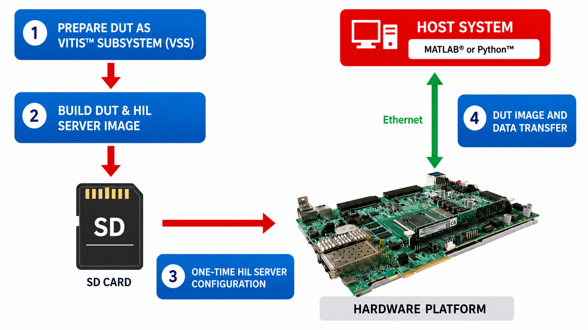
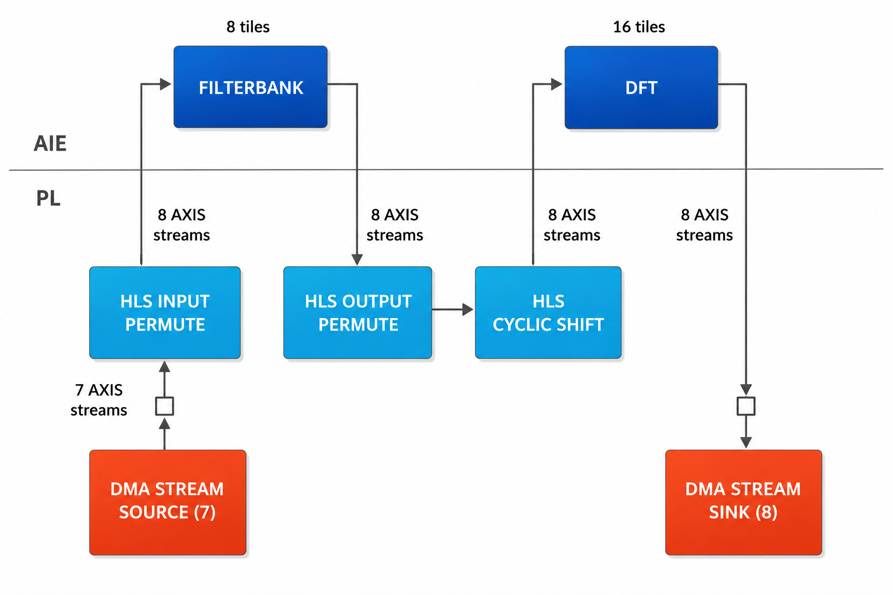
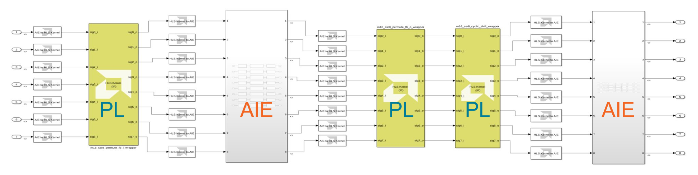
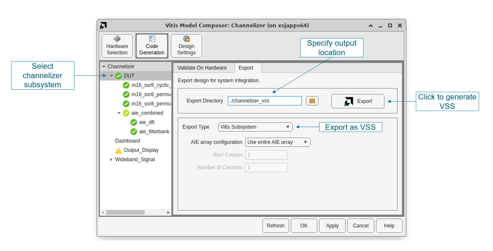
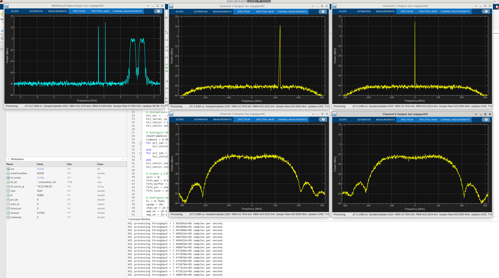
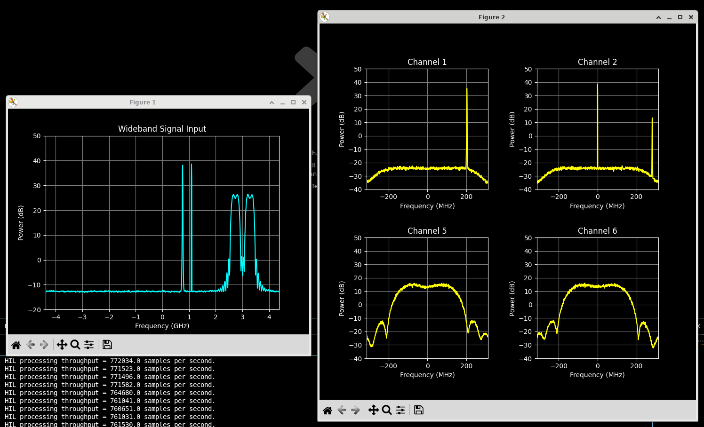

<table class="sphinxhide" style="width:100%;">
  <tr>
    <td align="center">
      <picture>
        <source media="(prefers-color-scheme: dark)" srcset="https://raw.githubusercontent.com/Xilinx/Image-Collateral/main/logo-white-text.png">
        
      </picture>
      <h1>AMD Vitis™ System Design Tutorials</h1>
      <a href="https://www.amd.com/en/products/software/adaptive-socs-and-fpgas/vitis.html">See Vitis™ Development Environment on amd.com</a>
    </td>
  </tr>
</table>

# Getting Started with Vitis Hardware in the Loop

***Version: Vitis 2026.1***

## Introduction

Vitis™ Hardware in the Loop (HIL) enables real-time verification of DSP-based systems by executing the actual design on a development board equipped with a Versal™ adaptive SoC. A host application generates stimulus, streams it to the hardware over a network connection using the Vitis HIL API, and receives the processed results — without requiring modifications to the host algorithm or hardware-specific driver development.

This approach allows you to validate hardware execution at full speed against a reference model running on the host. Vitis HIL is particularly valuable for systems that involve acquisition or convergence behavior, where traditional simulation requires excessive test vectors and impractical runtimes.

This tutorial demonstrates the complete Vitis HIL workflow using a polyphase channelizer as the design under test (DUT). The workflow consists of the following steps:

1. Package the design as a Vitis subsystem (VSS) from HLS programmable logic (PL) kernels and AI Engine graphs.
2. Generate an HIL image from the VSS using the `hil_gen` tool, targeting the AMD VCK190 evaluation board.
3. Set up and boot the hardware platform, including the Vitis HIL server (one-time setup).
4. Run the host application (MATLAB® or Python®) to download the design, stream data to and from the hardware, and analyze the results.

The following figure shows the Vitis HIL workflow. Refer to the _Vitis Hardware in the Loop User Guide_ ([UG1865](https://docs.amd.com/access/sources/markdown/map?Doc_Version=2026.1%20English&amp;url=ug1865-hardware-in-the-loop)) for additional details on any step.


*Figure: Overview of the Vitis Hardware in the Loop (Vitis HIL) Workflow*

This tutorial is intended for designers who want to validate DSP designs on real hardware while maintaining a high-level MATLAB or Python-based verification flow.

## Channelizer Design Overview

This design implements an _M = 16, SSR = 8, P/Q = 8/7 oversampled polyphase channelizer_. It accepts a wideband input stream sampled at 8.75 GHz and produces 16 contiguous sub-channel outputs, each mapped to a uniformly spaced frequency bin.

An 8/7 oversampling ratio is used to mitigate spectral aliasing at channel boundaries, ensuring clean separation between adjacent sub-bands while preserving signal fidelity at the band edges.

The implementation is heterogeneous, combining programmable logic and AI Engine components. The end-to-end signal flow and kernel partitioning are shown in the following figure. 


*Figure: Channelizer Signal Chain and Kernel Architecture*

Detailed coverage of the design, including AI Engine kernel algorithms, HLS kernel implementation, and the MATLAB golden reference model, is provided in the [Polyphase Channelizer](https://docs.amd.com/r/en-US/Vitis-Tutorials-AI-Engine-Development/Polyphase-Channelizer) tutorial.

The associated AI Engine and HLS source files are available in the `channelizer_src` directory.

If you are not already familiar with the underlying architecture, reviewing that material is recommended before proceeding with this HIL example.

## Generating a Vitis Subsystem

A Vitis subsystem (VSS) packages AI Engine graphs and HLS PL kernels together as a reusable IP block. The Vitis HIL flow requires a compiled VSS as its starting point. The VSS for this tutorial is generated in `channelizer_vss/`, which contains a Makefile, configuration files, and a top-level AI Engine graph.

For general information on creating and using Vitis subsystems, refer to the [Vitis Subsystem](https://docs.amd.com/access/sources/dita/topic?Doc_Version=2026.1%20English&url=ug1701-vitis-accelerated-embedded&resourceid=yhu1757413857371.html) section in the _Embedded Design Development Using Vitis User Guide_ ([UG1701](https://docs.amd.com/access/sources/dita/map?Doc_Version=2026.1%20English&url=ug1701-vitis-accelerated-embedded)). 

---

### Building with Make

All VSS build steps for this tutorial are driven by the `Makefile` located in `channelizer_vss/`. You can examine content of the `Makefile` for details on the individual compilation and linking commands used. Before running any targets, source the Vitis environment:

```bash
source <Vitis_install>/settings64.sh
```

Available make targets are shown in the following table. 

| Target | Description |
|--------|-------------|
| `make all` | Compile HLS kernels and AI Engine graph, then link the VSS. |
| `make hls` | Compile HLS PL kernels only (produces `.xo` files). |
| `make aie` | Compile the AI Engine graph only (produces `libadf.a`). |
| `make link` | Link HLS `.xo` files and `libadf.a` into the VSS (requires `hls` and `aie` first). |
| `make clean` | Remove all build artifacts. |

To build the complete VSS from a clean state, run the following command:

```bash
cd channelizer_vss
make all
```

On success, the VSS output is written to `channelizer_vss/vss_out/`.

---

### HLS Kernel Components

HLS compilation is controlled by the `.cfg` files located in `channelizer_vss/`:

| Config file | Kernel | Function |
|-------------|--------|----------|
| `hls_permute_fb_i.cfg` | `m16_ssr8_permute_fb_i_wrapper` | Input permutation (7 → 8 streams) |
| `hls_permute_fb_o.cfg` | `m16_ssr8_permute_fb_o_wrapper` | Output permutation (8 → 8 streams) |
| `hls_cyclic_shift.cfg` | `m16_ssr8_cyclic_shift_wrapper` | Cyclic frequency shift (8 → 8 streams) |

Each `.cfg` file defines the target part, clock frequency, and source file paths. To modify synthesis behavior, such as clock frequency or optimization settings, edit the `[hls]` section of the corresponding `.cfg` file.

---

### AI Engine Top-Level Graph

The file `channelizer_aie_top.cpp` located in `channelizer_vss/` serves as the entry point for AI Engine compilation and provides the integration layer between independently developed sub-graphs and the VSS build. This top-level construct is necessary for generating a single `libadf.a` containing the AI Engine array component of the design.

The following actions are its key responsibilities:

- Instantiating the sub-graphs (`m16_ssr8_filterbank_graph` and `m16_ssr8_dft_graph`)
- Defining `input_plio` and `output_plio` interfaces with names aligned to `stream_connect` directives in `system.cfg`
- Connecting PLIO interfaces to sub-graph ports using `connect<stream>()`
- Providing the required `main()` entry point for the AI Engine compiler

The sub-graphs themselves use generic `port<input>` and `port<output>` interfaces and do not include PLIO definitions. This separation keeps them portable and reusable across different integration contexts.

---

### VSS Integration

The `system.cfg` file located in `channelizer_vss/` controls both AI Engine compilation integration and VSS linking. It defines the following parameters:

- Target device and platform
- Kernel instantiation
- Clock frequencies
- `stream_connect` mappings between HLS kernels and AI Engine PLIO interfaces

This file acts as the system-level connectivity specification for assembling the complete VSS.

---

### Generating with Vitis Model Composer

As an alternative to the command-line flow, Vitis Model Composer (VMC) provides a graphical environment for building and verifying DSP designs. For more information on Vitis Model Composer, refer to the _Vitis Model Composer User Guide_ ([UG1483](https://docs.amd.com/access/sources/dita/map?Doc_Version=2026.1%20English&url=ug1483-model-composer-sys-gen-user-guide)). 

The polyphase channelizer used for this tutorial is also available as a [VMC example design](https://github.com/Xilinx/Vitis_Model_Composer/tree/2025.2/Examples/AIENGINE_plus_PL/AIE_HLS/Channelizer). The AI Engine and HLS kernel layout, and the kernels' connectivity, are visualized on the VMC design canvas shown in the following figure.



*Figure: Channelizer Kernel Layout in Vitis Model Composer*

You can generate a VSS by clicking the button located on the Export tab of the VMC hub block, as shown in the following figure.



*Figure: Generating VSS from a Vitis Model Composer Hub Block*

## Building the HIL Image and Setting Up the Board

After the VSS is built, the `hil_gen` command packages the VSS into a bootable SD card image containing the DUT hardware, the HIL server application, and all required runtime libraries.

### Prerequisites

Before running `hil_gen`, ensure these prerequisites are available:

- Vitis installation with `XILINX_VITIS` set (source `settings64.sh`).
- VCK190 base DFX platform `.xpfm` file. AMD base platforms are bundled under `<Vitis_install>/base_platforms/`. You can also download them from the [AMD Embedded Platforms downloads page](https://www.xilinx.com/support/download/index.html/content/xilinx/en/downloadNav/embedded-platforms.html).
- A Versal common image to provide the cross-compilation SDK and root filesystem:
  - Download the Versal common image from the [AMD Embedded Platforms downloads page](https://www.xilinx.com/support/download/index.html/content/xilinx/en/downloadNav/embedded-platforms.html). 
  - Extract and install the sysroot by running `sdk.sh -d <install_path>` from the extracted directory. Doing this also provides the `Image` and `rootfs.ext4` files referenced by `rootfs_dir`.
- **`curl`** installed on the host (used by the HIL API for board communication)

### Configuring hil_gen

You can invoke `hil_gen` directly with command line arguments:

```bash
hil_gen -vss <vss_dir> -p <platform.xpfm> -sdk <sdk_dir> -rootfs <rootfs_dir> [-o <out_dir>]
```

Alternatively, create a `hil_gen.cfg` configuration file in the tutorial root directory. Edit it to match your environment:

```ini
[hil_gen]
vss_dir       = <path to channelizer_vss/vss_out>
platform      = <path to VCK190 platform .xpfm file>
sdk_dir       = <path to Versal common image / SDK directory>
rootfs_dir    = <path to Versal root filesystem directory>
out_dir       = <output directory for HIL artifacts>
vitis_dir     = <path to Vitis installation root>
generate_only = false
```

| Option | Description |
|--------|-------------|
| `vss_dir` | Path to the VSS output directory produced by `make all` |
| `platform` | Path to the VCK190 base DFX platform `.xpfm` file |
| `sdk_dir` | Path to the installed Versal common image / sysroot |
| `rootfs_dir` | Path to the Versal root filesystem (`rootfs.ext4` or directory) |
| `out_dir` | Directory where HIL artifacts are written (default: `hil_out`) |
| `vitis_dir` | Path to the Vitis installation root (uses `XILINX_VITIS` env var if omitted) |
| `generate_only` | `true` to generate build scripts without running the hardware build |

### Running hil_gen

With the Vitis environment sourced, run from the tutorial root:

```bash
hil_gen -vss ./channelizer_vss/vss_out/ -p $PLATFORM_REPO_PATHS/xilinx_vck190_base_dfx_202610_1/xilinx_vck190_base_dfx_202610_1.xpfm -sdk $SYSROOT_VERSAL -rootfs $ROOTFS_VERSAL -o ./channelizer_hil/
```

Ensure the environment variables specified in this command are adjusted to reflect your local installation. The location and name of the output directory are assumed in the host scripts provided with this tutorial. After the initial run of `hil_gen`, a `hil_gen.cfg` file is generated for your convenience. You can use it in subsequent invocations of the `hil_gen` command by entering the following command:

```bash
hil_gen -cfg hil_gen.cfg
```

On success, the `channelizer_hil` directory contains the following files:

- `sd_card/`: SD card contents, including boot files (`Image`, `boot.scr`), DUT bitstream (`rm.xclbin`), HIL server binary (`cosim_host.exe`), and board setup script (`setup_hil.sh`).
- `hil_interface_spec.json`: Port specification describing input/output port names, data types, frame sizes, and AXI burst widths. Used by the HIL API at test time.
- `hil_server.sh`: Convenience script to start `cosim_host.exe` manually on the board.

### Board Setup

Board setup is a one-time procedure per board. After it is complete, the board boots and becomes ready for HIL testing automatically with no login required.

1. Flash the SD card. Copy the contents of `sd_card/` to the boot partition of an SD card. You can do this by using the `sd_card.img` file located in `channelizer_hil` with a tool such as `Win32DiskImager`. Refer to the _VCK190 Evaluation Board User Guide_ ([UG1366](https://docs.amd.com/go/en-US/ug1366-vck190-eval-bd/)) for SD card formatting and boot mode switch settings.

2. First boot: install the upload server. Insert the SD card, set the boot mode switches to SD boot, connect the board to your network, and power on. Log in using the UART/USB serial console with a terminal emulator such as PuTTY set to 115200 baud. Enter a username and password if prompted (`petalinux` is a common choice for both). When you are logged in, run the following command:

```bash
sudo su
cd /run/media/mmcblk0p1
./setup_hil.sh
```

Running this command installs the `hil-upload-server` systemd service, which starts `upload_server.py` automatically on every boot (listening on HTTP port 8889). The board reboots automatically after installation.

3. Note the board IP address. After reboot, the upload server prints a banner on the serial console:

```
============================================================
  HIL Upload Server
  Started at : 192.168.1.100
  Upload dir : /run/media/mmcblk0p1/uploads
============================================================
```

  The `Started at` address is the IP address of the board. Use this in `setConnection()` in the host script. If the address shows `0.0.0.0`, DHCP did not assign an address. In that case, assign a static IP by creating `/etc/rc.local` on the board with the following content:

```bash
#!/bin/bash
ifconfig end0 <your.static.ip.address>
```

4. Make it executable and reboot:

```bash
chmod a+x /etc/rc.local
reboot
```

_After initial setup_, no further board interaction is needed. When the host script calls `initialize()`, the HIL client automatically uploads `rm.xclbin` and `cosim_host.exe` to the board over HTTP, starts `cosim_host.exe`, and opens a TCP connection on port 8888.

> **DFX platforms** (such as the VCK190 base DFX platform used here) allow the FPGA bitstream to be reloaded without rebooting between design changes. If you switch to a non-DFX platform, run `hil_update_and_reboot.sh <board_ip> <hil_dir>` from the host after each new hardware build to update `BOOT.bin` and reboot the board.

## Running the Host Code

Host code is provided in both MATLAB (`matlab/`) and Python (`python/`). Both implementations are functionally equivalent and use the same HIL API.

Before running either version, set `hil_server_ip` to the IP address of your VCK190 board in the `hil_host` script. Modify the value of `hil_dir` if the output of `hil_gen` is set to something other than `channelizer_hil` in the top-level of the tutorial directory.

### Wideband Signal Source

A wideband signal source generator is provided for both versions of the `hil_host` script. This script allows sub-band signals to be individually enabled by setting the `chan_en` parameter. By default, enabling a sub-band causes a tone to be injected. If you set the `qam_en` parameter of the enabled sub-band, a modulated signal appears instead. You can also sweep sub-band signals across the entire band by enabling the `swp_en` parameter and setting a non-zero value for `swp_rate`. Details on how to set these parameters in the host script are provided in the following sections.

### MATLAB Host Code

**Files:**

| File | Description |
|------|-------------|
| `matlab/hil_host.m` | Main script: HIL setup, main processing loop, spectrum display |
| `matlab/getWbSmp.m` | Wideband signal generator with up to 16 independent sub-channels |
| `matlab/dmux_ssr_input.m` | Demultiplexes wideband signal into 7 SSR input streams |
| `matlab/mux_ssr_output.m` | Reorders 8 SSR output streams into 16 channel outputs |

**Requirements:** MATLAB with DSP System Toolbox (for `rcosdesign` and `spectrumAnalyzer`).

1. Open MATLAB and set the working directory to `matlab/`. 

2. Edit `hil_host.m` to set your board IP address:

```matlab
hil_server_ip = '192.168.1.100';   % replace with your VCK190 IP address
```

3. Run the following command:

```matlab
hil_host
```

If the script is successful, the output is similar to the following figure. 



*Figure: Output of MATLAB Host Script*

The script performs these steps: 

1. Instantiates a `hil` object pointing to the `channelizer_hil/` directory and connects to the board.
2. Optionally calls `getInputSpec()` / `getOutputSpec()` to inspect port names, data types, and frame sizes.
3. Configures frame sizes for all seven input ports and eight output ports (1-based indexing in MATLAB), then calls `initialize()`, which uploads the bitstream, starts `cosim_host.exe`, and opens the TCP connection.
4. Enters a loop (`nIter` iterations):
   - Calls `getWbSmp()` to generate a block of `N=16384` wideband samples and displays the wideband spectrum.
   - Calls `dmux_ssr_input()` to split the samples into seven SSR streams and scale to `cint16`.
   - Wraps the input in a cell array with `num2cell(varray.cint16(...), 1)` and sends it to hardware by way of `hil_chnlzr.run()`, which returns a cell array of output `varray` objects.
   - Buffers returned samples in a FIFO to align Vitis HIL output latency.
   - Calls `mux_ssr_output()` on a fixed-size FIFO read to recover 16 individual channel streams.
   - Updates four `spectrumAnalyzer` displays for selected channels.
5. Runs a drain loop: calls `run()` with empty inputs to flush data remaining in the hardware pipeline.
6. Calls `getStats()` to report DMA transfer counts and processing throughput.

> **Throughput tip:** The frame size (`chanFrameSize = 4*N`) is set to a multiple of the kernel-level frame size. Larger frame sizes reduce TCP/DMA overhead and improve throughput. 

**Key parameters** (edit at the top of `hil_host.m`):

| Parameter | Default | Description |
|-----------|---------|-------------|
| `nIter` | 1024 | Number of HIL loop iterations |
| `N` | 16384 | Wideband samples per iteration |
| `chanFrameSize` | 4*N | HIL port frame size (tune for network performance) |
| `timeout` | 0.01 | HIL socket timeout (seconds) |
| `chan_en` | `[0 1 1 0 0 1 1 ...]` | Enable individual sub-channels |
| `qam_en` | `[0 0 0 0 0 1 1 ...]` | Enable QAM modulation on sub-channels |
| `swp_en` | `[0 1 0 ...]` | Enable carrier frequency sweep on sub-channels |
| `swp_rate` | `[0 0.02 0 ...]` | Carrier sweep rate per sub-channel (range: -1.0 to +1.0) |
| `disp_slct` | `[1 2 5 6]` | Indices of the four channels to display |

### Python Host Code

**Files:**

| File | Description |
|------|-------------|
| `python/hil_host.py` | Main script — HIL setup, main processing loop, spectrum display |
| `python/wb_src.py` | `wb_src` class — wideband signal generator with persistent state |

**Requirements:** Python 3 with `numpy`, `scipy`, and `matplotlib`.

1. Edit `hil_host.py` to set your board IP address:

```python
hil_server_ip = "192.168.1.100"   # replace with your VCK190 IP address
```

2. Run the following command:

```bash
python hil_host.py
```

If the script is successful, the output is similar to the following figure.



*Figure: Output of Python Host Script*

The Python script is functionally equivalent to the MATLAB version. It performs these steps:

1. Instantiates a `hil` object and connects to the board.
2. Optionally calls `getInputSpec()` / `getOutputSpec()` to inspect port names, data types, and frame sizes.
3. Configures frame sizes for all seven input ports and eight output ports (0-based indexing in Python), then calls `initialize()`, which uploads the bitstream, starts `cosim_host.exe`, and opens the TCP connection.
4. Enters a loop (`n_iter` iterations):
   - Calls `wb_src.get_samp()` to generate `N=16384` wideband samples.
   - Computes and displays the wideband power spectrum using `matplotlib`.
   - Splits the wideband samples into 7 SSR input columns, scales to `cint16`, and sends to hardware as a list of `varray` arrays via `hil_chnlzr.run()`, which returns a list of output `varray` objects.
   - Buffers returned samples in a FIFO.
   - Recovers 16 individual channel streams from a fixed-size FIFO read.
   - Updates four `matplotlib` spectrum plots for selected channels.
5. Runs a drain loop: calls `run()` with no arguments to flush data remaining in the hardware pipeline.
6. Calls `getStats()` to report DMA transfer counts and processing throughput.

**Key parameters** (edit at the top of `hil_host.py`):

| Parameter | Default | Description |
|-----------|---------|-------------|
| `n_iter` | 1024 | Number of HIL loop iterations |
| `N` | 16384 | Wideband samples per iteration |
| `chan_frame_size` | 4*N | HIL port frame size (tune for network performance) |
| `timeout` | 0.01 | HIL socket timeout (seconds) |
| `chan_en` | `[0,1,1,0,0,1,1,...]` | Enable individual sub-channels |
| `qam_en` | `[0,0,0,0,0,1,1,...]` | Enable QAM modulation on sub-channels |
| `swp_en` | `[0,1,0,...]` | Enable carrier frequency sweep on sub-channels |
| `swp_rate` | `[0,0.02,0,...]` | Carrier sweep rate per sub-channel (range: -1.0 to +1.0) |
| `disp_slct` | `[1, 2, 5, 6]` | Indices of the four channels to display |

> **Note:** HIL port indices are *0-based* in the Python API and *1-based* in the MATLAB API. This difference is handled internally in each host script.

## Best Practices

### Frame Size and Throughput

The kernel-level frame size from `hil_interface_spec.json` is the minimum required size but results in many small DMA transfers with high overhead. Set frame sizes to a multiple of the kernel size (a *burst factor*, typically a power of 2) to maximize throughput:

```python
# Python — 0-based port index
burst_factor = 4        # chanFrameSize = 4 * N in this tutorial
for prt_idx in range(7):
    hil_chnlzr.setInputFrameSize(prt_idx, spec_size * burst_factor)
```

```matlab
% MATLAB — 1-based port index
chanFrameSize = 4*N;
for prt_idx = 1:7
    hil_chnlzr.setInputFrameSize(prt_idx, chanFrameSize);
end
```

### Drain Loop

After the main send loop, the hardware pipeline still holds output data in flight. Call `run()` with no input (or empty inputs) until all expected samples have been collected:

```python
# Python drain
for _ in range(drain_iter):
    hil_chnlzr.run(*empty_inputs)
```

```matlab
% MATLAB drain
for iter = 1:drain_iter
    return_data = hil_chnlzr.run(empty_input);
end
```

### Verifying Transfers with getStats()

Call `getStats()` after the drain loop. The returned table shows `Started` and `Finished` counts per port. These counts should match when all data has been processed.

### Timeout Tuning

A small timeout (for example, 0.001 s) enables pipelined execution: `run()` returns quickly with whatever output is available (possibly empty) while the host keeps feeding data. A larger timeout causes `run()` to wait longer for complete output frames, which can be useful for debugging.

## References

- [Polyphase Channelizer](https://docs.amd.com/r/en-US/Vitis-Tutorials-AI-Engine-Development/Polyphase-Channelizer): full description of the channelizer design used as the DUT.
- _Vitis Hardware in the Loop User Guide_ ([UG1865](https://docs.amd.com/access/sources/markdown/map?Doc_Version=2026.1%20English&amp;url=ug1865-hardware-in-the-loop)): `hil_gen`, board setup, and the HIL API.
- _Vitis Model Composer User Guide_ ([UG1483](https://docs.amd.com/access/sources/dita/map?Doc_Version=2026.1%20English&url=ug1483-model-composer-sys-gen-user-guide)): generating a VSS from a Simulink model.
- _Embedded Design Development Using Vitis User Guide_ ([UG1701](https://docs.amd.com/access/sources/dita/map?Doc_Version=2026.1%20English&url=ug1701-vitis-accelerated-embedded)): HIL prerequisites, SDK/rootfs installation, `varray` data types and supported operations, [Vitis Subsystem](https://docs.amd.com/access/sources/dita/topic?Doc_Version=2026.1%20English&url=ug1701-vitis-accelerated-embedded&resourceid=yhu1757413857371.html) section.
- [AMD Embedded Platforms Downloads](https://www.xilinx.com/support/download/index.html/content/xilinx/en/downloadNav/embedded-platforms.html): VCK190 platform files and Versal common images.
- _VCK190 Evaluation Board User Guide_ ([UG1366](https://docs.amd.com/go/en-US/ug1366-vck190-eval-bd/)): SD card formatting, boot mode switches, and hardware setup.

## Support

For questions and support, refer to the [AMD Adaptive Computing Support Portal](https://support.xilinx.com) or open an issue in the [Vitis Tutorials GitHub repository](https://github.com/Xilinx/Vitis-Tutorials).

## License

<p class="sphinxhide" align="center"><sub>Copyright © 2026 Advanced Micro Devices, Inc.</sub></p>

<p class="sphinxhide" align="center"><sup><a href="https://www.amd.com/en/corporate/copyright">Terms and Conditions</a></sup></p>

