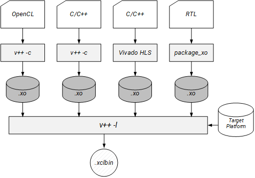

<table>
 <tr>
   <td align="center"><h1>2019.2 Vitis™ アプリケーション アクセラレーション開発フローのチュートリアル</h1><a href="https://github.com/Xilinx/SDAccel-Tutorials/branches/all">SDAccel™ 開発環境 2019.1 チュートリアルを参照</a></td>
 </tr>
 <tr>
 <td align="center"><h1>アクセラレーション アプリケーションのビルドおよび実行の基本概念</h1>
 </td>
 </tr>
</table>

# 1\. アプリケーションのビルド

## 概要

[FPGA アクセラレーション アプリケーションの実行モデル](/docs/vitis-execution-model/)に示すように、アクセラレーションされたアプリケーションには、x86 サーバーで実行されるソフトウェア プログラム、および Alveo データセンター アクセラレータ カードまたはザイリンクス FPGA で実行されるアクセラレーションされたカーネルが含まれます。これらソースは、別々にビルド (コンパイルおよびリンク) する必要があります。詳細は、[インストール](https://japan.xilinx.com/html_docs/xilinx2019_2/vitis_doc/vhc1571429852245.html)を参照してください。

このチュートリアルでは、`g++` コンパイラおよび Vitis コンパイラを使用してデザインのソフトウェア部分とハードウェア部分の両方をビルドする方法を説明します。ターゲット プラットフォームを指定する方法やハードウェアまたはソフトウェア エミュレーションをビルドする方法など、さまざまなコマンド ライン オプションについて説明します。

このチュートリアルで使用するリファレンス ファイルは、[./reference\_files](./reference-files) に含まれます

> **重要:** サンプル コマンドを実行する前に、[インストール](https://japan.xilinx.com/html_docs/xilinx2019_2/vitis_doc/vhc1571429852245.html)に示すように Vitis コア開発キットをインストールしておく必要があります。
>
> ```bash
>  #setup Xilinx Vitis tools. XILINX_VITIS and XILINX_VIVADO will be set in this step.
>  source <VITIS_install_path>/settings64.sh
>  #Setup Xilinx runtime. XILINX_XRT will be set in this step.
>  source <XRT_install_path>/setup.sh
> ```

## ソフトウェアのビルド

ソフトウェア プログラムは C/C++ で記述され、OpenCL™ API 呼び出しを使用してアクセラレーションされたカーネルとの通信および制御します。これは、標準 GCC コンパイラや `g++` コンパイラを使用してビルドされます。  各ソース ファイルはオブジェクト ファイル (.o) にコンパイルされ、ザイリンクス ランタイム (XRT) 共有ライブラリとリンクされて、実行ファイルが作成されます。GCC および関連するコマンド ライン オプションの詳細は、[GNU コンパイラ コレクション (GCC) の使用](https://gcc.gnu.org/onlinedocs/gcc/)を参照してください。

1. **ソフトウェア プログラムのコンパイル**

   ホスト アプリケーションをコンパイルするには、`-c` オプションにホスト ソース ファイルのリストを付けます。  
オプションで、出力オブジェクト ファイル名を `-o` オプションで指定することもできます。

   ```bash
   g++ ... -c <source_file_name1> ... <source_file_nameN> -o <object_file_name> -g
   ```

2. **ソフトウェア プログラムのリンク**

   生成したオブジェクト ファイルをリンクするには、次のように `-l` オプションとオブジェクト入力ファイルを使用します。

   ```bash
   g++ ... -l <object_file1.o> ... <object_fileN.o> -o <output_file_name>
   ```

   > **ヒント:** ホスト コンパイルおよびリンクは、1 つにまとめることができます。この場合、`-c` および `-l` オプションは必要なく、ソース入力ファイルだけが必要です。
   >
   > `g++ ... <source_file_name1> ... <source_file_nameN> ... -o <output_file_name>`

3. **必須のフラグ**

   XRT および Vivado ツールのインクルード パスとライブラリ パスを指定する必要があります。

   1. `-I` オプションを使用してインクルード ディレクトリを `-I$XILINX_XRT/include -I$XILINX_VIVADO/include` と指定します。
   2. `-L` オプションを使用して `-l` ライブラリを検索するディレクトリを `-L$XILINX_XRT/lib` と指定します。
   3. `-l` オプションを使用してリンク中に使用されるライブラリを `-lOpenCL -lpthread -lrt -lstdc++` と指定します。

4. **すべてのコマンド**

   ホスト プログラムを `./reference_files/run` から 1 つのステップでビルド、リンク、コンパイルするすべてのコマンドは、次のようになります。

   ```bash
   g++ -I$XILINX_XRT/include/ -I$XILINX_VIVADO/include/ -Wall -O0 -g -std=c++11 \
   ../src/host.cpp  -o 'host'  -L$XILINX_XRT/lib/ -lOpenCL -lpthread -lrt -lstdc++
   ```

   > **コマンド オプションおよび説明**
   >
   > * `-I../libs`、`-I$XILINX_XRT/include/`、および `-I$XILINX_VIVADO/include/`: インクルード ディレクトリ
   > * `-Wall`: 警告をすべてイネーブル
   > * `-O0`: 最適化オプション (最後の最適化を実行)
   > * `-g`: デバッグ情報を生成
   > * `-std=c++11`: 言語規格 (インクルード ディレクトリではなく、C++ 規格を定義)
   > * `../src/host.cpp`: ソース ファイル
   > * `-o 'host'`: 出力名
   > * `-L$XILINX_XRT/lib/`: XRT ライブラリを検索
   > * `-lOpenCL`、`-lpthread`、`-lrt`、および`-lstdc++`: : リンク中に該当ライブラリを検索

## ハードウェアのビルド

次に、ハードウェア アクセラレータ カードで実行されるカーネルをビルドする必要があります。  ホスト アプリケーションと同様、カーネルのビルドにもコンパイルおよびリンクが必要です。ハードウェア カーネルは C/C++、OpenCL C、または RTL で記述できます。C/C++ および OpenCL C カーネルは、Vitis コンパイラを使用してコンパイルされますが、RTL で記述されたカーネルはザイリンクスの `package_xo` ユーティリティを使用してコンパイルされます。

`v++` および `package_xo` の詳細は、[Vitis 環境リファレンス マニュアル](https://japan.xilinx.com/html_docs/xilinx2019_2/vitis_doc/yxl1556143111967.html)を参照してください。カーネルのコンパイル方法に関係なく、どちらの方法でもザイリンクス オブジェクト ファイル (XO) が生成されます。

オブジェクト ファイルは、FPGA バイナリ ファイルまたは xclbin ファイルを作成するために、Vitis コンパイラを使用してシェル (ハードウェア プラットフォーム) とリンクされます。

次の図は、さまざまなタイプのカーネルのコンパイルおよびリンク フローを示しています。



このチュートリアルでは、`v++` コンパイルに限定して説明をし、RTL カーネルについては説明しません。RTL カーネルのビルド方法については、[RTL カーネル入門](/docs/getting-started-rtl-kernels)チュートリアルを参照してください。

### ハードウェア コンパイル

ハードウェア コンパイルでは、`v++` コマンドの `-c` オプションを使用してハードウェア カーネルのソース ファイルをコンパイルします。`v++` コマンドには多くのコマンド オプションがありますが、最低でもソース ファイル、ターゲット プラットフォーム、ビルド ターゲットを指定する必要があります。`v++` コマンド オプションのリストは、[Vitis 環境リファレンス マニュアル](https://japan.xilinx.com/html_docs/xilinx2019_2/vitis_doc/yxl1556143111967.html)を参照してください。

オプションで `-k` または `--kernel` 引数を使用すると、コンパイルするカーネル ソース ファイル内のカーネル名を指定できます。

`v++ … -k <kernel_name> <kernel_source_file> … <kernel_source_file>`

ターゲット プラットフォームは、コンパイルとリンクの両方の段階で指定する必要があります。これは、次のように `--platform` オプションを使用して指定します。

`v++ … --platform <platform_target>`

最後に、`-t` オプションを使用してビルド ターゲットを `v++ … -t <build_target>` のように指定します。

ビルド ターゲットには、デバッグおよび検証に使用する 2 つのエミュレーション ターゲット、および FPGA で実行する必要のある実際のバイナリを生成するのに使用されるハードウェア ターゲット 1 つの合計 3 つがあります。

これらのビルド ターゲットの設定オプションは、sw\_emu、hw\_emu、および hw です。

* ソフトウェア エミュレーション (`sw_emu`) では、ホスト アプリケーション コードとカーネル コードの両方が x86 プロセッサで実行できるようコンパイルされます。これにより、高速なビルドおよび実行ループを使用した反復アルゴリズムによる改善が可能になります。このターゲットは、構文エラーを特定し、アプリケーションと共に実行されるカーネル コード ソース レベルのデバッグを実行し、システムの動作を検証するのに便利です。  RTL カーネルでは、C モデルが関連付けられている場合にソフトウェア エミュレーションがサポートされます。C モデルが使用可能でない場合は、ハードウェア エミュレーションを使用してカーネル コードをデバッグする必要があります。

* ハードウェア エミュレーション (`hw_emu`) では、カーネル コードがハードウェア モデル (RTL) にコンパイルされ、専用シミュレータで実行されますが、残りのシステムは C シミュレータが使用されます。ビルドおよび実行にかかる時間は長くなりますが、詳細でサイクル精度の高いカーネル アクティビティが表示されます。このターゲットは、FPGA に含まれるロジックの機能をテストして、最初のパフォーマンス見積もりを取得する場合に便利です。

* 最後に、ターゲットがシステム (`hw`) に設定される場合、FPGA で実行するバイナリを生成するためにカーネル コードが合成されてコンパイルされます。

Vitis コア開発キット 2019.2 バージョンでは、コマンド ラインでのコンフィギュレーション ファイルの概念が Vitis コンパイラでサポートされています。これにより、さまざまなオプションが付いた長いコマンド ラインを管理したり、論理的に関連オプションをまとめたりしやすくなっています。この演習では、`design.cfg` ファイルを使用し、必要なオプションすべてをこのファイルに含めます。`design.cfg` ファイルを開き、内容を確認します。

```
platform=xilinx_u200_xdma_201830_2
debug=1

[connectivity]
nk=mmult:1:mmult_1

```

次のコマンドは、`./reference_files/run` フォルダーからカーネルをソフトウェア エミュレーション ターゲットにコンパイルします。

```bash
v++ -t sw_emu --config design.cfg -c -k mmult -I'../src' -o'mmult.sw_emu.xilinx_u200_xdma_201830_2.xo' '../src/mmult.cpp'
```

> **コマンド オプションおよび説明**
>
> * `-c`: カーネルをコンパイル
> * `-g`: デバッグ情報を生成
> * `platform=xilinx_u200_xdma_201830_2`: xilinx\_u200 プラットフォームをターゲットに指定
> * `-t sw_emu`: ソフトウェア エミュレーションをターゲットに指定
> * `-k mmult`: カーネル名を krnl\_vadd に指定
> * `../src/mmult.cpp`: ソース ファイルを指定
> * `-o mmult.sw_emu.xilinx_u200_xdma_201830_2.xo`: XO 出力ファイル名を指定

`v++` コマンドは、Vitis アナライザーで使用して関連レポートを表示可能な `compile_summary` ファイルも生成します。

### ハードウェア リンク

ハードウェア リンク中は、1 つまたは複数のカーネルをプラットフォームにリンクして、出力バイナリ コンテナー (xclbin) ファイルを作成します。ハードウェア カーネルをリンクするには、`v++` コマンドの `-l` オプションが使用されます。コンパイルと同様、リンクには XO オブジェクト ファイル、プラットフォーム、およびビルド ターゲットの指定などの複数のオプションを指定する必要があります。使用可能なリンク オプションは、[Vitis 環境リファレンス マニュアル](https://japan.xilinx.com/html_docs/xilinx2019_2/vitis_doc/yxl1556143111967.html)を参照してください。リンク中に使用されるプラットフォームおよびビルド ターゲット オプションは、コンパイル中に使用されるものと同じである必要があります。

XO オブジェクト ファイルは、オブジェクト ファイルを直接リストして `v++` コマンドで指定します。複数のオブジェクト ファイルを追加できます。

`v++ … <kernel_xo_file.xo> … <kernel_xo_file.xo>`

リンク段階中に指定できるオプションは多くあります。たとえば、`--nk` がその 1 つです。リンク プロセス中に作成されるカーネル インスタンス (計算ユニット (CU)) 数を指定するのに使用されます。使用方法は、次のとおりです。

`v++ ... --nk <kernel_name>:<compute_units>:<kernel_name1>:…:<kernel_nameN>`

> **ヒント:** インスタンス名 (\`kernel\_name1...') はオプションで、指定しない場合は自動的に定義されます。

`-o` オプションを使用して生成される出力ファイルの名前を指定することもできます。リンク段階の出力ファイルは xclbin ファイルで、適宜名前を付ける必要があります。

`v++ ... -o <xclbin_name>.xclbin`

では、ハードウェアをリンクします。前と同様、ハードウェア コンパイル段階のターゲットと同じになるようにプラットフォームとターゲットを指定する必要があります。次のコマンドを実行します。

```bash
v++ -t sw_emu --config design.cfg  -l  -o'mmult.sw_emu.xilinx_u200_xdma_201830_2.xclbin' mmult.sw_emu.xilinx_u200_xdma_201830_2.xo
```

> **コマンド オプションおよび説明**
>
> * `-l`: カーネルをリンク
> * `-g`: デバッグ情報を生成
> * `-t sw_emu`: ソフトウェア エミュレーションをターゲットに指定
> * `--config design.cfg`: コンパイル中に使用されるコンフィギュレーション ファイルを指定
> * `nk=mmult:1:mmult_1`: mmult\_1 という 1 つの CU を作成。これはコンフィギュレーション ファイルで定義できるようになりました。
> * `mmult.sw_emu.xilinx_u200_xdma_201830_2.xo`: 入力オブジェクト ファイル
> * `-o mmult.sw_emu.xilinx_u200_xdma_201830_2.xclbin`: 種強く xclbin ファイルの名前を指定

`v++` コマンドは、Vitis アナライザーで使用して関連レポートを表示可能な `link_summary` ファイルも生成します。

### ハードウェア エミュレーションおよびハードウェア システムのビルド

「ハードウェア エミュレーション」または Alveo データセンター アクセラレータ カード「システム」をターゲットにしたハードウェアをビルドするには、\<*build\_target*> を定義する `-t` オプションを、ハードウェア エミュレーションの場合は **sw\_emu** から **hw\_emu** に、アクセラレータ カード用にビルドする場合は **hw** に変更します。

「ハードウェア エミュレーション」と「システム」ビルド ターゲットの両方に対してコンパイルおよびリンクする `v++` コマンドは、次のとおりです。

* **ハードウェア エミュレーション ビルド**

  ```
  v++ -t hw_emu --config design.cfg -c -k mmult -I'../src' -o'mmult.hw_emu.xilinx_u200_xdma_201830_2.xo' '../src/mmult.cpp'
  v++ -t hw_emu --config design.cfg -l -o'mmult.hw_emu.xilinx_u200_xdma_201830_2.xclbin' mmult.hw_emu.xilinx_u200_xdma_201830_2.xo
  ```

* **システム ビルド**

  > **重要:** ハードウェア ターゲットのコンパイルおよびリンクには、FPGA バイナリ ファイルの合成およびインプリメンテーションのため、数時間かかることがあります。

  ```
  v++ -t hw --config design.cfg -c -k mmult -I'../src' -o'mmult.hw.xilinx_u200_xdma_201830_2.xo' '../src/mmult.cpp'
  v++ -t hw --config design.cfg -l -o'mmult.hw.xilinx_u200_xdma_201830_2.xclbin' mmult.hw.xilinx_u200_xdma_201830_2.xo
  ```

### ハードウェア ビルド レポートの確認

コンパイル、リンク、実行段階中に複数の重要度レベル (エラー、アドバイザリ、警告、クリティカル警告) のガイダンスが生成されます。これらは、ソフトウェア エミュレーション、ハードウェア エミュレーション、システム ビルド中に表示されます。

「ハードウェア エミュレーション」および「システム ビルド」ターゲット ビルドの場合は、`system_estimate_<kernel_name>.<build_target>.<dsa_name>.xtxt` レポート ファイルもコンパイル段階とリンク段階の両方で自動的に生成されます。このレポートには、FPGA リソース使用量の見積もりと、ハードウェアでアクセラレーションされたカーネルの周波数の見積もりが示されます。

Vitis アナライザーは、特定のレポートを開くのに使用できるほか、コンパイル、リンク、実行段階で生成される compile\_summary、link\_summary、または run\_summary を直接開くもできます。これらのサマリ レポートが開くと、Vitis アナライザーが関連するレポートを自動的に開きます。

次のコマンドを実行して、これらのレポートを開きます。

```
vitis_analyzer compile_summary
vitis_analyzer link_summary
vitis_analyzer run_summary
```


* 次の図は、実行段階で生成されるガイダンス レポートの例を示しています。これは run\_summary レポートを使用して開くことができます。

  

### まとめ

次の手順は、この演習のソース ファイルを使用してソフトウェア エミュレーションをターゲットにしたソフトウェアおよびハードウェア両方をビルドする方法をまとめています。

1. Vitis コア開発キットを設定します。

   ```bash
   #setup Xilinx Vitis tools, XILINX_VITIS and XILINX_VIVADO will be set in this step. source <VITIS install path>/settings64.sh. for example:
   source /opt/Xilinx/Vitis/2019.2/settings64.sh
   #Setup runtime. XILINX_XRT will be set in this step
   source /opt/xilinx/xrt/setup.sh
   #change to the working directory
   cd ./reference-files/run
   ```

2. ホスト ソフトウェアをビルドします。

   ```bash
   g++ -I$XILINX_XRT/include/ -I$XILINX_VIVADO/include/ -Wall -O0 -g -std=c++11 ../src/host.cpp  -o 'host'  -L$XILINX_XRT/lib/ -lOpenCL -lpthread -lrt -lstdc++
   ```

3. ハードウェアをビルドします。ターゲット (ソフトウェア エミュレーション、ハードウェア エミュレーション、またはシステム) を選択して、関連コマンドを実行します。

   * 「ソフトウェア エミュレーション」をターゲットにした場合

     ```bash
     v++ -t sw_emu --config design.cfg -c -k mmult -I'../src' -o'mmult.sw_emu.xilinx_u200_xdma_201830_2.xo' '../src/mmult.cpp'
     v++ -t sw_emu --config design.cfg -l -o'mmult.sw_emu.xilinx_u200_xdma_201830_2.xclbin' mmult.sw_emu.xilinx_u200_xdma_201830_2.xo
     ```

   * 「ハードウェア エミュレーション」をターゲットにした場合

     ```bash
     v++ -t hw_emu --config design.cfg -c -k mmult -I'../src' -o'mmult.hw_emu.xilinx_u200_xdma_201830_2.xo' '../src/mmult.cpp'
     v++ -t hw_emu --config design.cfg -l -o'mmult.hw_emu.xilinx_u200_xdma_201830_2.xclbin' mmult.hw_emu.xilinx_u200_xdma_201830_2.xo
     ```

   * 「システム」をターゲットにした場合

     > **重要:** この手順は数時間かかるので、オプションです。

     ```bash
     v++ -t hw --config design.cfg -c -k mmult -I'../src' -o'mmult.hw.xilinx_u200_xdma_201830_2.xo' '../src/mmult.cpp'
     v++ -t hw --config design.cfg -l -o'mmult.hw.xilinx_u200_xdma_201830_2.xclbin'   mmult.hw.xilinx_u200_xdma_201830_2.xo
     ```

## 次のステップ

問題なくデザインを構築できたら、エミュレーションを実行してデバッグおよび最適化します。

* ソフトウェアおよびハードウェア エミュレーションの実行方法は、[ソフトウェアおよびハードウェア エミュレーションの実行](./Emulation.md)を参照してください。
* Alveo データセンター アクセラレータ カードをお持ちの場合は、[ハードウェアでの実行](./HardwareExec.md)演習に進んで、ハードウェアで直接アプリケーションを実行することもできます。</br>

<hr/>
<p align="center"><b><a href="../../docs/vitis-getting-started/">入門コースの初めに戻る</a> &mdash; <a href="./README.md">チュートリアルの初めに戻る</a></b></p>
<p align="center"><sup>Copyright&copy; 2019 Xilinx</sup></p>
