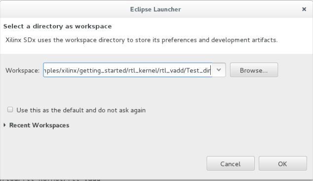
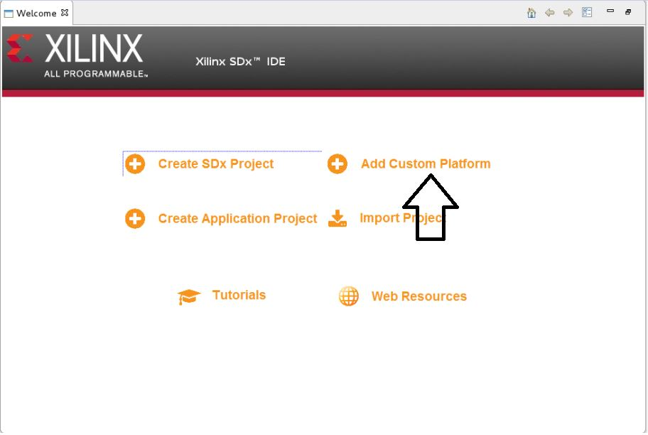
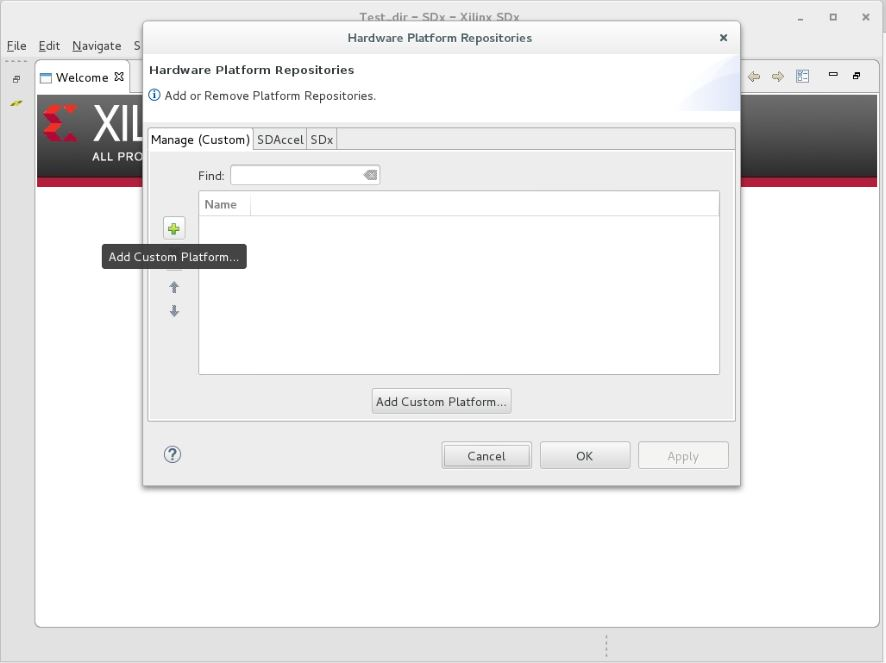
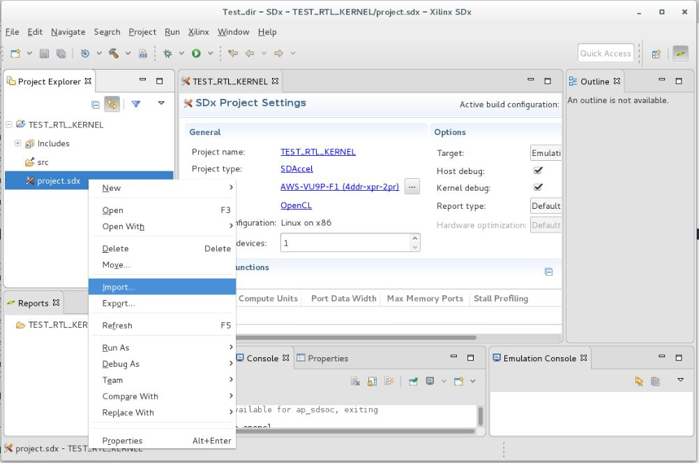
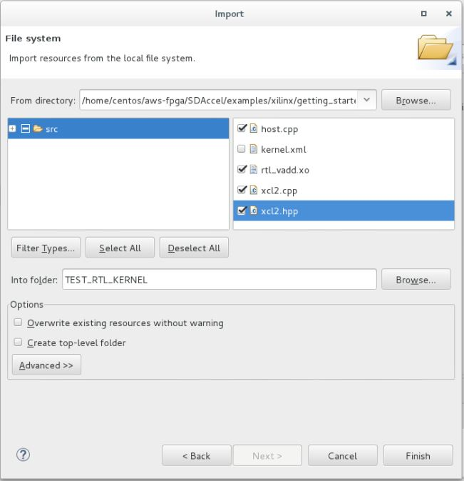
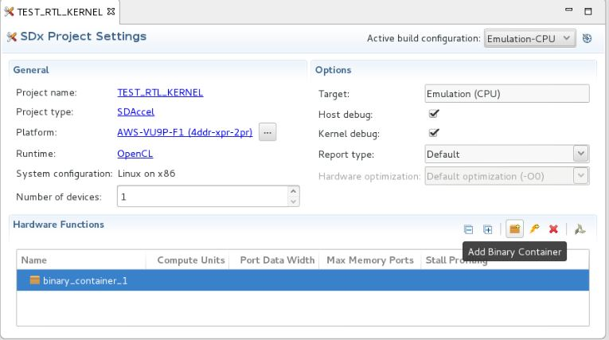
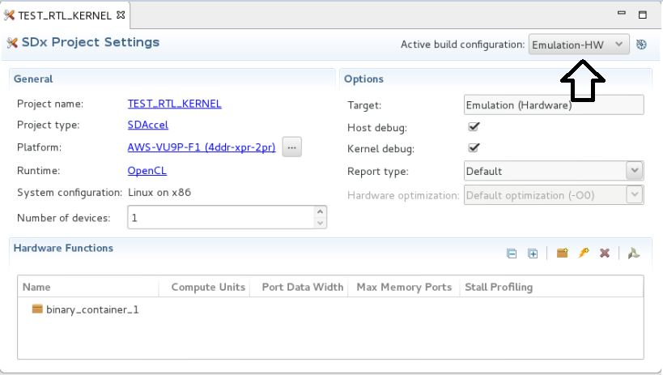
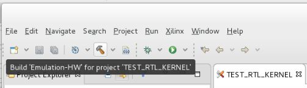
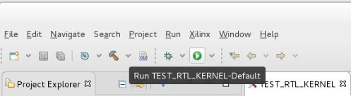
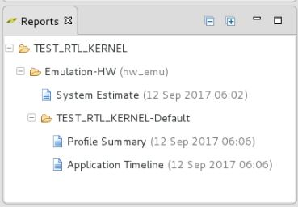

# Run your first SDAccel Program on AWS F1

This tutorial describes how to package an RTL design as an SDAccel™ kernel and then use this kernel to accelerate a host application. The tutorial uses the [**vadd_kernel**](https://github.com/Xilinx/SDAccel_Examples/tree/master/getting_started/rtl_kernel/rtl_vadd) example from the SDAccel GitHub Examples repository, and covers the following:

1. [Writing an RTL design adhering to the SDAccel kernel interface requirements](Run-your-first-SDAccel-program-on-AWS-F1.md#1-writing-an-rtl-design-adhering-to-the-sdaccel-kernel-interface-requirements)
2. [Packaging the RTL design as an SDAccel kernel (XO file)](Run-your-first-SDAccel-program-on-AWS-F1.md#2-packaging-the-rtl-design-as-an-sdaccel-kernel-xo-file)  
3. [Compiling the host application and the FPGA binary containing the RTL kernel](Run-your-first-SDAccel-program-on-AWS-F1.md#3-compiling-the-host-application-and-the-fpga-binary-containing-the-rtl-kernel)
4. [Creating the Amazon FPGA Image](Run-your-first-SDAccel-program-on-AWS-F1.md#4-creating-the-amazon-fpga-image)
5. [Executing the host application with the Amazon FPGA image](Run-your-first-SDAccel-program-on-AWS-F1.md#5-executing-the-host-application-with-the-amazon-fpga-image)

>**Note**: This tutorial does not currently use the SDAccel **RTL Kernel Wizard**. The SDAccel RTL Kernel Wizard is a new feature which assists users through the process of packaging RTL designs as SDAccel kernels. The RTL Kernel Wizard generates the required XML file, an example project design, and a set of scripts to build that example design into an XO file. For more details on how to use the RTL Kernel Wizard, watch this [online video](https://www.youtube.com/watch?v=IZQ1A2lPXZk).


## Example Overview
This example is a simple vector-add design. The host application writes two vectors (A and B) of arbitrary length to the FPGA kernel which in turn sums the two vectors together to produce an output vector (C). The host application then reads back the result.

#### Overview of the Hardware Kernel
The hardware kernel has an AXI memory mapped master interface and an AXI-Lite slave interface:
- The AXI master interface is used to read the values of A and B from global memory and write back the values of C.
- The AXI-Lite slave interface is used to pass parameters and control the kernel as follows:
   - Offset 0x00: Control and status register
   - Offset 0x10: Base address of vector A in global memory
   - Offset 0x1C: Base address of vector B in global memory
   - Offset 0x28: Base address of vector C in global memory
   - Offset 0x34: Length of the vectors

The kernel starts executing when bit 0 of the control register is set to 1. The AXI master issues bursts requests to read values of A and B from global memory and streams them into two FIFOs; one for the values of A, one for the values of B. The adder module reads from both FIFOs, sums the values to compute `C[i] = A[i] + B[i]`, and writes the result into an output FIFO. This FIFO is read by the AXI master to burst the results of the vector-add back into global memory. When the vectors have been processed, the kernel asserts bit 1 of the control register to indicate it is done.


#### Overview of the Host Application
The host.cpp file provides a very simple application to exercise the vector-add kernel. All FPGA-side operations are triggered using the following standard OpenCL™ API calls:
- Buffers are created in the FPGA using `cl::Buffer`
- Data is copy to and from the FPGA using `<command_queue>.enqueueMigrateMemObjects`
- Kernel arguments (length of the vectors, base addresses of A, B, C) are passed using `<kernel>.setArg`
- Kernel is executed using `<command_queue>.enqueueTask`

Of note, the FPGA device is initialized using the `xcl::find_binary_file` and `xcl::import_binary_file` utility functions. The `xcl::find_binary_file` function makes it very easy to find the desired FPGA binary file. The function searches four predefined directories for a binary file matching one of the following names:
* `\<name>.\<target>.\<device>.(aws)xclbin`
* `\<name>.\<target>.\<device_versionless>.(aws)xclbin`
* `binary_container_1.(aws)xclbin`
* `\<name>.(aws)xclbin`

## Preparing to run the Tutorial
- Execute the following commands to clone the GitHub repository and configure the SDAccel environment:

```bash
cd $AWS_FPGA_REPO_DIR
source sdaccel_setup.sh
```

- Go to the test case directory   

```bash
cd $AWS_FPGA_REPO_DIR/SDAccel/examples/xilinx/getting_started/rtl_kernel/rtl_vadd
```

The SDAccel GitHub examples use common header files that need to be copied in the local project source folder to make it easier to use.
- Enter the **make local-files** command to copy all necessary files in the local directory:  

```
   make local-files
```

## 1. Writing an RTL Design adhering to the SDAccel Kernel Interface Requirements
To be used as an SDAccel kernel, an RTL design must comply with the following signals and interface requirements:
 * Clock.
 * Active Low reset.
 * One or more AXI4 memory mapped (MM) master interfaces for global memory. All AXI MM master interfaces must have 64-bit addresses.
   - You are responsible for partitioning global memory spaces. Each partition in the global memory becomes a kernel argument. The memory offset for each partition must be set by a control register programmable via the AXI4 MM Slave Lite interface.
 * One AXI4 MM slave lite control interface. The AXI-Lite interface name must be **S_AXI_CONTROL**.
    - Offset 0 of the AXI4 MM slave lite must have the following signals:
      - `Bit 0`: start signal - The kernel starts processing data when this bit is set.
      - `Bit 1`: done signal - The kernel asserts this signal when the processing is done.
      - `Bit 2`: idle signal - The kernel asserts this signal when it is not processing any data.
 * One or more AXI4-Stream interfaces for streaming data between kernels.

In this example, the RTL is already compliant and doesn't need to be modified.

The RTL code for this example is located in the `./src/hdl` directory.

## 2. Packaging the RTL Design as an SDAccel Kernel (XO file)  
A fully packaged RTL Kernel is delivered as an XO file which has a file extension of `.xo`. This file is a container encapsulating a Vivado® IP object (including RTL source files) and a kernel description XML file. The XO file can be compiled into the platform and run in the SDAccel hardware or hardware emulation flows.

To package the kernel and create the XO file, you must:
- Write a kernel description XML file.
- Package the RTL as a Vivado IP suitable for use in IP Integrator.
- Run the `package_xo` command to generate the XO file.

#### Writing a Kernel Description XML File    
A special XML file is needed to describe the interface properties of the RTL kernel. The format for the kernel XML file is described in the [Create Kernel Description XML File](https://www.xilinx.com/html_docs/xilinx2018_3/sdaccel_doc/topics/design-flows/concept-create-kernel-description-xml-file.html) section of the documentation.

This XML file can be created manually or with the RTL Kernel Wizard. In this example, the XML file is already provided (`./src/kernel.xml`).

- Look at the content of the file to familiarize yourself with the information captured in the XML description.

#### Packaging the RTL as a Vivado IP suitable for use in IP Integrator
The example comes with the `./scripts/package_kernel.tcl` script which takes the existing RTL design and packages it as Vivado IP. The script places it in an IP directory called  `./packaged_kernel_${suffix}`, where `suffix` is specified as a user argument.    

#### Running the package_xo command to Generate the XO File
- In the `SDAccel/examples/xilinx/getting_started/rtl_kernel/rtl_vadd` directory, run the following commands to package the RTL and create the XO file:   

```bash
vivado -mode tcl  

# Set suffix for the directory for RTL-IP import   
Vivado% set suffix rtl_ip    

# Import the RTL to the “packaged_kernel_{$suffix}” IP directory   
Vivado% source scripts/package_kernel.tcl   

# Create the XO file
Vivado% package_xo -xo_path ./src/rtl_vadd.xo \
                   -kernel_name krnl_vadd_rtl \
                   -ip_directory ./packaged_kernel_rtl_ip \
                   -kernel_xml ./src/kernel.xml
# Exit Vivado
Vivado% exit
```

The `./src/rtl_vadd.xo` file gets generated. It contains all the necessary information SDAccel requires to use the kernel.

## 3. Compiling the Host Application and the FPGA Binary containing the RTL Kernel
This section covers the following steps:
   * Creating and configuring a new project
     - Starting the SDAccel GUI
     - Creating a workspace
     - Setting the platform
     - Creating a new empty project
     - Importing the application host code and kernel XO file
     - Specifying the binary container for the kernel executable
   * Verifying the application using the hardware emulation flow
   * Compiling the host application and the FPGA binary for hardware execution   

The host application code for this example is in the `./src/host.cpp` file.

In the SDAccel flow, the host code uses OpenCL APIs to interacts with the FPGA.

### Creating and Configuring a new Project

#### Starting the SDAccel GUI
- Open the SDx GUI by running the following command:
```bash
  sdx
```

#### Creating a Workspace
- In the Workspace Launcher window, add a workspace inside the current directory named `Test_dir`, as shown below. A new directory `Test_dir` will be created and used to store all the log files from your runs.



#### Setting the Platform
- In the Welcome window, to set the path to the AWS F1 platform, click **Add custom platform**.  

  

- Click on the plus sign:  

  

- Browse to the `<git area>/SDAccel/aws_platform/xilinx_aws-vu9p-f1_4ddr-xpr-2pr_4_0/` directory, and select **platform**.  

  

- Click **Apply** and **OK**. This completes the platform setup process.

#### Creating a new Empty Project
- In the Welcome window, click **Create SDX Project** and set the project name to **TEST_RTL_KERNEL**.  
- Step through the next three screens (keeping the default selections) by clicking **Next** -> **Next** -> **Next**.  
- Finally, select an **Empty Application** in the **Available Templates** section, and then click **Finish**.

#### Importing the Application Host Code and Kernel XO File.
On the left side of the SDAccel GUI, you will see the **Project Explorer** pane.
1. Right-click **project.sdx**, and select **Import**.



2. Select **General** -> **Filesystem** and then click **Next**.  
3. Browse to the source file directory of the current example: **rtl_vadd/src**
4. Select the following files:
* `host.cpp`
* `xcl2.cpp`
* `xcl2.h`
* `rtl_vadd.xo`

  

#### Specifying the Binary Container for the Kernel Executable
Now that the files have been imported, instruct SDAccel to add a binary container. This is the output file where the FPGA design will be compiled to.

In the center of the SDAccel GUI, notice the SDx Project Settings.
- Click the **Add Binary Container** icon.



The default name for the binary container is `binary_container_1`. Since the host application uses the xcl::find_binary_file utility function, it will automatically find the container by searching for a file with the default name.

Project creation and setup is now complete.

### Verifying the Application using the Hardware Emulation Flow
SDAccel provides three different build configurations:  
* **Emulation-CPU**
* **Emulation-HW**
* **System**

In **Emulation-CPU** mode, the host application executes with a C/C++ or OpenCL model of the kernel(s). The main goal of this mode is to ensure the functional correctness of your application.
>**NOTE**: this mode is not presently supported for RTL kernels.

In **Emulation-HW** mode, the host application executes with a RTL model of the kernel(s). This mode enables the programmer to check the correctness of the logic generated for the custom compute units and provides performance estimates.

In **System** mode, the host application executes with the actual FPGA.

- To run hardware emulation, go to SDx Project Settings, and ensure that **Active build configuration** is set to `Emulation-HW`.



- To star the emulation build process, click the **Build** icon.

   

- After the emulation build process completes, to run Hardware Emulation, click the **Run** icon.



After completion of Hardware Emulation run, you can find and inspect various reports in the Reports tab, such as the **System Estimate**, **Profile Summary**, and  **Application Timeline**.  



### Compiling the Host Application and the FPGA Binary for Hardware Execution   
- To run hardware execution, go to **SDx Project Settings** and set **Active build configuration** to **System**.
- Click the **Build** icon to initiate the hardware build process.

It generally takes a few hours to complete the hardware build.   

At the end of this process, the host executable (`TEST_RTL_KERNEL.exe`) and FPGA binary (`binary_container_1.xclbin`) are generated in the `Test_dir/TEST_RTL_KERNEL/System` directory.  

- Exit the SDAccel GUI.

## 4. Creating the Amazon FPGA Image
In order to execute the application on F1, an Amazon FPGA Image (AFI) must first be created from the FPGA binary (`.xclbin`).
>**Note**: Currently this step cannot be performed through the SDAccel GUI. The AFI is created using the AWS ```create_sdaccel_afi.sh``` command line script.

- Using the S3 bucket, S3 dcp folder, and S3 log folder information, execute the following command:

```bash
cd ./Test_dir/TEST_RTL_KERNEL/System
SDACCEL_DIR/tools/create_sdaccel_afi.sh \
         -xclbin=binary_container_1.xclbin \
         -o=binary_container_1 \
         -s3_bucket=<bucket-name> \
         -s3_dcp_key=<dcp-folder-name> \
         -s3_logs_key=<logs-folder-name>
```

The above step generates an `.awsxclbin` file and an `_afi_id.txt` file containing the ID of your AFI. The AFI ID can be used to check the status of the AFI generation process.  

- Note your AFI ID.
```bash
  cat <timestamp>_afi_id.txt
```  

- Check the status of the AFI generation process.
```bash
  aws ec2 describe-fpga-images --fpga-image-ids <AFI ID>
```
The command will return **Available** when the AFI is created, registered, and ready use.	Otherwise, the command will return **Pending**.   

```json
  "State: {
      "Code" : Available"
  }
```

## 5. Executing the Host Application with the Amazon FPGA Image

After the AFI is **Available**, you can execute the application on the F1 instance.  
    ```bash
    sudo sh
    source /opt/xilinx/xrt/setup.sh   
    ./TEST_RTL_KERNEL.exe
    ```  

You should see the following output:  
    ```bash
    Device/Slot[0] (/dev/xdma0, 0:0:1d.0)
    xclProbe found 1 FPGA slots with XDMA driver running
    platform Name: Xilinx
    Vendor Name : Xilinx
    Found Platform
    XCLBIN File Name: vadd
    INFO: Importing ./binary_container_1.awsxclbin
    Loading: './binary_container_1.awsxclbin'
    TEST PASSED
    ```


Behind these deceptively simple log messages, a lot just happened. The application:
- Detected the FPGA platform.
- Loaded the ```binary_container_1.awsxclbin``` container.
- Retrieved the AFI ID from the container and requested that the corresponding AFI be downloaded in the FPGA.
- Created buffers in the FPGA and transferred two vectors (A and B).
- Triggered the FPGA kernel to sum the two vectors (A and B).
- Read the results back and checked them for correctness.

This concludes this tutorial on how to run your first SDAccel program on F1 using RTL kernels.

Do not forget to stop or terminate your instance.
<hr/>
<p align="center"><b>
<a href="STEP3.md">NEXT: Develop Your Knowledge on the SDAccel RTL Flow</a>
</b></p>
<br>
<hr/>
<p align="center"><sup>Copyright&copy; 2018 Xilinx</sup></p>
