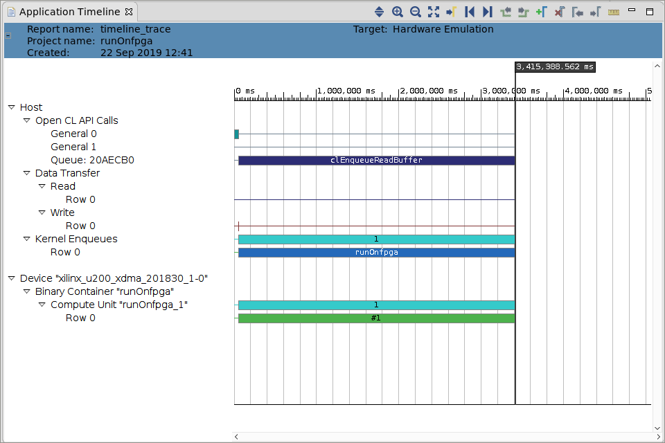
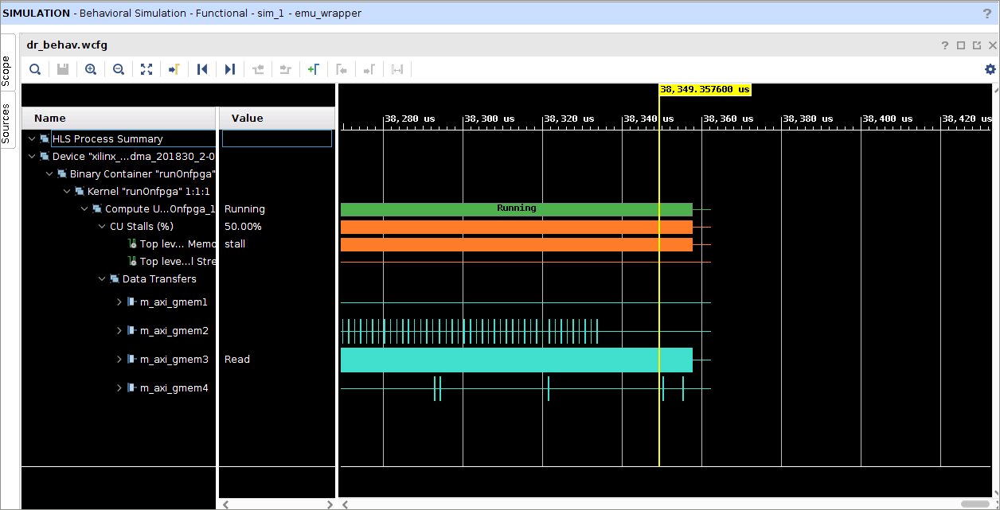

<table>
 <tr>
   <td align="center"><h1>2019.2 Vitis™ アプリケーション アクセラレーション開発フローのチュートリアル</h1><a href="https://github.com/Xilinx/SDAccel-Tutorials/branches/all">SDAccel™ 開発環境 2019.1 チュートリアルを参照</a></td>
 </tr>
 <tr>
 <td align="center"><h1>アクセラレーション FPGA アプリケーションの最適化: ブルーム フィルターの例</td>
 </tr>
</table>

# 2\. C アプリケーションから Vitis コア開発キット アプリケーションを作成

ホスト コードから、`runOnCPU` 関数がアプリケーションの実行時間の 73% を占めていることがわかったので、この関数の実行を速める必要があります。パフォーマンスを速めるには、この関数をカーネルに移動し、FPGA アクセラレータ カード上で実行します。

この演習では、C++ 関数をハードウェア カーネルに変換し、そのパフォーマンスを評価するプロセスを説明します。また、アクセラレートされたアプリケーションのパフォーマンスのベースライン値を確立します。このベースラインは、後に続く演習で最適化を実行するたびにその結果と比較するために使用します。まず、最初の FPGA カーネルをハードウェア エミュレーションで実行します。ハードウェア エミュレーションでカーネルを実行するので、アクセラレート可能なランタイムを保つため、100 個のドキュメントのみが使用されます。

パフォーマンスを計測するには、カーネル詳細トレース レポートおよびタイムライン トレース レポートを使用します。これらのレポートの詳細は、「アクセラレートされたアプリケーションの構築および実行の基本コンセプト」の[プロファイルおよびトレース レポートの生成](../Pathway3/ProfileAndTraceReports.md)の演習を参照してください。

## ホスト コード

各反復実行で、ホストから FPGA に送るドキュメント数を決めておく必要があります。ホストから FPGA に送るのに理想的なデータ量については、[Vitis 統合ソフトウェア プラットフォームを使用したアプリケーションのアクセラレーション手法](https://japan.xilinx.com/html_docs/xilinx2019_2/vitis_doc/Chunk1821279816.html#wgb1568690490380)の[デバイスとのデータ転送の最適化](https://japan.xilinx.com/html_docs/xilinx2019_2/vitis_doc/Chunk1821279816.html#yfz1555544741101)を参照してください。

データ アナリティクスを使用した実践的なアプリケーションでは、データが大きすぎて FPGA メモリにフィットしない可能性があります。この演習でのアプローチなら、ホストから FPGA にデータを分割して転送しやすくなります。このチュートリアルでは、1 反復で 2 MB を転送するとベスト パフォーマンスが得られるため、各反復で 2 MB のデータを転送します。

1. OpenCL API に基づいてカーネル、コマンド キュー、バッファーを作成する `run.cpp` ファイルの 19 行目から 41 行目を確認します。

   15 行目に `size_per_iter_const` 変数が追加されています。この変数は、各反復で転送される 4 バイトのワード数を表します。2 MB のデータを転送するので、**サイズ = 2x1024x1024/4 = 512x1024 ワード**となります。

   すべてのドキュメントを合わせたサイズは 2 MB 未満になる可能性があるので、`size_per_iter_const` の最小サイズおよび合計ドキュメント サイズである `size_per_iter` も定義します。

   ```
    unsigned int size_per_iter_const = 512*1024;
    unsigned int size_per_iter;
   ```

   カーネル引数は 37 行目および 38 行目で設定されています。

   * 配列は呼び出し 1 回でメモリにフィットさせることができ、アプリケーション全体で値が定数なので、input\_words 以外の入力配列はすべて呼び出し 1 回で転送されます。`input_words` の配列サイズだけは非常に大きくなる可能性があります。データ アナリティクスを使用した実践的なアプリケーションでは、データが大きすぎて 1 つの配列にフィットしない可能性があります。

   * 配列サイズが大きすぎる場合は、データを分割して転送する必要があります。分割転送により、データおよび演算をオーバーラップさせることができます。これについては後の最適化で説明します。

   * 43 行目および 44 行目は、`enqueueMigrateMemObjects` を使用した `buffer_profile_weights` 配列と `buffer_bloom_filter` 配列のデータ転送を表します。

2. 48 行目では、ホストから FPGA にすべてのデータを転送するのに必要な反復数 `num_iter` を計算します。

3. 65 行目から 69 行目までは、演算の各反復における配列の一部を使用しているので、`buffer_doc_sizes` バッファーと `buffer_fpga_profileScore` バッファーのサブバッファーを使用します。65 行目および 66 行目の `cl_buffer_region` を使用して、サブバッファーのオフセットおよびサイズを指定します。

   69 行目および 70 行目の元のバッファーからサブバッファーを作成します。

4. サブバッファーを使用する場合は、最初の反復で、元になるバッファーのカーネル引数のみを設定します。それ以降の反復には、サブバッファーを使用します。このコードは 73 行目から 80 行目にあります。

5. 53 行目から 89 行目までは、各反復の呼び出しで `enqueueMigrateMemObjects` を使用し、ホスト メモリの buffer\_input\_words バッファーからカーネルの DDR メモリにデータを転送し、`enqueueTask` を使用してカーネルを呼び出します。

6. 57 行目で、イベント `ef` を作成し、必ず演算が完了した後に出力バッファーを読み出すようにします。

7. イベントのベクター `eventlist` を作成し、手順 8 で生成されたイベントをすべて格納します。

8. データ転送および演算が完了したら、引数に `eventlist` を使用している 91 行目のように、`enqueueMigrateMemObjects` を使用して、カーネルの DDR メモリからホストへ結果を読み出します。

## カーネル コードの変更

次の手順に従い、C++ コードをカーネル コードに変換し、FPGA 上で実行するため `runOnCPU` 関数をハードウェアのアクセラレートされたカーネルに変換します。

> **ヒント:** 完成したカーネルのソース ファイルは `reference-files/baseline_fpga` フォルダーにあります。参照用として使用してください。

1. `cpu_src` フォルダーから `compute_score_host.cpp` を選択し、`compute_score_fpga.cpp` という名前でコピーを作成します。

2. `compute_score_fpga.cpp` ファイルを開き、`runOnCPU` 関数の名前を `runOnfpga` に変更します。

3. `cpu_profileScore` 配列の名前を `fpga_profileScore` に変更します。

4. 次の HLS INTERFACE pragma を関数の冒頭のかっこ内に追加します。

   ```
   #pragma HLS INTERFACE s_axilite port=return bundle=control
   #pragma HLS INTERFACE s_axilite port=doc_sizes bundle=control
   #pragma HLS INTERFACE s_axilite port=input_doc_words bundle=control
   #pragma HLS INTERFACE s_axilite port=bloom_filter bundle=control
   #pragma HLS INTERFACE s_axilite port=profile_weights bundle=control
   #pragma HLS INTERFACE s_axilite port=fpga_profileScore bundle=control
   #pragma HLS INTERFACE s_axilite port=total_num_docs bundle=control
   ```

   FPGA カーネルには AXI4-Lite スレーブ制御インターフェイス (`s_axilite`) が 1 つ必要です。このインターフェイスを介して、ホスト アプリケーションでコンフィギュレーションを実行でき、カーネルと通信できます。戻り値を含む関数の引数はすべて、専用の pragma を使用してこの制御インターフェイスにマップする必要があります。

5. 各ポインター引数も、専用の pragma を使用して、AXI メモリ マップド マスター ポート (`m_axi`) にマップする必要があります。次の pragma を関数に追加します。

   ```
   #pragma HLS INTERFACE m_axi port=doc_sizes offset=slave bundle=gmem1
   #pragma HLS INTERFACE m_axi port=input_doc_words offset=slave bundle=gmem2
   #pragma HLS INTERFACE m_axi port=bloom_filter offset=slave bundle=gmem3
   #pragma HLS INTERFACE m_axi port=profile_weights offset=slave bundle=gmem4
   #pragma HLS INTERFACE m_axi port=fpga_profileScore offset=slave bundle=gmem4
   ```

   * AXI マスター ポートは、グローバル メモリのデータにアクセスするため、カーネルにより使用されます。
   * データの基本アドレス (オフセット) は、前に定義された制御インターフェイス (スレーブ) を介してカーネルに渡されます。
   * pragma のバンドル プロパティにより、インターフェイス ポートに名前を付けることができます。

   > **注記**: profile\_weights および fpga\_profileScore は同時に使用されないので、この 2 つにはシングル ポートが使用されます。さらに少ない数のポートを使用できたのですが、そうすると、データフローをイネーブルにした同じ関数で同じポートのある 2 つの配列を読み出すとき (後の最適化) で競合が発生するので、ポートは 4 つ使用しています。

6. ドキュメント サイズを反復計算する内側のループに、トリップカウント用に次の pragma を追加します。

   ```
   #pragma HLS loop_tripcount min=3000 max=4000 avg=3500
   ```

   この pragma はアプリケーションの残りの部分には影響しませんが、ループ サイズがわかっている場合は、処理が停止されたのが原因で起きるスローダウンがすべてレポートされます。このケースでは、ホスト コードから作成されたドキュメント サイズを基に、ループ サイズの見積もり値が書き込まれています。

7. `compute_score_fpga.cpp` ファイルを保存します。

## ハードウェア エミュレーションの実行

1. `makefile` ディレクトリに移動し、次のコマンドを使用してハードウェア エミュレーションを実行します。

   ```
   cd design/makefile
   make run TARGET=hw_emu STEP=baseline_fpga SOLUTION=1 NUM_DOCS=100
   ```

   > **ヒント:** 各演習の変更内容は `src` ディレクトリにあります。この演習で実行するすべての最適化用に完成させたコードもこのディレクトリにあります。結果を実行するだけの場合は、コードを変更する必要はありません。`SOLUTION=1` を設定してこれをイネーブルにできます。

## ハードウェア エミュレーションのレポートの確認

次のコマンドを使用して、Vitis 解析でプロファイル サマリとタイムライン トレースのレポートを確認します。

```
make view_report TARGET=hw_emu STEP=baseline_fpga
```

## ハードウェア エミュレーションのプロファイル サマリ

1. Vitis 解析でプロファイル サマリ レポートをクリックすると、次が表示されます。

   

2. プロファイル サマリ レポートからパフォーマンス データを取り込んで、次の表に追加します。

| 演習                            | Number of Documents   | Average Document Size(kB) | Time (Hardware) (ms) | Throughput (MBps) |
| :-----------------------        | :----------- | ------------: | ------------------: | ----------------: |
| CPU                       |     100 |           16 |              11.23 |   124.67        |
| baseline                   |     100 |           16 |             38|  36.84          |
---------------------------------------

## ハードウェア エミュレーションのタイムライン トレース レポート

Vitis 解析でタイムライン トレース レポートを選択すると、次のように表示されます。



データ転送がすべて完了した後にのみ演算が実行され、実行時間のほとんどがカーネルにあてられているのがわかります。

## ハードウェア エミュレーションのカーネル詳細トレース レポートの確認

カーネル詳細トレース レポートを開き、ハードウェア エミュレーションを実行している間にプロファイル サマリ レポートおよびタイムライン トレース レポートを生成するため、次の行が既に `xrt.ini` ファイルに追加されています。

```
[Emulation]
launch_waveform=gui
[Debug]
profile=true
timeline_trace=true
data_transfer=fine
```

次の図は、ハードウェア エミュレーション用にアプリケーションを実行すると生成されるカーネル詳細トレース レポートを示しています。



図を見てわかるように、演算ユニット (CU) の停止は 50% です。これは、外部メモリの停止が原因であることがわかります。\[Data transfer] を確認すると、\[CU Stalls] は主に \[Top Level External Memory Stalls] が原因で発生しているのがわかります。グローバル メモリ アクセスを確認すると、CU の停止が主に、`bloom_filter` 配列である `gmem3` とオーバーラップしているのがわかります。`input_doc_Words` および `fpga_profileScore` 配列によって `gmem2` および `gmem4` からもそれぞれまれにメモリ アクセスがあります。

カーネルに関連したボトルネックが起きているので、まずはスループットを改善するため、カーネル コードを最適化することにします。`gmem3` でのメモリ転送が大きなボトルネックになっているらしいことがわかっています。カーネルへのデータ転送を最適化するには、次の手順に従ってください。

1. Vitis 解析でコンパイル サマリ レポートからのカーネル ガイダンスを確認するため、次のコマンドを実行します。

   ```
   vitis_analyzer -open runOnfpga.hw_emu.xilinx_u200_xdma_201830_2.xo.compile_summary
   ```

2. \[**Kernel Guidance**] をクリックして、カーネルでパフォーマンスを改善する方法を確認します。

   カーネル ガイダンス レポートを見ると、II のあるループがあって、バースト推論が起きていません。通常、データがグローバル メモリから順次アクセスされていると、バースト推論が起きます。グローバル メモリにランダム アクセスがあるデザインの場合は、バースト推論は起きません。

   * バースト推論は `gmem1` と `gmem2` とで起きます。デザインでは `profile_weights` および `fpga_profileScore` 配列にランダムにアクセスがあるので、`gmem3` および `gmem4` 上ではバースト推論は起きません。

   * `gmem4` ポートは継続的にランダム アクセスされているので、II は 15 です。

## 次のステップ

次のセクションでは、カーネルとグローバル メモリ間の[メモリ転送の最適化](./localbuf.md)方法を確認します。</br>

<hr/>
<p align="center"><b><a href="../../docs/vitis-getting-started/README.md">入門ガイドの最初に戻る</a> &mdash; <a href="./README.md">チュートリアルの最初に戻る</a></b></p>
<p align="center"><sup>Copyright&copy; 2019 Xilinx</sup></p>
