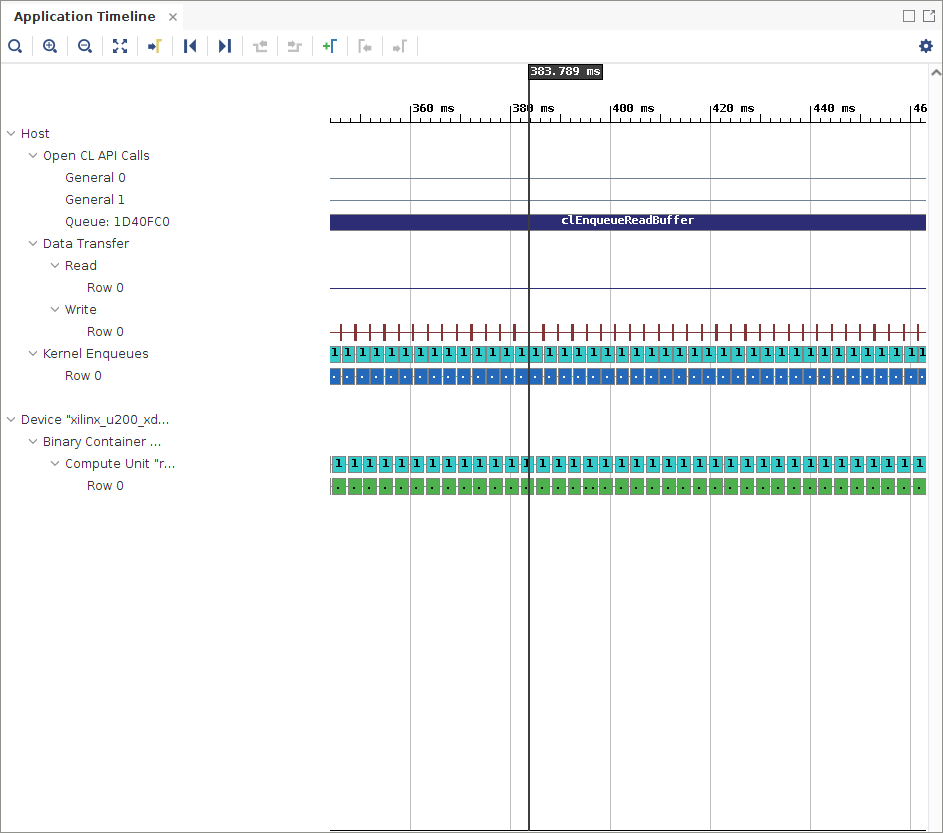

<table>
 <tr>
   <td align="center"><h1>2019.2 Vitis™ アプリケーション アクセラレーション開発フローのチュートリアル</h1><a href="https://github.com/Xilinx/SDAccel-Tutorials/branches/all">SDAccel™ 開発環境 2019.1 チュートリアルを参照</a></td>
 </tr>
 <tr>
 <td align="center"><h1>アクセラレーション FPGA アプリケーションの最適化: ブルーム フィルターの例</td>
 </tr>
</table>

# 4\. データフローを使用した最適化

前の演習では、グローバル メモリからローカル メモリへブルーム フィルターの配列をコピーしてカーネルの効率を改善しました。この演習では、タスクおよび命令の並列処理を増やすためコードの構造を確認します。命令レベルで並列処理を実行するには、プロセッサでパイプライン処理を使用するのが一般的です。パイプライン処理をしておくと、前の命令を完了させたハードウェアでこの複数の命令を並行実行しながら、プロセッサで同時に複数の命令を処理できます。

Vitis コンパイラでは、自動的にほとんどの操作がパイプライン処理されます。コードでパイプライン処理をイネーブルにするために何かを追加する必要はありません。各ループがどのようにパイプライン処理されているのかは、HLS レポートで確認できます。

普通、パイプライン処理は命令レベルで機能しますが、データフローを使用して、関数レベルでパイプライン処理をすることも可能です。データフローを使用すると複数の関数をパイプライン処理できるので、さまざまな反復セットで同時にこれらの命令を実行できます。次の図に例を示します。

データフローを使用しない場合は、`func_A`、`func_B`、および `func_C` が順次実行されます。データフローを使用しない場合は、この 3 つの関数をオーバーラップさせられるので、合計実行時間を短縮できます。

この演習では、データフローで関数をインプリメントするため、元のブルーム フィルター関数を 2 つの関数に分けます。

* `read_dataflow`: データを読み出します。
* `compute_dataflow`: 各ドキュメントのドキュメント スコアを計算し、配列に書き込みます。

この 2 つの関数間でデータを渡すのにストリームが使用されます。ストリームについては、『Vivado Design Suite ユーザー ガイド: 高位合成』 ([UG902](https://www.xilinx.com/support/documentation/sw_manuals/xilinx2019_2/ug902-vivado-high-level-synthesis.pdf)) の「HLS ストリーム ライブラリ」を参照してください。ストリームを使用すると、データ エレメント レベルでデータを処理できます。ストリームを使用すると、エレメントがストリーム変数に挿入されるとすぐに、次のモジュールがそのエレメントの処理を開始します。

## ホスト コードの変更

カーネルでデータをストリーミングするときは、転送するドキュメントの合計ワード数を指定しておくと便利なので、合計ワード数を指定するため `size` 引数を追加します。

87 行目に次の行を追加します。

```
kernel.setArg(7,flag);
```

## カーネル コードの変更

> **ヒント:** 完成したカーネルのソース ファイルは `reference-files/dataflow` フォルダーにあります。参照用として使用してください。

1. `src/dataflow` で `compute_score_fpga.cpp` を開きます。

2. カーネルに送信された入力データの合計サイズを表すため `runOnfpga` 関数に `total_size` 引数を追加します。

   > **注記:** `doc_sizes` 配列に基づいてサイズを反復させることもできたのですが、個別に `total_size` スカラー引数が渡されています。`doc_sizes` 配列が `compute_score` 関数および `read_dataflow` 関数で使用されているので (次の説明を参照)、また、配列は 2 つの関数に別々に読み込まれるため、データフロー機能はインプリメントできません。

   ```
   void runOnfpga (unsigned int* doc_sizes,unsigned int* input_doc_words,unsigned int* bloom_filter,unsigned long* profile_weights,unsigned long* fpga_profileScre,unsigned int total_num_docs,bool load_weights)
   ```

   上記の行を次のように変更します。

   ```
   void runOnfpga (unsigned int* doc_sizes,unsigned int* input_doc_words,unsigned int* bloom_filter,unsigned long* profile_weights,unsigned long* fpga_profileScore,unsigned int total_num_docs,unsigned int total_size,bool load_weights)
   ```

3. メイン関数をサブ関数に分ける必要があるので 43 行目から 68 行目までを削除します。それから新しい関数 `compute_score` を作成し、その関数に削除した行を含めます。

4. ラッパー関数を使用して 2 つのサブ関数を呼び出すため、`runOnfpga` 関数の構造を変更します。

   分岐パスがあるコードブロックでは、データフローを適用できないので、この 2 つの関数を呼び出すために、ラッパー関数を作成します。この場合は、これが最初のカーネル呼び出しなのかどうかによりますが、 DDR からローカル メモリへブルーム フィルター配列を読み込む `if` ループがあります。したがって、まずラッパー関数を作成し、このラッパー関数の中でデータフローをイネーブルにします。

   `runOnfpga` 関数に次の行を追加します。

   ```
   wrapper(doc_sizes,input_doc_words,bloom_filter_local,profile_weights,fpga_profileScore,total_num_docs,total_size);
   ```

5. `read_dataflow` および `compute_score` の 2 つのサブ関数を持つ `wrapper` 関数を定義します。また関数呼び出しの間のデータをパイプライン処理するためストリームを作成します。次の行を追加します。

```
void wrapper(unsigned int* doc_sizes,unsigned int* input_doc_words,unsigned int* bloom_filter_local,unsigned long* profile_weights,unsigned long* fpga_profileScore,unsigned int total_num_docs,unsigned int total_size) {

hls::stream<unsigned int> read_stream("read");

#pragma HLS dataflow

read_dataflow(read_stream,input_doc_words,total_size) ;
compute_score (doc_sizes,read_stream,bloom_filter_local,profile_weights,fpga_profileScore,total_num_docs);
}
```

6. 次に 1 つずつこの 2 つのサブ関数を作成します。まずは `read_dataflow` 関数から始めます。

   この関数はグローバル メモリからデータを読み出すために作成されます。そしてストリームを使用して、読み出したデータを次の関数に渡します。内部的には、書き込みと読み出しが非同期に実行される FIFO を使用してストリームがインプリメントされます。

   完成した関数は次のようになるはずです。

   ```
   void read_dataflow(hls::stream<unsigned int>& read_stream,const unsigned int* input_doc_words,unsigned int total_size) {

   for(int index=0;index<total_size;index++)
    read_stream << input_doc_words[index];

   }
   ```

   * hls::stream オブジェクトは `hls_stream.h` ヘッダーで定義されます。
   * `<<` 演算子はストリームに値を挿入するために使用されます。

7. 次は `compute_score` 関数を作成します。この関数は `read_flow` 関数からのストリーミング データを読み込んで計算するので最も複雑な関数です。出力データは `write_stream` に書き込まれます。

   `compute_score` コードの抜粋は次のようになります。

   ```
   for(unsigned int doc=0;doc<total_num_docs;doc++) {

   unsigned long ans = 0;
   unsigned int size = doc_sizes[doc];

   for (unsigned int i=0; i < size; i++)
   {

         unsigned int curr_entry;
        read_stream >> curr_entry;
         unsigned int frequency = curr_entry & 0x00ff;
         unsigned int word_id = curr_entry >> 8;
         unsigned hash_pu = MurmurHash2( &word_id,3,1);
         unsigned hash_lu = MurmurHash2( &word_id,3,5);
         bool doc_end= (word_id==docTag);
         unsigned hash1 = hash_pu&hash_bloom;
         bool inh1 = (!doc_end) && (bloom_filter_local[ hash1 >> 5 ] & ( 1 << (hash1 & 0x1f)));
         unsigned hash2=(hash_pu+hash_lu)&hash_bloom;
         bool inh2 = (!doc_end) && (bloom_filter_local[ hash2 >> 5 ] & ( 1 << (hash2 & 0x1f)));

         if (inh1 && inh2)
         {
            ans += profile_weights[word_id] * (unsigned long)frequency;
         }
   }
        fpga_profileScore[doc]=ans;
   }

    }
   ```

## ハードウェア エミュレーションの実行

`makefile` ディレクトリに移動し、次のコマンドを使用してハードウェア エミュレーションを実行します。

```
make run TARGET=hw_emu STEP=dataflow SOLUTION=1 NUM_DOCS=100
```

## ハードウェア エミュレーション用のレポートの生成

次のコマンドを使用して、プロファイル サマリとタイムライン トレースのレポートを生成します。

```
make view_report TARGET=hw_emu STEP=dataflow
```

## ハードウェア エミュレーションのプロファイル サマリ

1. Vitis 解析でプロファイル サマリ レポートをクリックすると、次が表示されます。

   

2. プロファイル サマリ レポートからパフォーマンス データを取り込んで、次の表に追加します。

| 演習                            | Number of Documents   | Average Document Size(kB) | Time (Hardware) (ms) | Throughput (MBps) |
 | :-----------------------        | :----------- | ------------: | ------------------: | ----------------: |
 | CPU                       |     100 |           16 |              12.6 |   130.03        |
 | baseline                   |     100 |           16 |             10.42|  157.236            |
 | localbuf                 | 100 | 16| 1.67 | 981.078 |
 | dataflow                 | 100 | 16|  | 1.56  | 1025.64 |
---------------------------------------

こステップではあまりパフォーマンスの改善は見られません。その理由は、`compute_score` 関数内の演算ループの II が既に 1 だからです。従って、パフォーマンスはほとんど影響を受けません。

## ハードウェア エミュレーションのタイムライン トレース

Vitis 解析でタイムライン トレース レポートをクリックすると、次が表示されます。


データ転送がすべて完了した後にのみ演算が実行され、実行時間のほとんどがカーネルにあてられているのがわかります。



## ハードウェア エミュレーションのカーネル詳細トレースの確認

カーネル詳細トレース レポートはハードウェア エミュレーション実行の一部として自動的に生成されます。カーネル詳細トレースの次の図は、メモリ転送が最適化されている CU ストールを示しています。


この CU ストールは、主に、DDR メモリの `profile_weights` 配列に対応している `gemem4` が原因で起きています。このメモリへのアクセスは順次アクセスではないので、サイズが大きすぎてローカル メモリにフィットできません。これらのアクセスはアクセス全体の 1% にしかならないので、このストールは許容されます。

## 次のステップ

次のセクションでは、並列処理するために [CU を増やすことで](./multicu.md)パフォーマンスを改善する方法を説明します。</br>

<hr/>
<p align="center"><b><a href="../../docs/vitis-getting-started/README.md">入門ガイドの最初に戻る</a> &mdash; <a href="./README.md">チュートリアルの最初に戻る</a></b></p>
<p align="center"><sup>Copyright&copy; 2019 Xilinx</sup></p>
