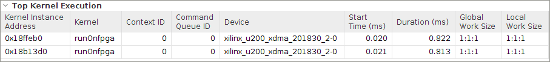

<table>
 <tr>
   <td align="center"><h1>2019.2 Vitis™ アプリケーション アクセラレーション開発フローのチュートリアル</h1><a href="https://github.com/Xilinx/SDAccel-Tutorials/branches/all">SDAccel™ 開発環境 2019.1 チュートリアルを参照</a></td>
 </tr>
 <tr>
 <td align="center"><h1>アクセラレーション FPGA アプリケーションの最適化: ブルーム フィルターの例</td>
 </tr>
</table>

# 5\. アウト オブ オーダー キューおよび複数の演算ユニットの使用

これまでの演習では、パイプライン処理やデータフローなどのテクニックを使用して、カーネルないの並列処理を抽出することに専念してきました。FPGA の強力な機能の 1 つは、複数の演算ユニット (CU) を作成できることです。これらの CU はカーネルとまったくように複製したもので、これを活用して並列処理能力を強化できます。前に説明したように、並列処理を可能にするには、CU のデータパスを広げるか、CU を置き換えるかの方法があります。この演習では、コード記述が簡単という理由から、CU を置き換えるアプローチを取り、2.6 Gb/s のスループットを達成します。これらの CU は一度に複数のドキュメントを処理するために使用できるので、各ドキュメントをより速く処理できるのです。

複数の CU で達成できるアクセラレーションを活用するには、CU への複数同時リクエストをホスト アプリケーションで出力および管理する必要があります。最大パフォーマンスを得るには、このアプリケーションですべての CU をビジー状態にさせておくことが大事です。データ転送に少しでも遅延があったり、CU が開始したりすると、全体的なパフォーマンスが低下します。

また、アウト オブ オーダー キューを利用し、次の演算イテレーションのデータ転送を、現在の演算イテレーションとオーバーラップさせることができ、計算をスピードアップできます。これは、データが大きすぎて FPGA メモリにフィットさせられず、データを分けて転送する必要のあるデータ アナリティクス アプリケーションで特に便利です。

この演習では、まず、複数の CU を処理するために、ホスト コードを変更するところから始めます。

## キュー操作をアウト オブ オーダーで実行

ホスト アプリケーションでは、FPGA 上のカーネルと通信するため、OpenCL™ API が使用されます。これらのコマンドは、コマンド キュー オブジェクトを介して実行されます。コマンド キューはデフォルトで順番に処理されます。ただし、コマンド キューに特別なフラグを渡すことにより、どんな順番でも操作を実行できるよう、このデフォルト動作を変更できます。このタイプのキューは、リソースが使用可能になるとすぐに実行できる準備が整っている操作であれば、すべてすぐに実行します。

アウト オブ オーダー キューでは、メモリ転送やカーネル コールなど、同時に複数の操作を開始できます。タスクの依存関係は、OpenCL API イベントおよび待機リストを使用して追加できます。イベントは、特定タスクに関連付けられているオブジェクトです。操作が別のタスクに依存している場合は、そのイベントを待機リストに渡すことができます。その操作は、待機リストのすべてのイベントが完了するのを待ってから、実行する必要があります。

ドキュメントの計算はそれぞれに独立しているので、1 つの CU のデータ転送および計算と、ほかの CU のものをオーバーラップさせることができます。

> **ヒント:** 完成したホスト コードのソース ファイルは `reference-files/multicu` フォルダーにあります。必要であれば、それを参照として使用できます。

アウト オブ オーダー キューおよびイベントを活用するには、ホスト プログラムを変更します。

1. `src/multicu` から `run.cpp` ファイルを開き、次の行を変更します。

   ```
   cl::CommandQueue q(context,device,CL_QUEUE_PROFILING_ENABLE);
   ```

   上記の行を次のように変更します。

   ```
   cl::CommandQueue q(context,device,CL_QUEUE_PROFILING_ENABLE|CL_QUEUE_OUT_OF_ORDER_EXEC_MODE_ENABLE);
   ```

2. `enqueueMigrateMemObjects` データ転送の後にイベントをまず格納するため、`num_iter` ループ内にイベント `eve` を作成します。

   ```
   for(unsigned int iter=0;iter<num_iter;iter++) {
   ...
   q.enqueueMigrateMemObjects({buffer_input_words},0);
   ...
   }
   ```

   上記の行を次のように変更します。

   ```
   for(unsigned int iter=0;iter<num_iter;iter++) {
   ...
   cl::Event eve;
   q.enqueueMigrateMemObjects({buffer_input_words},0,NULL,&eve);
   ...
   ```

3. `num_iter` ループ内の `input_words` のデータ転送の後に、イベント `eve` を格納するため、イベントのベクター `waitlist` を作成します。

   これは、データ転送が完了するまで待機する `enqueueTask` 操作の入力ベクター配列として使用されます。演算は、データ転送が完了した後に常に開始するはずです。`num_iter` の各データ転送コールでデータを転送するので、`num_iter` のループの内側に次のベクターを作成します。

   次のように変更します。

   ```
   for(unsigned int iter=0;iter<num_iter;iter++) {
   ...
   vector<cl::Event> waitlist;
   q.enqueueMigrateMemObjects({buffer_input_words},0,NULL,&eve);
   waitlist.push_back(eve);
   ...
   }
   ```

4. 演算 (`enqueueTask`) の後にイベントをまず格納するため、86 行目にイベント `ef` を作成します。

   `enqueueTask` は `enqueueMigrateMemObjects` が完了するまで待機する必要があるので、入力ベクターに `&waitlist` を追加します。

   次の行を変更します。

   ```
   for(unsigned int iter=0;iter<num_iter;iter++) {
   ...
   q.enqueueTask(kernel);
   ...
   }
   ```

   上記の行を次のように変更します。

   ```
   for(unsigned int iter=0;iter<num_iter;iter++) {
   ….
   cl::Event ef;
   q.enqueueTask(kernel,&waitlist,&ef);…
   }
   ```

5. 演算 (`enqueueTask`) が完了した後に `num_iter` ループ内にイベント `ef` を格納するイベントのベクター `eventlist` を作成します。

   これは、出力バッファーの最終読み出し操作の入力ベクターとして使用されます (fpga\_profile\_score)。出力バッファーの読み出しは `enqueueTask` 演算が完了した後にのみ実行してください。前のステップで生成したイベント `ef` を使用して、それをベクター `eventlist` に格納します。

   次のように変更します。

   ```
    vector<cl::Event> eventlist;
    for(unsigned int iter=0;iter<num_iter;iter++) {
    ...
    cl::Event ef;
    q.enqueueTask(kernel,&waitlist,&ef);
    eventlist.push_back(ef);
    ...
   }

   q.enqueueMigrateMemObjects({buffer_fpga_profileScore},CL_MIGRATE_MEM_OBJECT_HOST,&eventlist,NULL);

   ```

## 複数の計算ユニットの使用

これまでの演習では、カーネル用に CU を 1 つだけ使用しました。このセクションでは、複数の CU を使用するため、ホスト コードを変更し、各 CU で少ない数のドキュメントを処理します。ドキュメントのみに対して演算が実行されるようにカーネルを変更します。

### 複数の CU をサポートするためのホスト コードのアップデート

1. CU の数は 2 に設定しています。`run.cpp` ファイルを開き、次の行を追加します。

   ```
   unsigned int num_compute_units=2;
   vector<cl::Kernel> kernel(num_compute_units);

   for(unsigned int i=0;i<num_compute_units;i++) {
   string s = kernel_name+":{"+kernel_name + "_"+ to_string(i+1)+"}";

   kernel[i] = cl::Kernel(program,s.c_str(),NULL);
   }
   ```

   カーネルのベクターを作成します (各カーネルはそのカーネル名に関連付けられています)。たとえば、カーネルは次のように作成されます。

   ```
   Kernel[0] = cl::kernel(program,runOnfpga:{runOnfpga_1});
   ```

2. 各 CU に、`input_words`、`doc_sizes`、`profile_weights`、`bloom_filter` などの独自の入力配列が持てるように、CU に新しいバッファーを作成します。

   各 CU に新しいバッファーを作成する代わりに、複数の CU に同じバッファーを使用することも可能でした。ただしその場合は、複数の CU が同時に同じバッファーにアクセスしようとするので、メモリ競合が発生します。そこで、バッファーを置き換えます。このアプローチにもカーネルで使用される DDR ポートを使用するという欠点はあります。DDR には最大 16 ポートまであります。ここではパフォーマンスに焦点を当てているので、バッファーの数を置き換えて、合計 8 個の DDR ポートが 2 個の CU で使用されるようにします (各 CU で 4 ポート)。

   ```
   cl::Buffer buffer_input_words;
   cl::Buffer buffer_doc_sizes...
   cl::Buffer buffer_bloom_filter...
   cl::Buffer buffer_profile_weights...
   cl::Buffer sub_buffer;
   cl::Buffer doc_sizes_sub_buffer;
   ```

   上記の行を次のように変更します。

   ```
   cl::Buffer buffer_input_words[num_compute_units];
   cl::Buffer buffer_doc_sizes(context, CL_MEM_USE_HOST_PTR | CL_MEM_READ_ONLY,total_num_docs\*sizeof(uint),doc_sizes);
   cl::Buffer buffer_bloom_filter[num_compute_units];
   cl::Buffer buffer_profile_weights[num_compute_units];
   cl::Buffer sub_buffer[num_compute_units];
   cl::Buffer doc_sizes_sub_buffer[num_compute_units];
   ```

3. カーネル引数を設定します。

   ```
   buffer_bloom_filter =  cl::Buffer(context, CL_MEM_USE_HOST_PTR | CL_MEM_READ_ONLY, bloom_size*sizeof(uint),bloom_filter);
   buffer_profile_weights = cl::Buffer(context, CL_MEM_USE_HOST_PTR | CL_MEM_READ_ONLY, profile_size*sizeof(ulong),profile_weights);
   kernel.setArg(2,buffer_bloom_filter);
   kernel.setArg(3,buffer_profile_weights);
   ```

   上記の行を次のように変更します。

   ```
   for(unsigned int i=0;i<num_compute_units;i++) {
   buffer_bloom_filter[i] =  cl::Buffer(context, CL_MEM_USE_HOST_PTR | CL_MEM_READ_ONLY, bloom_size*sizeof(uint),bloom_filter);
   buffer_profile_weights[i] = cl::Buffer(context, CL_MEM_USE_HOST_PTR | CL_MEM_READ_ONLY, profile_size*sizeof(ulong),profile_weights);
   kernel[i].setArg(2,buffer_bloom_filter[i]);
   kernel[i].setArg(3,buffer_profile_weights[i]);
   }
   ```

4. 各 CU の `buffer_profile_weights` および `buffer_bloom_filter` に対し、ホスト メモリから DDR メモリへデータを転送するには、次を変更します。

   ```
    q.enqueueMigrateMemObjects({buffer_profile_weights},0);
    q.enqueueMigrateMemObjects({buffer_bloom_filter},0);
   ```

   上記の行を次のように変更します。

   ```
   for(unsigned int i=0;i<num_compute_units;i++) {
   q.enqueueMigrateMemObjects({buffer_profile_weights[i]},0);
   q.enqueueMigrateMemObjects({buffer_bloom_filter[i]},0);
   }
   ```

5. 各ドキュメントのサイズが違うので、各 CU が開始するオフセットを監視するため、ホスト バッファーを作成する必要があります。

   * CU オフセットを格納するための `doc_offset` 配列を作成します。

   * 2 MB のデータを反復ごとに転送するので、データ転送の各反復のオフセットを格納するための `doc_offset_per_iter` 配列を作成します。

   * `total_size` 配列の合計サイズおよび各 CU で処理されるドキュメント数を監視します。

   * 合計サイズおよび各 CU のドキュメント数をそれぞれ処理するため、`total_size` および `num_docs` 配列を作成します。

   * 各 CU でさまざまなサイズが処理されるので、CU の処理に必要な最大反復数を計算します。その計算には num\_iter を使用します。

   * 次の行を追加します。

   ```
   unsigned int doc_offset[num_compute_units]={0};
   unsigned int num_docs[num_compute_units];
   unsigned int total_size[num_compute_units];
   unsigned int num_iter=0;
   ```

6. ドキュメント オフセット、ドキュメント数、CU ごとの合計サイズおよび反復数をプリコンパイルします。

   ```
   for(unsigned int comp=0;comp<num_compute_units;comp++) {


   doc_offset_per_iter[comp]=doc_offset[comp];
   num_docs[comp] = (total_num_docs/num_compute_units) + (((total_num_docs%num_compute_units)>comp)?1:0);

   if(comp<num_compute_units-1) {
    total_size[comp] = starting_doc_id[(num_docs[comp]+doc_offset[comp])]-starting_doc_id[doc_offset[comp]];
   doc_offset[comp+1]=(doc_offset[comp])+num_docs[comp];
   }
   else
    total_size[comp] =  (total_doc_size_1-starting_doc_id[doc_offset[comp]]);


   size_per_iter=min(total_size[comp],size_per_iter_const);

   num_iter = max(num_iter,((total_size[comp]/size_per_iter) + (((total_size[comp]%size_per_iter)>0)?1:0)));
   }
   ```

7. データ転送および演算ループで、CU のループをさらに追加します。CU が完全並列操作するようにするには、`compute units` ループを一番内側に追加する必要があります。そうすると、各反復で、すべての CU の演算およびデータ転送が実行され、オーバーラップできます。

   手順 5 で作成した配列を使用し、各 CU の反復実行で送信されたドキュメント数を計算します。次のように変更します。

   ```
   for(unsigned iter=0;iter<num_iter;iter++) {

   unsigned int docs_per_iter = (total_num_docs/num_iter) + ((total_num_docs%num_iter)>iter?1:0);
   unsigned int size;
   cl::Event ef;
   bool flag=false;

   if(iter<num_iter-1) {

   size = starting_doc_id[doc_offset+docs_per_iter] - starting_doc_id[doc_offset];
   } else {
   size = total_doc_size_1 - starting_doc_id[doc_offset];
   }

   cl_buffer_region buffer_info={doc_offset*sizeof(ulong), docs_per_iter*sizeof(ulong)};
   cl_buffer_region buffer_info_sizes={doc_offset*sizeof(uint), docs_per_iter*sizeof(uint)};

   sub_buffer =  buffer_fpga_profileScore.createSubBuffer(CL_MEM_WRITE_ONLY,CL_BUFFER_CREATE_TYPE_REGION,&buffer_info);
   doc_sizes_sub_buffer =  buffer_doc_sizes.createSubBuffer(CL_MEM_READ_ONLY,CL_BUFFER_CREATE_TYPE_REGION,&buffer_info_sizes);

   if(i==0) {
   kernel.setArg(0,buffer_doc_sizes);
   kernel.setArg(4,buffer_fpga_profileScore);
   q.enqueueMigrateMemObjects({buffer_doc_sizes},0);
   }
   else {
   kernel.setArg(0,doc_sizes_sub_buffer);
   kernel.setArg(4,sub_buffer);
   }
   buffer_input_doc_words = cl::Buffer (context,CL_MEM_USE_HOST_PTR | CL_MEM_READ_ONLY, size*sizeof(uint),&input_doc_words[starting_doc_id[doc_offset]]);
   kernel.setArg(1,buffer_input_doc_words);
   kernel.setArg(5,docs_per_iter);
   kernel.setArg(6,size);
   if(iter==0)
   flag=true;
   kernel.setArg(7,flag);

   q.enqueueMigrateMemObjects({buffer_input_doc_words},0);
   q.enqueueTask(kernel,NULL,&ef);
   eventlist.push_back(ef);
   doc_offset+=docs_per_iter;
   }
   ```

   上記の行を次のように変更します。

   ```
   for(unsigned int i=0;i<num_iter;i++) {

   for(unsigned int comp=0;comp<num_compute_units;comp++) {

   cl::Event eve,ef,eve_size;
   vector<cl::Event> waitlist;
    unsigned int docs_per_iter = (num_docs[comp]/num_iter) + (((num_docs[comp]%num_iter)>i)?1:0);
   unsigned int size;
   bool flag=false;

   if(i<num_iter-1)
   size= (starting_doc_id[docs_per_iter+doc_offset_per_iter[comp]]) - (starting_doc_id[doc_offset_per_iter[comp]]);
   else
   size= starting_doc_id[doc_offset[comp]] + total_size[comp] - (starting_doc_id[doc_offset_per_iter[comp]]);

   buffer_input_doc_words[comp]=cl::Buffer(context,CL_MEM_USE_HOST_PTR | CL_MEM_READ_ONLY,size*sizeof(uint),input_doc_words+starting_doc_id[doc_offset_per_iter[comp]]);
   cl_buffer_region buffer_info={doc_offset_per_iter[comp]*sizeof(ulong), docs_per_iter*sizeof(ulong)};
   cl_buffer_region buffer_info_sizes={doc_offset_per_iter[comp]*sizeof(uint), docs_per_iter*sizeof(uint)};

   sub_buffer[comp] =  buffer_fpga_profileScore.createSubBuffer(CL_MEM_WRITE_ONLY,CL_BUFFER_CREATE_TYPE_REGION,&buffer_info);
   doc_sizes_sub_buffer[comp] =  buffer_doc_sizes.createSubBuffer(CL_MEM_READ_ONLY,CL_BUFFER_CREATE_TYPE_REGION,&buffer_info_sizes);

   if(i==0) {
   kernel.setArg(0,buffer_doc_sizes);
   kernel.setArg(4,buffer_fpga_profileScore);
   q.enqueueMigrateMemObjects({buffer_doc_sizes},0);
   }
   else {
   kernel.setArg(0,doc_sizes_sub_buffer);
   kernel.setArg(4,sub_buffer);
   }

   kernel[comp].setArg(1,buffer_input_doc_words[comp]);
   kernel[comp].setArg(5,docs_per_iter);
   kernel[comp].setArg(6,size);
   if(i==0)
    flag=true;
   kernel[comp].setArg(7,flag);

   q.enqueueMigrateMemObjects({buffer_input_doc_words[comp]},0,NULL,&eve);
   waitlist.push_back(eve);
   q.enqueueTask(kernel[comp],&waitlist,&ef);
   eventlist.push_back(ef);
   doc_offset_per_iter[comp]+=docs_per_iter;
   q.enqueueMigrateMemObjects({sub_buffer[comp]},CL_MIGRATE_MEM_OBJECT_HOST,&eventlist,NULL);
   }
   }
   ```

## 複数の CU をサポートするための Makefile のアップデート

1. 複数の CU のコンパイル サポートをイネーブルにするため `connectivity.cfg` ファイルを新規作成します。

2. `connectivity.cfg` ファイルに次の行を追加します。

   ```
   [connectivity]
   nk=runOnfpga:2:runOnfpga_1.runOnfpga_2
   ```

## ハードウェア エミュレーションの実行

`makefile` ディレクトリに移動し、次のコマンドを使用してハードウェア エミュレーションを実行します。

```
make run TARGET=hw_emu STEP=multicu SOLUTION=1 NUM_DOCS=100
```

## ハードウェア エミュレーションのレポートの生成

次のコマンドを使用して、プロファイル サマリとタイムライン トレースのレポートを生成します。

```
make view_report TARGET=hw_emu STEP=multicu
```

## ハードウェア エミュレーションのプロファイル サマリ

1. Vitis 解析でプロファイル サマリ レポートをクリックすると、次が表示されます。

   

   CU が並列に実行されているので、実行時間がスピードアップしているのがわかります。

2. パフォーマンス データを取り込んで、次の表に追加します。

   | 演習| Number of Documents| Average Document Size(kB)| Time (Hardware) (ms)| Throughput (MBps)|
   |:----------|:----------|----------:|----------:|----------:|----------
   | CPU| 100| 16| 11.23| 124.67|
   | baseline| 100| 16| 38| 36.84|
   | localbuf| 100| 16| 1.67| 838.323|
   | dataflow| 100| 16| 1.567| 893.42|
   | multicu| 100| 16| 0.822| 1703.16| \---------------------------------------


## ハードウェア エミュレーションのタイムライン トレース

次の図を見ると、2 つの CU 間で実行時間がオーバーラップしているのがわかります。


## 次のステップ

CU 間で同じ DDR ポートにアクセスすると、競合が発生する可能性があるので、[複数の DDR バンク](./multiddr.md)を使用して、アプリケーションのパフォーマンスをスピードアップします。Alveo データセンター U200 アクセラレータ カードには、DDR バンクが 4 つ、PLRAMS が 3 つあります。入力ドキュメント データが大きすぎて 1 つの DDR バンク (4 GB) にはフィットしない場合は、複数の DDR バンクを使用することもできます。</br>

<hr/>
<p align="center"><b><a href="../../docs/vitis-getting-started/README.md">入門ガイドの最初に戻る</a> &mdash; <a href="./README.md">チュートリアルの最初に戻る</a></b></p>
<p align="center"><sup>Copyright&copy; 2019 Xilinx</sup></p>
