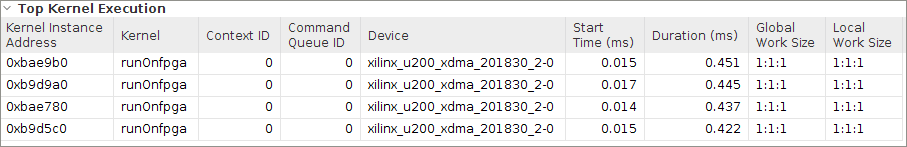
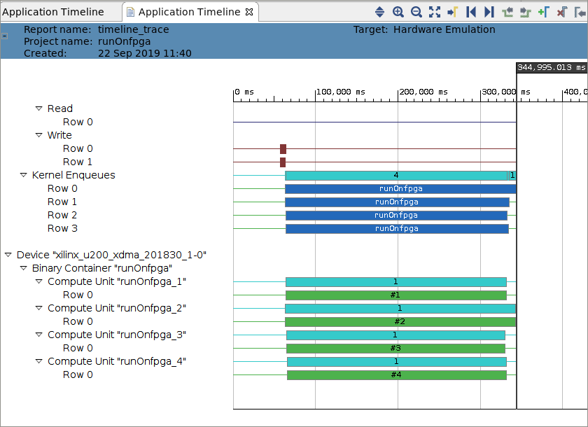

<table>
 <tr>
   <td align="center"><h1>2019.2 Vitis™ アプリケーション アクセラレーション開発フローのチュートリアル</h1><a href="https://github.com/Xilinx/SDAccel-Tutorials/branches/all">SDAccel™ 開発環境 2019.1 チュートリアルを参照</a></td>
 </tr>
 <tr>
 <td align="center"><h1>アクセラレーション FPGA アプリケーション: ブルーム フィルターの例</td>
 </tr>
</table>

# 6\. 複数 DDR バンクを使用した最適化

先ほどの演習では、パフォーマンスを改善するために複数の演算ユニット (CU) を使用しました。この演習では、さらにパフォーマンスを高めるため複数の DDR バンクを使用します。

DDR メモリにはカーネル用に最大 15 のポートがあるので、1 つの DDR バンクでネイティブに CU の数を増やすと、DDR メモリ ポートに競合が発生する可能性があります。たとえば、このチュートリアルでは、CU ごとに 4 つのポートがあり、CU の数を 4 つ増やすと、16 のメモリ ポートが必要になります。Alevo データセンター U200 アクセラレータ カードには 4 つの DDR バンクがあります。このカードでは、パフォーマンスをさらに高めるために、これらの DDR バンクが使用されます。個々のドキュメントの演算は互いに独立しているので、各ドキュメントで複数の CU、複数の DDR を使用すると、パフォーマンスはさらに改善されるはずです。

この演習では、2 つの DDR バンクを使用して、CU の数を 4 つに増やします (DDR バンクごとに 2 つの CU)。

## 複数の DDR バンクをサポートするためのホスト コードのアップデート

各 DDR に 2 つの CU を使用できるよう、CU の数を `2` から `4` に変更します。

```
 unsigned int num_compute_units = 2;
```

上記の行を次のように変更します。

```
unsigned int num_compute_units = 4;
```

## 複数の DDR バンクをサポートするための Makefile のアップデート

1. 特定 DDR バンクに関連付けられている CU をコンフィギュレーション ファイルで指定するため `sp` フラグを追加しました。ブルーム フィルター `bloom_filter` の場合は、PLRAM を使用します。

   PLRAM はアクセラレータ ボード上のメモリで、DDR よりも低レイテンシです。Alveo データセンター U200 アクセラレータ カードの合計サイズは 128 KB です。ブルーム フィルターのサイズは 64 KB なので、2 つの演算ユニットで 128 KB が消費されます。このデザインには PLRAM を 2 つ使用するので、Alveo データセンター U200 アクセラレータ カードで使用できる PLRAM の合計数は 4 つです。

2. `connectivity.cfg` ファイルを次のように変更します。

   ```
   [connectivity]
   nk=runOnfpga:2:runOnfpga_1.runOnfpga_2
   ```

   上記の行を次のように変更します。

   ```
   [connectivity]
   nk=runOnfpga:4:runOnfpga_1.runOnfpga_2:runOnfpga_3:runOnfpga_4
   sp=runOnfpga_1.fpga_profile_score:DDR[0]
   sp=runOnfpga_2.fpga_profile_score:DDR[0]
   sp=runOnfpga_3.fpga_profile_score:DDR[0]
   sp=runOnfpga_4.fpga_profile_score:DDR[0]
   sp=runOnfpga_1.doc_sizes:DDR[0]
   sp=runOnfpga_2.doc_sizes:DDR[0]
   sp=runOnfpga_3.doc_sizes:DDR[0]
   sp=runOnfpga_4.doc_sizes:DDR[0]
   sp=runOnfpga_1.input_words:DDR[0]
   sp=runOnfpga_2.input_words:DDR[0]
   sp=runOnfpga_3.input_words:DDR[1]
   sp=runOnfpga_1.profile_weights:DDR[0]
   sp=runOnfpga_2.profile_weights:DDR[0]
   sp=runOnfpga_3.profile_weights:DDR[0]
   sp=runOnfpga_4.profile_weights:DDR[0]
   sp=runOnfpga_1.bloom_filter:PLRAM[0]
   sp=runOnfpga_2.bloom_filter:PLRAM[0]
   sp=runOnfpga_3.bloom_filter:PLRAM[1]  
   sp=runOnfpga_4.bloom_filter:PLRAM[1]
   ```

## ハードウェア エミュレーションの実行

`makefile` ディレクトリに移動し、次のコマンドを使用してハードウェア エミュレーションを実行します。

```
make run TARGET=hw_emu STEP=multiddr SOLUTION=1 NUM_DOCS=100
```

## ハードウェア エミュレーションのレポートの生成

次のコマンドを使用して、プロファイル サマリとタイムライン トレースのレポートを生成します。

```
make view_report TARGET=hw_emu STEP=multiddr
```

## ハードウェア エミュレーションのプロファイル サマリ

1. Vitis 解析でプロファイル サマリ レポートをクリックすると、次が表示されます。

   

2. カーネル詳細トレースからパフォーマンス データを取り込んで、次の表に追加します。

   | 演習| Number of Documents| Average Document Size(kB)| Time (Hardware) (ms)| Throughput (MBps)
   |:----------|:----------|----------:|----------:|----------:
   | CPU| 100| 16| 11.23| 124.67
   | baseline| 100| 16| 38| 36.84
   | localbuf| 100| 16| 1.67| 838.32
   | dataflow| 100| 16| 1.567| 893.42
   | multicu| 100| 16| 0.822| 1703.16
   | multiddr| 100| 16| 0.55| 2909.09


---------------------------------------


## ハードウェア エミュレーションのタイムライン トレース

Vitis 解析でタイムライン トレース レポートは次のように表示されます。



* 4 つの演算ユニットの間で実行が重複してします。
* さらに大きなデータセットのデータ転送と演算ユニットの間で重複があります。

## 次のステップ

次のセクションでは、パフォーマンスの改善を確認するため、[前出のステップで触れた最適化をすべてハードウェアで実行します。](./runningonhardware.md)</br>

<hr/>
<p align="center"><b><a href="../../docs/vitis-getting-started/README.md">入門ガイドの最初に戻る</a> &mdash; <a href="./README.md">チュートリアルの最初に戻る</a></b></p>
<p align="center"><sup>Copyright&copy; 2019 Xilinx</sup></p>
