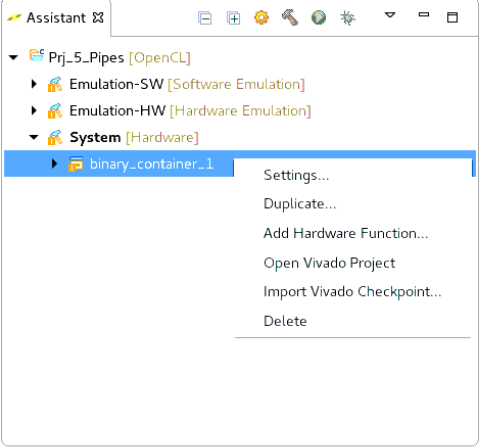
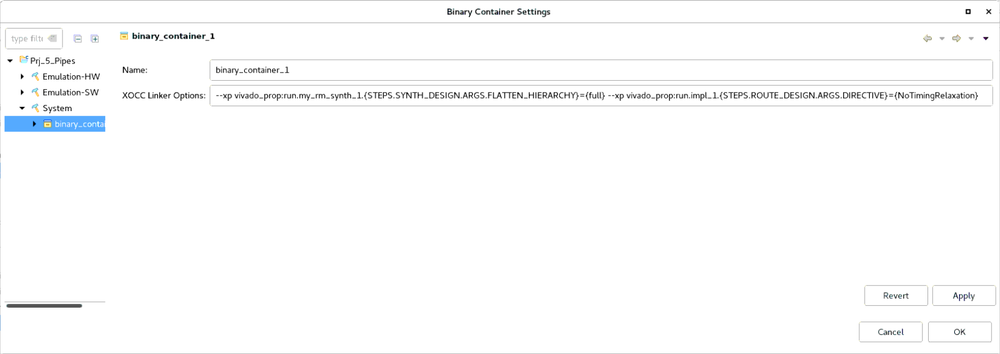
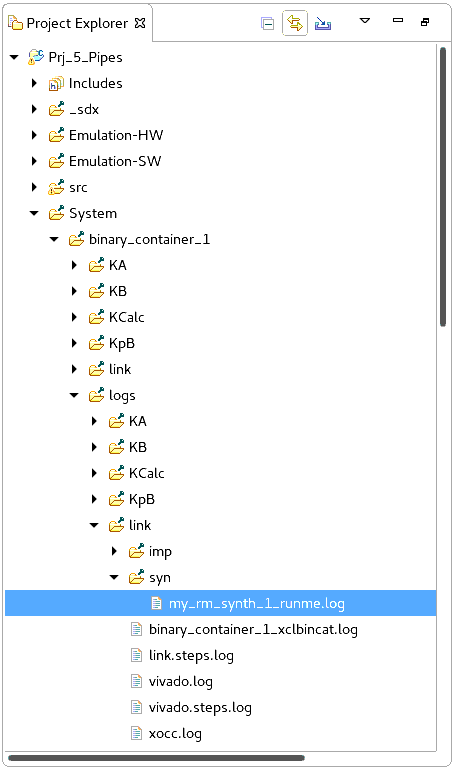
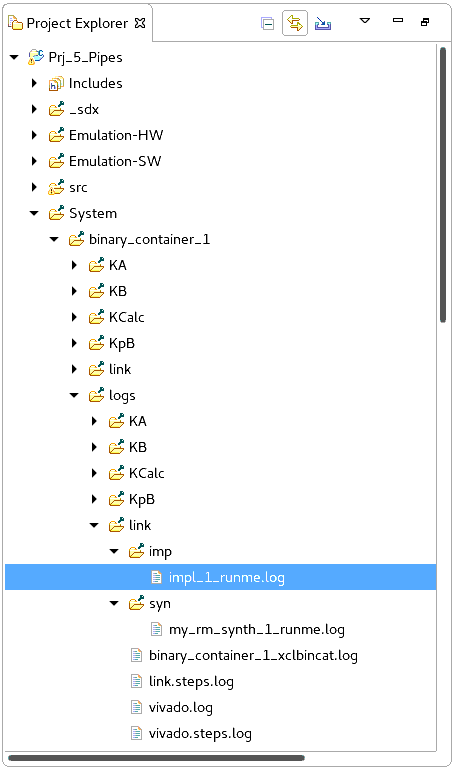
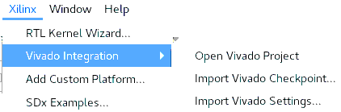
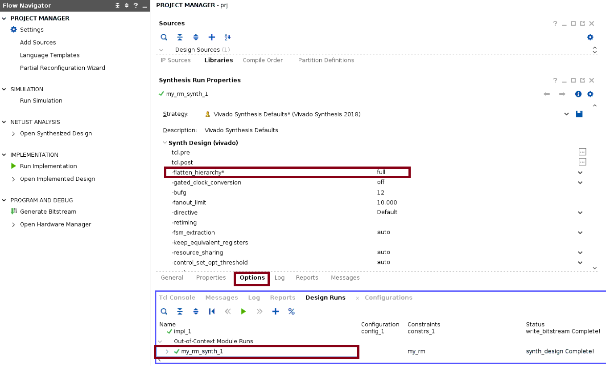
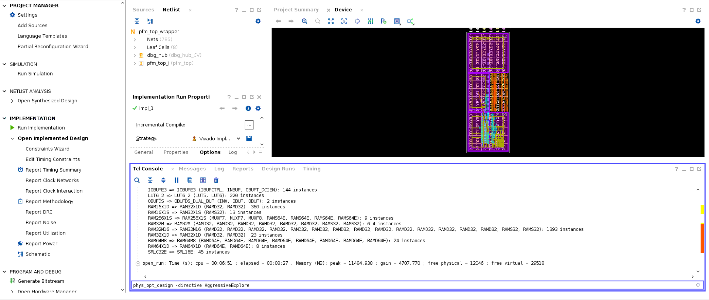
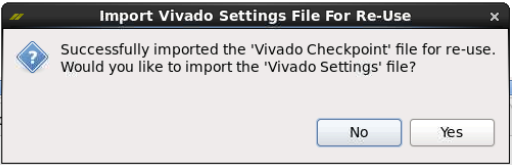
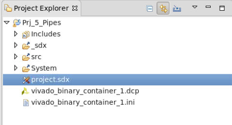

<p align="right">
別の言語で表示: <a href="../../../README.md">English</a>          
</p>

<table>
 <tr>
   <td align="center"><h1>2018.3 SDAccel™ 開発環境チュートリアル</h1>
   <a href="https://github.com/Xilinx/SDAccel-Tutorials/branches/all">その他のバージョン</a>
   </td>
 </tr>
 <tr>
 <td align="center"><h3>Vivado インプリメンテーションの制御</h3>
 </td>
 </tr>
</table>

ザイリンクス オープン コード コンパイラ (XOCC) は、ソース コードに対して Vivado® インプリメンテーションを実行し、FPGA ベースのアクセラレータ ボードのプログラムに必要なビットストリームおよびその他のファイルを生成するコマンド ライン コンパイラです。タイミング クロージャを含む適切な結果を達成するため、Vivado 合成およびインプリメンテーションのアドバンス オプションを使用することが必要となる場合があります。  
このセクションでは、プロジェクトをインプリメントする際に Vivado フローを制御する方法を GUI で手順ごとに示します。  
>**注記**: このセクションは、システム実行に適用されます。アプリケーションのコンパイルには、1 時間以上かかる場合があります。

SDAccel™ 環境から Vivado フローを制御するには、2 つの方法があります。
システム実行のコンパイルを開始する前に、`--xp` XOOC コンパイラ オプションを使用して Vivado 特有の合成およびインプリメンテーション オプションを渡します。
* アプリケーションが既にシステム実行用にコンパイルされている場合は、次を実行します。
  1. Vivado ツールの GUI を開きます。
  2. デザインを最適化します。
  3. 新しいチェックポイントを生成します。
  4. このチェックポイントを SDAccel 環境にインポートし戻して、新しいインプリメンテーションを完了させます。

## `--xp` XOOC コンパイラ オプションを使用
ここでは、次の方法を説明します。
 * RTL 合成で階層を完全にフラット化 (`FLATTEN_HIERARCHY=full` を指定)
 * 配線で NoTimingRelaxation 指示子を使用 (`DIRECTIVE=NoTimingRelaxation` を指定)

これらのオプションを `--xp` XOCC コンパイラ オプションを使用して Vivado フローに渡すには、次の構文を使用します。オプションごとに `--xp` オプションを使用する必要があります。
* `--xp vivado_prop:run.my_rm_synth_1.{STEPS.SYNTH_DESIGN.ARGS.FLATTEN_HIERARCHY}={full}`
* `--xp vivado_prop:run.impl_1.{STEPS.ROUTE_DESIGN.ARGS.DIRECTIVE}={NoTimingRelaxation}`


これらのオプションを SDAccel GUI で XOCC リンカーに指定する必要があります。
1. **[File]** → **[Import]** をクリックして `Prj_5_Pipes` プロジェクトをインポートします。<!--ThomasB: the project name is non-descriptive and should be changed. Also, it is best to create projects from scratch rather than load existing ones.-->
2. **[Xilinx/SDx Project]** を選択します。
3. 次のウィンドウで **[SDx project exported zip file]** を選択します。
4. **[Next]** をクリックし、プロジェクト ディレクトリの `Prj_5_Pipes.zip` を指定します。
5. **[OK]** をクリックすると、**[Application Projects/Prj_5_Pipes]** が既に選択されているはずです。**[Finish]** をクリックします。
6. [Assistant] ビューで **[System]** → **[binary_container_1]** を右クリックし、**[Settings]** をクリックします。

  

  [XOCC Linker Options] に `--xp` オプションが指定されています。
  

7. [Cancel] をクリックしてウィンドウを閉じます。
8. `Prj_5_Pipes/System` を右クリックして **[Build]** をクリックします。  

  デザインのインプリメンテーション中、これらのオプションが Vivado フローに正しく伝搬されていることを確認できます。Vivado RTL 合成で生成されたログ メッセージは、`Prj_5_Pipes/System/binary_container_1/logs/link/syn/my_rm_synth_1_runme.log` に含まれます。  
  

9. `Prj_5_Pipes/System/binary_container_1/logs/link/syn/my_rm_synth_1_runme.log` を開いて、`flatten_hierarchy` を検索します。次のコマンドが見つかります。  
```
Command: synth_design -top pfm_dynamic -part xcvu9p-fsgd2104-2-i -flatten_hierarchy full -mode out_of_context  
```

  Vivado インプリメンテーション機能で生成されたログ メッセージは、`Prj_5_Pipes/System/binary_container_1/logs/link/impl/impl_1_runme.log` に含まれます。  


10. `Prj_5_Pipes/System/binary_container_1/logs/link/impl/impl_1_runme.log` を開いて、`NoTimingRelaxation` を検索します。次のコマンドが見つかります。  
```
Command: route_design -directive NoTimingRelaxation
```

  ログ ファイルからは、SDAccel 環境で指定したオプションが Vivado フローに正しく伝搬されてたことが確認できます。

## SDAccel GUI から Vivado を実行
アプリケーションを既にシステム実行用にコンパイルしている場合は、Vivado GUI を開き、合成済みまたはインプリメント済みデザインを読み込んで、インタラクティブに変更を加えてから、このチェックポイントを SDAccel 環境にエクスポートして新しいインプリメンテーションを実行します。

>**重要**: マシンのメモリが 32 GB RAM 未満の場合は、この後の手順を実行せずに確認だけしてください。実行すると、メモリ不足になる可能性があります。

1. Prj_5_Pipes プロジェクトを開いた状態で、**[Xilinx]** → **[Vivado Integration]** → **[Open Vivado Project]** をクリックして Vivado を起動します。  
  
2. 開いている Vivado プロジェクトで合成 run (`my_rm_synth_1`) を選択します。
3. [Synthesis Run Properties] セクションの [Options] タブをチェックします。`flatten_hierarchy` オプションが `full` に設定されています。これは、`--xp` オプションを使用して `flatten_hierarchy` オプションを伝搬したからです。  
  
同様に、Vivado インプリメンテーション設定も確認します。

  Vivado インプリメンテーション結果でタイミングを調整する必要があるとします。

4. **[IMPLEMENTATION]** → **[Open Implemented Design]** を展開します。
5. 配線後の物理合成を実行するには、コンソール ウィンドウに次を入力します。  
```
phys_opt_design -directive AggressiveExplore
```  
  
 スラックが小さい場合は、タイミングが向上しています。
6. これが終了したら、次のコマンドを使用して配線済みチェックポイント (`.dcp` ファイル) を生成します。
```
write_checkpoint -force prj/prj.runs/impl_1/pfm_top_wrapper_routed.dcp
```
>**注記**: `.dcp` ファイルのパスを変更する必要がある場合があります。`pwd` コマンドを使用して作業ディレクトリを確認します。
7. 最適化が終了したら、Vivado ツール を閉じます。

## Vivado チェックポイントを SDAccel GUI にインポート

1. SDx™ 環境で、**[Xilinx]** → **[Vivado Integration]** → **[Import Vivado Checkpoint]** をクリックしてアップデートされた `.dcp` をインポートします。  
インポートが終了すると、Vivado 設定ファイルをインポートするかどうか尋ねるダイアログ ボックスが表示されます。  
  
2. **[Yes]** をクリックして Vivado 設定ファイル (`xocc.ini`) をインポートします。`.dcp` ファイルと `.ini` ファイルがインポートされたことを確認します。  

3. [Assistant] ビューで **[Prj_5_Pipes]** → **[System]** を右クリックし、**[Build]** をクリックします。  

インクリメンタル フローが Vivado インプリメンテーション フローに進み、ビットストリームが生成されます。

<hr/>
<p align="center"><sup>Copyright&copy; 2018 Xilinx</sup></p>

この資料は表記のバージョンの英語版を翻訳したもので、内容に相違が生じる場合には原文を優先します。資料によっては英語版の更新に対応していないものがあります。日本語版は参考用としてご使用の上、最新情報につきましては、必ず最新英語版をご参照ください。