<table style="width:100%">
  <tr>
    <td  align="center" width="100%" colspan="6"><h1>2018.3 SDAccel™ 開発環境チュートリアル</h1>
    <a href="https://github.com/Xilinx/SDAccel-Tutorials/branches/all">ほかのバージョンを参照</a>
</td>
  </tr>
  <tr>
    <td colspan="3" align="center"><h1>C/C++ カーネル入門</h1></td>
  </tr>  <tr>
    <td align="center"><a href="README.md">はじめに</td>
    <td align="center">演習 1: SDAccel 開発環境の概要</td>
    <td align="center"><a href="lab-2-introduction-to-the-sdaccel-makefile.md">演習 2: SDAccel makefile の概要</a></td>
  </tr>
</table>

# 演習 1: SDAccel 開発環境の概要

2 種類のフローを示します。手順 1 ～ 3 では GUI フロー、手順 4 では makefile フローを説明します。

この演習では、ザイリンクス GitHub リポジトリからの [SDAccel&trade; サンプル デザイン](https://github.com/Xilinx/SDAccel_Examples)を使用します。

## 手順 1: GitHub サンプルからの SDAccel プロジェクトの作成

1. Linux のターミナル ウィンドウで `sdx` コマンドを使用して SDx 開発環境を起動します。

   [Workspace Launcher] ダイアログ ボックスが表示されます。

2. ワークスペースのディレクトリを選択します。このディレクトリにプロジェクトが含まれるようになります。

   

3. **[Launch]** をクリックします。

   [Welcome] ウィンドウが表示されます。

   >**注記**: [Welcome] ウィンドウは、ツールを初めて起動した場合に表示されます。**[Help]** → **[Welcome]** をクリックして開くこともできます。

4. [Welcome] ウィンドウで **[Create Application Project]** をクリックします。

   

   [New SDx Application Project] ダイアログ ボックスが開きます。

5. プロジェクトを作成します。
   1. [Project name] に `helloworld` と指定します。
   2. **[Use default location]** をオンにします。
   3. **[Next]** をクリックします。  

   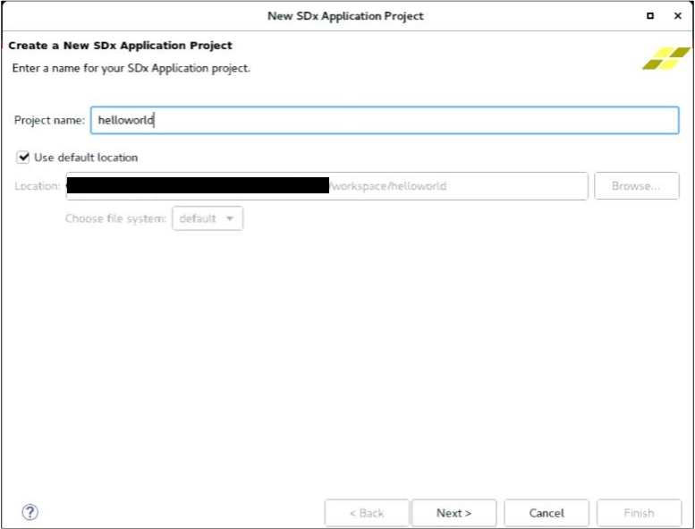

   [Platform] ページが表示されます。

6. `xilinx_u200_xdma_201830_1` を選んで、**[Next]** をクリックします。

   

   [Templates] ページが開き、SDAccel プロジェクトの作成に使用可能なテンプレートがリストされます。ほかの SDx サンプルをダウンロードしていない場合は、[Empty Application] と [Vector Addition] のみが使用可能なテンプレートとして表示されます。

   >**注記**: 選択したハードウェア プラットフォームのタイプによって、プロジェクトが SDAccel プロジェクトになるか SDSoC™ プロジェクトになるかが決まります。

7. この演習では、GitHub リポジトリの Helloworld サンプルを使用します。サンプルをダウンロードするには、**[SDx Examples]** をクリックします。

   

8. **[SDAccel Examples]** を選択し、**[Download]** をクリックします。

   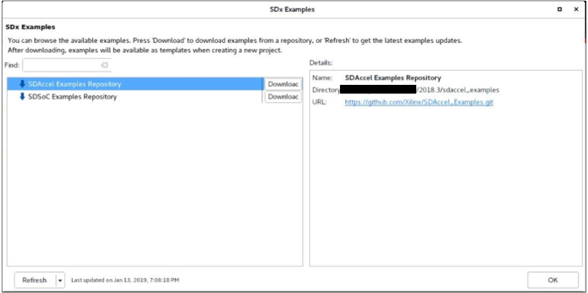

   GitHub リポジトリが指定したディレクトリにクローンされます。ダウンロードが完了すると、[SDAccel Examples] の下にサンプルがツリー形式でリストされます。

   >** 注記**: ダウンロードには、接続速度によって時間がかかることがあります。[Progress Information] ダイアログ ボックスがリポジトリのクローンが完了するまで表示されます。

9. **[OK]** をクリックします。ウィンドウが閉じて、[Templates] ページに戻ります。

   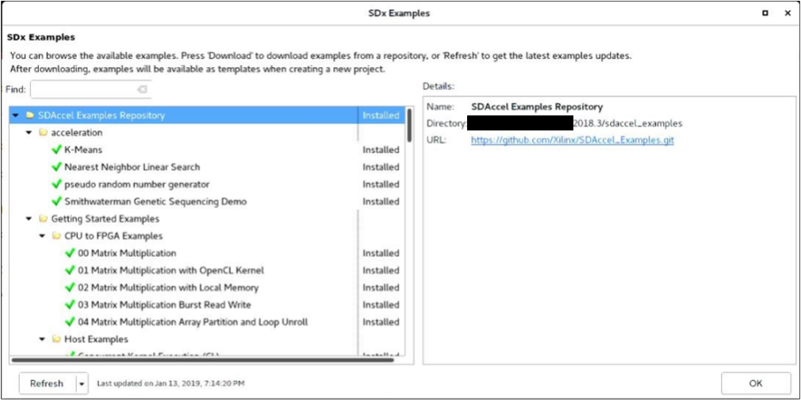

   [Templates] ページに SDAccel GitHub サンプルが表示されるようになります。  

10. [Find] フィールドに `hello` と入力し、[Host Examples] の下の [Hello World (HLS C/C++ Kernel)] を選択します。

11. **[Finish]** をクリックします。

    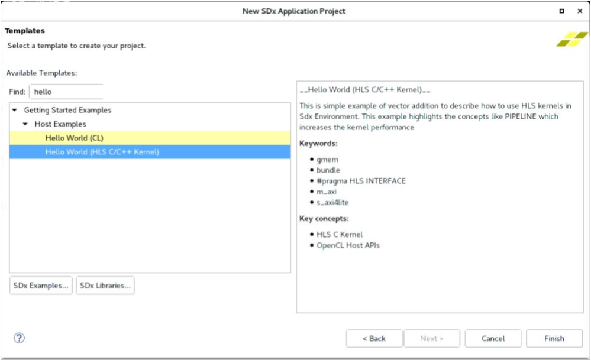

   helloworld プロジェクトが作成され、SDAccel 環境に表示されます。

   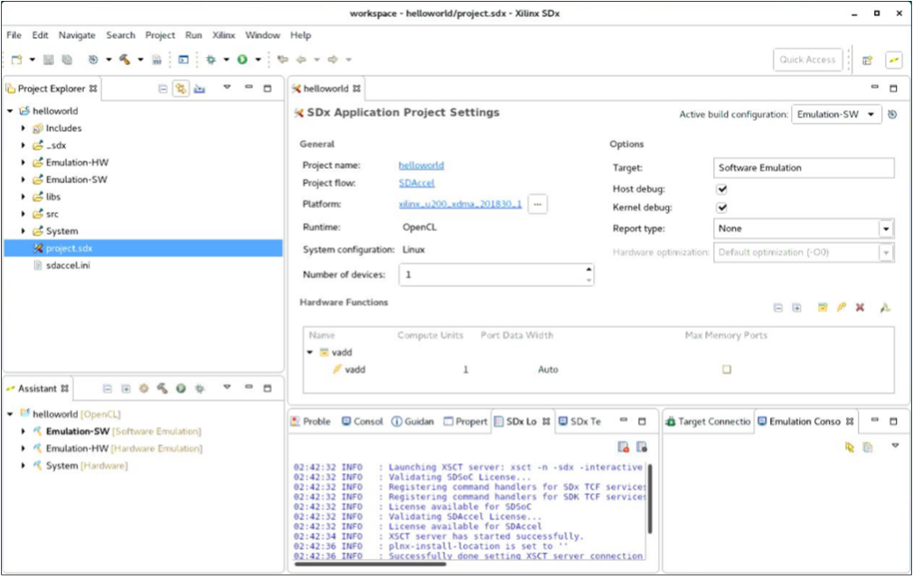

SDx IDE の機能の詳細は、『SDAccel 環境ユーザー ガイド』 ([UG1023](https://japan.xilinx.com/cgi-bin/docs/rdoc?v=2018.3;d=ug1023-sdaccel-user-guide.pdf)) を参照してください。

## 手順 2: ソフトウェア エミュレーションの実行

この手順では、次の順序でソフトウェア エミュレーションを実行する方法を説明します。

[Run Configuration] ダイアログ ボックスを設定
レポートを開く
デバッグを開始

デバッグの詳細は、『SDAccel 環境ユーザー ガイド』 ([UG1023](https://japan.xilinx.com/cgi-bin/docs/rdoc?v=2018.3;d=ug1023-sdaccel-user-guide.pdf)) を参照してください。

1. [Application Project Settings] の右上の **[Active build configuration]** を **[Emulation-SW]** に設定します。

   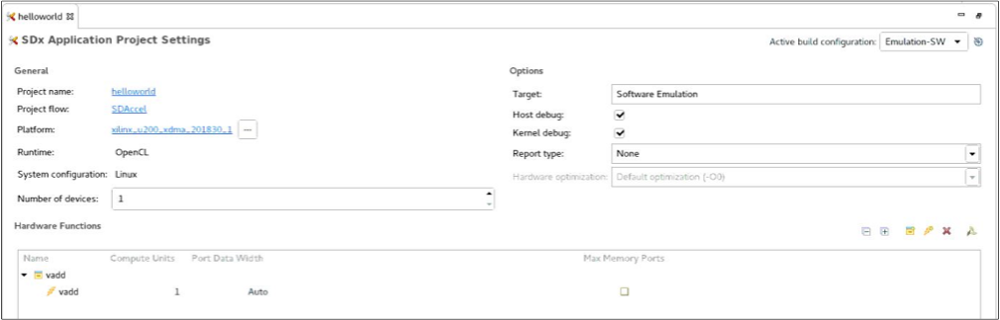

   GitHub サンプルにはこのデザイン用のアクセラレータが含まれるので、ハードウェア関数を追加する必要はありません。

   >**注記**: デザインにハードウェア関数を追加するには、 をクリックします。これにより C/C++ コードが解析され、アクセラレーションに使用可能な関数を判断できます。

2. ![[the Run ボタン]](./images/lvl1517357172451.png) (**Run**) をクリックしてソフトウェア エミュレーションを実行します。

   エミュレーション実行前にプロジェクトがビルドされます。

   >**注記**: ビルドおよびエミュレーション プロセスには数分以上かかることがあります。この間に、[Run Configurations] ダイアログ ボックスを開き、特定のコマンド ライン オプションを追加してビルドをカスタマイズする方法を説明します。

3. [Run] → **[Run Configurations]** をクリックします。

   [Arguments] タブの [Program arguments] フィールドには、XOCC (Xilinx OpenCL&trade; Compiler) コマンド ライン フラグおよびオプションを追加できます。コマンド オプションの詳細は、『SDx コマンドおよびユーティリティ リファレンス ガイド』 ([UG1279](https://japan.xilinx.com/cgi-bin/docs/rdoc?v=2018.3;d=ug1279-sdx-command-utility-reference-guide.pdf)) を参照してください。このチュートリアルでは、デザインを機能させるのにコマンド ライン引数は必要ありません。

   [Profile] タブには、[Generate timeline trace report] ドロップダウン リストがあります。オプションをクリックすると、生成されるレポートのタイプを確認できます。このタブには、[Enable Profiling] チェック ボックスもあります。

4. 何も変更せずウィンドウを閉じます。

   >** 注記:** [Run Configurations] ダイアログ ボックスの設定を変更した場合は、**[Run]** をクリックして、現在のエミュレーション段階を再実行して、変更を反映させます。

   [Console] ウィンドウに `TEST PASSED` と表示されます。

5. エミュレーションの実行終了したら、[Profile Summary] および [Application Timeline] レポートで最適化の詳細を確認できます。次の図に示すように、[Assistant] ビューで **[Profile Summary]** をダブルクリックします。

   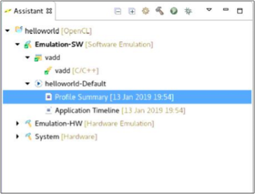

   デザインを最適化するのに使用可能な動作、実行時間、帯域幅などの有益なデータが表示されます。

   > **注記**: サマリの数値は、次の図とは異なる場合があります。

   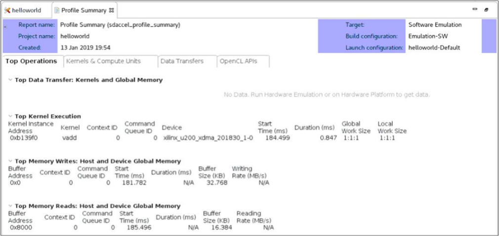

6. [Assistant] ビューに [Application Timeline] レポートを表示するには、**[Application Timeline]** をダブルクリックします。

   ホスト コードとカーネル コードの内訳とそれぞれの実行時間が表示されます。特定の部分を拡大するには、マウスを右へドラッグします。

   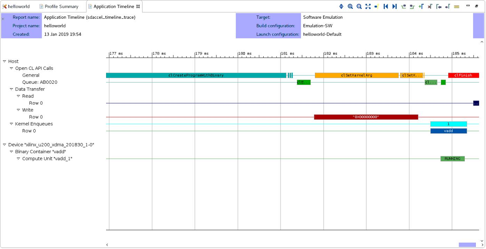  

   [Profile Summary] および [Application Timeline] には、ホスト コードとカーネル間の通信に関するデータと、カーネルの処理情報が含まれます。[Debug] 機能を使用すると、ホスト カーネルの処理をして問題を特定できます。

7. [Project Explorer] ビューで **host.cpp** (`src` ディレクトリの下) をダブルクリックして、ファイルをエディターで開きます。

8. デバッグを実行する前に、ブレークポイントを設定する必要があります。重要ポイントにブレークポイントを設定しておくと、問題が見つけやすくなります。カーネル デバッグの前にホスト コードを一時停止するには、`89 行目` (次の図の青い選択部分) の (`OCL_CHECK(err, err = q.enqueueMigrateMemObjects({buffer_in1, buffer_in2},0/* 0 means from host*/));`) を右クリックして **[Toggle Breakpoint]** をクリックします。

   

9. デバッグを実行するには、 をクリックします。

   パースペクティブを変更するかどうかを尋ねるダイアログ ボックスが表示されます。

10. **[Yes]** をクリックします。

    デフォルトでは、`main` の最初の行に自動ブレークポイントが挿入されます。次の図に示すように、[Run Configuration] ダイアログ ボックスの [Debugger] タブに `main` 関数で停止するオプションがあります。これは、問題のある関数をさらに詳細にデバッグする場合に便利な機能です。

11. (オプション) Eclipse デバッグを使用すると、ホストおよびカーネル コードを詳細に検証できます。デバッグをステップ実行するための制御コマンドは、[Run] メニューおよびメイン ツールバーにあります。

12. 次のブレークポイントまで再開します。
    1. **F8** キーを押します。
    2. **[Run]** → **[Resume]** をクリックします。

       

13. デバッグを再開すると、SDx ツールでカーネル コード用に別の gdb インスタンスがツール起動します。これにも関数の始めにブレークポイントが設定されています。

    このブレークポイントを使用すると、カーネルが詳細に解析され、データがどのように関数に読み込まれてメモリに書き込まれるのかがわかります。カーネル実行が gdb で終了すると、そのインスタンスが終了し、main デバッグ スレッドに戻ります。

14. **F8** キーを押して続行します。

    >**注記:** [Console] ビューにはまだカーネル デバッグ出力が表示されています。 をクリックして vadd.exe コンソールに戻り、ホスト コードからの出力を確認します。

15. [Debug] パースペクティブは、次のいずれかの方法で閉じることができます。

    * ウィンドウ右上の  (Debug) を右クリックして、**[Close]** をクリックします。
    *  (SDx) をクリックして、標準の [SDx] パースペクティブに切り替えます。

16. 標準の [SDx] パースペクティブに戻ったら、中央にあるプロジェクト エディター ウィンドウの [Application Project Settings] 以外のすべてのタブを閉じます。

## 手順 4: ハードウェア エミュレーションの実行

この手順では、ハードウェア エミュレーション機能を実行する方法と、基本的なプロファイリングとレポートについて説明します。

[Emulation-SW] と [Emulation-HW] の主な違いは、ハードウェア エミュレーションではカーネル コードの RTL が合成され、プラットフォームのものにより近いデザインをビルドできる点です。より正確な帯域幅、スループット、実行時間などに関するデータが使用されます。このため、デザインのコンパイルに時間がかかります。

1. ハードウェア エミュレーションを実行するには、[SDx Application Settings] で **[Active build configuration]** を [Emulation-HW] に設定し、**[Run]** をクリックします。これには、少し時間がかかります。

2. [Assistant] ビューの [Emulation-HW] の下の [System Estimate] レポートをダブルクリックして開きます。このテキスト レポートには、カーネル情報、デザインに関するタイミング、クロック サイクル、デバイスで使用されるエリアなどの情報が示されます。

   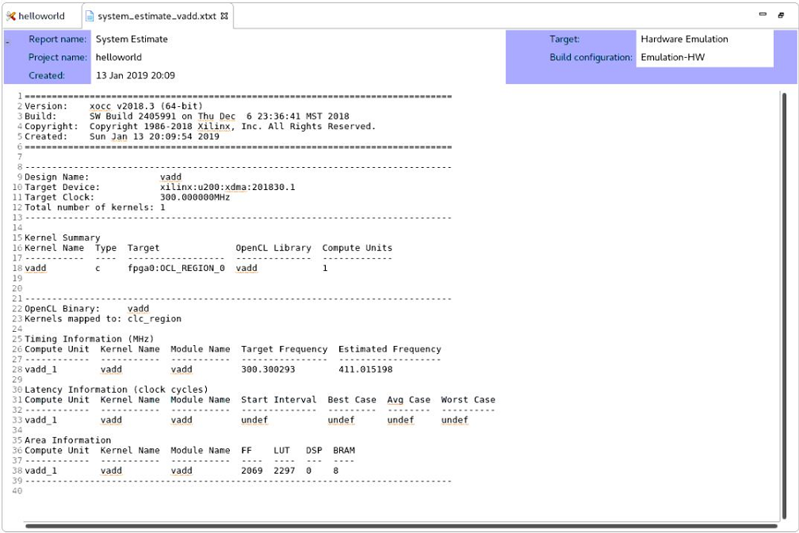

3. [Reports] ビューで [Profile Summary] をダブルクリックして開きます。このレポートには、カーネル動作、データ転送、OpenCL API 呼び出しに関する詳細情報のほか、リソース使用量に関するプロファイル情報、カーネル/ホスト間のデータ転送などに関する詳細な情報が示されます。

   >** 注記:** [Hardware Emulation] で使用されるシミュレーション モデルは概算です。表示されるプロファイルの数値はあくまで見積もりであり、実際のハードウェアの結果とは異なる可能性があります。

   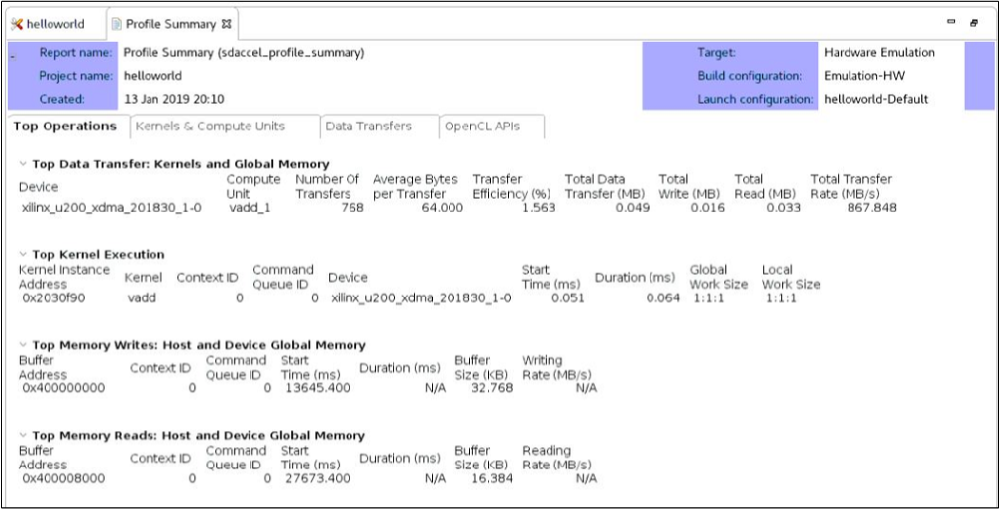

   [Console] ビューの横に [Guidance] というビューがあります。このビューには、満たされなかったチェックに対してカーネルの最適化方法に関する情報が含まれます。

   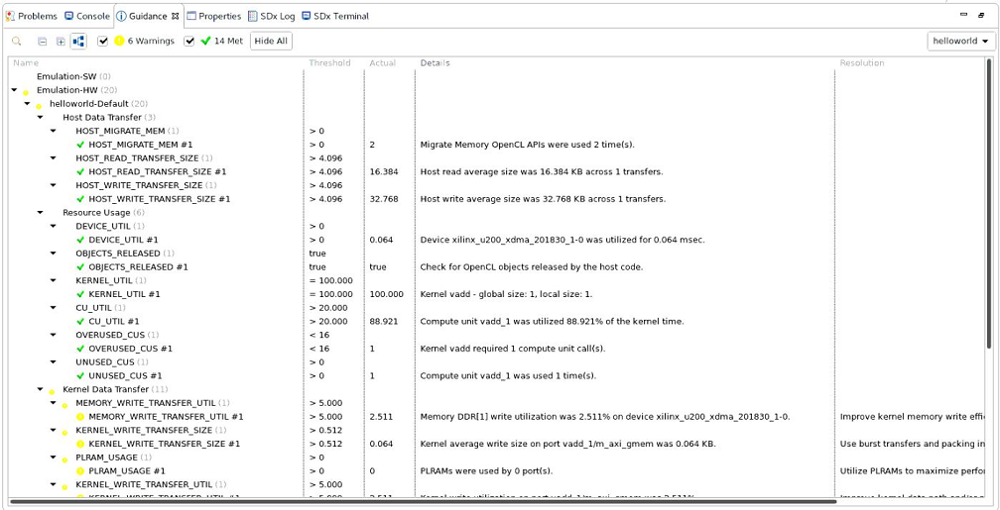

   >** 注記:** その他のパフォーマンス最適化手法および設計手法は、『SDAccel 環境プロファイリングおよび最適化ガイド』 ([UG1207](https://japan.xilinx.com/cgi-bin/docs/rdoc?v=2018.3;d=ug1207-sdaccel-optimization-guide.pdf)) を参照してください。

4. [Reports] ビューで [Application Timeline] レポートをダブルクリックして開きます。このレポートは、ホストおよびカーネルがタスクを終了するのにかかる見積もり時間と、どこがボトルネックなのかを詳細に示します。マーカーを追加、拡大/縮小、信号を展開すると、ボトルネックを見つけるのに役立ちます。

     

5. HLS レポートを開くには、[Emulation-HW] タブを展開してカーネルのタブを展開します。

   このレポートには、Vivado® HLS からのカーネル変換および合成に関する詳細な情報が表示されます。レポートの下のタブには、カーネルで最も時間がかかった場所とその他のパフォーマンスに関するデータが表示されます。レイテンシおよびクロック周期を含めたパフォーマンス データもこのレポートに表示されます。

   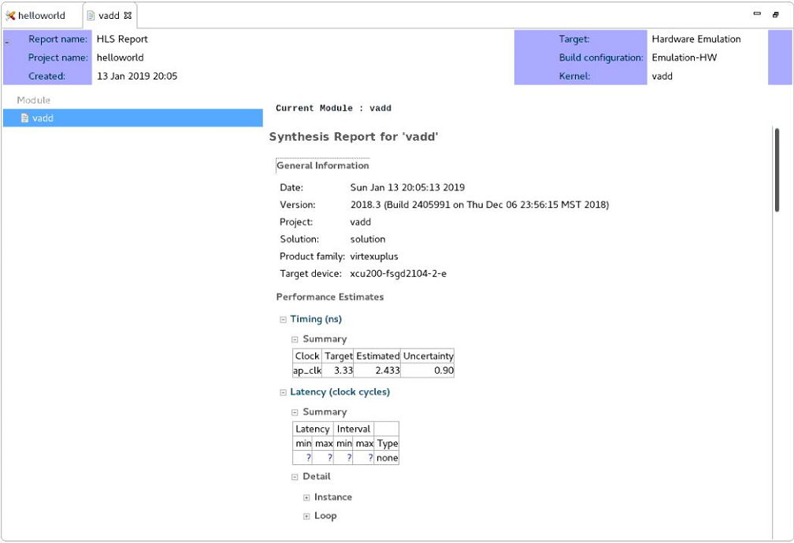  

## 手順 5: makefile フローの使用

この手順では、基本的な makefile フローと SDx™ IDE での使用方法について説明します。このフローを使用する利点は、次のとおりです。

* システムに簡単にオートメーションを導入
* デザインを少し変更した場合の処理時間の短縮

1. [Project Explorer] ビューの [Emulation-SW] ディレクトリで makefile ファイルを見つけます。
2. ファイルをダブルクリックして、エディターに表示します。この makefile は SDx IDE で作成され、エミュレーションをビルドして実行するのに使用されます。または、`Emulation-HW` ディレクトリで makefile ファイルを見つけます。

   ビルドごとに makefile があります。エディター ウィンドウで開いている makefile の 21 行目で、`hw_emu` または `sw_emu` がターゲットとして指定されています。

   >**ヒント**: SDx IDE で生成された makefile を使用して、GUI の外でプロジェクトをビルドすることもできます。

3. 新しいターミナル セッションを開いて、ワークスペースに移動します。

4. Emulation-SW ディレクトリに移動して、`make incremental` と入力します。

   これにより、典型的な SDx のログ出力が生成されます。

   >** 注記:** ホストまたはカーネル コードが変更されていない場合は、コンパイルは既に完了しているので何も実行されません。この場合、次のようなメッセージが表示されることがあります。  
   >
   >_make: Nothing to be done for `incremental`._

[演習 2: SDAccel makefile の概要](./lab-2-introduction-to-the-sdaccel-makefile.md)で、makefile の使用方法とコマンド ライン フローをさらに詳細に説明します。

## まとめ

このチュートリアルを終了すると、次ができるようになります。

* GitHub サンプル デザインから SDAccel 環境プロジェクトを作成。
* デザインのバイナリ コンテナーとアクセラレータを作成。
* ソフトウェア エミュレーションを実行し、ホストおよびカーネル コードでデバッグ環境を使用。
* ハードウェア エミュレーションを実行し、レポートを使用して可能な最適化を判別。
* ソフトウェア エミュレーションとハードウェア エミュレーション レポートの違いを理解。
* プロジェクトの makefile を読み込んで、makefile コマンド ラインを実行。

## 演習 2: SDAccel makefile の概要

[演習 2: SDAccel makefile の概要](./lab-2-introduction-to-the-sdaccel-makefile.md)で、makefile の使用方法とコマンド ライン フローをさらに詳細に説明します。

Copyright&copy; 2019 Xilinx

