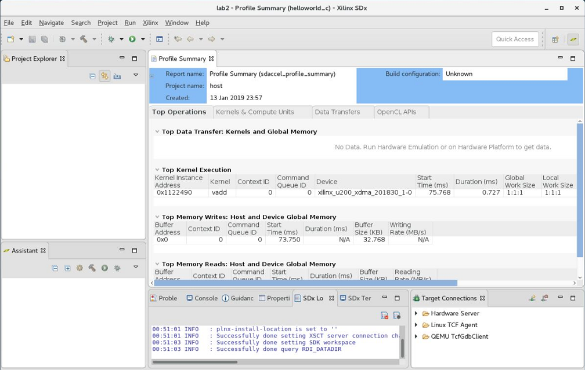
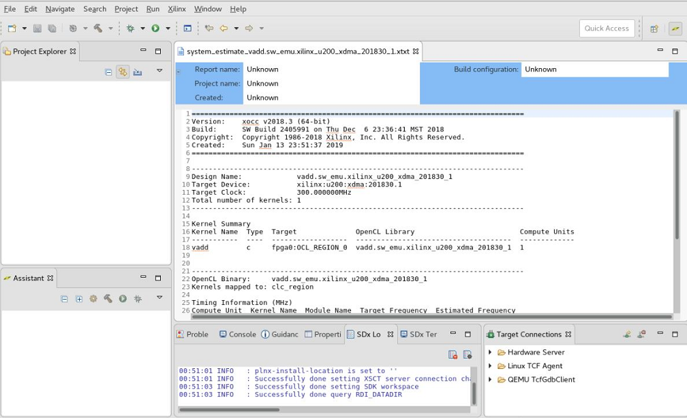
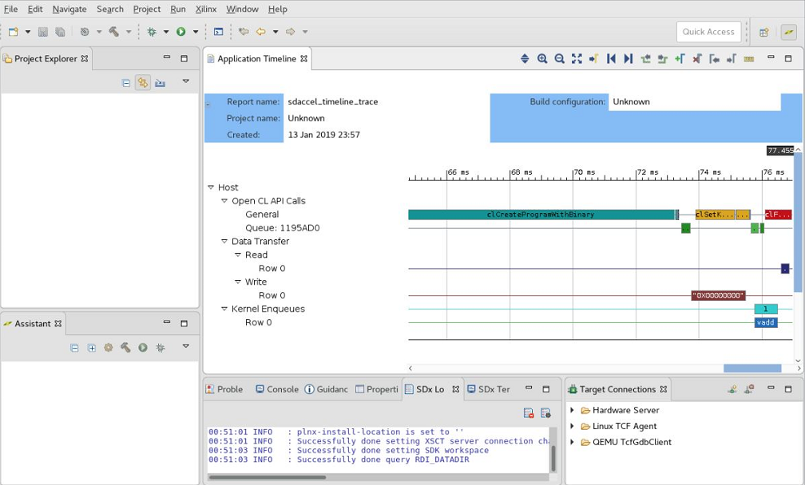
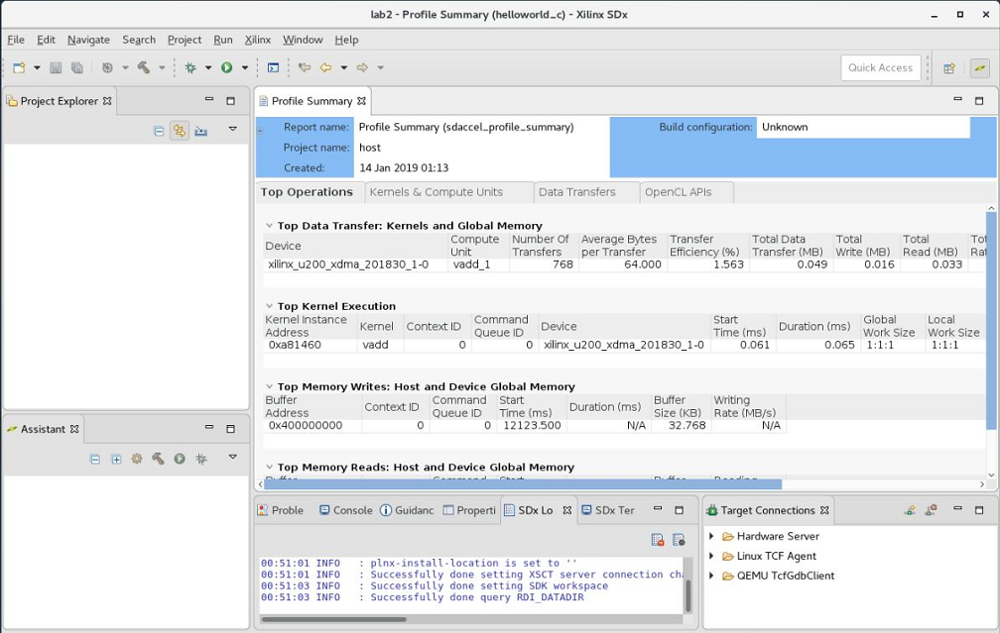

<table style="width:100%">
  <tr>
    <td align="center" width="100%" colspan="6"><h1>2018.3 SDAccel™ 開発環境チュートリアル</h1>
    <a href="https://github.com/Xilinx/SDAccel-Tutorials/branches/all">ほかのバージョンを参照</a>
</td>
  </tr>
  <tr>
    <td align="center"><a href="README.md">はじめに</td>
    <td align="center"><a href="lab-1-introduction-to-the-sdaccel-gui.md">演習 1: SDAccel 開発環境の概要</td>
    <td align="center">演習 2: SDAccel makefile の概要</a></td>
  </tr>
</table>

# 演習 2: SDAccel makefile の概要

この演習では、[ザイリンクス GitHub リポジトリ](https://github.com/Xilinx/SDAccel_Examples)からの SDAccel™ サンプル デザインを使用します。

## 手順 1: SDAccel 環境の準備と設定

この手順では、SDx™ 環境をコマンド ラインで実行できるように設定し、SDAccel の GitHub リポジトリをクローンします。

1. ターミナル ウィンドウを起動し、次のいずれかのコマンドを使用して SDx 環境にある設定スクリプトを読み込みます。

   ```c
   source <SDx_install_location>/<version>/settings64.csh
   ```

   ```c
   source <SDx_install_location>/<version>/settings64.sh
   ```

   これにより、GUI を使用しなくても SDx コマンド ラインを実行できるようになります。

   演習 1 で説明されているように SDx IDE で SDAccel サンプルをダウンロードした場合は、その場所からファイルにアクセスできます。Linux の場合、ファイルは `/home/<user>/.Xilinx/SDx/<version>/sdaccel_examples/` にダウンロードされます。ファイルをワークスペースにダウンロードするには、次のコマンドを使用します。

   ```
   git clone https://github.com/Xilinx/SDAccel_Examples <workspace>/examples
   ```

   >** 注記:** この GitHub リポジトリの容量は約 400 MB です。ローカルまたはリモート ディスクに十分な容量があるかどうかを確認してください。

2. ダウンロードが完了したら、次のコマンドを使用して SDAccel サンプルの `vadd` ディレクトリに移動します。

   ```C
   cd <workspace>/examples/getting_started/host/helloworld_c
   ```

   このディレクトリで `ls` コマンドを実行し、ファイルを確認します。

   ```C
   [sdaccel@localhost helloworld_c]$ ls
   Makefile    README.md    description.json src utils.mk
   ```

   `src` ディレクトリで `ls` を実行した場合は、次のように表示されます。

   ```C
   [sdaccel@localhost helloworld_c]$ ls src
   host.cpp    vadd.cpp
   ```

## 手順 2: 初期デザインおよび makefile の確認

`helloworld_c` ディレクトリには makefile ファイルが含まれます。makefile は次を実行するために使用します。

* ハードウェアおよびソフトウェア エミュレーションの両方でデザインをコンパイル
* システム実行を生成

1. テキスト エディターで makefile を開きます。

2. 内容を確認し、使用されている bash 形式の構文など、どのように記述されているかを見てみます。

   >** 注記**: このファイル自体は、すべての GitHub サンプル デザインで使用される汎用 makefile を参照しています。

   最初の数行には、すべてのサンプルで使用されるほかの汎用 makefile の `include` 文が含まれます。

   ```c
   COMMON_REPO = ../../../
   ABS_COMMON_REPO = $(shell readlink -f $(COMMON_REPO))

   include ./utils.mk
   ```

3. 22 行目までスクロールダウンします。

   ```c
   TARGETS:=hw
   ```

   `TARGETS` はデフォルト ビルド (makefile コマンド ラインで指定しない場合) を定義します。デフォルトでは、`hw` (システム ビルド) に設定されています。ユーザー デザインでは、必要な値を設定してください。

4. `./utils.mk` を開きます。この makefile には、ホストおよびソース コードをビルドするのに必要なオプションおよびコマンド ライン コンパイラ情報が含まれます。

   ```c
   # By Default report is set to none, no report will be generated  
   # 'estimate' for estimate report generation  
   # 'system' for system report generation  
   REPORT:=none
   PROFILE ?= no
   DEBUG ?=no

   ifneq ($(REPORT),none)  
   CLFLAGS += --report $(REPORT)  
   endif

   ifeq ($(PROFILE),yes)
   CLFLAGS += --profile_kernel data:all:all:all
   endif

   ifeq ($(DEBUG),yes)
   CLFLAGS += --dk protocol:all:all:all
   endif
   ```

   >**注記**: `REPORT`、`PROFILE`、および `DEBUG` は、`make` コマンドの入力オプション (パラメーター) です。`CLFLAGS` は使用される `xocc` コマンド ライン オプションをリストします。

5. `utils.mk` ファイルを閉じて、makefile を再度確認します。

6. 44 行目以降を確認します。src ディレクトリにあるものが処理され、カーネルおよびアプリケーション実行ファイルが指定されています。

## 手順 3: ソフトウェア エミュレーションの実行

ここまでで makefile の構成部分を理解したので、次にソフトウェア エミュレーションを実行するコードをコンパイルします。

1. 次のコマンドを実行して、ソフトウェア エミュレーション用にアプリケーションをコンパイルします。

   ```C
   make all REPORT=estimate TARGETS=sw_emu DEVICES=xilinx_u200_xdma_201830_1`
   ```

   次の 4 つのファイルが生成されます。

   * host (ホスト実行ファイル)
   * `xclbin/vadd.sw_emu.xilinx_u200_xdma_201830_1.xclbin` (バイナリ コンテナー)
   * システム見積もりレポート
   * `emconfig.json`

2. これらのファイルが生成されていることを確認するため、ディレクトリで `ls` コマンドを実行すると、

   次のように表示されます。

   ```C
   [sdaccel@localhost helloworld_c]$ ls
   description.json
   Makefile
   README.md
   src
   host
   _x  this directory contains the logs and reports from the build process.
   xclbin
   [sdaccel@localhost helloworld_c]$ ls xclbin/
   vadd.sw_emu.xilinx_u200_xdma_201830_1.xclbin
   vadd.sw_emu.xilinx_u200_xdma_201830_1.xo
   xilinx_u200_xdma_201830_1 this folder contains the emconfig.json file
   ```

3. 次のコマンドを実行して、アプリケーションのエミュレーションを実行します。

   ```C
   make check PROFILE=yes TARGETS=sw_emu DEVICES=xilinx_u200_xdma_201830_1
   ```

   >**注記**: 指定されている `DEVICES` が「初期デザインおよび makefile の確認」セクションのコンパイルに使用されたものと同じであることを確認してください。

   このフローでは、前のコマンドとアプリケーションが実行されます。

   アプリケーションの実行に問題がない場合は、ターミナルに次のメッセージが表示されます。

   ```C
   [sdaccel@localhost helloworld_c]$ make check TARGETS=sw_emu DEVICES=xilinx_u200_xdma_201830_1
   cp -rf ./xclbin/xilinx_u200_xdma_201830_1/emconfig.json .
   XCL_EMULATION_MODE=sw_emu ./host
   Found Platform
   Platform Name: Xilinx
   XCLBIN File Name: vadd
   INFO: Importing xclbin/vadd.sw_emu.xilinx_u200_xdma_201830_1.xclbin
   Loading: 'xclbin/vadd.sw_emu.xilinx_u200_xdma_201830_1.xclbin'
   TEST PASSED
   sdx_analyze profile -i sdaccel_profile_summary.csv -f html
   INFO: Tool Version : 2018.3
   INFO: Done writing sdaccel_profile_summary.html
   ```

   追加レポートを生成するには、次のいずれかを実行します。

   * 環境変数を設定
   * 適切な情報とパーミッションを含む `sdaccel.ini` というファイルを作成

## 手順 4: 追加レポートの生成

このチュートリアルでは、`helloworld_c` ディレクトリに `sdaccel.ini` ファイルを作成して、次の内容を追加します。

```C
[Debug]
timeline_trace = true
profile = true
```

1. 次のコマンドを実行します。

   ```C
   make check PROFILE=yes TARGETS=sw_emu DEVICES=xilinx_u200_xdma_201830_1
   ```

   アプリケーションの実行が終了すると、`sdaccel_timeline_trace.csv` というタイムライン トレース ファイルも作成されます。

2. このトレース レポートを GUI で確認するには、次のコマンドを使用して CSV ファイルを WDB ファイルに変換します。

   ```C
   sdx_analyze trace sdaccel_timeline_trace.csv
   ```

   アプリケーションで `sdaccel_profile_summary` という CSV 形式のプロファイリング サマリ レポートが生成されます。

3. このレポートを SDx IDE で確認するには、`sdaccel_timeline_trace.csv` を「演習 1: プロファイル サマリ」のレポート タイプに変換します。次のコマンドを実行します。

   ```C
   sdx_analyze profile sdaccel_profile_summary.csv
   ```

   これにより、`sdaccel_profile_summary.xprf` ファイルが生成されます。

4. このレポートを表示するには、**[File]** → **[Open File]** をクリックして、ファイルを選択します。

   次の図に、レポートが表示されたところを示します。

   

   >** 注記:** これらのレポートを表示するのに、演習 1 で使用したワークスペースを使用する必要はありません。次のコマンドを使用すると、これらのレポートを表示するためのワークスペースをローカルに作成できます。
   >```C
   >sdx -workspace ./lab2
   >```
   >
   > レポートを表示するために、[Welcome] ウィンドウを閉じる必要があることもあります。
   >
   ソフトウェア エミュレーションではプロファイル情報すべてが含まれるわけではなく、カーネルとグローバル メモリ間のデータ転送に関する情報などは含まれません。この情報は、ハードウェア エミュレーションおよびシステムにのみ含まれます。

   システム見積もりレポート (`system_estimate.xtxt`) も生成されます。これは `xocc` コマンドで `--report` オプションを指定してコンパイルすると生成されます。

   

5. **[File]** → **[Open File]** をクリックし、`sdaccel_timeline_trace.wdb` ファイルを指定して、次のレポートを開きます。

   

## ハードウェア エミュレーションの実行

1. ソフトウェア エミュレーションが終了したら、ハードウェア シミュレーションを実行できます。makefile を変更せずにこれを実行するには、次のコマンドを実行します。

   ```C
   make all REPORT=estimate TARGETS=hw_emu DEVICES=xilinx_u200_xdma_201830_1
   ```

   `TARGETS` をこのように定義すると、その値が渡されて、makefile で設定されているデフォルトが上書きされます。

   >** 注記:** ハードウェア エミュレーションには、ソフトウェア エミュレーションよりも時間がかかります。

2. コンパイルされたホスト アプリケーションを再実行します。

   ```C
   make check TARGETS=hw_emu DEVICES=xilinx_u200_xdma_201830_1
   ```

   >** 注記:** makefile で環境変数が `hw_emu` に設定されます。
   >
   >デバイス情報は変更していないので `emconfig.json` を生成し直す必要はありませんが、エミュレーションをハードウェア エミュレーションに設定する必要があります。

   出力は、次に示すようにソフトウェア エミュレーションの出力のようになります。

   ```C
   [sdaccel@localhost helloworld_c]$ make check TARGETS=hw_emu DEVICES=xilinx_u200_xdma_201830_1
   cp -rf ./xclbin/xilinx_u200_xdma_201830_1/emconfig.json .
   XCL_EMULATION_MODE=hw_emu ./host
   Found Platform
   Platform Name: Xilinx
   XCLBIN File Name: vadd
   INFO: Importing xclbin/vadd.hw_emu.xilinx_u200_xdma_201830_1.xclbin
   Loading: 'xclbin/vadd.hw_emu.xilinx_u200_xdma_201830_1.xclbin'
   INFO: [SDx-EM 01] Hardware emulation runs simulation underneath.Using a large data set will result in long simulation times.It is recommended that a small dataset is used for faster execution.This flow does not use cycle accurate models and hence the performance data generated is approximate.
   TEST PASSED
   INFO: [SDx-EM 22] [Wall clock time: 00:10, Emulation time: 0.109454 ms] Data transfer between kernel(s) and global memory(s)
   vadd_1:m_axi_gmem-DDR[1]          RD = 32.000 KB              WR = 16.000 KB       

   sdx_analyze profile -i sdaccel_profile_summary.csv -f html
   INFO: Tool Version : 2018.3
   Running SDx Rule Check Server on port:40213
   INFO: Done writing sdaccel_profile_summary.html
   ```

3. プロファイル サマリとタイムライン トレースを表示するには、SDx IDE で表示できるように変換してから、そのアップデートされた情報を表示する必要があります。次のコマンドを使用します。

   ```C
   sdx_analyze profile sdaccel_profile_summary.csv
   sdx_analyze trace sdaccel_timeline_trace.csv
   ```

   次の図のように、プロファイル サマリが表示されます。

   

## システム実行

1. 次のコマンドを実行し、システム実行用にコンパイルします。

   ```C
   make all TARGETS=hw DEVICES=xilinx_u200_xdma_201830_1
   ```

   >** 注記:** システムのビルドには、コンピューターのリソースによって時間がかかることがあります。

2. デザインを U200 アクセラレーション カードで実行するには、『Alveo データセンター アクセラレータ カード入門』 ([UG1301](https://japan.xilinx.com/support/documentation/boards_and_kits/accelerator-cards/j_ug1301-getting-started-guide-alveo-accelerator-cards.pdf)) に示すように、ボードと運用ソフトウェアをインストールする必要があります。

3. カードが問題なくインストールされて検証されたら、次のコマンドでアプリケーションを実行します。

   ```C
   make check TARGETS=hw DEVICES=xilinx_u200_xdma_201830_1
   ```

4. システム実行が終了したら、次のコマンドを使用して、プロファイル サマリとタイムライン トレースを SDx で読み込むことができるファイルに変換します。

   ```C
   sdx_analyze profile sdaccel_profile_summary.csv
   sdx_analyze trace sdaccel_timeline_trace.csv
   ```

## まとめ

このチュートリアルを終了すると、次ができるようになります。

* SDx 環境を設定し、すべてのコマンドをターミナルで実行。
* GitHub リポジトリをクローン。
* xcpp、xocc、emconfigutil、sdx_analyze profile、sdx_analyze trace コマンドを実行してアプリケーション、バイナリ コンテナー、エミュレーション モデルを生成。
* makefile を記述して OpenCL™ カーネルおよびホスト コードをコンパイル。
* エミュレーションから生成したファイルをテキスト エディターまたは SDx IDE で表示。
* 環境を設定し、デザインをプラットフォームで使用されるように運用。

<hr/>
<p align="center"><sup>Copyright&copy; 2019 Xilinx</sup></p>
