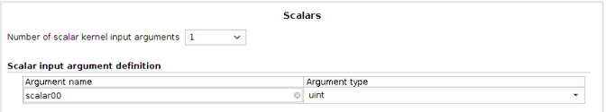
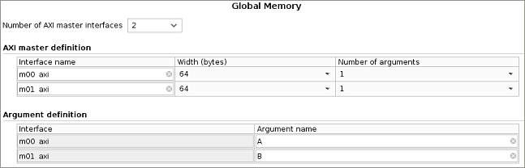
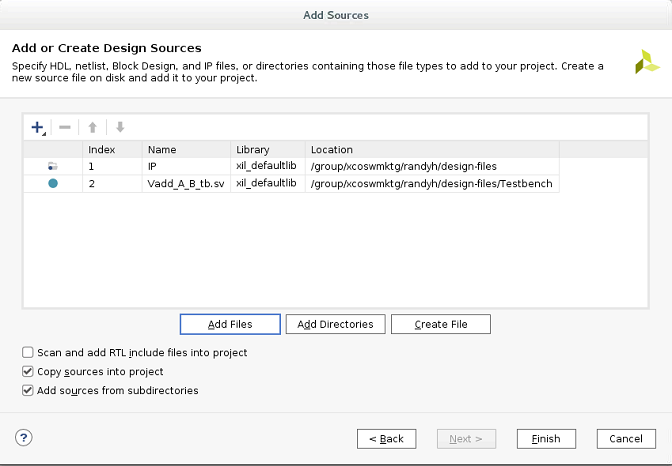
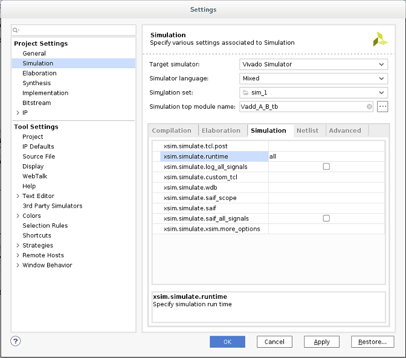

<p align="right">
別の言語で表示: <a href="../../../README.md">English</a>          
</p>

<table>
 <tr>
   <td align="center"><h1>2018.3 SDAccel™ 開発環境チュートリアル</h1>
   <a href="https://github.com/Xilinx/SDAccel-Tutorials/branches/all">ほかのバージョンを参照</a>
   </td>
 </tr>
 <tr>
 <td align="center"><h1>RTL カーネル入門</h1>
 </td>
 </tr>
</table>

# 概要

このチュートリアルでは、SDAccel 環境を使用して RTL カーネルを FPGA にプログラムし、よく使用される開発フローでハードウェア エミュレーションをビルドする方法について説明します。

1. Vivado™ Design Suite IP として RTL ブロックをパッケージ。
2. カーネル記述 XML ファイルを作成。
3. RTL カーネルをザイリンクス オブジェクト (`.xo`) ファイルにパッケージ。
4. SDAccel を使用して RTL カーネルを FPGA にプログラムし、ハードウェアまたはハードウェア エミュレーションで実行。

# チュートリアルの概要

特定のソフトウェアおよびハードウェア インターフェイス要件に従った RTL デザインは、ザイリンクス オブジェクト (`.xo`) ファイルにパッケージできます。このファイルをバイナリ コンテナーにリンクすると、ホスト アプリケーションがカーネルを FPGA にプログラムする際に使用する `xclbin` ファイルを作成できます。

このチュートリアルには、次のリファレンスファイルが含まれます。
- `B[i] = A[i]+B[i]` 演算を実行する単純なベクター累算の例。
- ホストと FPGA 間のデータ転送のために、ダブル データ レート (DDR) メモリに読み出しおよび書き込みバッファーを作成するホスト アプリケーション。
  - ホストは RTL カーネルをエンキューします (FPGA で実行)。具体的には、DDR のバッファーが読み込まれ、`B[i] = A[i]+B[i]` が実行され、結果が DDR に書き戻されます。
  - ホストがデータを読み戻して、結果を比較します。

これらのリファレンス ファイルを使用して、SDx™ プロジェクトを作成する最初の手順から、プロジェクトをビルドして実行する最後の手順まで説明します。

# RTL デザインを RTL カーネルとして使用するための要件

SDAccel 環境フレームワーク内で RTL カーネルを使用するには、SDAccel カーネル実行モデルの要件とハードウェア インターフェイス要件の両方を満たす必要があります。

## カーネルの実行モデル

RTL カーネルは、C/C++ カーネルと同じソフトウェア インターフェイスおよび実行モデルを使用します。RTL カーネルは、ホスト アプリケーションでは void 戻り値、スカラー引数、およびポインター引数を持つ関数として認識されます。次はその例です。

```C
void vadd_A_B(int *a, int *b, int scalar)
```

この例からは、RTL カーネルの実行モデルがソフトウェア関数のものと類似していることがわかります。
- 呼び出されたときに開始。
- 必要な結果を処理。
- 処理が終了したら、通知を送信。

さらに詳細に説明すると、SDAccel 実行モデルは、次の機能および条件に従っている必要があります。
- スカラー引数は AXI4-Lite スレーブ インターフェイスを介してカーネルに渡されます。
- ポインター引数はグローバル メモリ (DDR または PLRAM) を介して転送されます。
- ポインター引数のベース アドレスは、その AXI4-Lite スレーブ インターフェイスを介してカーネルに渡されます。
- カーネルは 1 つまたは複数の AXI4 メモリ マップド インターフェイスを介して、グローバル メモリ内のポインター引数にアクセスします。
- カーネルは AXI4-Lite インターフェイスを介してホスト アプリケーションにより開始されます。
- カーネルは演算が終了したら、AXI4-Lite インターフェイスまたは特別な割り込み信号を介してホスト アプリケーションに通知する必要があります。

## ハードウェア インターフェイス要件

この実行モデルを使用するには、カーネルが特定のハードウェア インターフェイス要件を満たしている必要があります。

- プログラマブル レジスタ (制御レジスタ、スカラー引数およびポインターのベース アドレス) へのアクセスに使用するインターフェイスは AXI4-Lite スレーブ インターフェイス 1 つのみ。
  - オフセット `0x00` - 制御レジスタ - カーネル ステータスを制御および表示。
    - ビット `0`: **start 信号** — カーネルがデータ処理を開始できるようになるとホスト アプリケーションによりアサート。**done** 信号がアサートされるとクリアされる必要あり。
    - ビット `1`: **done 信号** — 演算を終了したらアサート。読み出しでクリア。
    - ビット `2`: **idle 信号** — どのデータも処理されていない場合にアサート。**done** 信号がアサートされるのと同時に Low から High に遷移。    
  - オフセット `0x04`- グローバル割り込みイネーブル レジスタ - ホストへの割り込みをイネーブルにするために使用   
  - オフセット `0x08`- IP 割り込みイネーブル レジスタ - 割り込みを生成するのに使用する IP 生成信号を制御
  - オフセット `0x0C`- IP 割り込みステータス レジスタ - 割り込みステータスを提供
  - オフセット `0x10` およびそれ以上 - カーネル引数レジスタ - スカラー パラメーターおよびポインターのベース パラメーター用のレジスタ

- 次のインターフェイスの 1 つまたは複数:
  - グローバル メモリとの通信用の AXI4 マスター メモリ マップド インターフェイス。
    - AXI4 マスター インターフェイスにはすべて 64 ビット アドレスが必要です。
    - グローバル メモリ空間の分割はカーネル開発者が実行します。グローバル メモリの各パーティションがカーネル引数になります。各パーティションのベース アドレス (メモリ オフセット) は、AXI4-Lite スレーブ インターフェイスを介してプログラム可能な制御レジスタにより設定されます。
    - AXI4 マスターには WRAP または FIXED タイプのバースト、またはサイズが満たない (サブサイズ) バーストは使用できませんので、AxSIZE は AXI データ バスの幅と同じである必要があります。
    - 上記の要件を満たさないユーザー ロジックまたは RTL コードは、ラップしておくかブリッジさせておく必要があります。
  - その他のカーネルとの通信用の AXI4-Stream インターフェイス。

変更前の RTL デザインに別の実行モデルまたはハードウェア インターフェイスがある場合、デザインがこの方法で実行できて、インターフェイス要件に従うように、ロジックを追加する必要があります。

### 追加情報

SDAccel 環境カーネルのインターフェイス要件の詳細は、『SDAccel 環境ユーザー ガイド』 ([UG1023](https://japan.xilinx.com/cgi-bin/docs/rdoc?v=2018.3;d=ug1023-sdaccel-user-guide.pdf)) の[RTL カーネルとして RTL デザインを使用するための要件](https://japan.xilinx.com/html_docs/xilinx2018_3/sdaccel_doc/creating-rtl-kernels-qnk1504034323350.html#qbh1504034323531)を参照してください。

## Vector-Accumulate RTL IP

`B[i]=A[i]+B[i]` を実行する Vector-Accumulate RTL IP は、上記の要件すべてを満たしているほか、次のような特性を持っています。

- 2 つの AXI4 メモリ マップド インターフェイス:
  - A を読み出すインターフェイス
  - B を読み出して書き込むインターフェイス
  - このデザインで使用される AXI4 マスターは WRAP、FIXED、または NARROW バースト タイプを使用しません。
- 1 つの AXI4-Lite スレーブ制御インターフェイス:
  - 制御レジスタはオフセット 0x00
  - カーネル引数レジスタをオフセット 0x10 にすると、ホストがスカラー値をカーネルに渡すことができます。
  - カーネル引数レジスタをオフセット 0x18 にすると、ホストがグローバル メモリの A のベース アドレスをカーネルに渡すことができます。
  - カーネル引数レジスタをオフセット 0x1C にすると、ホストがグローバル メモリの B のベース アドレスをカーネルに渡すことができます。

これらは RTL カーネル ウィザードへの入力に使用されます。RTL カーネル ウィザードはこの情報を使用して次を生成します。
- RTL デザインを SDAccel カーネルの `.xo` ファイルとしてパッケージするのに必要な XML ファイル
- A[i] = A[i] + 1 を実行するサンプル カーネル (RTL コード、テストベンチ、およびホスト コード)
- カーネル用の Vivado プロジェクト

チュートリアルの後半部分では、このサンプル カーネルを既存の Vector-Accumulate デザインに置き換えて、`.xo` ファイルとしてパッケージします。

# SDx プロジェクトの作成

1. Linux のターミナル ウィンドウで `sdx` コマンドを使用して SDx 開発環境を起動します。  
[Workspace Launcher] ダイアログ ボックスが表示されます。  
  

2. ワークスペースのディレクトリを選択します。このディレクトリにプロジェクトが含まれるようになります。  

3. **[Launch]** をクリックします。  
[Welcome] ウィンドウが表示されます。  
  
>**注記**: [Welcome] ウィンドウは、ツールを初めて起動した場合に表示されます。**[Help]** → **[Welcome]** をクリックして開くこともできます。

4. [Welcome] ウィンドウで **[Create Application Project]** をクリックします。  
[New SDx Application Project] ウィンドウが開きます。  


5. 新規 SDx プロジェクトを作成します。  
   1. プロジェクト名を入力します。  
   2. **[Use default location]** をオンにします。  
   3. **[Next]** をクリックします。  
  [Platform] ページが表示されます。  


6. `xilinx_u200_xdma_201830_1` を選んで、**[Next]** をクリックします。  
[Templates] ページが開き、SDAccel プロジェクトの作成に使用可能なテンプレートがリストされます。ほかの SDx サンプルをダウンロードしていない場合は、[Empty Application] と [Vector Addition] のみが使用可能なテンプレートとして表示されます。  


   選択したプラットフォームによって、プロジェクトが SDAccel プロジェクトになるか SDSoC™ プロジェクトになるかが決まります。ここでは SDAccel アクセラレーション プラットフォームを選択したので、プロジェクトは SDAccel プロジェクトになります。

7. **[Empty Application]** を選択し、**[Finish]** をクリックします。プロジェクト ウィザードが閉じて、SDx GUI ウィンドウに戻ります。

8.  SDx GUI の一番上のメニュー バーから **[Xilinx]** → **[RTL Kernel Wizard]** をクリックします。  
  

[Welcome to SDx RTL Kernel Wizard] ページが表示され、カーネル ウィザードの機能のサマリが表示されます。使用情報を確認します。

# RTL カーネル ウィザードの設定

RTL カーネル ウィザードでは、RTL カーネルのインターフェイス機能を指定できます。このウィザードを使用すると、SDAccel でシステムに統合可能な有効なカーネルに RTL IP をパッケージできます。RTL IP をカーネルにパッケージするために必要なタスクがいくつか自動化されるのが利点です。

## [General Settings] ページ

- **[Kernel Identification]**: IP の VLNV (Vendor:Library:Name:Version) とも呼ばれるベンダー、カーネル名、およびライブラリなどを指定します。カーネル名は、RTL カーネルに使用する IP の最上位モジュール名と同じにする必要があります。
- **[Kernel Options]**: デザイン タイプを指定します。
  - **[RTL]** (デフォルト): 関連ファイルを Verilog 形式で生成します。
  - **[Block design]**: Vivado™ ツールの IP インテグレーター用のブロック デザインを生成します。ブロック デザインには、制御レジスタをエミュレートするため、ブロック RAM 交換メモリを使用する MicroBlaze™ サブシステムが含まれます。
- **[Clock and Reset Options]**: カーネルで使用されるクロック数およびカーネルに最上位リセット ポートが必要かどうかを指定します。

1. [Kernel Identification] には、カーネル名を `Vadd_A_B` と指定します。

2. 残りのオプションはデフォルトのままにして、**[Next]** をクリックします。  


## [Scalars] ページ

スカラー引数は、ホスト アプリケーションからカーネルへ入力パラメーターを渡すために使用されます。指定した [Number of scalar kernel input arguments] の数に応じて、ソフトウェアからハードウェアに引数を渡すための制御レジスタが作成されます。各引数には ID 値が付けられ、ホスト アプリケーションからその引数にアクセスするために使用されます。この ID 値は、ウィザードのサマリ ページに表示されます。
- **[Argument name]**: 引数の名前。  
- **[Argument type]**: ネイティブ C/C++ データ型として記述されるスカラー引数型。たとえば、(u)char、(u)short、(u)int などがあります。

1. デフォルト値のままにして、**[Next]** をクリックします。  


## [Global Memory] ページ

グローバル メモリは、ホストとカーネル間、カーネルとその他のカーネル間で大型のデータ セットを渡すため使用されます。このメモリには、カーネルから AXI4 メモリ マップド マスター インターフェイスを介してアクセスできます。AXI4 マスター インターフェイスごとに、インターフェイス名、データ幅、関連する引数の数を指定できます。
- **[Number of AXI master interfaces]**: カーネルの AXI インターフェイス数を指定します。
- **[AXI master definition]**: インターフェイス名、データ幅 (バイト)、各 AXI インターフェイスの引数の数を指定します。
- **[Argument definition]**: 各 AXI インターフェイスに割り当てるポインター引数を指定します。各引数には ID 値が付けられ、ホスト アプリケーションからその引数にアクセスするために使用されます。この ID 値の割り当ては、ウィザードのサマリ ページに表示されます。  

  

1. Vector-Accumulate カーネルには 2 つの AXI4 インターフェイスがあるので、[Number of AXI master interfaces] は **2** にします。

2. [AXI master definition] セクションは次のように設定します。
   1. インターフェイス名は変更しません。
   2. 幅は変更しません。
   3. AXI4 インターフェイスはそれぞれ 1 つのポインター引数専用なので、[Number of arguments] は **1** にします。

3. [Argument definition] セクションの [Argument name] は次のように設定します。
   1. [m00_axi] には `A` と入力します。データセット A にはこの AXI4 インターフェイスを介してアクセスされます。
   2. [m01_axi] には `B` と入力します。データセット B にはこの AXI4 インターフェイスを介してアクセスされます。
    設定は、上記のスクリーン キャプチャのようになるはずです。  

4. **[Next]** をクリックします。  
[Summary] ページが表示されます。  

## [Summary] ページ


- **[Target platform]**: RTL カーネルがコンパイルされるプラットフォームを表示します。別のプラットフォームがサポートされるようにするには、RTL カーネルをリコンパイルする必要があります。
- **[Function prototype]**: カーネル呼び出しが C 関数でどのように記述されるかを示します。
- **[Register map]**: ホスト ソフトウェア ID、引数名、ハードウェア レジスタ オフセット、データ型、関連する AXI インターフェイス間の関係を表示します。

1. カーネルを生成する前に、この [Summary] ページを確認してください。

RTL カーネル ウィザードは、さまざまな段階で指定したものを [Summary] ページにまとめて、次を生成します。
- カーネルを記述した XML ファイル。
  - `kernel.xml` には、レジスタ マップなど、ウィザードで定義したランタイムおよび SDAccel 環境フローで必要となる属性が指定されます。
- 次を含む、A[i]=A[i]+1 をインプリメントする VADD というサンプル カーネル。
  - RTL コード
  - 検証テストベンチ
  - ホスト コード
- VADD サンプル カーネル用の Vivado プロジェクト。

2. **[OK]** をクリックし、Vivado Design Suite を起動して RTL IP をパッケージしてカーネルを作成します。

# Vivado Design Suite — RTL デザイン

Vivado Design Suite GUI が開くと、[Sources] ウィンドウには RTL カーネル ウィザードで自動的に生成されたソース ファイルが表示されます。これらの定義済みファイルを `reference-files` ディレクトリのユーザー自身のソース ファイルと置き換えます。  
- `IP` ディレクトリ: ユーザーの RTL IP 用のソース ファイルが 10 個含まれます。デザイン階層は、次のようになります。  
  - `Vadd_A_B.v`: カーネルの最上位モジュール。  
      - `Vadd_A_B_control_s_axi.v`: RTL 制御レジスタ モジュール。  
      - `Vadd_A_B_example.sv`: Wrapper for AXI4 メモリ マップドおよび加算器モジュールのラッパー。  
          - `Vadd_A.sv`: Vector A の AXI4 読み出しモジュール。  
          - `Vadd_B.sv`: Vector B および加算器の AXI4 読み出し/書き込みモジュール。
- `testbench` ディレクトリ: サンプル VADD カーネルのテストベンチが含まれます。
  - `Vadd_A_B_tb.sv`
- `host` ディレクトリ: サンプル VADD カーネルのサンプル ホスト コードが含まれます。
  - `vadd.cpp`: ホストと FPGA 間のデータ転送用の読み出し/書き込みバッファーを作成します。

## 既存の `A+1` ソース ファイルの削除

プロジェクトからサンプル VADD カーネル (`A+1` ソース ファイルとテストベンチ) を削除し、ユーザーの Vector-Accumulate (`B[i] = A[i]+B[i]`) の RTL IP に置き換えます。

1. Vivado Design Suite GUI の [Sources] ウィンドウで **[Compile Order]** → **[Synthesis]** をクリックし、**[Design Sources]** ツリーを展開表示します。

2. 8 つすべてのソース ファイルを選択して右クリックし、**[Remove File from Project]** をクリックします。

3. [Remove Sources] ダイアログ ボックス **[OK]** をクリックして、プロジェクトからファイルを削除します。

[Invalid Top Module] ダイアログ ボックスが開きます。

4. **[OK]** をクリックします。

   >**注記**: RTL カーネル プロジェクトから自動生成された RTL ファイルを削除したので、ユーザー自身の RTL IP ファイルをプロジェクトに戻すことができるようになりました。このチュートリアルでは RTL IP ファイルは提供済みですが、実際にはご自身の RTL IP ファイルとサポートされるファイル階層を挿入してください。

5. 同じウィンドウでシミュレーションするソースを変更して、`Vadd_A_B_wizard_0_tb.sv` ファイルのみを削除します。

6. 手順 3 と 4 を繰り返します。

## ソースの追加

1. **[Design Sources]** を右クリックし、**[Add Sources]** をクリックします。  
[Add Sources] ウィンドウが開きますます。

2. **[Add or create design sources]** をクリックし、**[Next]** をクリックします。

3. **[Add Directories]** をクリックし、`reference-files` の `IP` ディレクトリ (RTL ソースを含む) を指定します。
    >**注記**: ユーザーの RTL IP を追加するには、その必要なフォルダーまたはファイルを指定します。

4. **[Add Files]** をクリックし、`testbench` に含まれる `Vadd_A_B_tb.sv` を選択します。  
  

5. **[Finish]** をクリックして、現在のプロジェクトにファイルを追加します。

6. プロジェクトの階層を確認するには、[Sources] ウィンドウで **[Hierarchy]** タブをクリックします。

   > **重要**: テストベンチが最上位デザイン ファイルとして選択されています。テストベンチは IP を含むので技術的には問題ありませんが、テストベンチは RTL カーネルの最上位にするべきではありません。

7. `Vadd_A_B_tb.sv` を右クリックし、**[Move to Simulation Sources]** をクリックします。  

これでテストベンチがシミュレーションで使用できるように定義され、Vivado Design Suite で `Vadd_A_B.v` がデザインの新しい最上位ファイルとして認識されるようになります。この RTL IP には、SDAccel 開発環境内で RTL カーネルの要件と互換性のあるインターフェイスが含まれます。これは、module `Vadd_A_B` 定義部分に表示されます (次の図を参照)。  
  

これで XML ファイルと RTL ソースを使用して、カーネルを `.xo` ファイルにパッケージできるようになりました。

## RTL 検証

RTL デザインをカーネル `.xo` ファイルとしてパッケージする前に、検証 IP、ランダムおよびプロトコル チェッカーなどの標準 RTL 検証方法を使用して、完全に検証しておきます。

このチュートリアルでは、Vector-Accumulate カーネルの RTL コードは既に検証済みです。  

この手順を飛ばして RTL カーネル IP のパッケージを開始する場合は、次のセクションへ進んでください。

> **注記**: Vivado IP カタログに含まれる AXI Verification IP (AXI VIP) は、AXI インターフェイスを検証するのに役立ちます。このチュートリアルに含まれるテストベンチには、この AXI VIP が組み込まれています。

このテストベンチを使用して Vector Addition カーネルを検証する手順は、次のとおりです。

1. Flow Navigator で **[Simulation]** を右クリックし、**[Simulation Settings]** をクリックします。

2. [Settings] ダイアログ ボックスで **[Simulation]** をクリックします。

3. 次の図のように **[xsim.simulate.runtime]** 値を `all` に変更します。

   

4. **[OK]** をクリックします。

5. Flow Navigator で **[Run Simulation]** → **[Run Behavioral Simulation]** をクリックします。

   Vivado シミュレーションが実行されて終了したら、[Tcl Console] ウィンドウに次のようなメッセージが表示されます。エラー メッセージはすべて無視します。

   `Test Completed Successfully` が表示されたら、カーネルが問題なく検証されています。

   > **注記**: このメッセージを確認するために、[Tcl Console] ウィンドウをスクロールアップする必要があることもあります。

## RTL カーネル IP のパッケージ

Vivado プロジェクトをカーネル `.xo` ファイルとしてパッケージして、SDx 環境で使用する準備ができました。

1. Flow Navigator で **[Generate RTL Kernel]** をクリックします。次の図のように [Generate RTL Kernel] ダイアログ ボックスが開きます。  

    >**パッケージ オプションの詳細**
    >- **[Sources-only kernel]**: RTL デザイン ソースを直接使用してカーネルをパッケージします。
    >- **[Pre-synthesized kernel]**: RTL デザイン ソースと、合成済みのキャッシュされた出力 (後で SDx のリンキング フローで使用すると、カーネルの再合成をしなくてすむので、ランタイムが改善されます) を含めてカーネルをパッケージします。
    >- **[Netlist (DCP) based kernel]**: カーネルの合成済み出力により生成されたネットリストを使用して、カーネルをブラック ボックスとしてパッケージします。この出力はオプションで暗号化して、IP を保護しつつ、サードパーティに提供することも可能です。
    >- **[Software Emulation Sources]** (オプション): ソフトウェア エミュレーションで使用可能なソフトウェア モデルを使用して、RTL カーネルをパッケージします。このチュートリアルでは、ソフトウェア モデルを使用しないので、このオプションは空のままにします。

2. このチュートリアルでは、**[Sources-only]** を選択します。

3. **[OK]** をクリックします。  
Vivado ツールで `package_xo` コマンドを使用して、`.xo` ファイルを生成します。

   ```
   package_xo -xo_path Vadd_A_B.xo -kernel_name Vadd_A_B -kernel_xml kernel.xml -ip_directory ./ip/
   ```

ファイルは、Vivado カーネル プロジェクトの `./sdx_imports` ディレクトリに生成されます。プロセスの記録は、[Tcl Console] ウィンドウを参照してください。

4. プロンプトが表示されたら、Vivado Design Suite を終了します。

   Vivado ツールが閉じ、SDx 統合開発環境 (IDE) に戻ります。RTL カーネルが開いている SDAccel 環境プロジェクトにインポートされ、カーネル ウィザードのダイアログ ボックスが表示されます。

5. **[OK]** をクリックします。

# SDAccel プロジェクトでの RTL カーネルの使用

## ホスト コードの削除とインポート

Vivado ツールを終了したら、次のファイルが SDAccel 環境の [Project Explorer] ビューに追加されます。
- `Vadd_A_B.xo`: コンパイル済みのカーネル オブジェクト ファイル。
- `host_example.cpp`: サンプルのホスト アプリケーション ファイル。  

1. [Project Explorer] ビューで `src` を展開表示します。  

   > **注記**: `Vadd_A_B.xo` に稲妻アイコンが付きます。SDx GUI では、これはハードウェア関数であることを示しています。ツールで RTL カーネルが認識され、アクセラレーションされた関数としてマークされます。

2. `host_example.cpp` を選択して削除します。  
この段階で、チュートリアル用に用意されたホスト アプリケーションをインポートします。

3. このホスト アプリケーション プロジェクトをインポートするには、[Project Explorer] ビューでチュートリアル プロジェクトを右クリックし、**[Import Sources]** をクリックします。

4. **[Browse]** で `reference-files/host` を指定し、**[OK]** をクリックします。

5. ホスト アプリケーション コードをプロジェクトに追加するには、`vadd.cpp` を選択して、**[Finish]** をクリックします。  
`vadd.cpp` が `src` の下に追加されました。

6. `vadd.cpp` をダブルクリックすると、[Code Editor] ウィンドウが開きます。

ホスト コードの構造

ホスト コードの構造は、次の 3 つのセクションに分けられます。

1. OpenCL ランタイム環境の設定
2. カーネルの実行
3. FPGA デバイスのポストプロセスとリリース

次は、ホスト アプリケーションと FPGA のやり取りを可能にする重要な OpenCL API 呼び出しの一部です。

- カーネルへのハンドルを作成します (239 行目)。
```C
clCreateKernel(program, "Vadd_A_B", &err);
```

- ホストと FPGA 間のデータ転送用にバッファーを作成します (256 行目)。
```C
clCreateBuffer(context, CL_MEM_READ_WRITE,sizeof(int) * number_of_words, NULL, NULL);
```

- 値 (A および B) がバッファーに書き込まれて、そのバッファーが FPGA に転送されます (266、274 行目)。
```C
clEnqueueWriteBuffer(commands, dev_mem_ptr, CL_TRUE, 0,sizeof(int) * number_of_words, host_mem_ptr, 0, NULL, NULL);
```

- A と B がデバイスに転送されたら、カーネルが実行できるようになります (299 行目)。
```C
clEnqueueTask(command_queue, kernel, 0, NULL, NULL);
```

- カーネルが終了したら、ホスト アプリケーションが新しい B の値を含むバッファーを読み戻します (312 行目)。
```C
clEnqueueReadBuffer(command_queue, dev_mem_ptr, CL_TRUE, 0, sizeof(int)*number_of_words,host_mem_output_ptr, 0, NULL, &readevent );
```

ホスト アプリケーションの構造と要件の詳細は、『SDAccel 環境ユーザー ガイド』 ([UG1023](https://japan.xilinx.com/html_docs/xilinx2018_3/sdaccel_doc/pjq1528392379194.html#awb1528664475358)) および『SDAccel 環境プログラマ ガイド』 ([UG1277](https://japan.xilinx.com/html_docs/xilinx2018_3/sdaccel_doc/vpy1519742402284.html#vpy1519742402284)) を参照してください。

## プロジェクトのビルド

プロジェクトのビルドについては、[C/C++ カーネル入門](../getting-started-c-kernels/README.md)を参照してください。

ホスト アプリケーション コード (`vadd.cpp`) および RTL カーネル コード (`Vadd_A_B.xo`) をプロジェクトに追加したら、プロジェクトをビルドして実行できます。

1. バイナリ コンテナーを作成するには、ハードウェア関数として RTL カーネルを選択します。  
    >**注記**: [Software Emulation] の場合は、RTL カーネル フローにそのカーネルの C/C++ ソフトウェア モデルが必要となります。このチュートリアルには、そのようなモデルは含まれていませんので、[Software Emulation] ビルドを実行することはできません。

2. [SDx Application Project Settings] で **[Active build configuration]** を **[Emulation-HW]** に変更します。  
[Hardware Emulation] は、次のような場合に使用します。
   - FPGA に含まれるロジックの機能を検証。
   - アクセラレータの最初のパフォーマンス見積もりとホスト アプリケーションを取得。

3. ハードウェア エミュレーション コンフィギュレーションをビルドして実行し、結果を検証します。

### オプション: ハードウェア プラットフォームでのシステムのビルドと実行

1. [SDx Application Project Settings] で **[Active build configuration]** を **[System]** に変更します。  
[System] コンフィギュレーションでは、カーネル コードが FPGA デバイスにインプリメントされるので、選択したプラットフォーム カードで実行されるバイナリが生成されます。  

2. 使用可能なハードウェア プラットフォームがある場合は、システムをビルドして実行してから、結果を検証してください。

# まとめ

1. SDx GUI から RTL カーネル ウィザードを使用し、既存 RTL IP に基づいて、新しい RTL カーネルの名前とインターフェイスを指定しました。
   - RTL カーネル ウィザードは指定した仕様で XML テンプレートを作成し、テンプレート IP (`Vadd A+1`) 用の RTL ファイルを自動的に生成し、Vivado Design Suite を起動しました。

2. Vivado Design Suite でテンプレート RTL ファイルを削除して、ユーザー自身の RTL IP ファイルを追加しました。

3. テストベンチを使用して IP をシミュレーションし、AXI Verification IP (AXI VIP) を組み込みました。  
    >**注記**: ユーザー自身の RTL IP を使用する場合は、このテストベンチを作成する必要があります。

4. RTL IP を SDAccel 開発環境で必要とされるコンパイル済み `.xo` ファイルにパッケージしました。

5. RTL カーネルをホスト アプリケーションに追加し、[Hardware Emulation] コンフィギュレーションをビルドしました。  
   - SDAccel 開発環境で、`.xo` ファイルを使用してバイナリ コンテナーが作成され、`xclbin` ファイルがコンパイルされました。

<hr/>
<p align="center"><sup>Copyright&copy; 2019 Xilinx</sup></p>

この資料は表記のバージョンの英語版を翻訳したもので、内容に相違が生じる場合には原文を優先します。資料によっては英語版の更新に対応していないものがあります。日本語版は参考用としてご使用の上、最新情報につきましては、必ず最新英語版をご参照ください。