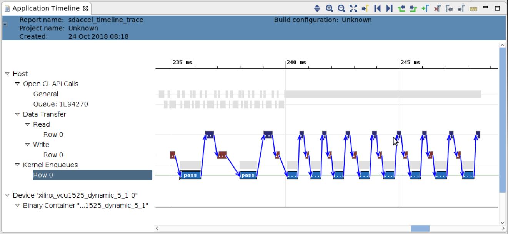
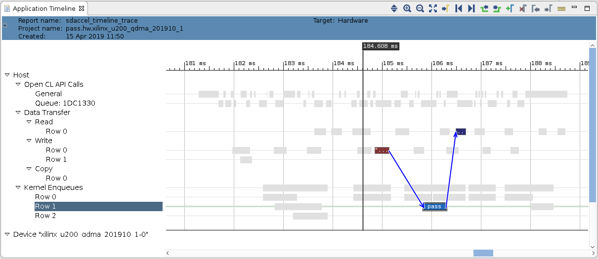
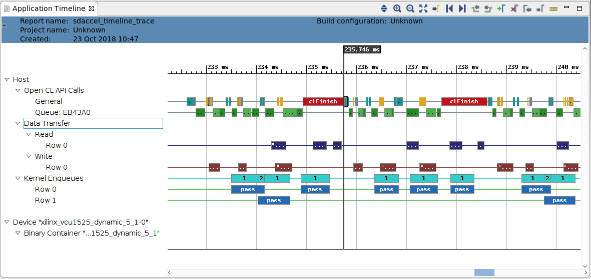
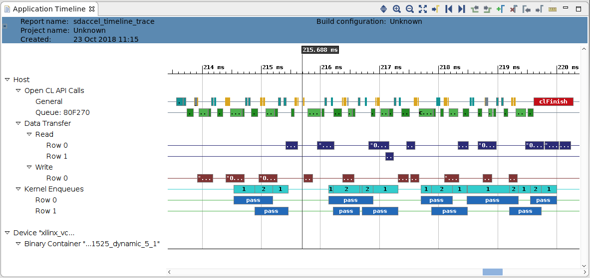

<p align="right">
別の言語で表示: <a href="../../../README.md">English</a>          
</p>

<table>
 <tr>
   <td align="center"><h1>2018.3 SDAccel™ 開発環境チュートリアル</h1>
   <a href="https://github.com/Xilinx/SDAccel-Tutorials/branches/all">その他のバージョン</a>
   </td>
 </tr>
 <tr>
 <td align="center"><h3>ホスト コードの最適化</h3>
 </td>
 </tr>
</table>

## はじめに

このチュートリアルでは、FPGA アクセラレーション アプリケーションに関連するホスト コードのパフォーマンスを調整する方法について説明します。ホスト コード最適化は、パフォーマンス最適化の 1 つにすぎません。ホスト コード最適化には、次のような最適化が含まれます。
* ホスト プログラム最適化
* カーネル コード最適化
* トポロジ最適化
* インプリメンテーション最適化

このチュートリアルでは、 1 つの単純な C++ カーネル インプリメンテーションを使用することで、カーネル コードの修正や、トポロジ最適化、およびホスト コード インプリメンテーションの解析に基づいたインプリメンテーション選択などをしなくてすむようにしています。
>このチュートリアルのホスト コード最適化手法では、アクセラレータのインテグレーションを最適化する点についてのみ説明します。複数の CPU コアを使用したり、ホスト コードのメモリを管理したりといったその他のよく使用される手法については、ここには含めません。詳細は、『SDAccel プロファイリングおよび最適化ガイド』 ([UG1207](https://japan.xilinx.com/support/documentation/sw_manuals_j/xilinx2018_3/ug1207-sdaccel-optimization-guide.pdf)) を参照してください。

次のセクションでは、特定のホスト コード最適化の注意点について説明しています。
* ソフトウェア パイプライン/イベント キュー
* カーネルおよびホスト コードの同期
* バッファー サイズ

## モデル

この例で使用されるカーネルは、ホスト コード最適化目的にのみ、ホスト コードの最適化の影響がわかるように作成されています。  
<!--this could be better suited as a table-->

C++ カーネルには、入力ポートと出力ポートが 1 つずつあります。これらのポートの幅は、AXI 帯域幅を最適に使用するため、512 ビットになっています。実行ごとにカーネルで消費されるエレメント数は、`numInputs` パラメーターで設定できます。同様に、`processDelay` パラメーターを使用すると、カーネルのレイテンシを変更できます。このアルゴリズムは、`processDelay` の値分、入力値を増加しますが、これは `processDelay` 回分入力値を各回で 1 ずつ増加するループによりインプリメントされます。このループはカーネル インプリメンテーション内にあるので、反復ごとに一定量のサイクルが必要とされるようになり、`processDelay` 数で乗算されます。

カーネルは、AXI バースト転送をイネーブルにするようにも設計されています。カーネルには、読み出しおよび書き込みプロセスが含まれ、プロセスの終わり頃に実際のカーネル アルゴリズム (`exec`) と並列で実行されます。
読み出しおよび書き込みプロセスは AXI トランザクションを単純なループで開始し、受け取った値を内部 FIFO に書き込むか、内部 FIFO から読み出して AXI 出力に書き込みます。Vivado 高位合成 (HLS) は、これらのブロックを同時処理の並列プロセスとしてインプリメントします。これは、DATAFLOW プラグマが周囲の `pass_dataflow` 関数で設定されているためです。

## カーネルをビルド
>**注記**: このチュートリアルの手順はすべて、`reference-files` ディレクトリから実行するように記述されています。

ホスト コードの中にはハードウェア エミュレーションを使用して実行しても問題ないものもありますが、正確なランタイム情報および大型のテスト ベクターの実行には、実際のシステム上でカーネルを実行する必要があります。通常、カーネルはホスト コード最適化中には変更しないものですが、これは 一度だけのもので、ハードウェア モデルが終了する前に簡単に実行できます。

このチュートリアルのサンプル カーネルは、次のコマンドでハードウェア ビットストリームが一度ビルドされるように設定されています。<!--ThomasB: Would be nice to add the specific string for U200 as an example.-->
```
make TARGET=hw DEVICE=<device> kernel
```
`device` をインストールしたザイリンクス アクセラレーション カードのデバイス ファイル (`.xpfm`) に置き換えます。  
>**注記**: このビルド プロセスには数時間かかるので、カーネル コンパイルはホスト コードの影響を解析する前に終了しておく必要があります。

## ホスト コード

ホスト コードのさまざまなインプリメンテーション オプションを検証する前に、コードの構造を確認します。ホスト コード ファイルは、ホスト コード最適化の重要な点に集中できるように設計されています。共通ソース ディレクトリ (`srcCommon`) のヘッダー ファイルには、次の 3 つのクラスが含まれます。

* `srcCommon/AlignedAllocator.h`: `AlignedAllocator` は 2 つのメソッドを含む小型の構造体です。この構造体は、テスト ベクターのメモリ アライメントされた割り当てをサポートするヘルパー クラスとして提供されています。メモリ アライメントされたブロックのデータの方が速く転送でき、データ送信がメモリ アライメントされない場合は OpenCL™ ライブラリで警告が作成されます。

* `srcCommon/ApiHandle.h`: 次の主な OpenCL オブジェクトをカプセル化します。
  * コンテキスト
  * プログラム
  * `device_id`
  * 実行カーネル
  * `command_queue`  
これらの構造はコンストラクターで作成され、デフォルトの OpenCL 関数呼び出しのシーケンスを 1 つずつ実行します。コンストラクターには、次の 2 つの設定パラメーターのみがあります。
      * FPGA をプログラムするのに使用するビットストリーム (`xclbin`) の名前を含む文字列。
      * 順番外のキューを作成するか、順番通りの実行キューを作成する必要があるかどうかを決定するブール。

  このクラスには、バッファーの生成およびアクセラレータでのタスクのスケジューリングに必要なキュー、コンテキスト、カーネルへの補足的な関数が含まれます。また、`ApiHandle` デストラクターが呼び出されると、自動的に割り当てられた OpenCL オブジェクトが解放されます。

* `srcCommon/Task.h`: オブジェクト クラス `Task` は、アクセラレータで実行されるワークロードの 1 つのインスタンスを示します。このクラスのオブジェクトがコンストラクトされると、バッファー サイズに基づいて入力および出力ベクターが割り当てられて初期化され、タスク呼び出しごとに転送されるようになります。同様に、デストラクターはタスク実行中に生成されたオブジェクトの割り当てを解除します。
  >**注記**: このように 1 つのモジュールの呼び出しのために 1 つのワークロードがカプセル化される場合、このクラスに出力検証関数 (`outputOk`) も含めることができます。

    このクラスのコンストラクターには、次の 2 つのパラメーターが含まれます。
	* `bufferSize`: このタスクが実行される際に転送される 512 ビット値の数を指定します。
	* `processDelay`: 同様の名前のカーネル パラメーターを提供します。これは検証中にも使用されるます。

    このクラスで最も重要なメンバー関数は、`run` です。この関数は、アルゴリズムを実行するため、次の 3 つの手順を使用して OpenCL をエンキューします。
	1. FPGA アクセラレータへデータを書き込み
	2. カーネルを設定して、アクセラレータを実行
	3. FPGA の DDR メモリからデータを読み戻す 

	
    このタスクを実行するため、通信用にバッファーが DDR で割り当てられます。また、異なるタスク間の依存性 (実行前読み出し前に書き込み) を示すために、イベントが使用されます。

`run` 関数には、`ApiHandle` オブジェクトだけでなく、1 つの条件引数があります。この引数を使用すると、タスクを前に生成したイベントに依存するようにでき、このチュートリアルの後半で説明するように、ホスト コードでタスク順の依存性を構築できるようになります。

これらのヘッダー ファイルのコードはいずれもこのチュートリアル中には変更しません。主な概念はすべて次に含まれる異なる `host.cpp` ファイルに表示されます。
* `srcBuf`
* `srcPipeline`
* `srcSync`

ただし、次のセクションで説明するように、`host.cpp` ファイルの main 関数でさえも特別な構造に従っています。

### host.cpp の main 関数
main 関数には、次のセクションが含まれます。

1. Environment / Usage Check
2. Common Parameters:
   * `numBuffers`: 変更されないパラメーターです。カーネル実行の回数を指定するために使用します。
   * `oooQueue`: true の場合、このブール値で ApiHandle 内で生成される OpenCL イベントキューの種類を宣言します。
   * `processDelay`: カーネルで必要とされる計算時間を人工的に遅らせます。このパラメーターは、このバージョンのチュートリアルでは使用しません。
   * `bufferSize`: カーネル実行ごとに転送される 512 ビット値の数を宣言します。
   * `softwarePipelineInterval`: 同期の発生前に前もってスケジュールできる演算の数を指定します。
3. Setup: 設定変数のステータスを知らせるため、このセクションには最終的な設定を表示します。
4. Execution: このセクションでは、複数の異なるホスト コードのパフォーマンス問題をモデル化できます。このチュートリアルでは、これらの行について説明します。
5. Testing: 実行が終了したら、出力で単純なチェックを実行します。
6. Performance Statistics: モデルが実際のアクセラレータ カードで実行されると (エミュレーションなし)、ホスト コードがシステム時間の計測に基づいてパフォーマンス統計を計算して表示します。

>**注記:** setup セクションだけでなくその他のセクションも、システム ステータスに関連する追加メッセージのほか、run の全体的な `PASS` または `FAIL` も表示できます。

### 順番外のイベント キューを使用してパイプライン処理済みのカーネルを実行

ここでは、パイプライン処理されたカーネル実行を確認します。
>**注記:** 1 つの計算ユニット (カーネルのインスタンス) を扱っているので、結果的にポイントごとにハードウェアで実際に実行できるカーネルは 1 つだけです。前述のように、カーネルの実行には、データが計算ユニットから送受信される必要もあります。これらの動作は重複させて、ホスト アプリケーションで動作するカーネルのアイドリング時間を最小限に抑える必要があります。

ホスト コード (`srcPipeline/host.cpp`) をコンパイルして実行するところから始めます。

```
make TARGET=hw DEVICE=<device> pipeline
```

前と同様に、``<device>`` は、使用可能なアクセラレータ カードの実際のデバイス ファイル (`.xpfm`) に置き換える必要があります。カーネルのコンパイル時間と比べると、即座に実行されます。

ホスト コードの実行ループを確認します。

```
  // -- Execution -----------------------------------------------------------

  for(unsigned int i=0; i < numBuffers; i++) {
    tasks[i].run(api);
  }
  clFinish(api.getQueue());
```
<!--ThomasB: Formatting should be cpp, not bash-->
この場合、コードですべてのバッファーがスケジュールされて実行されるようになっています。実際に同期して終了を待機するのは最後の行のみです。

ビルドが終了したら、次のコマンドを使用してホスト実行ファイルを実行します。

```
make TARGET=hw DEVICE=<device> pipelineRun
```

このスクリプトは、アプリケーションを実行してから SDAccel GUI を生成するように設定されています。GUI は収集したランタイム データを使用して自動的に生成されます。

ランタイム データは `sdaccel.ini` ファイルを使用して生成されます。データには、次が含まれます。

```
[Debug]
profile=true
timeline_trace=true
data_transfer_trace=coarse
stall_trace=all
```

`sdaccel.ini` ファイルの詳細は、『SDAccel 環境ユーザー ガイド』 ([UG1023](https://japan.xilinx.com/support/documentation/sw_manuals_j/xilinx2018_3/ug1023-sdaccel-user-guide.pdf)) を参照してください。

[Application Timeline] ビューには、実行ファイルの実行全体が示されます。このタイムラインには、主に次の 3 つのセクションが含まれます。
* [OpenCL API Calls]
* [Data Transfer section]
* [Kernel Enqueues]

実際のアクセラレータ実行を示すセクションを拡大し、カーネル エンキューの 1 つを選択すると、次のような画面が表示されます。


青の矢印は依存性を示します。すべての Write/Execute/Read タスク実行が前の Write/Execute/Read 演算セットに依存しており、実行が効率的にシリアライズされています。

ホスト コードの実行ループでは、Write/Execute/Read の run 間に依存性は指定されていません。特定タスクの **run** の各呼び出しのみ apiHandle に依存し、それ以外は完全にカプセル化されます。

この場合、依存性は順番どおりのキューを使用して作成されます。parameter セクションでは、`oooQueue` パラメーターが `false` に設定されています。<!--ThomasB: Formatting should be cpp, not bash-->

```
  bool         oooQueue                 = false;
```

この依存性は、順番外 (`oooQueue`) パラメーターを `true` に変更するとなくなります。<!--ThomasB: Formatting should be cpp, not bash-->

```
  bool         oooQueue                 = true;
```

リコンパイルして実行します。

```
make TARGET=hw DEVICE=<device> pipeline
make TARGET=hw DEVICE=<device> pipelineRun
```

[Application Timeline] ビューを拡大して、次の図のようにカーネル キューの結果をクリックします。



ほかの pass カーネル エンキューを選択すると、そのうち 10 個すべての依存性が Write/Execute/Read グループ内でのみ表示されるようになったことがわかります。これにより、読み出しおよび書き込み操作が実行と重複できるようになったので、ソフトウェアの書き込み、実行、読み出しが効率的にパイプライン処理されています。通信のオーバーヘッドがアクセラレータの実行と同時に発生するので、全体的なパフォーマンスがかなり改善されます。


## カーネルおよびホスト コードを同期

ここでは、まず `srcSync` (`srcSync/host.cpp`) のソース コードの実行ループを確認します。これは、このチュートリアルの前のセクションと同じです。<!--ThomasB: Formatting should be cpp, not bash-->

```
  // -- Execution -----------------------------------------------------------

  for(unsigned int i=0; i < numBuffers; i++) {
    tasks[i].run(api);
  }
  clFinish(api.getQueue());
```

この例の場合、フリーランニング パイプラインがインプリメントされます。同期は、終了時 (`clFinish` への呼び出しがイベント キューで実行される) まで実行されません。これで効率的なパイプラインは作成されますが、インプリメンテーションでバッファー割り当てと実行順序に関する問題が発生します。

たとえば、`numBuffer` 変数が大きな数値に増加される場合や、未知の数である場合 (ビデオ ストリームの処理で発生する可能性あり) に問題となることがあります。これらの場合、バッファー割り当てとメモリ使用量が問題の原因である可能性があります。この例では、ホスト メモリが前もって割り当てられ、FPGA と共有されているので、メモリ不足になる可能性があります。

同様に、アクセラレータを実行する呼び出しがそれぞれ独立していて、同期されていない (順番外キュー) ので、異なる呼び出し間の実行順がエンキューの順番で揃えられない可能性があります。この結果、ホスト コードが特定のブロックが終了するのを待つ場合に、かなり後にならないと実行されない可能性があります。これにより、アクセラレータは実行されていても、ホスト コードの並列処理はディスエーブルになってしまいます。

この問題を軽減するため、OpenCL には 2 つの同期方法が提供されています。
* `clFinish` 呼び出し
* `clWaitForEvents` 呼び出し

まず、`clFinish` 呼び出しを確認します。ビヘイビアーを確認するには、実行ループを次のように変更する必要があります。<!--ThomasB: Formatting should be cpp, not bash-->

```
  // -- Execution -----------------------------------------------------------

  int count = 0;
  for(unsigned int i=0; i < numBuffers; i++) {
    count++;
    tasks[i].run(api);
    if(count == 3) {
	  count = 0;
	  clFinish(api.getQueue());
    }
  }
  clFinish(api.getQueue());
```

リコンパイルして実行します。

```
make TARGET=hw DEVICE=<device> sync
make TARGET=hw DEVICE=<device> syncRun
```

[Application Timeline] ビューを拡大すると、次のように表示されます。


`clFinish` という赤いボックスと、アクセラレータのカーネル エンキュー間の間隔が 3 呼び出しごとに大きく開いていることに注意してください。

`clFinish` への呼び出しにより、全 OpenCL コマンド キューに同期ポイントが作成されるので、該当キューにエンキューされたコマンドは、すべて `clFinish` がホスト プログラムに制御を戻す前に終了している必要があります。このため、すべての動作 (バッファー通信を含む) が、次の 3 アクセラレータ呼び出しのセットが再開する前に終了している必要があります。これが効率的なバリア同期です。

バッファーが解放でき、すべてのプロセスが確実に終了することになっている同期ポイントをイネーブルにしつつ、同期ポイントで重複が起きないようにもします。

では、同期が前のアクセラレータへの呼び出しの終了に基づいて実行される、別の同期スキーマを確認します。`host.cpp` ファイルで実行ループを次のように変更します。

```
  // -- Execution -----------------------------------------------------------

  for(unsigned int i=0; i < numBuffers; i++) {
    if(i < 3) {
      tasks[i].run(api);
	} else {
	  tasks[i].run(api, tasks[i-3].getDoneEv());
    }
  }
  clFinish(api.getQueue());
```

リコンパイルして実行します。

```
make TARGET=hw DEVICE=<device> sync
make TARGET=hw DEVICE=<device> syncRun
```

[Application Timeline] ビューを拡大すると、次のように表示されます。


タイムラインの後半では、不必要な間隔なしに pass が 5 回実行されていますが、さらにマーカーのポイントでデータが転送されています。この段階では、3 つのパッケージがアクセラレータで処理されるように送信されており、既に 1 つが戻ってきて受信されています。最初のアクセラレータ呼び出しが終了した時点で次の Write/Execute/Read のスケジューリングを同期してあったので、その他のパッケージを受信する前に別の書き込みがあります。これにより、重複している実行が明確にわかります。

この場合、クラス タスクの `run` メソッドで次のイベント同期を使用して、3 呼び出し前にスケジュールされた実行が終了してから、その次のアクセラレータ実行全体を同期しました。<!--ThomasB: Formatting should be cpp, not bash-->

```
    if(prevEvent != nullptr) {
      clEnqueueMigrateMemObjects(api.getQueue(), 1, &m_inBuffer[0],
				 0, 1, prevEvent, &m_inEv);
    } else {
      clEnqueueMigrateMemObjects(api.getQueue(), 1, &m_inBuffer[0],
				 0, 0, nullptr, &m_inEv);
    }
```

これは OpenCL のエンキューされたオブジェクト間によく使用される同期スキーマですが、次を呼び出してホスト コードを同期する方法もあります。<!--ThomasB: Formatting should be cpp, not bash-->

```
  clWaitForEvents(1,prevEvent);
```

これにより、アクセラレータが早めにエンキューされたタスクで実行されている間に、ホスト コード計算がさらにできるようになります。これについては、ここでは詳細は説明しませんが、その他の演習で説明します。  


## OpenCL API バッファー サイズ

このチュートリアルの最後のセクションでは、パフォーマンス全体へのバッファー サイズの影響について説明します。`srcBuf/host.cpp` のホスト コードについては、終わりの方で説明します。実行ループは、前のセクションの終わりのものとまったく同じです。

ただし、このホスト コード ファイルの場合、処理されるタスク数が 100 に増加しています。これは、100 個のアクセラレータ呼び出しを取得して、100 個のバッファーを転送して 100 個のバッファーを読み込むために変更されています。これで、転送ごとの平均スループット見積もりをより正確に取得できるようになります。

また、特定の run に対してバッファー サイズを指定する 2 つ目のコマンド ライン オプション (`SIZE=`) が追加されています。1 つの書き込みまたは読み出し中に転送される実際のバッファー サイズは、指定した引数の 2 のべき乗 (`pow(2, argument)`) を 512 ビットで乗算して算出されます。

ホスト コードは、次を呼び出すとコンパイルできます。

```
make TARGET=hw DEVICE=<device> buf
```

次のコマンドで実行ファイルを実行します。

```
make TARGET=hw DEVICE=<device> SIZE=14 bufRun
```

引数 `SIZE` は、ホスト コード実行可能 pass への 2 つ目の引数として使用されます。
>**注記**: `SIZE` が含まれない場合は、デフォルトで `SIZE=14` に設定されます。これにより、異なるバッファー サイズを使用してインプリメンテーションを実行でき、計算時間合計を監視することでスループットを測定できるようになります。この数値はテストベンチで計算され、FPGA スループットの出力からレポートされます。

この異なるバッファー サイズのスイープをしやすくするため、別の makefile 目標が作成されており、次のコマンドで実行できます。

```
make TARGET=hw DEVICE=<device> bufRunSweep
```

>**注記**: スイープ スクリプト (`auxFiles/run.py`) には、Python (ほとんどのシステムで使用可能) をインストールする必要があります。スイープが実行され、8 ～ 19 のバッファー サイズ引数の FPGA スループットが記録されます。計測されたスループット値が実際の転送ごとのバイト数と一緒に `runBuf/results.csv` に記録され、makefile の実行の終わりに表示されます。

これらの数値を解析すると、次の図のようなステップ関数が表示できるようになります。  


この図は、バッファー サイズが確実にパフォーマンスに影響しており、約 2 MB で水平になり始めるところを示しています。
>**注記**: この図は、Gnuplot を使用して `results.csv` ファイルから作成されます。Gnuplot がシステムに含まれている場合、スイープを実行すると自動的に表示されます。

ホスト コードのパフォーマンスについては、このステップ関数によりバッファー サイズおよび実行速度合計間の関係がわかります。この例で示すように、デフォルト インプリメンテーションが少量の入力データに基づいている場合、アルゴリズムのバッファー サイズは簡単に変更できます。ここで実行されるようにダイナミックに実行時間で決まるようにする必要はありませんが、原則は同じです。アルゴリズムの 1 回の呼び出しに対して 1 つの値セットを送信するのではなく、複数の入力値を送信して、1 つのアクセラレータ呼び出しでアルゴリズム実行を繰り返します。

## まとめ

このチュートリアルでは、ホスト コード最適化の 3 つの特殊な項目について説明しました。
   * 順番外のイベント キューを使用してパイプライン処理済みのカーネルを実行
   * カーネルおよびホスト コードを同期
   * OpenCL API バッファー サイズ

効率的なアクセラレーション インプリメンテーションを作成するには、これらの項目について考慮する必要があります。チュートリアルでは、これらのパフォーマンス ボトルネックの解析方法と、それらのインポート方法の 1 つを示しました。

ホスト コードをインプリメントしてパフォーマンスを改善する方法は多くあります。たとえば、ホストからアクセラレータのパフォーマンスや、バッファー管理などのその他の項目を改善します。このチュートリアルでは、ホスト コード最適化のすべての点について説明しているわけではありません。

アプリケーション パフォーマンスを解析するのに使用するツールおよびプロセスの詳細は、『SDAccel プロファイリングおよび最適化ガイド』 ([UG1207](https://japan.xilinx.com/support/documentation/sw_manuals_j/xilinx2018_3/ug1207-sdaccel-optimization-guide.pdf)) を参照してください。

<hr/>
<p align="center"><sup>Copyright&copy; 2018 Xilinx</sup></p>

この資料は表記のバージョンの英語版を翻訳したもので、内容に相違が生じる場合には原文を優先します。資料によっては英語版の更新に対応していないものがあります。日本語版は参考用としてご使用の上、最新情報につきましては、必ず最新英語版をご参照ください。
