<p align="right">
別の言語で表示: <a href="../../../README.md">English</a>          
</p>

<table>
 <tr>
   <td align="center"><h1>2018.3 SDAccel™ 開発環境チュートリアル</h1>
   <a href="https://github.com/Xilinx/SDAccel-Tutorials/branches/all">ほかのバージョンを参照</a>
   </td>
 </tr>
 <tr>
 <td align="center"><h3>C カーネルと RTL カーネルの混合</h3>
 </td>
 </tr>
</table>

## 概要
SDAccel™ 開発環境は、関数をハードウェアでアクセラレーションするためのプラットフォームを提供します。ホスト ソフトウェア (アプリケーション) は C/C++ で OpenCL™ API 呼び出しを使用して開発しますが、ハードウェア コンポーネント (カーネル) は C/C++、OpenCL C、または RTL を使用して開発できます。  SDAccel 環境アプリケーションでは、異なる言語で開発したカーネルを組み合わせて使用できます。このチュートリアルでは、2 つのカーネルを使用するアプリケーションを示します。ホスト コードは、これらのカーネルに同じようにアクセスします。
* C++ で開発されたカーネル
* RTL で開発されたカーネル

### ワークフロー
このチュートリアルでは、SDAccel ツールを GUI モードで使用して新規プロジェクトを作成し、C++ ベースのカーネルを追加します。その後、C++ ベースのカーネルを FPGA にインプリメンテーションするため、このカーネルを含むバイナリ コンテナー (xclbin) を生成します。そして、デザインのソフトウェア エミュレーションを実行します。生成されたアプリケーション タイムライン レポートを開き、カーネルがホスト アプリケーションから呼び出されて実行されていることを確認します。

セクション 2 では、RTL Kernel ウィザードを使用して単純な RTL カーネルを作成し、プロジェクトに追加します。C++ カーネルを含むバイナリ コンテナーに RTL ベース カーネルを追加します。ホスト コードを RTL ベース カーネルを使用するよう変更し、ハードウェア エミュレーションを実行します。再びアプリケーション タイムライン レポートを開き、両方のカーネルがホスト アプリケーションから呼び出されて実行されていることを確認します。

## C/C ++ カーネルの使用
まず SDAccel 環境を起動し、新規プロジェクトを作成してソース ファイルをインポートします。詳細は、『SDAccel 環境ユーザー ガイド』 ([UG1023](https://japan.xilinx.com/cgi-bin/docs/rdoc?v=2018.3;d=ug1023-sdaccel-user-guide.pdf)) を参照してください。[C/C++ カーネル入門](./docs/getting-started-c-kernels/README.md)チュートリアルでも、具体的な手順を説明しています。

### SDAccel 環境の起動
1. Linux ターミナルを開き、次のコマンドを入力して SDAccel を GUI モードで起動します。
```
$ sdx
```  
2. [Eclipse Launcher] ダイアログ ボックスで、`Tutorial` という名前の新しいワークスペースを作成し、**[OK]** をクリックします。ワークショップの場所には、どの場所でも選択できます。

### New SDx Project ウィザードを使用した新規プロジェクトの作成

1. [File] → [New] → **[SDx Application Project]** をクリックします。
2. プロジェクト名を `mixed_c_rtl` に指定します。
3. **[Next]** をクリックします。
4. [Platform] ページで、プラットフォームに `xilinx_u200_xdma_201830_1` を選択し、**[Next]** をクリックします。
5. [Templates] ページで **[Empty Application]** を選択し、**[Finish]** をクリックします。

### prj_c_rtl プロジェクトにソース ファイルを追加

1. SDAccel の [Project Explorer] ビューで、[Import Sources] (下の図の赤丸で示されているボタン) をクリックします。  
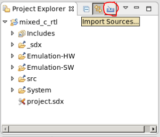  
2. [Browse] をクリックして `mixing-c-rtl-kernels/reference-files` サブディレクトリを開き、[OK] をクリックします。
3. ディレクトリに含まれるすべてのファイルを選択し、**[Finish]** をクリックします。これにより、`reference-files` ディレクトリからホストおよび C++ カーネルのソース ファイルが `mixing_c_rtl` プロジェクトの `src` ディレクトリにインポートされます。

カーネル (`krnl_vadd.cpp`) は 2 つの入力ベクターを追加し、出力を生成します。
ホスト コード (`host.cpp`) はプラットフォームを設定し、グローバル メモリ バッファーを定義してカーネルに接続します。ホスト コードには、次に説明する 4 つの OpenCL API 呼び出しがあります。これらの呼び出しは、`host.cpp` ファイルに含まれています。

1 つ目は `host.cpp` ファイルの 135 ～ 138 行目のコードで、実行するプログラムを作成します。C++ ベース カーネルのみを含むバイナリ コンテナーを使用します。

```
cl::Program::Binaries bins;
bins.push_back({buf,nb});
devices.resize(1);
cl::Program program(context, devices, bins);
```

2 つ目は 142 行目のコードで、プログラムから C++ `krnl_vadd` カーネル オブジェクトを取得し、`krnl_vector_add` という名前を付けます。これにより、ホストがカーネルを使用できるようになります。

```
cl::Kernel krnl_vector_add(program,"krnl_vadd");
```

3 つ目は 162 ～ 165 行目のコードで、`krnl_vector_add` カーネル引数をバッファーに割り当てます。

```
krnl_vector_add.setArg(0,buffer_a);
krnl_vector_add.setArg(1,buffer_b);
krnl_vector_add.setArg(2,buffer_result);
krnl_vector_add.setArg(3,DATA_SIZE);
```


引数の番号 0、1、2、および 3 は、`krnl_vadd.cpp` に含まれる次の `krnl_vadd` 定義の引数の順序に一致します。
```
void krnl_vadd(
                int* a,
                int* b,
                int* c,
                const int n_elements)
```
4 つ目は 171 目のコードで、次の OpenCL API により `krnl_vector_add` カーネルが起動します。

```
q.enqueueTask(krnl_vector_add);
```

RTL ベースのコードを追加するときには、そのカーネルに対して同一の読み出しを追加します。
高位 OpenCL 呼び出しは、カーネルがプログラムされている言語には関係なく同じです。

>**注記**: ホスト コードのプログラムに関する詳細は、『SDAccel プログラマ ガイド』 ([UG1277](https://japan.xilinx.com/cgi-bin/docs/rdoc?v=2018.3;d=ug1277-sdaccel-programmers-guide.pdf)) を参照してください。

### C++ カーネルを含むバイナリ コンテナーの作成

1. [Project Explorer] ビューで **[project.sdx]** をダブルクリックし、[SDx Application Project Settings] を開きます。  
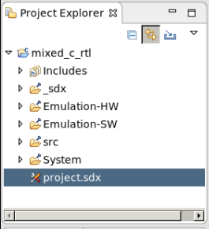  
SDx 環境ですべてのソース ファイルがスキャンされ、プロジェクトにカーネルが含まれることが自動的に検出されます。このチュートリアルでは、検出されるカーネルは 1 つのみです。それを選択して [OK] をクリックします。
2. [Hardware Function] セクションで稲妻アイコンをクリックします (次の図を参照)。  
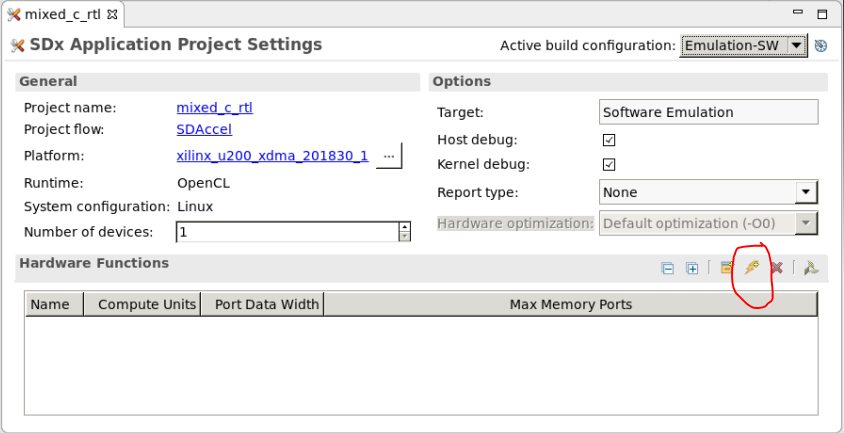  
稲妻アイコンをクリックすると、SDx 環境ですべてのソース ファイルがスキャンされ、プロジェクトにカーネルが含まれることが自動的に検出されます (この場合は検出されるカーネルは 1 つのみ)。
3. カーネルを選択し、**[OK]** をクリックします。  
デフォルトの `binary_container_1` という名前のバイナリ コンテナーが作成され、krnl_vadd が含まれます。  
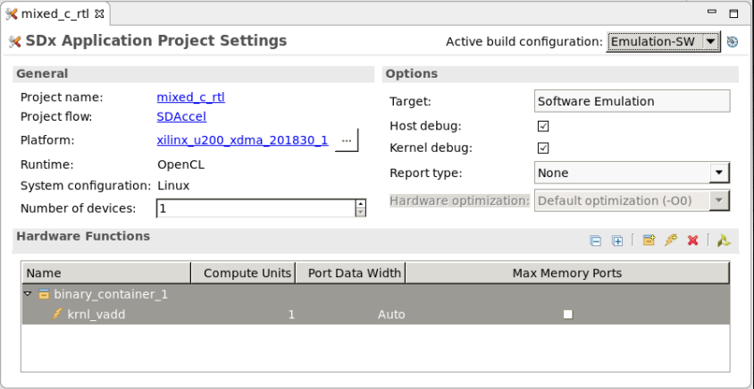  

これで、プロジェクトをコンパイル (ビルド) する準備ができました。

### プロジェクトのコンパイル

1. [SDx Application Project Settings] で、[Active build configuration] に **[Emulation-SW]** が選択されていることを確認します。  
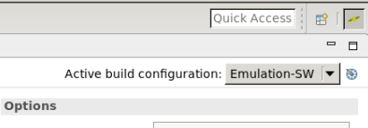  
2. ハンマー アイコンをクリックしてコンパイルを開始します。  
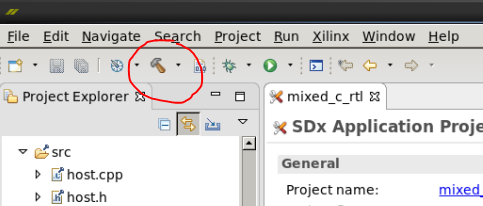  
>**注記**: ソフトウェア エミュレーションを使用して、ホスト コードとカーネルの機能を検証します。ソフトウェア エミュレーションは、ホスト コードとカーネル コードの両方がコンパイルされて、開発マシンの x86 プロセッサで実行されるので、非常に高速です。
3. エミュレーションを実行するには、[Run] アイコンをクリックします。  
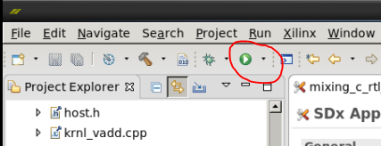  
アプリケーションが正しく完了すると、[Console] ビューに `TEST WITH ONE KERNEL PASSED` というメッセージが表示されます。

### アプリケーション タイムラインの確認

ソフトウェア エミュレーション中に生成されたアプリケーション タイムライン レポートを確認します。アプリケーション タイムラインは、ホストおよびデバイスのイベントを収集して共通のタイムラインに表示します。ホスト イベントと実行中のカーネルを可視化するのに使用できます。
1. [Assistant] ビューで、次の図に示すように **[Emulation-SW]** → **[mixed_c_rtl-Default]** を展開します。  
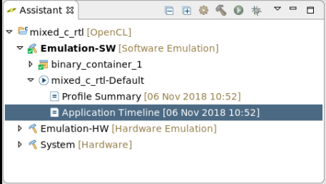
2. **[Application Timeline]** をダブルクリックし、プログラムおよびバッファーの作成を含むホスト イベントを表示します。
3.	**[Device]** → **[Binary Container]** の下に、`Compute Unit krnl_vadd_1` という行があります。  そのタイムラインをたどり、計算ユニット `krnl_vadd_1` が実行されている部分を拡大表示します。  
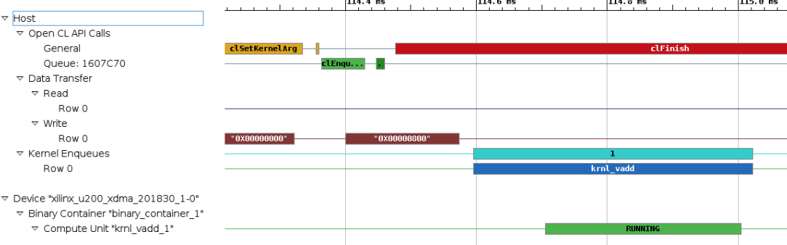  
確認したら、[Application Timeline] ビューを閉じます。  
>**注記:** 計算ユニットは、FPGA 上のカーネルのインスタンシエーションです。

## RTL カーネルの作成

C++ カーネルを追加して実行しました。次に、`prj_c_rtl` プロジェクトに RTL カーネルを追加します。その後、C++ カーネルと RTL カーネルの両方をビルドして実行します。  SDAccel 環境では、カーネルのソースに次の言語がサポートされます。
* OpenCL
* C/C++
* RTL

カーネルがどのように設計されているかにかかわらず、ホスト コードからカーネルのアクセスには同様の関数呼び出しが使用されます。  

### RTL Kernel ウィザードの使用

まず、RTL Kernel ウィザードを使用して、入力ベクターに定数を追加するカーネルを生成します。RTL Kernel ウィザードは、RTL デザインを SDAccel 環境でアクセス可能なコンパイル済みカーネル オブジェクト ファイル (`.xo`) にパッケージするのに必要な手順の一部を自動化します。

デフォルトでは、このチュートリアルの最初のセクションで使用した C++ カーネルと同様に、ウィザードで単純な Vector Addition カーネルが作成されます。この RTL カーネルを作成してプロジェクトに追加します。  
>**重要**: このチュートリアルで RTL カーネルを作成するため、ここでは詳細を説明せずに手順を示します。RTL Kernel ウィザードについては、[RTL カーネル入門](./docs/getting-started-rtl-kernels/README.md)チュートリアルに詳細に記述されています。また、RTL Kernel ウィザードの完全な詳細は、『SDAccel 環境ユーザー ガイド』 ([UG1023](https://japan.xilinx.com/cgi-bin/docs/rdoc?v=2018.3;d=ug1023-sdaccel-user-guide.pdf)) を参照してください。

### RTL Kernel ウィザードを開く

1.	[Xilinx] → **[RTL Kernel Wizard]** をクリックします。RTL Kernel ウィザードの Welcome ページが開きます。
2. **[Next]** をクリックします。
3. [General Settings] ページで、デフォルト設定のままにして **[Next]** をクリックします。
4. [Scalars] ページで、スカラー引数の数を `0` に設定し、**[Next]** をクリックします。
5. [Global Memory] ページで、デフォルト設定のままにして **[Next]** をクリックします。  
[Summary] ページに、RTL カーネル設定のサマリが示され、呼び出しが C 関数としてどのように見えるかを示す関数プロトタイプが含まれます。
6. **[OK]** をクリックします。


### Vivado プロジェクト

この時点で、Vivado™ Design Suite が開き、生成された RTL コードのプロジェクトが表示されます。RTL Kernel ウィザードで生成および設定された RTL コードは、`A = A + 1` 関数に対応します。  ソース ファイルを開いて確認するか、RTL シミュレーションを実行できます。  このチュートリアルでは、RTL カーネルを生成します。

1. Flow Navigator で **[Generate Block Design]** をクリックします (次の図を参照)。  
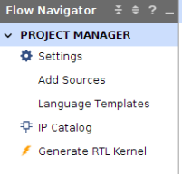  
2. [Generate RTL Kernel] ダイアログ ボックスで、カーネル パッケージ オプションに **[Sources-only]** を選択します。
3. (オプション) ソフトウェア エミュレーション ソースとして、SDAccel ツールでのソフトウェア エミュレーションで使用可能な RTL カーネルの C++ モデルを追加できます。C++ モデルは、設計エンジニアがコード記述する必要があります。通常は C++ モデルはなく、デザインのテストにハードウェア エミュレーションが使用されます。  
RTL Kernel ウィザードでは vadd デザインの C++ モデルが作成されるので、それを追加できます。
4. [`…`] (参照) ボタンをクリックします。
5. `imports` ディレクトリをダブルクリックします。
6. 唯一含まれる `.cpp` ファイルを選択し、**[OK]** をクリックします。
7. もう一度 **[OK]** をクリックして RTL カーネルを生成します。
8. RTL カーネルが生成されたら、**[Yes]** をクリックして Vivado Design Suite を閉じ、SDAccel 環境に戻ります。

## RTL および C++ カーネル のホスト コードへの追加

SDAccel 環境で、開始した`rtl_c_prj` プロジェクトに戻ります。[Project Explorer] ビューで `src` ディレクトリを展開すると、`sdx_rtl_kernel` の下に RTL カーネルが追加されているのがわかります。

カーネル ソース ファイルだーには、次の 2 つのファイルが含まれています。
- `host_example.cpp` (サンプル ホスト コード)
- `.xo` ファイル (RTL カーネル)  
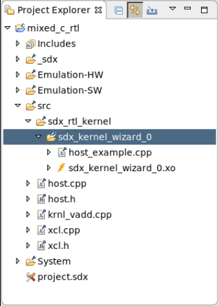

プロジェクトには既にホスト コードが含まれるので、生成された `host_example.cpp` ファイルは削除する必要があります。  これには、`host_example.cpp` ファイルを右クリックして **[Delete]** をクリックします。

### 新規カーネルのバイナリ コンテナーへの追加

新しいカーネルをプロジェクトに追加したので、それをバイナリ コンテナーに追加する必要があります。

1. [SDx Application Project Settings] の [Hardware Functions] エリアで、稲妻アイコンをクリックします。
2. 作成したカーネルを選択し、**[OK]** をクリックします。  
これで、RTL カーネルがバイナリ コンテナー (既に C++ カーネルを含む) に追加されます。
3. ホスト コード (`host.cpp`) をアップデートして、新しいカーネルを組み込みます。
4. `host.cpp` ファイルを開き、`ADD_RTL_KERNEL` を定義する 49 行目のコメント `//` を削除します。
  * 変更前:
  ```
  //#define ADD_RTL_KERNEL
  ```
  * 変更後:
  ```
  #define ADD_RTL_KERNEL
  ```

5. ファイルを保存します。

  アップデートした `host.cpp` ファイルには、次に示すように追加の OpenCL 呼び出しが含まれます。実際の OpenCL 呼び出しは、C++ ベース カーネルに使用されるものと同じで、引数が RTL ベース カーネル用に変更されているだけです。  
  コードの最初の部分は変更されていませんが、バイナリ コンテナーには C++ カーネルと RTL カーネルが含まれます。
  ```
  cl::Program::Binaries bins;
  bins.push_back({buf,nb});
  devices.resize(1);
  cl::Program program(context, devices, bins);
  ```
6. プログラムから `sdx_kernel_wizard_0` オブジェクトを取得し、145 行目で名前 `krnl_const_add` を割り当てます。`sdx_kernel_wizard_0` オブジェクト名は、RTL Kernel ウィザードで生成された名前と一致します。
```
cl::Kernel krnl_const_add(program,"sdx_kernel_wizard_0");
```
7. 168 行目で `krnl_const_add` カーネル引数を定義します。  
```
krnl_const_add.setArg(0,buffer_result);
```
>**注記**: ホスト コードでは、`buffer_results` バッファーは C カーネルから DDR を介して RTL カーネルに渡され、ホスト メモリには戻されません。
8. 173 行目で `krnl_const_add` カーネルを起動します。
```
q.enqueueTask(krnl_vector_add);
```  
RTL カーネルをバイナリ コンテナーおよびホスト コードに追加したので、プロジェクトを再ビルドし、ハードウェア エミュレーションを実行できます。

9. [Active build configuration] が **[Emulation-HW]** に設定されていることを確認し、[Run] ボタンをクリックします。これによりコンパイルおよびハードウェア エミュレーションが実行されます。  
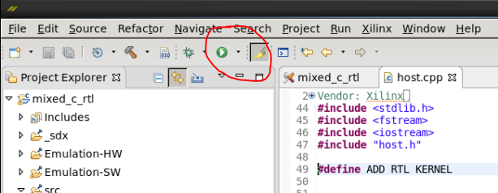  
エミュレーションが終了すると、[Console] ビューに `TEST WITH TWO KERNELS PASSED` というメッセージが表示されます。  
[Application Timeline] レポートを開いて、2 つのカーネルが実行されていることを確認します。

10. [Assistant] ビューで、**[Emulation-HW]** およびデフォルト カーネルを展開し、[Application Timeline] をダブルクリックして開きます。  
6.	**[Device]** → **[Binary Container]** の下のタイムラインをたどり、拡大表示します。計算ユニット `krnl_vadd_1` および `rtl_kernel` が実行されているのがわかります。  
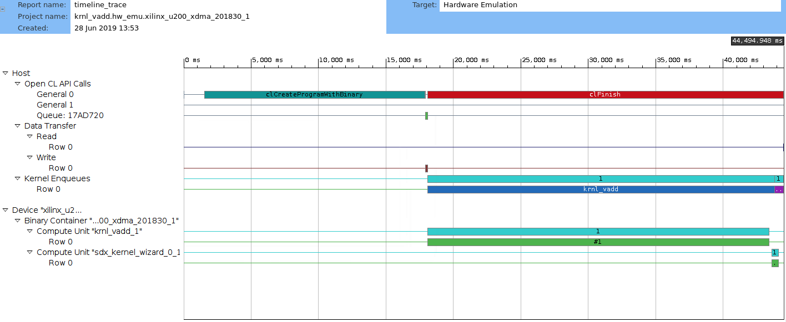

## まとめ

このチュートリアルでは、SDAccel 環境アプリケーションで C++ カーネルと RTL ベース カーネルを実行し、開発言語の異なるカーネルを組み合わせて使用できることを示しました。ホスト コードからこれらのカーネルにアクセスする方法は同じです。

<hr/>
<p align="center"><sup>Copyright&copy; 2018 Xilinx</sup></p>

この資料は表記のバージョンの英語版を翻訳したもので、内容に相違が生じる場合には原文を優先します。資料によっては英語版の更新に対応していないものがあります。日本語版は参考用としてご使用の上、最新情報につきましては、必ず最新英語版をご参照ください。