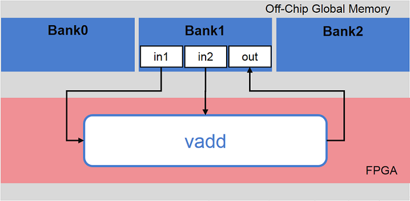
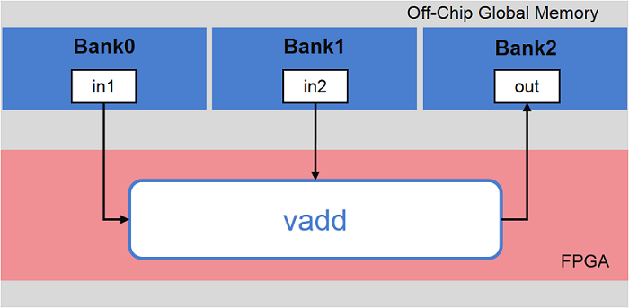
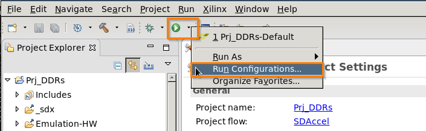

<p align="right">
別の言語で表示: <a href="../../../README.md">English</a>          
</p>

<table>
 <tr>
   <td align="center"><h1>2018.3 SDAccel™ 開発環境チュートリアル</h1>
   <a href="https://github.com/Xilinx/SDAccel-Tutorials/branches/all">ほかのバージョンを参照</a>
   </td>
 </tr>
 <tr>
 <td align="center"><h3>複数の DDR バンクの使用</h3>
 </td>
 </tr>
</table>

## 概要

SDAccel™ 環境では、カーネルと DDR の間のデータ転送に、デフォルトでは 1 つの DDR バンクが使用されます。アプリケーションによっては、データの移動がパフォーマンスのボトルネックになります。カーネルがグローバル メモリ (DDR) と FPGA の間で多量のデータを移動する必要がある場合、複数の DDR バンクを使用できます。これにより、カーネルが複数のメモリ バンクに同時にアクセスできるようになり、アプリケーションのパフォーマンスが向上します。

`--sp` オプションを使用してシステム ポート マップ指定すると、カーネル ポートを DDR やプログラマブル ロジック RAM (PLRAM) などの特定のグローバル メモリ バンクにマップできます。このチュートリアルでは、カーネル ポートを複数の DDR バンクにマップする方法を示します。

## 例の説明

このチュートリアルでは、Vector Addition サンプルを使用します。このサンプルは、`vadd` カーネルが `in1` および `in2` からデータを読み出し、結果 `out` を生成します。

このチュートリアルでは、3 つの DDR バンクを使用して Vector Addition アプリケーションをインプリメントします。

XOCC コンパイラのデフォルトの動作では、カーネルとグローバル メモリの間のデータ転送に 1 つの DDR バンクが使用され、`in1`、`in2`、および `out` ポートを介するすべてのデータ アクセスがプラットフォームのデフォルト DDR バンクを介して実行されます。  


これを、次のようにアクセスするように変更します。
* `in1` は `Bank0` を介する
* `in2` は `Bank1` を介する
* `out` は `Bank2` を介する



これを達成するには、次のようにアップデートする必要があります。  
* ホスト コードを変更し、カーネルおよび引数インデックスに `cl_mem_ext_ptr` を使用するようにします。
* SDAccel ツールで、各カーネル引数が適切なバンクに接続されるように設定します。

このチュートリアルの例では C++ カーネルを使用しますが、RTL および OpenCL™ カーネルでも手順は同じです。

## チュートリアルの設定

1. SDx™ 環境 GUI を起動します。
	1. 次のワークスペース ディレクトリを作成します。
		* `cd mult-ddr-banks`
		* `mkdir workspace`
	2. SDx 環境を GUI モードで開きます。
```
sdx -workspace workspace
```
2. 新しいプロジェクトを作成します。
	1. メニューから **[SDx Application Project]** を選択します。プロジェクト名は **Prj_DDRs** にします。
	2. プラットフォームとして `xilinx_u200_xdma_201830_1` を選択します。
	3. **[Empty Application]** を選択し、**[Finish]** をクリックします。
	4. このチュートリアルのソース ファイルをプロジェクトの `src` ディレクトリにインポートします。  

3. 次のソース ファイルが `src` ディレクトリにインポートされたことを確認します。`src` ディレクトリを展開すると、次のようになっているはずです。  

4. [SDx Application Project Settings] で [Hardware Functions] に **vadd** を追加します。  

5. [Active build configuration] を **[Emulation-HW]** に設定します。
6. [Run] → **[Run Configurations]** をクリックします。  

7. [Arguments] タブで、**[Automatically add binary container(s) to arguments]** をオンにします。  

8. 設定を適用し、ハードウェア エミュレーションをビルドします。  
前述のように、デザインのデフォルト インプリメンテーションでは 1 つの DDR バンクが使用されます。[Console] ビューにリンク段階で表示されるメッセージを確認します。次のようなメッセージが表示されるはずです。  
  
SDx 環境により、`--sp` が設定されていない各カーネル引数に対してマップが自動的に推論されているのがわかります。
9. [Run] ボタンをクリックして **[HW-Emulation]** を実行します。シミュレーションが終了したら、[Guidance] ビューでカーネル データ転送のメモリ接続を確認します (次の図を参照)。  


この後、データ転送を次の 3 つに分割する方法を示します。
* `DDR Bank 0`
* `DDR Bank 1`
* `DDR Bank 2`

## ホスト コードの変更
ホスト コードで、カーネルおよび引数インデックスに `cl_mem_ext_ptr` を使用する必要があります。これには、ザイリンクス ベンダー拡張を使用します。

`host.cpp` ファイルを開き、次のセクションを見つけます。

```
// #define USE_MULT_DDR_BANKs
...
	// ------------------------------------------------------------------
	// Create Buffers in Global Memory to store data
	//             GlobMem_BUF_in1 - stores in1
	// ------------------------------------------------------------------
#ifndef USE_MULT_DDR_BANKs
#else
	cl_mem_ext_ptr_t  GlobMem_BUF_in1_Ext;
	GlobMem_BUF_in1_Ext.param = krnl_vector_add.get();
	GlobMem_BUF_in1_Ext.flags = 0; // 0th Argument
	GlobMem_BUF_in1_Ext.obj   = source_in1.data();

	cl_mem_ext_ptr_t  GlobMem_BUF_in2_Ext;
	GlobMem_BUF_in2_Ext.param = krnl_vector_add.get();
	GlobMem_BUF_in2_Ext.flags = 1; // 1st Argument
	GlobMem_BUF_in2_Ext.obj   = source_in2.data();

	cl_mem_ext_ptr_t  GlobMem_BUF_output_Ext;
	GlobMem_BUF_output_Ext.param = krnl_vector_add.get();
	GlobMem_BUF_output_Ext.flags = 2; // 2nd Argument
	GlobMem_BUF_output_Ext.obj   = source_hw_results.data();
#endif
```

カーネル ポートを複数の DDR バンクに割り当てるには、`cl_mem_ext_ptr_t` 構造を使用します。  
説明:
* `param`: 引数インデックスに関連付けるカーネル。
* `flags`: 有効なカーネルに関連付ける引数インデックス。
* `obj`: データ転送に割り当てるホスト メモリ。

上記の例では、メモリ ポインター `in2` が グローバル メモリの `GlobMem_BUF_in2_Ext` に割り当てられています。  
>**注記**: バンクをバッファーに明示的に割り当てない場合、デフォルトの DDR バンクに割り当てられます。

バッファーの割り当てに `cl::Buffer API` を使用して、次のコードに示すように `cl::Buffer API` を使用します。
```
#ifndef USE_MULT_DDR_BANKs
    OCL_CHECK(err, cl::Buffer buffer_in1   (context,CL_MEM_USE_HOST_PTR | CL_MEM_READ_ONLY,
            vector_size_bytes, source_in1.data(), &err));
    OCL_CHECK(err, cl::Buffer buffer_in2   (context,CL_MEM_USE_HOST_PTR | CL_MEM_READ_ONLY,
            vector_size_bytes, source_in2.data(), &err));
    OCL_CHECK(err, cl::Buffer buffer_output(context,CL_MEM_USE_HOST_PTR | CL_MEM_WRITE_ONLY,
            vector_size_bytes, source_hw_results.data(), &err));
#else
    OCL_CHECK(err, cl::Buffer buffer_in1   (context,CL_MEM_USE_HOST_PTR | CL_MEM_READ_ONLY | CL_MEM_EXT_PTR_XILINX,
            vector_size_bytes, &GlobMem_BUF_in1_Ext, &err));
    OCL_CHECK(err, cl::Buffer buffer_in2   (context,CL_MEM_USE_HOST_PTR | CL_MEM_READ_ONLY | CL_MEM_EXT_PTR_XILINX,
            vector_size_bytes, &GlobMem_BUF_in2_Ext, &err));
    OCL_CHECK(err, cl::Buffer buffer_output(context,CL_MEM_USE_HOST_PTR | CL_MEM_WRITE_ONLY | CL_MEM_EXT_PTR_XILINX,
            vector_size_bytes, &GlobMem_BUF_output_Ext, &err));
#endif
```

ホスト コードですべてを変更するには、ホスト コードの最初にある `#define USE_MULT_DDR_BANKs` 行のコメントをはずし、保存します。

## XOCC リンカー オプションの設定

次に、XOCC カーネル リンカーでカーネル引数が対応するバンクに接続されるように設定します。`--sp` オプションを使用して、カーネル ポートまたはカーネル引数をマップします。

カーネル ポート:
```
--sp <kernel_cu_name>.<kernel_port>:<sptag>
```
カーネル引数:
```
--sp <kernel_cu_name>.<kernel_arg>:<sptag>
```
``<sptag>[min:max]`` のようにすると、範囲を指定できます。便宜上、1 つのインデックスもサポートされます (DDR[2] など)。

* `<kernel_cu_name>`: 計算ユニット名。カーネル名にアンダースコア (`_`) とインデックス (`index`) を付けたものになります。たとえば、vadd カーネルの計算ユニットの名前は `vadd_1` などになります。
* `<kernel_arg>`: 計算ユニットのメモリ インターフェイスまたは関数引数。`vadd` カーネルのカーネル引数は、`vadd.cpp` ファイルにあります。
* `<sptag>`: ターゲット プラットフォームで使用可能なメモリ リソース。有効な `<sptag>` 名は DDR、PLRAM などです。このチュートリアルでは、`DDR[0]`、`DDR[1]`、および `DDR[2]` を使用します。


`vadd` カーネルの `--sp` オプションの定義を確認します。
* **カーネル**: `vadd`
* **カーネル インスタンス名**: `vadd_1`

これは C/C+ カーネルなので、引数は `vadd.cpp` ファイルに指定されています。このカーネル引数 (`in1`、`in2`、および `out`) を `DDR[0]`、`DDR[1]`、および `DDR[2]` に接続する必要があるので、  
`--sp` オプションは次のようになります。
```
--sp vadd_1.in1:DDR[0]
--sp vadd_1.in2:DDR[1]
--sp vadd_1.out:DDR[2]
```
引数 `in1` は DDR Bank0 にアクセスし、引数 `in2` は DDR Bank1 にアクセスし、引数 `out` は DDR Bank2 にアクセスします。

>**注記**: DDR バンクを割り当てる際は、`--slr` オプションを使用して計算ユニットを特定の SLR に割り当てることをお勧めします。  
>このオプションの構文は `--slr <COMPUTE_UNIT>:<SLR_NUM>` で、`<COMPUTE_UNIT>` は計算ユニットの名前、`<SLR_NUM>` は計算ユニットを割り当てる SLR 番号です。  
>たとえば、`xocc … --slr vadd_1:SLR2` は `vadd_1` という計算ユニットを SLR2 に割り当てます。

すべての `--sp` オプションをまとめると、次のようになります。
```
--sp vadd_1.in1:DDR[0] --sp vadd_1.in2:DDR[1] --sp vadd_1.out:DDR[2]
```

>**重要**: SDAccel GUI でこれらすべてのオプションの設定を間違えないようにするため、`host.cpp` ファイルの冒頭からこれらのオプションをコピーしてください。次の `--sp` から始まる部分を選択します。

```
// #define USE_MULT_DDR_BANKs
// Note: set XOCC options for Link: --sp vadd_1.in1:DDR[0] --sp vadd_1.in2:DDR[1] --sp vadd_1.out:DDR[2]
```

XOCC リンカー用にこれらのオプションを指定するには、[Assistant] ビューで **[Settings]** をクリックします。  


[Project Settings] ダイアログ ボックスで、**[XOCC linker options]** にコピーした `--sp` オプションを貼り付けます。  


**[Apply]** をクリックした後、[Project Settings] ダイアログ ボックスを閉じます。**[Project]** → **[Clean]** をクリックし、**[HW-Emulation]** モードのプロジェクトのビルドをクリーンアップします。  


[Console] ビューにリンク段階で表示されるメッセージを確認します。次のようなメッセージが表示されるはずです。  


このメッセージに、SDAccel 環境で、`--sp` オプションの設定に基づいて、カーネル引数が指定の DDR バンクに正しくマップされたことが示されています。

ここで、[Run] ボタンをクリックして [HW-Emulation] を実行し、デザインが正しいことを確認します。シミュレーションが終了したら、[Guidance] ビューでカーネル データ転送のメモリ接続を確認します (次の図を参照)。  


## まとめ

このチュートリアルでは、カーネル `vadd` の `in1`、`in2`、および `out` ポートのデフォルト マップを 1 つの DDR バンクから複数の DDR バンクに変更する方法を示しました。次の方法も学びました。

* ホスト ポインターを定義し、ホスト ポインターを `cl:Buffer` API に割り当て。
* `--sp` オプションを使用して XOCC リンカー オプションを設定し、カーネル引数を複数の DDR バンクに接続。
* アプリケーションをビルドして DDR マップを確認。

<hr/>
<p align="center"><sup>Copyright&copy; 2018 Xilinx</sup></p>

この資料は表記のバージョンの英語版を翻訳したもので、内容に相違が生じる場合には原文を優先します。資料によっては英語版の更新に対応していないものがあります。日本語版は参考用としてご使用の上、最新情報につきましては、必ず最新英語版をご参照ください。