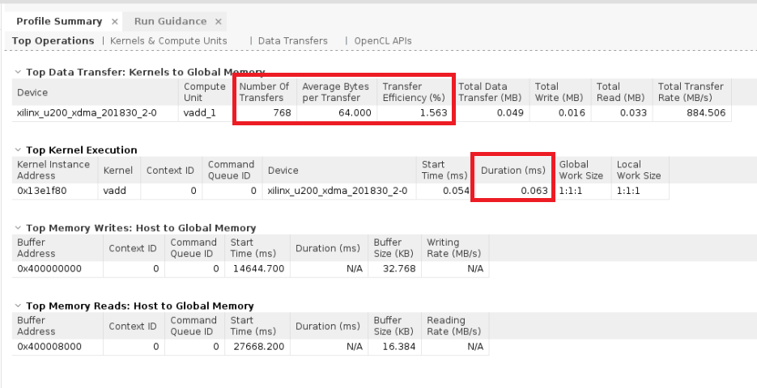
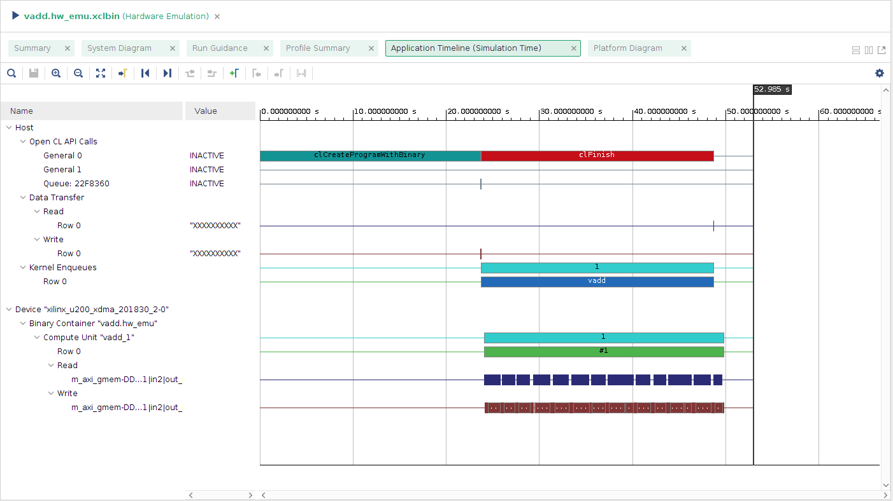

<table class="sphinxhide">
 <tr>
   <td align="center"><h1>2020.1 Vitis™ アプリケーション アクセラレーション開発フロー チュートリアル</h1><a href="https://github.com/Xilinx/Vitis-Tutorials/branches/all">2019.2 Vitis アプリケーション アクセラレーション開発フロー チュートリアル</a></td>
 </tr>
 <tr>
 <td>
 </td>
 </tr>
</table>

# 4\. アプリケーションのプロファイリング

Vitis™ コア開発キットでは、コンパイル中にカーネルのリソースとパフォーマンスに関するさまざまなレポートが生成されます。また、エミュレーション モードおよび FPGA アクセラレーション カードでアプリケーション実行中のプロファイリング データも収集されます。この演習では、レポートを生成し、プロファイリング結果を収集して Vitis 統合設計環境 (IDE) 環境に表示する方法を説明します。

## プロファイル サマリ

XRT は、ホスト アプリケーションのプロファイリング データを自動的に収集します。アプリケーションの実行が終了すると、ソリューション レポート ディレクトリまたは作業ディレクトリ内にプロファイル サマリが HTML、CSV および Google Protocol Buffer フォーマットで保存されます。これらのレポートは、ウェブ ブラウザー、スプレッドシート ビューアー、または Vitis IDE の \[Profile Summary] ビューで表示できます。

1. プロファイルの監視を有効にするには、`xrt.ini` ファイルを作成して `profile=true` を設定します。このファイルは、実行ディレクトリ内に含める必要があります。

   > **ヒント:** `xrt.ini` ファイル作成の詳細は、[プロファイルおよびトレース レポートの生成](../Pathway3/ProfileAndTraceReports.md)演習を参照してください。

   ```
   [Debug]
   profile=true
   timeline_trace=true
   data_transfer_trace=fine
   ```

2. ハードウェア エミュレーションのプロファイル サマリ レポートを生成するには、ハードウェア リンク段階で `--profile_kernel` オプションを使用してカーネルをビルドします。これにより、エミュレーション中にパフォーマンス データを収集できるようになります。このオプションは、`design.cfg` ファイルに追加できます。

   ```
   platform=xilinx_u200_xdma_201830_2
   debug=1
   profile_kernel=data:all:all:all

   [connectivity]
   nk=vadd:1:vadd_1
   ```

   ```
   v++ -t hw_emu --config design.cfg -c -k vadd -I'../src' -o'vadd.xilinx_u200_xdma_201830_2.xo' './src/vadd.cpp'
   v++ -t hw_emu --config design.cfg -l -o'vadd.xilinx_u200_xdma_201830_2.xclbin' vadd.xilinx_u200_xdma_201830_2.xo
   ```

3. プロファイル サマリ レポートを IDE で表示するには、Vitis アナライザーを使用します。

   > **ヒント:** Vitis アナライザー使用の詳細は、[プロファイルおよびトレース レポートの生成](../Pathway3/ProfileAndTraceReports.md)演習を参照してください。

   ```bash
   vitis_analyzer ./vadd.hw_emu.xclbin.run_summary
   ```

   

   プロファイル サマリには、アプリケーションに関する有益な複数の統計が含まれます。重要なメトリクスは、上の図で赤で囲まれているものです。このサマリには、アプリケーションの機能的なボトルネックの概要が表示されます。

4. レポートの [Kernel to Global Memory] セクションを確認します。データ転送の数と転送ごとの平均バイトがわかります。

5. [Top Kernel Execution] セクションの [Duration] 列を確認します。ハードウェア エミュレーション/ハードウェアでカーネルを実行するのにかかった時間がわかります。

6. プロファイル レポートの **\[OpenCL APIs]** タブをクリックします。呼び出し数および呼び出しの時間など、さまざまな OpenCL API 呼び出しに関する詳細が表示されます。

   

上の図の結果は、データ転送に高位シミュレーション モードを使用するハードウェア エミュレーションからのものです。アプリケーションの実行時間のほとんどが、ハイライトされている呼び出し (`clFinish`、`clCreateProgramWithBinary`、および `clReleaseContext`) に費やされていることがわかります。ハードウェアで実行する際は、上記のハイライトされている統計を確認することをお勧めします。

## アプリケーション タイムライン

アプリケーション タイムラインは、ホストとデバイスのイベント情報を収集し、共通のタイムラインに表示します。これは、システムの全体的な状態とパフォーマンスを視覚的に表示して理解するのに役立ちます。これらのイベントには、次のものがあります。

* ホスト コードからの OpenCL API 呼び出し。
* AXI トランザクションの開始/停止、カーネルの開始/停止を含むデバイス トレース データ。

1. タイムライン トレース情報の収集を有効にするには、`xrt.ini` ファイルを作成して `timeline_trace=true` および `data_transfer_trace=fine` を設定します。

   ```
   [Debug]
   profile=true
   timeline_trace=true
   data_transfer_trace=fine
   ```

2. ハードウェア エミュレーションのタイムライン トレース レポートを生成するには、ハードウェア リンク段階で `--profile_kernel` オプションを使用してカーネルをビルドします (実行していない場合)。

   ```
   v++ -t hw_emu --config design.cfg -c -k vadd -I'../src' -o 'vadd.xilinx_u200_xdma_201830_2.xo' './src/vadd.cpp'
   v++ -t hw_emu --config design.cfg -l -o 'vadd.xilinx_u200_xdma_201830_2.xclbin' vadd.xilinx_u200_xdma_201830_2.xo
   ```

3. タイムライン トレースを表示するには、IDE で Vitis アナライザーを使用します。

   ```bash
   vitis_analyzer ./vadd.hw_emu.xclbin.run_summary
   ```

   次の図に、生成されたタイムライン トレース レポートを示します。

   

4. \[Application Timeline] ビューで読み出し/書き込みデータ転送を示す横棒にカーソルを置くと、バースト長、DDR メモリ リソース、転送時間などの情報が表示されます。

## ガイダンス

\[Guidance] ビューは、開発プロセス全体を通してフィードバックを提供するためのもので、実際のデザインの構築からランタイム解析までに発生した問題すべてが 1 つのページにまとめて表示されます。

Vitis アナライザーでは、特定のレポートだけでなく、コンパイル、リンク、実行段階で生成された compile_summary、link_summary、または run_summary を直接開くこともできます。これらのサマリ レポートを開くと、Vitis アナライザーで関連のレポートが表示されます。

```bash
vitis_analyzer ./vadd.hw_emu.xclbin.run_summary
```

次の図に、VADD サンプルの \[Guidance] ビューを示します。


## カーネル レポート (HLS)

Vitis コンパイラを使用してカーネルをコンパイルすると、Vitis コンパイラが Vitis 高位合成 (HLS) ツールを実行して OpenCL C/C++ コードを RTL コードに合成します。プロセス中、HLS ツールは自動的にレポートを生成します。レポートには、ユーザーのカーネル コードから生成されたカスタム ハードウェア ロジックのパフォーマンスおよび使用量についての詳細が含まれます。これらのレポートは、Vitis コンパイラを `--save-temps` オプションを使用して呼び出すと表示できるようになります。

```
v++ -t hw_emu --config design.cfg --save-temps -c -k vadd -I'../src' -o 'vadd.xilinx_u200_xdma_201830_2.xo' './src/vadd.cpp'
```

カーネル レポートを表示するには、次のコマンドを使用して Vitis HLS プロジェクトを開き、VADD の HLS 合成レポートを開きます。

```bash
vitis_hls -p _x.hw_emu/vadd/vadd.hw_emu/vadd/vadd
```

次の図に、VADD サンプルの HLS レポートを示します。


## 最適化

レポートおよび画像から、アプリケーションのパフォーマンスを改善する余地があることがわかります。ほかにもさまざまな最適化手法があります。詳細は、このチュートリアルの次の手順である[アクセラレーション FPGA アプリケーションの最適化: たたみ込みの例](../convolution-tutorial/README.md)および[アクセラレーション FPGA アプリケーションの最適化: ブルーム フィルターの例](../bloom/README.md)チュートリアルを参照してください。

## まとめ

これで、このチュートリアルのすべての演習を終了しました。

1. 標準 C++ コードを Vitis コア開発キット カーネルに変換しました。
2. FPGA 上のカーネルを運用し、カーネルと通信するホスト プログラムをビルドしました。
3. コマンド ラインを使用してカーネルをコンパイルし、`xclbin` にリンクしました。
4. デザインを Alveo データセンター アクセラレータ カード上でで実行する前に、ソフトウェアおよびハードウェア エミュレーション モードで実行しました。
5. アプリケーションのビルド中に生成されたレポートを確認しました。</br>

<hr/>
<p align="center" class="sphinxhide"><b><a href="/docs/vitis-getting-started/README.md">入門コースの初めに戻る</a> &mdash; <a href="docs/my-first-program/README.md">チュートリアルの初めに戻る</a></b></p>
<p align="center" class="sphinxhide"><sup>Copyright&copy; 2020 Xilinx</sup></p>
