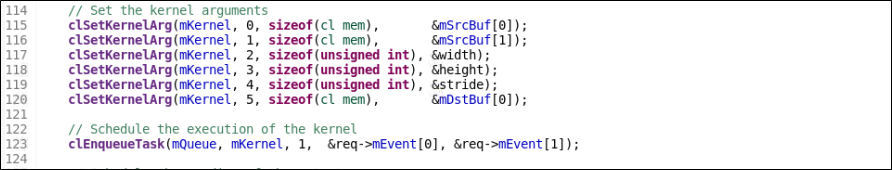
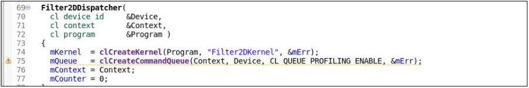

<p align="right">
別の言語で表示: <a href="../../../README.md">English</a>          
</p>

<table>
 <tr>
   <td align="center"><h1>2018.3 SDAccel™ 開発環境チュートリアル</h1>
   <a href="https://github.com/Xilinx/SDAccel-Tutorials/branches/all">ほかのバージョンを参照</a>
   </td>
 </tr>
 <tr>
 <td align="center"><h3>複数の計算ユニットの使用</h3>
 </td>
 </tr>
</table>

## 概要

このチュートリアルでは、FPGA 上のカーネル インスタンスの数を増やすための柔軟なカーネル リンク プロセスを示します。カーネルの各インスタンスは、計算ユニット (CU) とも呼ばれます。このプロセスを使用すると、統合されたホスト/カーネル システムの並列処理が向上します。

## 背景

SDAccel™ ツールでは、デフォルトではカーネルごとに 1 つのハードウェア インスタンス (計算ユニット) が作成されます。ホスト プログラムは、異なるデータ セットに対して同じカーネルを複数回使用できます。この場合、カーネルに対して複数の計算ユニットを生成して、これらの計算ユニットを同時実行すると、システム全体のパフォーマンスを向上できます。  

詳細は、『SDAccel プログラマ ガイド』 ([UG1277](https://japan.xilinx.com/cgi-bin/docs/rdoc?v=2018.3;d=ug1277-sdaccel-programmers-guide.pdf)) を参照してください。

<!-- We should provide some prerequisites for this tutorial, as well as some directions for accessing the lab materials either through cloning the repository or downloading a zip file from xilinx.com.-->

## チュートリアル例の説明

このチュートリアルでは、画像フィルター例を使用して複数の計算ユニットの機能を示します。ホスト アプリケーションは、画像を処理して Y、U、および V プレーンを抽出し、カーネルを 3 回実行して画像の各プレーンをフィルター処理します。デフォルトでは、FPGA にはカーネルのハードウェア インスタンスが 1 つしか含まれないので、これら 3 つのカーネルは同じハードウェア リソースを使用して順次実行されます。このチュートリアルでは、ホスト アプリケーションが呼び出す計算ユニットの数を増やし、Y、U、および V プレーンを同時にフィルター処理する方法を示します。

## 内容

このチュートリアルでは、次を実行します。
1. 新しいアプリケーション プロジェクトを作成し、ソース ファイルをインポートします。
2. ハードウェア エミュレーションを実行し、エミュレーション レポートを参照して、カーネルが順に複数回実行されることを確認します。
3. ホスト コードを変更し、コマンドを順不同に実行できるようにします。
4. カーネル リンク プロセスを変更し、同じカーネルのインスタンスを複数作成します。
5. ハードウェア エミュレーションを再実行し、計算ユニットが同時実行されることを確認します。  

## チュートリアル手順

### ワークスペースの設定

1. 次のコマンドを使用してサンプル デザインのディレクトリに移動します。
   ```
   cd using-multiple-cu/reference-files/
   ```
2. 次のコマンドを使用して SDx™ 環境 GUI を起動します。
   ```
   sdx
   ```
3. ワークスペースを指定し、新しいアプリケーション プロジェクトを作成して、プロジェクトを名前を `filter2d` に指定します。
4. プラットフォームとして `xilinx_u200_xdma_201830_1` を選択します。
5. **[Templates]** ページで **[Empty Application]** を選択し、**[Finish]** をクリックします。

プロジェクトが作成され、指定したワークスペースで開きます。

### デザインの設定

1. [Project Explorer] ビューで `src/host` ディレクトリからホスト ソース ファイルをインポートし、すべてのファイルを選択します。
2. [Project Explorer] ビューで、`src/kernel` ディレクトリから `Filter2DKernel.xo` カーネル オブジェクト ファイルをインポートします。
>**注記**: このチュートリアルで使用するカーネル コードは、既にコンパイル済みのオブジェクト ファイル (.xo) です。実際には、`Filter2DKernel.xo` ファイルは、C/C++ または RTL のいずれかから生成されたものです。コンパイル済みオブジェクト コードから開始する場合は、どちらでも基本的には同じです。`.xo` ファイルから開始しても、リンク プロセスをカスタマイズすることは可能です。
3. メイン プロジェクト ウィンドウで、ハードウェア関数として **Filter2DKernel** を選択します。
4. ホスト コード リンカー オプションを指定します。  
ホスト コードでは、画像ファイルの演算に OpenCV™ ライブラリが使用されるので、関連するリンカー オプションを指定する必要があります。
  1. [Project Explorer] ビューで `filter2d` プロジェクトの最上位フォルダーを右クリックし、**[C/C++ Build Settings]** をクリックします。
  2. [Settings] ダイアログ ボックスの [Tool Settings] タブで、**[SDx GCC Host Linker (x86_64)]** を選択します。
  3. [Settings] ダイアログ ボックスの上部で、**[Configuration]** ドロップダウン リストから **[All Configuration]** を選択し、リンカー オプションがすべてのフローに適用されるようにします。
  4. [Expert Settings: Command line pattern] フィールドの現在の文字列の最後に、次の文字列を追加します。  
```
  -L${XILINX_SDX}/lnx64/tools/opencv -lopencv_core -lopencv_highgui -Wl,-rpath,${XILINX_SDX}/lnx64/tools/opencv
```  
  5. **[Apply and Close]** をクリックします。  

6. ランタイム引数を設定します。  
[Run] メニューから [Run Configurations] をクリックし、[Arguments] タブで **[Program arguments]** フィールドに `-x ../binary_container_1.xclbin -i ../../../../img/test.bmp -n 1` と入力します。

### ハードウェア エミュレーションの実行

**[Active build configuration]** を **[Emulation-HW]** に設定し、**[Run]** ボタン () をクリックしてハードウェア エミュレーションを実行します。

### ホスト コードの確認

エミュレーションを実行中に、ホスト コードを確認してみます。**[Project Explorer]** ビューで `src` フォルダーを展開し、`host.cpp` ファイルをダブルクリックして開きます。

266 ～ 268 行目にスクロールし、Y、U、および V チャネルを処理するためにフィルター関数が 3 回呼び出されていることを確認します。  


この関数は、80 行目から記述されています。下の抜粋部分で、カーネル引数が設定され、カーネルが `clEnqueueTask` コマンドにより実行されます。  


これら 3 つの `clEnqueueTask` コマンドは、1 つの順序どおりのコマンド キューを使用してキューに追加されます (75 行目)。このコマンド キューを使用するすべてのコマンドは、キューに追加された順序で実行されます。  


### エミュレーション結果

ハードウェア エミュレーションの実行が終了したら、左下にある [Assistant] ビューをクリックします。**[Emulation-HW]** → **[filter2d-Default]** を展開します。ここから、プロファイル サマリ (`Profile Summary`) および アプリケーション タイムライン (`Application Timeline`) などの重要なレポートを開くことができます。  


1. **[Profile Summary]** レポートをダブルクリックして **[Reports]** ビューに開きます。  
  * このレポートには、アプリケーションがどうのように実行されたかに関連するデータが表示されます。
  * 「**Top Kernel Execution**」セクションを見ると、カーネルが 3 回実行されていることがわかります。

2. **[Emulation-HW]** の [Application Timeline] レポートを開きます。
   * アプリケーション タイムライン レポートは、ホストとデバイスのイベント情報を収集し、共通のタイムラインに表示します。これは、システムの全体的な状態とパフォーマンスを視覚的に表示して理解するのに役立ちます。
   * タイムラインの最下部に、ホストからキューに追加された各カーネルに 1 本ずつ、合計 3 本の青いバーがあります。1 つの順序どおりのコマンド キューが使用されているので、ホストはカーネル実行を順にキューに追加します。
   * 青いバーの下に、各カーネル実行に 1 本ずつ、合計 3 本の緑色のバーがあります。これらは、FPGA で順に実行されます。  
   


### カーネルを同時にキューに追加するためのホスト コードの変更

ホスト コードの 75 行目を変更して、順不同コマンド キューを宣言します。

変更前:
```
mQueue   = clCreateCommandQueue(Context, Device, CL_QUEUE_PROFILING_ENABLE, &mErr);
```

変更後:
```
mQueue   = clCreateCommandQueue(Context, Device, CL_QUEUE_PROFILING_ENABLE | CL_QUEUE_OUT_OF_ORDER_EXEC_MODE_ENABLE, &mErr);
```
**Ctrl** + **S** キー を押してファイルを保存します。  
>**オプションの手順:** 変更したホスト コードでハードウェア エミュレーションを実行できます。ハードウェア エミュレーションを実行する場合、タイムライン トレースを使用して、順不同コマンド キューを使用することによりカーネルがほぼ同時に実行できるようになることを確認します。

ホストはこれらの実行を同時にスケジューリングできますが、FPGA 上にあるカーネル インスタンスに制限があるので、一部の実行要求は遅れます (FPGA ではカーネルは順次実行される)。  


次の手順では、FPGA 上のカーネル インスタンスの数を増やして、ホスト カーネルを同時に実行できるようにします。

1 つの順不同キューを使用する代わりに、複数の順序どおりのキューを使用して、ホスト コードから同じ同時コマンド実行を達成できます。詳細は、[この SDAccel Github ホスト コード例](https://github.com/Xilinx/SDAccel_Examples/blob/master/getting_started/host/concurrent_kernel_execution_ocl/src/host.cpp)を参照してください。この例では、1 つの順不同コマンド キューを使用した方法と複数の順序どおりのコマンド キューを使用した方法を示しています。

### カーネル インスタンスの数の増加

次の手順に従って、カーネル インスタンスの数を 3 に増加します。
1. **[Filter2D]** タブをクリックして [SDx Project Settings] に戻ります。
2. ウィンドウの下部にある [Hardware Functions] セクションを見つけます。
3. 計算ユニットの数を `1` から `3` に増やします。  


### ハードウェア エミュレーションの実行と変更の確認

1. 先ほどと同様にハードウェア エミュレーションを実行します。
2. 実行が終了したら、プロファイル サマリ レポートを確認します。
3. [Application Timeline] レポートで、カーネル実行がオーバーラップしていることを確認します。  


カーネル リンク プロセスを変更して、FPGA 上の同じカーネル インスタンスを同時に実行する方法を学びました。

### オプションの手順

このチュートリアルでは、ハードウェア エミュレーションを使用してメカニズムを確認しました。[Active Build Configuration] を **[System]** に変更して **[Run]** ボタンをクリックしてコンパイルすると、実際の FPGA ボード上で実行することもできます。実行が終了したら、システム実行からのタイムライン トレース レポートで確認できます。

<hr/>
<p align="center"><sup>Copyright&copy; 2018 Xilinx</sup></p>

この資料は表記のバージョンの英語版を翻訳したもので、内容に相違が生じる場合には原文を優先します。資料によっては英語版の更新に対応していないものがあります。日本語版は参考用としてご使用の上、最新情報につきましては、必ず最新英語版をご参照ください。