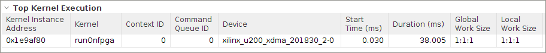

<table>
 <tr>
   <td align="center"><h1>2019.2 Vitis™ Application Acceleration Development Flow Tutorials</h1>
   <a href="https://github.com/Xilinx/SDAccel-Tutorials/branches/all">See SDAccel™ Development Environment 2019.1 Tutorials</a>
   </td>
 </tr>
 <tr>
 <td align="center"><h1>Optimizing Accelerated FPGA Applications: Bloom Filter Example
 </td>
 </tr>
</table>

# 2. Creating a Vitis Core Development Kit Application from the C Application

From the host code, you saw that the `runOnCPU` function is contributing to 73% of application's execution time, and you want to accelerate it. To accelerate performance, you are going to move that function into a kernel to run on the FPGA accelerator card.

This lab discusses the process for converting a C++ function into a hardware kernel and evaluating its performance. You will also establish the baseline performance numbers for the accelerated application that you will use to compare to each additional optimization in the subsequent labs. You are going to take your first FPGA kernel and run it in hardware emulation. Because you will be running your kernel in hardware emulation, only use 100 documents to keep the an acceptable runtime.

To measure the performance, use the Kernel Detail Trace and Timeline Trace reports. For details about these reports, refer to the [Generating Profile and Trace Reports](./Pathway3/ProfileAndTraceReports.md) lab in the Essential Concepts for Building and Running the Accelerated Application tutorial.

## Host Code

You must determine the number of documents to send from host to FPGA in each iteration. For information about the amount of data that is ideal for sending data from host to FPGA, refer to [Optimize Data Transfers to and from the Device](https://www.xilinx.com/html_docs/xilinx2019_2/vitis_doc/Chunk1068711200.html#yfz1555544741101) in the [Methodology for Accelerating Applications with the Vitis Unified Software Platform](https://www.xilinx.com/html_docs/xilinx2019_2/vitis_doc/Chunk1068711200.html#wgb1568690490380).

In practical applications with data analytics, the data can be too large to fit in the FPGA memory. This approach will help transfer the data in chunks from host to FPGA. In this tutorial, you will send 2 MB of data in each iteration because transferring 2 MB of data in one iteration gives the best performance.

1. Look at the `run.cpp` file, which creates kernels, command queues, and buffers based on OpenCL API from line 19 to 41.

   You have added the variable `size_per_iter_const` at line 15, which presents the number of 4-byte words transferred in each iteration. Because you are sending 2 MB of data, **size = 2x1024x1024/4 = 512x1024 words**.

   Because the entire size of all documents can be less than 2 MB, you will also define `size_per_iter` which is the minimum size of `size_per_iter_const` and total document size.

   ```
    unsigned int size_per_iter_const = 512*1024;
    unsigned int size_per_iter;
   ```

   Kernel arguments are set in lines 37 and 38.

   * All the input arrays except input_words are transferred in one call because the arrays can fit in global memory in one call and the values are constant for the entire application. The `input_words` array size can be very large. In practical applications with data analytics, the data can be too large to fit in one array.

   * If the size of the array is too large, you will have to transfer the data in chunks and this will also allow for overlap of data and compute, which is covered in the later optimizations.

   * Lines 43 and 44 represent the data transfer of `buffer_profile_weights` and `buffer_bloom_filter` arrays using `enqueueMigrateMemObjects`.

2. In line 48, calculate the number of iterations, `num_iter` required to transfer the entire data from the host to FPGA.

3. From lines 65 to 69, use sub buffers for `buffer_doc_sizes` and `buffer_fpga_profileScore` buffers because you will be using a section of the arrays in each iteration of compute. Specify the offset and the size of the sub-buffers using `cl_buffer_region` in lines 65 and 66.

   You will create the sub-buffers from original buffer in lines 69 and 70.

4. While using sub-buffers, only set the kernel argument for the original buffer in the first iteration. For the rest of the iterations, use the sub-buffers. The code can be seen in lines 73 to 80.

5. From lines 53 to 89, transfer the data from buffer_input_words buffer in host memory to kernel DDR memory in each iteration call using `enqueueMigrateMemObjects` and call the kernel using `enqueueTask`.

6. At line 57, create an event `ef` to ensure that you read the output buffer only after compute operation is completed.

7. Create vector of events `eventlist` to store all the events generated in step 8.

8. After the data transfer and compute are complete, read the results from kernel DDR memory to host using `enqueueMigrateMemObjects` as shown in line 91 using `eventlist` as an argument.

## Kernel Code Modifications

Use the following instructions to convert the C++ code into kernel code, and convert the `runOnCPU` function into a hardware accelerated kernel to run on the FPGA.

>**TIP:** The completed kernel source file is provided in the `reference-files/baseline_fpga` folder. You can use it as a reference.

1. Select the `compute_score_host.cpp` from the `cpu_src` folder, and make a copy called `compute_score_fpga.cpp`.

2. Open `compute_score_fpga.cpp` file, and rename the `runOnCPU` function to `runOnfpga`.

3. Rename `cpu_profileScore` array  with `fpga_profileScore`.

3. Add the following HLS INTERFACE pragmas at the beginning of the function, within the braces.

   ```
   #pragma HLS INTERFACE s_axilite port=return bundle=control
   #pragma HLS INTERFACE s_axilite port=doc_sizes bundle=control
   #pragma HLS INTERFACE s_axilite port=input_doc_words bundle=control
   #pragma HLS INTERFACE s_axilite port=bloom_filter bundle=control
   #pragma HLS INTERFACE s_axilite port=profile_weights bundle=control
   #pragma HLS INTERFACE s_axilite port=fpga_profileScore bundle=control
   #pragma HLS INTERFACE s_axilite port=total_num_docs bundle=control
   ```

   The FPGA kernel must have a single AXI4-Lite slave control interface (`s_axilite`), which allows the host application to configure and communicate with the kernel. All function arguments including the return must be mapped to this control interface using dedicated pragmas.

4. Each pointer argument must also be mapped to an AXI memory mapped master port (`m_axi`) using a dedicated pragma. Add the following pragmas to the function.

   ```
   #pragma HLS INTERFACE m_axi port=doc_sizes offset=slave bundle=gmem1
   #pragma HLS INTERFACE m_axi port=input_doc_words offset=slave bundle=gmem2
   #pragma HLS INTERFACE m_axi port=bloom_filter offset=slave bundle=gmem3
   #pragma HLS INTERFACE m_axi port=profile_weights offset=slave bundle=gmem4
   #pragma HLS INTERFACE m_axi port=fpga_profileScore offset=slave bundle=gmem4
   ```

   * The AXI Master ports are used by the kernel to access data in the global memory.
   * The base address of the data (offset) is provided to the kernel through the previously defined control interface (slave).
   * The bundle property of the pragma allows you to name the interface ports.

   >**NOTE**: You will be using a single port for "profile_weights" and "fpga_profileScore" because they are not used simultaneously. Although you could have used even fewer ports, you are using four ports because it will create conflicts in later optimizations(dataflow) when you are reading two arrays with same ports in the same function with dataflow enabled.

5. For the inner loop, which iterates over document size, add the following pragma for tripcount.

   ```
   #pragma HLS loop_tripcount min=3000 max=4000 avg=3500
   ```

   Although this pragma does not impact the result of the application, it will report the any bottlenecks due to stalling when it knows the size of the loop. In this case, the estimates of the loop size were written based on the document size created from host code.

6. Save the `compute_score_fpga.cpp` file.

## Run Hardware Emulation

1. Go to the `makefile` directory, and use the following commands to run hardware emulation.

   ```
   cd design/makefile
   make run TARGET=hw_emu STEP=baseline_fpga SOLUTION=1 NUM_DOCS=100
   ```

   >**TIP:** The modifications for each lab can made from the `src` directory. The completed code is also provided for all the optimizations in this lab. If you just want to run the results, you do not need to modify the code; you can enable this by setting `SOLUTION=1`.

## View Reports for Hardware Emulation

Use the following command to view the Profile Summary and Timeline Trace reports in Vitis analyzer.

```
make view_report TARGET=hw_emu STEP=baseline_fpga
```

## Profile Summary for Hardware Emulation

1. Click at the Profile Summary report in Vitis analyzer which displays as follows.

   
  
2. Capture the performance data from Profile Summary report, and add it to the following table.

   | Step                            | Number of Documents   | Average Document Size(kB) | Time (Hardware) (ms) | Throughput (MBps) |
   | :-----------------------        | :----------- | ------------: | ------------------: | ----------------: |
   | CPU                       |     100 |           16 |              11.23 |   124.67        |
   | baseline                   |     100 |           16 |             38|  36.84          |
   ---------------------------------------

## Timeline Trace Report for Hardware Emulation

Select the Timeline Trace report in Vitis analyzer, which displays as follows.


You can see that compute happens only after the entire data transfer is done, and that the kernel takes up most of the execution time.

## View Kernel Detail Trace for Hardware Emulation

The following lines are already added in the `xrt.ini` file to open the Kernel Detail Trace report, generate the Profile Summary and Timeline Trace reports while running hardware emulation.

```
[Emulation]
launch_waveform=gui
[Debug]
profile=true
timeline_trace=true
data_transfer=fine
```

The following figure shows the Kernel Detail Trace report generated when you run the application for hardware application.


As you can see in the figure, the compute unit (CU) stalls are 50%. You can see that it is due to *External Memory* stalls. If you look at the “data transfers” in detail, the "CU Stalls" are caused primarily due to "Top Level External Memory Stalls". If you take a look at global memory accesses, you can observe that the CU stalls mainly overlap with `gmem3`, which is the `bloom_filter` array. There are also sparse memory accesses from `gmem2` and `gmem4` caused by the `input_doc_Words` and `fpga_profileScore` arrays respectively.

Because there are bottlenecks associated with the kernel, you will first focus on optimizing kernel code to achieve better throughput. You have identified that the memory transfers in `gmem3` seem to be a major bottleneck`. To optimize data transfer to the kernel, complete the following steps:

1. Run the following command to look at Kernel Guidance from the compile summary report in Vitis analyzer.

   ```
   vitis_analyzer -open runOnfpga.hw_emu.xilinx_u200_xdma_201830_2.xo.compile_summary
   ```

2. Click **Kernel Guidance** to look at potential ways to improve performance in kernel.

   From the Kernel Guidance report, you can see certain loops with an II and any burst inference is not happening. Usually, burst inferences occur when data is accessed sequentially from global memory. In designs where random access of global memory occurs, burst inference do not occur.

   * The burst inference occurs on `gmem1`and `gmem2`. It does not occur on `gmem3` and `gmem4` because the `profile_weights` and `fpga_profileScore` arrays are accessed randomly in the design.

   * The II is 15 because the `gmem4` port is randomly accessed continuously.

## Next Step

In the next section, you will examine how to [optimize memory transfers](./localbuf.md) between kernel and global memory.
</br>
<hr/>
<p align="center"><b><a href="/docs/vitis-getting-started/">Return to Getting Started Pathway</a> — <a href="./README.md">Return to Start of Tutorial</a></b></p>

<p align="center"><sup>Copyright&copy; 2019 Xilinx</sup></p>
