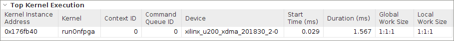
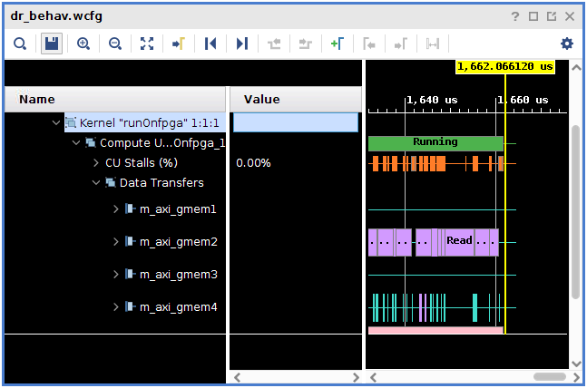

<table>
 <tr>
   <td align="center"><h1>2019.2 Vitis™ Application Acceleration Development Flow Tutorials</h1>
   <a href="https://github.com/Xilinx/SDAccel-Tutorials/branches/all">See SDAccel™ Development Environment 2019.1 Tutorials</a>
   </td>
 </tr>
 <tr>
 <td align="center"><h1>Optimizing Accelerated FPGA Applications: Bloom Filter Example
 </td>
 </tr>
</table>

# 4. Optimizing with Dataflow

In the last lab, you improved the efficiency of the kernel by copying the bloom filter array from the global memory to the local memory. In this lab, you will look at the structure of your code to increase task and instruction level parallelism. Pipelining is a common technique used by most processors to parallelize at the instruction level. Pipelining allows the processor to simultaneously process multiple instructions at the same time by executing them on hardware that has finished the previous instruction.

The Vitis compiler automatically pipelines most operations. You do not need to add anything to enable pipelining in your code. You can look at how each of the loops have been pipelined in the HLS report.

While pipelining usually works at the instruction level, the Vitis tool can also pipeline at the function level using a transformation called dataflow. Dataflow allows you to pipeline multiple functions, so you can execute their instructions simultaneously on different sets of iterations. The following figure shows an example.

Without using dataflow, `func_A`, `func_B`, and `func_C` are executed sequentially. With dataflow enabled, the three functions can overlap, which will reduce the total execution time.

In this lab, in order to implement the functions in dataflow, first divide the original bloom filter function into two separate functions:

* `read_dataflow`: Read the data.
* `compute_dataflow`: Compute the document score for each document and write into the array.

The two functions will use streams to pass data between them. To understand streams, refer to *HLS Stream Library* in the *Vivado Design Suite User Guide High-Level Synthesis* ([UG902](https://www.xilinx.com/support/documentation/sw_manuals/xilinx2019_2/ug902-vivado-high-level-synthesis.pdf)). Streams allow you to process data at the data element level. Using streams, the next module can immediately start processing the element as soon as it is inserted into the stream variable.

## Host Code Modifications

 Add an extra argument, `size` to indicate the total size of the data transfer of words in the document because it is helpful while streaming data in the kernel.

 At line 87, add the following line.

```
kernel.setArg(7,flag);
```

## Kernel Code Modifications

>**TIP:** The completed kernel source file is provided under the `reference-files/dataflow` folder. You can use it as a reference.

1. In `src/dataflow`, open `compute_score_fpga.cpp`.

2. Add an extra argument, in `runOnfpga` function, `total_size` to represent the total size of input data sent to the kernel.

   >**NOTE:** Although you could have iterated the size based on `doc_sizes` array, you have separately passed the `total_size` scalar argument. Because the `doc_sizes` array is used in `compute_score` function and `read_dataflow` function (see the following explanation), dataflow functionality cannot be implemented because the array is read in two separate functions.

   ```
   void runOnfpga (unsigned int* doc_sizes,unsigned int* input_doc_words,unsigned int* bloom_filter,unsigned long* profile_weights,unsigned long* fpga_profileScre,unsigned int total_num_docs,bool load_weights)
   ```

   To:

   ```
   void runOnfpga (unsigned int* doc_sizes,unsigned int* input_doc_words,unsigned int* bloom_filter,unsigned long* profile_weights,unsigned long* fpga_profileScore,unsigned int total_num_docs,unsigned int total_size,bool load_weights)
   ```

3. Because you want to divide the main function into sun functions, remove  lines 43 to 68 and create a new function `compute_score` containing these lines.

4. Modify the structure of the `runOnfpga` function to call the two sub-functions using a wrapper function.

   Create a wrapper function to call the two sub-functions because dataflow cannot be applied in the codeblock where there are divergent paths. In this case, you have an `if` loop, which loads bloom filter array from DDR to the local memory, depending on whether it is the first kernel call. Therefore, you create a wrapper function and enable dataflow inside this wrapper function.

   Add the following line in `runOnfpga` function.

   ```
   wrapper(doc_sizes,input_doc_words,bloom_filter_local,profile_weights,fpga_profileScore,total_num_docs,total_size);
   ```
  
5. Define the `wrapper` function, which has two sub functions, `read_dataflow` and `compute_score`. Also, create a stream for pipelining the data between the function calls. Add the following lines.

  ```
  void wrapper(unsigned int* doc_sizes,unsigned int* input_doc_words,unsigned int* bloom_filter_local,unsigned long* profile_weights,unsigned long* fpga_profileScore,unsigned int total_num_docs,unsigned int total_size) {
   
  hls::stream<unsigned int> read_stream("read");

  #pragma HLS dataflow

 read_dataflow(read_stream,input_doc_words,total_size) ;
 compute_score (doc_sizes,read_stream,bloom_filter_local,profile_weights,fpga_profileScore,total_num_docs);
 }
   ```

6. Next, create the two sub-functions one by one. First, start with the `read_dataflow` function.

   This function is created to read data from the global memory, and using streams, pass it to the data to the next function. Internally, streams are implemented using FIFOs, where writes and read occur asynchronously.

   The completed function should be similar to the following.

   ```
   void read_dataflow(hls::stream<unsigned int>& read_stream,const unsigned int* input_doc_words,unsigned int total_size) {

   for(int index=0;index<total_size;index++)
    read_stream << input_doc_words[index];

   }
   ```

   * The hls::stream objects are defined in the `hls_stream.h` header. 
   * The `<<` operator is used to insert values into a stream.

7. Now, work on the `compute_score` function. This is the most complicated function because it will read in the streaming data from the `read_flow` function and compute it. The output data will be written to the `write_stream`.

   The code snippet for `compute_score` is as follows:

   ```
   for(unsigned int doc=0;doc<total_num_docs;doc++) {

   unsigned long ans = 0;
   unsigned int size = doc_sizes[doc];

   for (unsigned int i=0; i < size; i++)
   {

         unsigned int curr_entry;
        read_stream >> curr_entry;
         unsigned int frequency = curr_entry & 0x00ff;
         unsigned int word_id = curr_entry >> 8;
         unsigned hash_pu = MurmurHash2( &word_id,3,1);
         unsigned hash_lu = MurmurHash2( &word_id,3,5);
         bool doc_end= (word_id==docTag);
         unsigned hash1 = hash_pu&hash_bloom;
         bool inh1 = (!doc_end) && (bloom_filter_local[ hash1 >> 5 ] & ( 1 << (hash1 & 0x1f)));
         unsigned hash2=(hash_pu+hash_lu)&hash_bloom;
         bool inh2 = (!doc_end) && (bloom_filter_local[ hash2 >> 5 ] & ( 1 << (hash2 & 0x1f)));

         if (inh1 && inh2)
         {
            ans += profile_weights[word_id] * (unsigned long)frequency;
         }
   }
        fpga_profileScore[doc]=ans;
   }

    }
   ```

## Run Hardware Emulation

Go to the `makefile` directory, and use the following command to run hardware emulation.

```
make run TARGET=hw_emu STEP=dataflow SOLUTION=1 NUM_DOCS=100
```

## Generate Reports for Hardware Emulation

Use the following command to generate the Profile Summary and Timeline Trace reports.

```
make view_report TARGET=hw_emu STEP=dataflow
```

## Profile Summary for Hardware Emulation

   1. Click the Profile Summary report in the Vitis analyzer, which displays as follows.

        

   2. Capture the performance data from Profile Summary report and add it to the following table.

   | Step                            | Number of Documents   | Average Document Size(kB) | Time (Hardware) (ms) | Throughput (MBps) |
   | :-----------------------        | :----------- | ------------: | ------------------: | ----------------: |
   | CPU                       |     100 |           16 |              12.6 |   130.03        |
   | baseline                   |     100 |           16 |             10.42|  157.236            |
   | localbuf                 | 100 | 16| 1.67 | 981.078 |
   | dataflow                 | 100 | 16|  | 1.56  | 1025.64 |
---------------------------------------

 You do not see much performance improvements from this step because the II for the compute loops inside `compute_score` function is already 1, so performance is not largely impacted.

## Timeline Trace for Hardware Emulation

Click the Timeline Trace report in the Vitis analyzer which displays as follows.


You can see that compute happens only after entire data transfer is done, and the kernel takes up most of the execution time.


## Kernel Detail Trace for Hardware Emulation

The Kernel Detail Trace report is automatically generated as part of the hardware emulation run. The following figure in the Kernel Detail Trace shows the CU stalls with the memory transfer optimization.



The CU stalls are mainly due to `gemem4`, which corresponds to the `profile_weights` array in DDR memory. The accesses to this memory are not sequential and the size is too large to fit in the local memory. Because these accesses correspond to 1% of total access, the stalls are acceptable.

## Next Step

In the next section, you will examine how to increase the performance by [increasing the CUs](./multicu.md) to process items in parallel.
</br>
<hr/>
<p align="center"><b><a href="/docs/vitis-getting-started/">Return to Getting Started Pathway</a> — <a href="./README.md">Return to Start of Tutorial</a></b></p>

<p align="center"><sup>Copyright&copy; 2019 Xilinx</sup></p>
