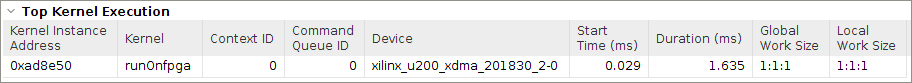
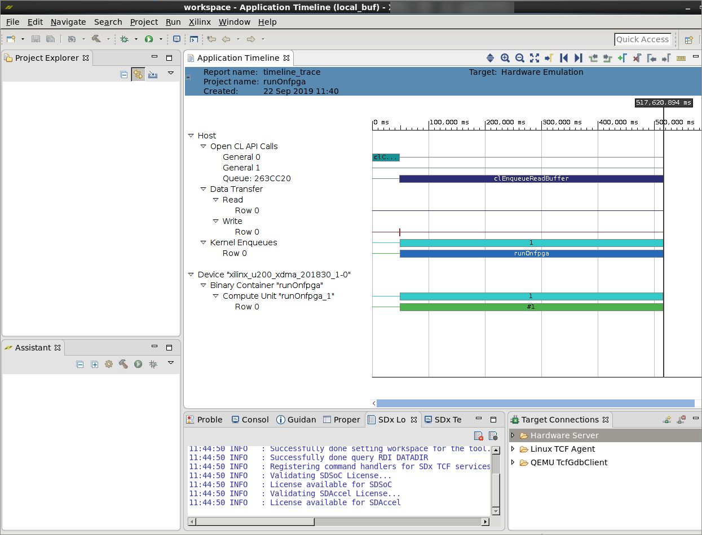

<table>
 <tr>
   <td align="center"><h1>2019.2 Vitis™ Application Acceleration Development Flow Tutorials</h1>
   <a href="https://github.com/Xilinx/SDAccel-Tutorials/branches/all">See SDAccel™ Development Environment 2019.1 Tutorials</a>
   </td>
 </tr>
 <tr>
 <td align="center"><h1>Optimizing Accelerated FPGA Applications: Bloom Filter Example
 </td>
 </tr>
</table>

# 3. Optimizing Memory Transfers

In the last lab, you established a baseline performance of the application using 100 documents and identified memory bottlenecks. In this lab, you will remove redundant memory accesses, and optimize the data movement between the kernel and global memory.

You identified that `gmem3` has a major memory bottleneck causing stalls in the function. From the source code, you can see that you have random accesses to that memory for every iteration, which is stalling the system up to 50%.

This might not be a problem on modern CPUs because most processors have a hardware-controlled cache that stores the data automatically on a very fast local cache. However, on an FPGA, this needs to be done explicitly by creating and copying the data into a local array in the hardware kernel.

The reads can then be performed from the local array, just as from the global memory. Once the data is read from the global memory to local memory, there is no need to access the global memory. The advantage here is that local memory has much higher bandwidth than global memory, which improves the throughput of the system if global memory access is a bottleneck.

The size of the `bloom_filter` array is 64 KB, so you can optimize the memory accesses from `bloom_filter` array by copying from global memory to local memory. There are also memory bottlenecks with the `profile_weights` array and `input_words` array.

The size of `profile_weights` is **(2^24)\*8B=128 MB**. The size is greater than the available memory inside the device, so you cannot copy this data into the local memory. Because there are smaller number of accesses to this array based on whether the word is potentially found in the bloom filter, you are not copying the memory into the local memory.

 Each word in the `input_doc_words` array is accessed only once by the kernel, and there is also burst inference happening on this array; therefore, it is not suggested to copy this array to the local memory because there is no data reuse occurring on the application side.

## Host Code Modifications

1. Add an extra boolean argument `flag` at line 58, so that it can be used to transfer `bloom_filter`array from the global memory to the local memory only in the first enqueue call to kernel.

   ```
   bool flag=false;
   ```

    Because the data in `bloom_filter` array is constant, you can improve the efficiency of transfer by only sending data once.

2. Set `flag` to `true` for only the first iteration at line 84, and set kernel argument.

   ```
    if(iter==0)
    flag=true;
   kernel.setArg(6,flag);
   ```

## Kernel Code Modifications

1. Add an extra boolean argument `load_weights` in the `runOnCPU` function.

   Because you are calling the kernel multiple times, it is more efficient to copy the `bloom_filter` array to local memory only in the first call to the kernel. This extra argument indicates whether it should load the `bloom_filter` from DDR to the local memory.

   ```
   void runOnfpga (unsigned int* doc_sizes,unsigned int* input_doc_words,unsigned int* bloom_filter,unsigned long* profile_weights,unsigned long* fpga_profileScore,unsigned int total_num_docs)
   ```
  
   To:

   ```
   void runOnfpga (unsigned int* doc_sizes,unsigned int* input_doc_words,unsigned int* bloom_filter,unsigned long* profile_weights,unsigned long* fpga_profileScore,unsigned int total_num_docs,bool load_weights)
   ```

2. Add an extra `s_axilite` pragma for the `load_weights` argument.

   ```
   #pragma HLS INTERFACE s_axilite port=load_weights bundle=control
   ```

3. After the last pragma in the function body, add the following lines.

   ```
   static unsigned int bloom_filter_local[bloom_filter];
   if(load_weights==true)
   memcpy(bloom_filter_local,bloom_filter,bloom_size*sizeof(unsigned int));
   ```

   These lines create a `bloom_filter_local` array that store the filter coefficients only when `load_weights` is set to true and is enabled in the host code. The `bloom_filter_local` array is going to be synthesized on the FPGA using block RAM resources. Access to block RAM has significantly lower latency than the on-board DDR memory.

4. Now that you have created the cached `bloom_filter_local` array, modify the rest of the code to use that array. Change the following lines in the inner loops (lines 59 and 60).

   ```
    bool inh1 = bloom_filter[ hash1 >> 5 ] & ( 1 << (hash1 & 0x1f));
    bool inh2 = bloom_filter[ hash2 >> 5 ] & ( 1 << (hash2 & 0x1f));
   ```

    To:

   ```
   bool inh1 = bloom_filter_local[ hash1>> 5 ] & ( 1 << (hash1 & 0x1f));
   bool inh2 = bloom_filter_local[ hash2 >> 5 ] & ( 1 << (hash2 & 0x1f));
   ```

5. From the code, you also see that `fpga_profileScore` is repeatedly accessed to store the cumulative sum. Instead of accessing `fpga_profileScore` continuously, use a local variable to calculate the sum and only store it in `fpga_profile_score` once, which will save accesses to the global memory.

   Create a local variable `ans` following the `for` loop at line 52.

     ```
     unsigned long ans=0;
     ```

6. Modify line 76 to have `ans` instead of `fpga_profile_score[doci]`.

   ```
   fpga_profile_score[doci] += profile_weights[word_id] * (unsigned long)frequency;
                 }
             }
   ```

   To :

   ```
   ans += profile_weights[word_id] * (unsigned long)frequency;
                }
            }
             fpga_profile_score[doc]=ans;
   ```

Now you have completed all the modifications, run hardware emulation with the optimized code.

## Run Hardware Emulation

Go to the `makefile` directory, and use the following command to run hardware emulation.

```
make run TARGET=hw_emu STEP=localbuf SOLUTION=1 NUM_DOCS=100
```

## Generate Reports for Hardware Emulation

 Use the following command to generate the Profile Summary and Timeline Trace reports.

   ```
   make view_report TARGET=hw_emu STEP=localbuf
   ```

## Profile Summary for Hardware Emulation

 1. Click the `Profile Summary` report in the Vitis analyzer, which displays as follows.

    

 2. Capture the performance data from Profile Summary report, and add it to the following table.

    | Step                            | Number of Documents   | Average Document Size(kB) | Time (Hardware) (ms) | Throughput (MBps) |
    | :-----------------------        | :----------- | ------------: | ------------------: | ----------------: |
    | CPU                       |     100 |           16 |              11.23 |   124.67        |
    | baseline                   |     100 |           16 |             38|  157.236            |
    | localbuf                 | 100 | 16| 1.67 | 838.32
    ---------------------------------------

## Timeline Trace for Hardware Emulation

 Click the `Timeline Trace` report in the Vitis analyzer, which displays as follows.

   

You can see that compute happens only after entire data transfer is done, and the kernel takes up most of the execution time.

   

## View Kernel Detail Trace for Hardware Emulation

The Kernel Detail Trace report is automatically generated as part of the hardware emulation run. The following figure in Kernel Detail Trace shows the CU stalls with the memory transfer optimization.

   

The CU stalls are now comparatively reduced. As you can see from the Kernel Detail Trace, the stalls mainly overlap with `gmem4`. This is because the array `h_profile_weights` is accessed randomly from the global memory.

You cannot transfer this memory to local memory because it is large, and you cannot optimize the data transfers by burst access because the accesses are random. Because the number of accesses are less, the performance impact due to this stalls is comparatively minimal.

## Next Step

In the next section, you will examine how to increase the performance by streamlining the data transfers from global memory to kernel using [dataflow-based streaming](./dataflow.md).
</br>
<hr/> 
<p align="center"><b><a href="/docs/vitis-getting-started/">Return to Getting Started Pathway</a> — <a href="./README.md">Return to Start of Tutorial</a></b></p>

<p align="center"><sup>Copyright&copy; 2019 Xilinx</sup></p>
