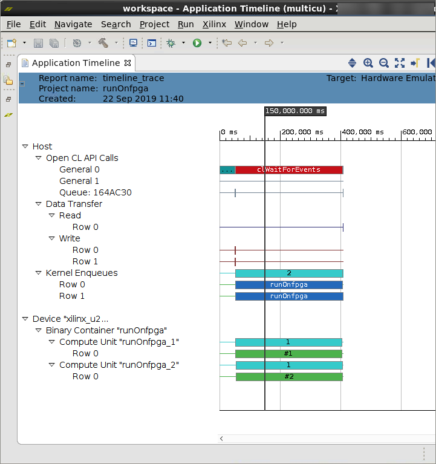

<table>
 <tr>
   <td align="center"><h1>2019.2 Vitis™ Application Acceleration Development Flow Tutorials</h1>
   <a href="https://github.com/Xilinx/SDAccel-Tutorials/branches/all">See SDAccel™ Development Environment 2019.1 Tutorials</a>
   </td>
 </tr>
 <tr>
 <td align="center"><h1>Optimizing Accelerated FPGA Applications: BLoom Filter Example
 </td>
 </tr>
</table>

# 5. Using Out-of-Order Queues and Multiple Compute Units

In the previous labs, you concentrated on extracting parallelism within a kernel using techniques, such as pipelining and dataflow. One of the very powerful features of FPGAs is that you can create multiple compute units (CUs), which are identical copies of your kernel, allowing more processing to happen in parallel. As previously discussed, there are several ways of achieving parallelism ⁠— by either widening the datapath of the CU or replicating the CU. You are taking the latter approach for this lab because it is easier to code, and you can reach the expected throughout of 2.6 GB/s by replicating the CUs. These CUs can be used to process multiple documents at the same time, so you can process each document faster.

To take advantage of acceleration potential offered by the multiple CUs, the host application needs to issue and manage multiple concurrent requests to the CUs. For maximum performance, it is important to ensure that the application keeps all the CUs busy. Any delay in transferring data or starting a CU will reduce the overall performance.

Another advantage of out-of-order queues is that you can overlap data transfer for next iteration with the compute of the current iteration, which will speed up the computation. This is very useful in data analytics applications, where the data is too large to fit in FPGA memory and therefore must be transferred in chunks.

In this lab, you will first implement changes in the host code to handle multiple CUs.

## Executing Queued Operations Out-of-Order

The host application uses OpenCL™ APIs to communicate with kernels on an FPGA. Those commands are executed through a command queue object. By default, the command queue is handled in order; however, you can change this behavior to execute your operations in any order by passing a special flag to the command queue. This type of queue will execute whatever operation is ready to execute as soon as the resources are available.

Out-of-order queues allow you to launch multiple operations at the same time, including memory transfers and kernel calls. You can add dependencies on tasks using OpenCL API events and wait lists. Events are objects that are associated with a particular task. If an operation depends on another task, you can pass the event into a wait list. The operation will need to wait for all events in the wait list to finish before executing.

  Because the computation of different documents are independent of each other, you can overlap the data transfer and compute of one CU with other CUs.

>**TIP:** The completed host code source file is provided under the `reference-files/multicu` folder. You can use it as a reference if needed.

To take advantage of the out-of-order queues and events, modify the host program.

1. From `src/multicu`, open the `run.cpp` file, and modify the following line.

   
   ```
   cl::CommandQueue q(context,device,CL_QUEUE_PROFILING_ENABLE);
   ```

   To:

   ```
   cl::CommandQueue q(context,device,CL_QUEUE_PROFILING_ENABLE|CL_QUEUE_OUT_OF_ORDER_EXEC_MODE_ENABLE);
   ```

2. Create an event `eve` inside  the `num_iter` loop to initially store the event after the `enqueueMigrateMemObjects` data transfer.

    ```
    for(unsigned int iter=0;iter<num_iter;iter++) {
    ...
    q.enqueueMigrateMemObjects({buffer_input_words},0);
   ...
    }
   ```

   To:

   ```
   for(unsigned int iter=0;iter<num_iter;iter++) {
   ...
   cl::Event eve;
   q.enqueueMigrateMemObjects({buffer_input_words},0,NULL,&eve);
   ...
   ```

3. Create vector of events `waitlist` to store the event `eve` after the data transfer of `input_words` inside the `num_iter` loop.

   This is used as an input vector array for the `enqueueTask` operation, which waits until the data transfer is completed. The compute should always begin after data transfer is done. Because you are transferring the data for each data transfer call of `num_iter`, create the following vector within the inner for loop of `num_iter`.

   Modify the lines as follows.

   ```
   for(unsigned int iter=0;iter<num_iter;iter++) {
   ...
   vector<cl::Event> waitlist;
   q.enqueueMigrateMemObjects({buffer_input_words},0,NULL,&eve);
   waitlist.push_back(eve);
   ...
   }
   ```

4. At line 86, create an event `ef` to initially store the event after the compute (`enqueueTask`).

    Because `enqueueTask` must wait for `enqueueMigrateMemObjects` to complete, add `&waitlist` in the input vector.

   Change the lines as follows.
   ```
   for(unsigned int iter=0;iter<num_iter;iter++) {
   ...
   q.enqueueTask(kernel);
   ...
   }
   ```

   To:

   ```
   for(unsigned int iter=0;iter<num_iter;iter++) {
   ….
   cl::Event ef;
   q.enqueueTask(kernel,&waitlist,&ef);…
   }
   ```

5. Create vector of events `eventlist`, which stores the event `ef` after compute operation (`enqueueTask`) is done inside the `num_iter` loop

   This is used as an input vector for the final read operation of output buffer (fpga_profile_score). The reads of output buffer should happen only after the `enqueueTask` compute is completed. You will use the event `ef` generated from previous step and store it in the vector `eventlist`.

   Modify the lines as follows.

   ```
    vector<cl::Event> eventlist;
    for(unsigned int iter=0;iter<num_iter;iter++) {
    ...
    cl::Event ef;
    q.enqueueTask(kernel,&waitlist,&ef);
    eventlist.push_back(ef);
    ...
   }
   
   q.enqueueMigrateMemObjects({buffer_fpga_profileScore},CL_MIGRATE_MEM_OBJECT_HOST,&eventlist,NULL);

   ```

## Using Multiple Compute Units

In previous labs, only one CU is used for the kernel. In this section, you will modify the host code to use multiple CUs, and each CU will process a small number of documents. You will modify the kernel so that it performs the compute for only document.

### Host Code Updates to Support Multiple CUs

1. You have chosen 2 as the number of CUs. Open the `run.cpp` file and add the following lines.

   ```
   unsigned int num_compute_units=2;
   vector<cl::Kernel> kernel(num_compute_units);

   for(unsigned int i=0;i<num_compute_units;i++) {
   string s = kernel_name+":{"+kernel_name + "_"+ to_string(i+1)+"}";

   kernel[i] = cl::Kernel(program,s.c_str(),NULL);
   }
   ```

   You are creating a vector of kernels and each kernel is being associated with its kernel name. For example, the kernel is created as follows.

   ```
   Kernel[0] = cl::kernel(program,runOnfpga:{runOnfpga_1});
   ```

2. Create new buffers for the CUs, so that each CU can have its own input array, such as `input_words`, `doc_sizes`, `profile_weights`, and `bloom_filter`.

   Instead of creating new buffers for each CU, you could have used the same buffers for the different CUs. Then there will be memory contention because the CUs are trying to access the same buffer simultaneously; hence, you are replicating the buffers. This approach also has the drawback of using of DDR ports used by the kernel and DDR can have a maximum of 16 ports. Because you are more focused on performance here, replicate the number of buffers, so a total of eight DDR ports will be consumed for two CUs (four ports for each CU).

   ```
   cl::Buffer buffer_input_words;
   cl::Buffer buffer_doc_sizes...
   cl::Buffer buffer_bloom_filter...
   cl::Buffer buffer_profile_weights...
   cl::Buffer sub_buffer;
   cl::Buffer doc_sizes_sub_buffer;
   ```

   To:

   ```
   cl::Buffer buffer_input_words[num_compute_units];
   cl::Buffer buffer_doc_sizes(context, CL_MEM_USE_HOST_PTR | CL_MEM_READ_ONLY,total_num_docs\*sizeof(uint),doc_sizes);
   cl::Buffer buffer_bloom_filter[num_compute_units];
   cl::Buffer buffer_profile_weights[num_compute_units];
   cl::Buffer sub_buffer[num_compute_units];
   cl::Buffer doc_sizes_sub_buffer[num_compute_units];
   ```

3. Set the kernel arguments.

    ``` 
    buffer_bloom_filter =  cl::Buffer(context, CL_MEM_USE_HOST_PTR | CL_MEM_READ_ONLY, bloom_size*sizeof(uint),bloom_filter);
    buffer_profile_weights = cl::Buffer(context, CL_MEM_USE_HOST_PTR | CL_MEM_READ_ONLY, profile_size*sizeof(ulong),profile_weights);
    kernel.setArg(2,buffer_bloom_filter);
    kernel.setArg(3,buffer_profile_weights);
    ```

   To:

    ```
   for(unsigned int i=0;i<num_compute_units;i++) {
   buffer_bloom_filter[i] =  cl::Buffer(context, CL_MEM_USE_HOST_PTR | CL_MEM_READ_ONLY, bloom_size*sizeof(uint),bloom_filter);
   buffer_profile_weights[i] = cl::Buffer(context, CL_MEM_USE_HOST_PTR | CL_MEM_READ_ONLY, profile_size*sizeof(ulong),profile_weights);
   kernel[i].setArg(2,buffer_bloom_filter[i]);
   kernel[i].setArg(3,buffer_profile_weights[i]);
   }
   ```

4. To transfer the data from the host memory to DDR memory for  `buffer_profile_weights` and `buffer_bloom_filter` arrays for each CU, modify the following lines.

   ```
    q.enqueueMigrateMemObjects({buffer_profile_weights},0);
    q.enqueueMigrateMemObjects({buffer_bloom_filter},0);
   ```

   To:

   ```
   for(unsigned int i=0;i<num_compute_units;i++) {
   q.enqueueMigrateMemObjects({buffer_profile_weights[i]},0);
   q.enqueueMigrateMemObjects({buffer_bloom_filter[i]},0);
   }
   ```

5. Because the size of each document is different, you need to create host buffers to keep track of offsets where each CU starts.

   * Create a `doc_offset` array to store the CU offsets.

   * Create `doc_offset_per_iter` to store the offsets for each iteration of data transfer as you are transferring 2 MB of data every iteration.

   * Keep track of total size with `total_size` array and number of documents processed by each CU.

   * Create `total_size` and `num_docs` arrays for processing total size and number of documents for each CU respectively.

   * Calculate maximum number of iterations required to process any CU as each CU is processing different sizes. Use the num_iter variable to calculate it.

   * Add the following lines.

    ```
    unsigned int doc_offset[num_compute_units]={0};
    unsigned int num_docs[num_compute_units];
    unsigned int total_size[num_compute_units];
    unsigned int num_iter=0;
   ```

6. Pre-compute the document offsets, number of documents, total size and number of iterations per CU since each CU.

   ```
   for(unsigned int comp=0;comp<num_compute_units;comp++) {


   doc_offset_per_iter[comp]=doc_offset[comp];
   num_docs[comp] = (total_num_docs/num_compute_units) + (((total_num_docs%num_compute_units)>comp)?1:0);

   if(comp<num_compute_units-1) {
    total_size[comp] = starting_doc_id[(num_docs[comp]+doc_offset[comp])]-starting_doc_id[doc_offset[comp]];
   doc_offset[comp+1]=(doc_offset[comp])+num_docs[comp];
   }
   else
    total_size[comp] =  (total_doc_size_1-starting_doc_id[doc_offset[comp]]);


   size_per_iter=min(total_size[comp],size_per_iter_const);
  
   num_iter = max(num_iter,((total_size[comp]/size_per_iter) + (((total_size[comp]%size_per_iter)>0)?1:0)));
   }
   ```

7. In the data transfer and compute loop, add an extra loop for the CUs. In order for the CUs to be operated completely in parallel, you will need to add the `compute units` loop as the innermost loop so that in each iteration, the compute and data transfer of all CUs are occurring which can overlap.

   Using the arrays created in step 5, calculate the number of documents sent in each iteration for each CU. Modify the lines as follows.

   ```
   for(unsigned iter=0;iter<num_iter;iter++) {

   unsigned int docs_per_iter = (total_num_docs/num_iter) + ((total_num_docs%num_iter)>iter?1:0);
   unsigned int size;
   cl::Event ef;
   bool flag=false;

   if(iter<num_iter-1) {

   size = starting_doc_id[doc_offset+docs_per_iter] - starting_doc_id[doc_offset];
   } else {
   size = total_doc_size_1 - starting_doc_id[doc_offset];
   }

   cl_buffer_region buffer_info={doc_offset*sizeof(ulong), docs_per_iter*sizeof(ulong)};
   cl_buffer_region buffer_info_sizes={doc_offset*sizeof(uint), docs_per_iter*sizeof(uint)};

   sub_buffer =  buffer_fpga_profileScore.createSubBuffer(CL_MEM_WRITE_ONLY,CL_BUFFER_CREATE_TYPE_REGION,&buffer_info);
   doc_sizes_sub_buffer =  buffer_doc_sizes.createSubBuffer(CL_MEM_READ_ONLY,CL_BUFFER_CREATE_TYPE_REGION,&buffer_info_sizes);

   if(i==0) {
   kernel.setArg(0,buffer_doc_sizes);
   kernel.setArg(4,buffer_fpga_profileScore);
   q.enqueueMigrateMemObjects({buffer_doc_sizes},0);
   }
   else {
   kernel.setArg(0,doc_sizes_sub_buffer);
   kernel.setArg(4,sub_buffer);
   }
   buffer_input_doc_words = cl::Buffer (context,CL_MEM_USE_HOST_PTR | CL_MEM_READ_ONLY, size*sizeof(uint),&input_doc_words[starting_doc_id[doc_offset]]);
   kernel.setArg(1,buffer_input_doc_words);
   kernel.setArg(5,docs_per_iter);
   kernel.setArg(6,size);
   if(iter==0)
   flag=true;
   kernel.setArg(7,flag);

   q.enqueueMigrateMemObjects({buffer_input_doc_words},0);
   q.enqueueTask(kernel,NULL,&ef);
   eventlist.push_back(ef);
   doc_offset+=docs_per_iter;
   }
   ```

   To:

   ```
   for(unsigned int i=0;i<num_iter;i++) {

   for(unsigned int comp=0;comp<num_compute_units;comp++) {

   cl::Event eve,ef,eve_size;
   vector<cl::Event> waitlist;
    unsigned int docs_per_iter = (num_docs[comp]/num_iter) + (((num_docs[comp]%num_iter)>i)?1:0);
   unsigned int size;
   bool flag=false;

   if(i<num_iter-1)
   size= (starting_doc_id[docs_per_iter+doc_offset_per_iter[comp]]) - (starting_doc_id[doc_offset_per_iter[comp]]);
   else
   size= starting_doc_id[doc_offset[comp]] + total_size[comp] - (starting_doc_id[doc_offset_per_iter[comp]]);

   buffer_input_doc_words[comp]=cl::Buffer(context,CL_MEM_USE_HOST_PTR | CL_MEM_READ_ONLY,size*sizeof(uint),input_doc_words+starting_doc_id[doc_offset_per_iter[comp]]);
   cl_buffer_region buffer_info={doc_offset_per_iter[comp]*sizeof(ulong), docs_per_iter*sizeof(ulong)};
   cl_buffer_region buffer_info_sizes={doc_offset_per_iter[comp]*sizeof(uint), docs_per_iter*sizeof(uint)};

   sub_buffer[comp] =  buffer_fpga_profileScore.createSubBuffer(CL_MEM_WRITE_ONLY,CL_BUFFER_CREATE_TYPE_REGION,&buffer_info);
   doc_sizes_sub_buffer[comp] =  buffer_doc_sizes.createSubBuffer(CL_MEM_READ_ONLY,CL_BUFFER_CREATE_TYPE_REGION,&buffer_info_sizes);

   if(i==0) {
   kernel.setArg(0,buffer_doc_sizes);
   kernel.setArg(4,buffer_fpga_profileScore);
   q.enqueueMigrateMemObjects({buffer_doc_sizes},0);
   }
   else {
   kernel.setArg(0,doc_sizes_sub_buffer);
   kernel.setArg(4,sub_buffer);
   }

   kernel[comp].setArg(1,buffer_input_doc_words[comp]);
   kernel[comp].setArg(5,docs_per_iter);
   kernel[comp].setArg(6,size);
   if(i==0)
    flag=true;
   kernel[comp].setArg(7,flag);

   q.enqueueMigrateMemObjects({buffer_input_doc_words[comp]},0,NULL,&eve);
   waitlist.push_back(eve);
   q.enqueueTask(kernel[comp],&waitlist,&ef);
   eventlist.push_back(ef);
   doc_offset_per_iter[comp]+=docs_per_iter;
   q.enqueueMigrateMemObjects({sub_buffer[comp]},CL_MIGRATE_MEM_OBJECT_HOST,&eventlist,NULL);
   }
   }
   ```

## Makefile Updates to Support Multiple Compute Units

1. Create a new `connectivity.cfg` file to enable compilation support for multiple CUs.

2. Add the following lines in the `connectivity.cfg` file.

   ```
   [connectivity]
   nk=runOnfpga:2:runOnfpga_1.runOnfpga_2
   ```

## Run Hardware Emulation

Go to the `makefile` directory and use the following command to run hardware emulation.

```
make run TARGET=hw_emu STEP=multicu SOLUTION=1 NUM_DOCS=100
```

## Generate Reports for Hardware Emulation

Use the following command to generate the Profile Summary report and Timeline Trace reports.

```
make view_report TARGET=hw_emu STEP=multicu
```

## Profile Summary for Hardware Emulation

1. Click on Profile Summary report in the Vitis analyzer, which displays as follows.

    

    You can see that the CUs are executing in parallel, which speeds up the execution time.

2. Capture the performance data and add it to the following table.

   | Step                            | Number of Documents   | Average Document Size(kB) | Time (Hardware) (ms) | Throughput (MBps) |
   | :-----------------------        | :----------- | ------------: | ------------------: | ----------------: |
   | CPU                       |     100 |           16 |              11.23 |   124.67        |
   | baseline                   |     100 |           16 |             38|  36.84          |
   | localbuf                  | 100 | 16| 1.67 | 838.323
   |dataflow | 100 | 16 | 1.567 | 893.42
   | multicu | 100 | 16 | 0.822 |1703.16 |---------------------------------------

## Timeline Trace for Hardware Emulation

There is an overlap of execution time between the two CUs as shown in the following figure.



## Next Step

Because there can be contention for accessing the same DDR ports between CUs, you are going to use [multiple DDR banks](./multiddr.md) to speed up the performance of the application. An Alveo Data Center U200 accelerator card has four DDR banks and three PLRAMS available. You also use multiple DDR banks if the input document data is too large to fit in one DDR bank (4 GB).
</br>
<hr/>
<p align="center"><b><a href="/docs/vitis-getting-started/">Return to Getting Started Pathway</a> — <a href="./README.md">Return to Start of Tutorial</a></b></p>

<p align="center"><sup>Copyright&copy; 2019 Xilinx</sup></p>
