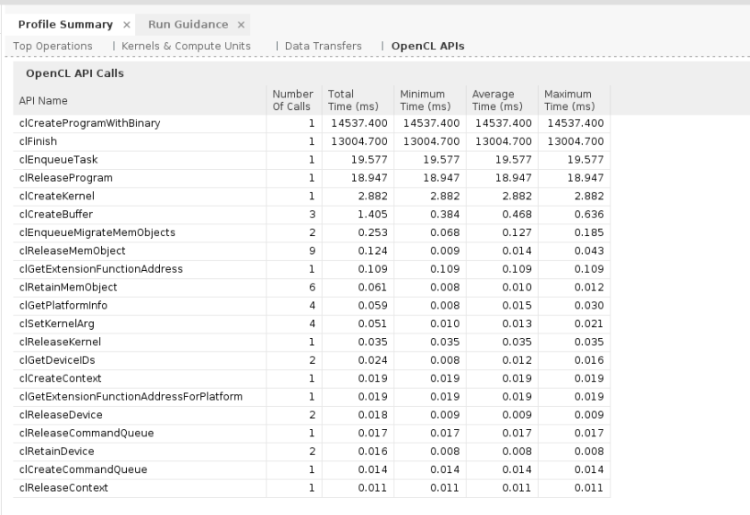
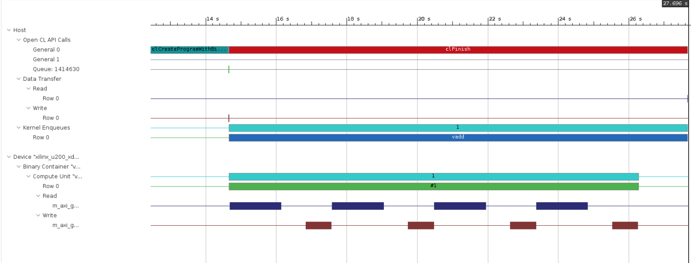
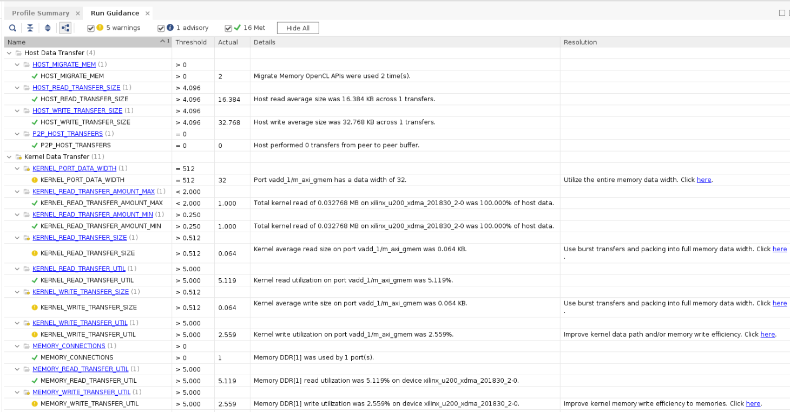

<table>
 <tr>
   <td align="center"><h1>2019.2 Vitis™ Application Acceleration Development Flow Tutorials</h1>
   <a href="https://github.com/Xilinx/SDAccel-Tutorials/branches/all">See other versions</a>
   </td>
 </tr>
 <tr>
 <td align="center"><h1>My First Program</h1>
 </td>
 </tr>
</table>

# 4. Profiling the Application

The Vitis™ core development kit generates various reports on the kernel resource and performance during compilation. It also collects profiling data during application execution in emulation mode and on the FPGA acceleration card. This lab describes how to generate the reports and collect, display, and read the profiling results in the Vitis integrated design environment (IDE).

## Profile Summary

Xilinx Runtime (XRT) automatically collects profiling data on host applications. After the application finishes execution, the Profile Summary report is saved in HTML, CSV, and Google Protocol Buffer formats in the solution report or working directory. These reports can be reviewed in a web browser, spreadsheet viewer, or the integrated Profile Summary view in the Vitis IDE.

1. To enable profile monitoring, create the [`xrt.ini`](../Pathway3/ProfileAndTraceReports.md#create-the-sdaccelini-file) file with `profile=true`. This file should be in the execution directory.

   ```
   [Debug]
   profile=true
   timeline_trace=true
   data_transfer_trace=fine
   ```

2. To generate the Profile Summary report for hardware emulation, build the kernel using the `--profile_kernel` option during the hardware linking stage. This enables the gathering of performance data during emulation. This option can be added in `design.cfg` file.

   ```
   platform=xilinx_u200_xdma_201830_2
   debug=1
   profile_kernel=data:all:all:all

   [connectivity]
   nk=vadd:1:vadd_1
   ```

   ```
   v++ -t hw_emu --config design.cfg -c -k vadd -I'../src' -o'vadd.xilinx_u200_xdma_201830_2.xo' './src/vadd.cpp'
   v++ -t hw_emu --config design.cfg -l -o'vadd.xilinx_u200_xdma_201830_2.xclbin' vadd.xilinx_u200_xdma_201830_2.xo
   ```

3. To view the Profile Summary, you can open the CSV file in a spreadsheet tool or use the [Vitis analyzer](../Pathway3/ProfileAndTraceReports.md#view-the-profile-summary) to view the report in IDE.

   ```bash
   vitis_analyzer -open ./profile_summary.csv
   ```

   

   The Profile Summary includes several useful statistics for any application. Important metrics to note are highlighted in the preceding figure. This will provide you with a general idea of the functional bottlenecks in your application.

4. Look at the Kernel to Global Memory" section of the report. Notice the total number of data transfers and average bytes per transfer.

5. Look at the "Duration" column under the "Top Kernel Execution" section. Notice the time it took to execute the kernel in hardware emulation/hardware.

6. Next, click the **OpenCL APIs** tab in the Profile Summary report. Notice the details provided on the various OpenCL API calls, including the number of calls and the duration of the calls.

   

The preceding figure is a captured from hardware emulation, which uses high-level simulation models for data transfers. Notice that the  highlighted calls `clProgramWithBinary`, `clEnqueueMigrateMemObjects` and `clEnqueueTask` are consuming most of the application time. It is best practice to observe the above highlighted statistics when run on hardware.

## Application Timeline Trace

The Application Timeline collects and displays host and device events on a common timeline to help you understand and visualize the overall health and performance of your systems. These events include:

* OpenCL API calls from the host code.
* Device trace data including AXI transaction start/stop, kernel start/stop, etc.

1. To enable Timeline Trace information gathering, create the [`xrt.ini`](../Pathway3/ProfileAndTraceReports.md#create-the-sdaccelini-file) file with `timeline_trace=true` and `data_transfer_trace=fine`

   ```
   [Debug]
   profile=true
   timeline_trace=true
   data_transfer_trace=fine
   ```

2. To generate the Timeline Trace report for HW Emulation, build the kernel using the `--profile_kernel` option during the hardware linking stage if you have not done this already.

   ```
   v++ -t hw_emu --config design.cfg -c -k vadd -I'../src' -o'vadd.xilinx_u200_xdma_201830_2.xo' './src/vadd.cpp'
   v++ -t hw_emu --config design.cfg -l -o'vadd.xilinx_u200_xdma_201830_2.xclbin' vadd.xilinx_u200_xdma_201830_2.xo
   ```

3. To view the Timeline Trace, use the [Vitis analyzer](../Pathway3/ProfileAndTraceReports.md#view-the-timeline-trace) to view it in the GUI.

   ```bash
   vitis_analyzer -open ./timeline_trace.csv
   ```

   The following figure shows the generated Timeline Trace report.

   

4. Hover the cursor over the bars showing the Read/Write data transfers in the Timeline Trace view to get more information such as burst length, DDR memory resource, and duration of transfer.

## Guidance

The Guidance view provides feedback throughout the development process. It presents all issues encountered from building the actual design all the way through runtime analysis in a single location.

The Guidance view is available through the Vitis GUI when you open the Profile Summary report.

   ```bash
   vitis_analyzer -open ./profile_summary.csv
   ```

The following figure shows the Guidance view for the VADD example.



## Kernel Reports (HLS)

After compiling a kernel using the v++ compiler, the v++ compiler runs the Vivado High-Level Synthesis (HLS) tool to synthesize the OpenCL C/C++ code to RTL code. During the process, the HLS tool automatically generates reports, which include details about the performance and logic usage of the custom-generated hardware logic from your kernel code. These reports are available when the Vitis is called with the `--save-temps` option.

   ```
   v++ -t hw_emu --config design.cfg --save-temps -c -k vadd -I'../src' -o'vadd.xilinx_u200_xdma_201830_2.xo' './src/vadd.cpp'
   ```

To view the Kernel report, open the Vivado HLS project, and open the HLS Synthesis Report for vadd.

   ```bash
   vivado_hls -p _x/vadd.xilinx_u200_xdma_201830_2/vadd/vadd
   ```

The following figure shows the HLS report for the VADD example kernel.


## Optimization

From the reports and images, you can see that there is a scope for improving the performance of the application. There are different optimization techniques which can be employed. For more information refer to the next step of the pathway, the [Methodology for Optimizing Accelerated FPGA Applications](../convolution-tutorial/) tutorial.

## Conclusion

Congratulations! You have successfully completed all the labs of this tutorial.

1. You successfully converted standard C++ code to a Vitis core development kit kernel.
2. You built a host program that deploys and talks to the kernel on the FPGA.
3. You used the command line to compile and link the kernel to an xclbin.
4. You executed the design in software and hardware emulation modes before running on the Alveo Data Center accelerator card.
5. You familiarized yourself with the reports generated during build and execution of the application.

</br>
<hr/>
<p align="center"><b><a href="/docs/vitis-getting-started/">Return to Getting Started Pathway</a> — <a href="./README.md">Return to Start of Tutorial</a></b></p>

<p align="center"><sup>Copyright&copy; 2019 Xilinx</sup></p>
